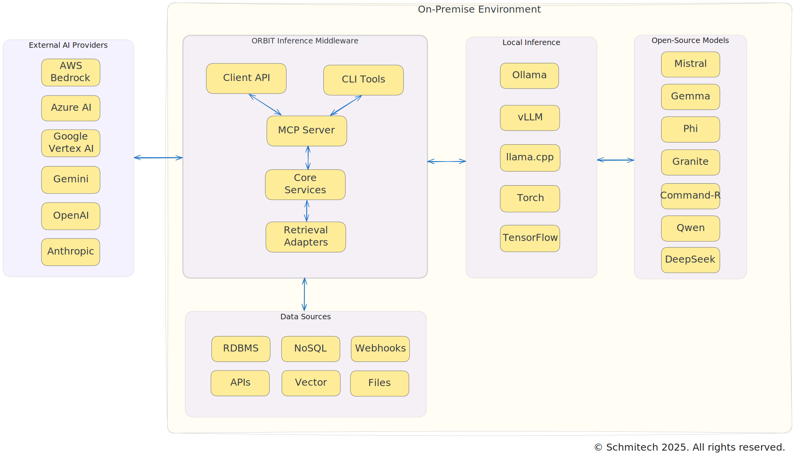

<div align="center">
  
  
  <h1>ORBIT</h1>
  <h2><strong>Open Retrieval-Based Inference Toolkit</strong></h2>
  
  <p>
    <a href="#-key-features">Features</a> •
    <a href="#-quick-start">Quick Start</a> •
    <a href="#-installation">Installation</a> •
    <a href="#-usage">Usage</a> •
    <a href="#-license">License</a>
  </p>
</div>

## Overview

ORBIT is a modular, self-hosted toolkit that provides a unified API for open-source AI inference models. It enables you to interact AI models on your own infrastructure, maintaining complete control over your data while eliminating commercial API dependencies.

## Sovereignty and Data Control

ORBIT is designed with digital sovereignty in mind, offering several key advantages:

1. **Complete Data Control**: All data processing happens on your infrastructure, ensuring sensitive information never leaves your environment
2. **No External Dependencies**: By eliminating reliance on commercial AI APIs, you maintain full control over your AI capabilities
3. **Compliance Ready**: Self-hosted deployment makes it easier to comply with data residency requirements and privacy regulations
4. **Transparency**: Open-source nature allows full visibility into the system's operations and data handling
5. **Customization**: Ability to modify and adapt the system to meet specific organizational or national requirements

This makes ORBIT particularly valuable for:

- Government agencies requiring sovereign AI capabilities
- Organizations with strict data privacy requirements
- Countries implementing digital sovereignty initiatives
- Enterprises needing to maintain control over their AI infrastructure

## Architecture



## Quick Start

### System Requirements

- A device (Win/Linux or Mac) with 16GB memory, GPU preferred.
- Python 3.12+
- MongoDB
- Redis (optional)
- Ollama (optional but preferred)
- Elasticsearch (optional)

### Setup

```bash
# Download and extract the latest release
curl -L https://github.com/schmitech/orbit/releases/download/v1.0.0/orbit-1.0.0.tar.gz -o orbit.tar.gz
tar -xzf orbit.tar.gz
cd orbit-1.0.0

# Activate virtual environment
source venv/bin/activate

# Add --help for comand options
./install.sh
```

#### Install Ollama:

https://ollama.com/download

```bash
# Download the models
ollama pull gemma3:1b
ollama pull nomic-embed-text
```

#### Using llama.cpp instead of Ollama
If you prefer not to use Ollama or open any additional ports, you may use the llama_cpp inference option in config.yaml.
First, install the dependencies and download the GGUF model file (by default, it downloads Gemma3:1b from Hugging Face - you can modify the download command to use your preferred model):

```bash
# Download the GGUF model file
curl -L https://huggingface.co/schmitech/gemma3-1b/resolve/main/gemma3-1b.gguf -o gemma3-1b.gguf
```

### Configuration
Edit config.yaml with default settings:
```yaml
general:
  port: 3000
  verbose: true
  https:
    enabled: false
    port: 3443
    cert_file: "./cert.pem"
    key_file: "./key.pem"
  session_id:
    header_name: "X-Session-ID"
    required: true
  inference_provider: "ollama"
  language_detection: false
  inference_only: false # Set to true to enable RAG mode
  adapter: "sqllite
```

```bash
# Update .env with your MongoDB credentials:
INTERNAL_SERVICES_MONGODB_HOST=locahost # change to your MongoDB host
INTERNAL_SERVICES_MONGODB_PORT=27017
INTERNAL_SERVICES_MONGODB_USERNAME=orbit
INTERNAL_SERVICES_MONGODB_PASSWORD=your-mongodb-password
```

### Starting the ORBIT server:
```bash
./bin/orbit.sh start ## other option: status - stop - restart. Add '--delete-logs' flag is you want to clear the logs everytime.
```

### ORBIT client setup:
```bash
pip install schmitech-orbit-client
orbit-chat --url http://localhost:3000 # Type 'hello' to chat with Ollama. No chat history yet, coming soon...
```

> **Note:** Set `inference_only: false` to enable RAG mode (run `./bin/orbit.sh restart --delete-logs` for the changes to take effect Here a sample DB you use for testing the SQL RAG Adapter:

```bash
# This script will create new api keys in MongoDB 'orbit' collection. You will need them to use the RAG functionality with
# the sample data in the SQLite database.
#
# Use --no-api-keys flag to skip api key creation if keys already exists.
# An API key is mapped to a collection, which is an abstraction of an SQL DB, 
# a NoSQL collection or index (i.e. elasticsearch). Each API key corresponds to exactly one collection.
./sample_db/setup-demo-db.sh sqlite

# Test with the orbit-chat client using the api key after creating the sample SQLLite DB.
# i.e. "What is the fee for a commercial sign permit?".
# You can find the training QA pairs in /sample_db/city-qa-pairs.json
orbit-chat --url http://localhost:3000 --api-key orbit_1234567ABCDE
```

## 📚 Documentation

For more detailed information, please refer to the following documentation in the `/docs` folder.

## 🤝 Contributing

Contributions are welcome! Please read our [Code of Conduct](CODE_OF_CONDUCT.md) for details the process for submitting pull requests.

## 📃 License

This project is licensed under the Apache 2.0 License - see the [LICENSE](LICENSE) file for details.