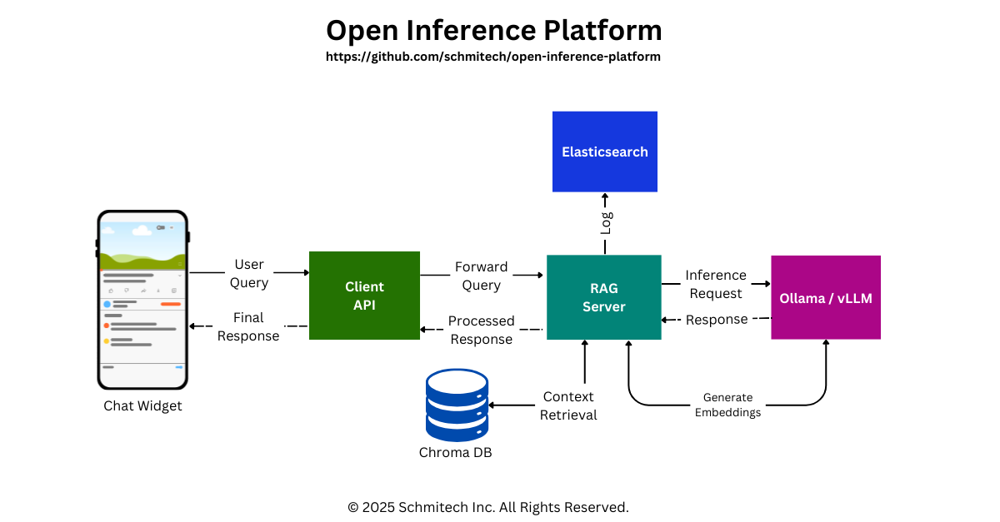

# Open Inference Platform

Open Inference Platform is a modular, self-hosted service that provides a unified API for interacting with various open-source AI inference models without relying on paid API subscriptions. It allows you to run AI models on your own infrastructure, maintaining full control over your data and eliminating dependency on commercial AI services.

## Why Open Inference Platform?

As commercial AI services continue to evolve, they often introduce limitations, pricing changes, or policy restrictions that can impact your applications. This platform gives you independence by:

- Running entirely on your own infrastructure
- Supporting both high-performance and smaller, more efficient models
- Keeping your data private and secure
- Allowing complete customization of the inference pipeline
- Avoiding vendor lock-in with a modular, open design

Most commercial generative AI tools present several challenges for organizations:

| Challenge | Impact | Solution |
|-----------|--------|--------------|
| **Privacy Risks** | Organizations with strict data regulations cannot send sensitive data to external APIs | All data stays within your infrastructure |
| **Vendor Lock-in** | Dependency on proprietary APIs limits control over models and data | Complete control over inference models |
| **Limited Deployment** | Lack of flexibility for diverse infrastructure requirements | Deploy anywhere - cloud, on-premise, or hybrid |
| **Reduced Customization** | Inability to fine-tune inference for domain-specific needs | Fully customizable for your specific use case |

### Use Cases

- **Customer Support**: Deploy AI-powered support systems with your company's knowledge base
- **Internal Knowledge Management**: Create intelligent Q&A systems for employee documentation
- **Educational Platforms**: Build interactive learning assistants with custom course materials
- **Healthcare**: Develop HIPAA-compliant medical information systems
- **Financial Services**: Create secure financial advisory chatbots
- **Legal Services**: Build confidential legal information retrieval systems

### Technical Highlights

- **Stack**: Node.js, Python, TypeScript, and React
- **Vector Search**: Semantic search using ChromaDB (support for Milvus coming soon)
- **Real-time Processing**: Stream responses for better user experience
- **Modular Design**: Easy to extend and customize for specific needs
- **Production Ready**: Includes error handling, logging, and monitoring
- **Cross-Platform**: Works on any infrastructure (cloud, on-premise, hybrid)

## 🧩 Project Components

This repository contains four interconnected projects:

1. **`server/`** - Backend server application handling inference and data management
2. **`examples/`** - Ready-to-use sample applications demonstrating integration
3. **`chroma/`** - Vector database configuration for managing embeddings
4. **`api/`** - JavaScript/TypeScript client library for easy integration
5. **`widget/`** - Ready-to-use UI component that can be embedded into any website

> **Note:** Each component has its own detailed README file with specific setup instructions and configuration details.

## 🏗️ Architecture

### System Overview



## 🚀 Getting Started

### Prerequisites

- Node.js v16 or higher
- Python 3.12+ (for ChromaDB)
- Ollama installed locally
- ElevenLabs API key (for text-to-speech capabilities)
- ChromaDB installed locally or in a server/container

### Server Setup

```bash
# Navigate to server directory
cd server

# Install dependencies
npm install

# Create configuration file
cp .env.example .env
# Edit .env with your configuration
```

### ChromaDB Setup

```bash
# Navigate to ChromaDB directory
cd chroma

# Create virtual environment
python -m venv venv 
source venv/bin/activate  # On Windows: venv\Scripts\activate

# Install requirements
pip install -r requirements.txt
```

> **Note:** If using Conda and seeing `(base)` in your terminal, run `conda deactivate` before creating venv or use `conda config --set auto_activate_base false` to prevent automatic activation.

#### Running ChromaDB

```bash
chroma run --host localhost --port 8000 --path ./chroma_db
```

The Chroma dashboard will be available at `http://localhost:8000`.

#### Verify ChromaDB Version

```bash
python -c "import chromadb; print(chromadb.__version__)"
```

#### Ingesting Data

```bash
python create-chroma-collection.py qa-pairs.json
```

Test your ingested data:
```bash
python query-chroma-collection.py "Your test query here"
```

### Text-to-Speech Testing

Test your ElevenLabs API key:

```bash
curl -X POST "https://api.elevenlabs.io/v1/text-to-speech/XrExE9yKIg1WjnnlVkGX" \
  -H "xi-api-key: $ELEVEN_LABS_API_KEY" \
  -H "Content-Type: application/json" \
  -d '{"text": "Test audio generation", "model_id": "eleven_monolingual_v1"}' \
  --output test.mp3
```

### Running the Server

```bash
cd server
npm run server -- ollama  # Use 'hf' for Hugging Face backend
```

### API Setup

The API is a JavaScript/TypeScript client library for applications to communicate with the server.

```bash
cd api
npm install
npm run build
```

The API will be available at `http://localhost:3001`.

### Widget Setup

The widget provides a ready-to-use UI component for website integration.

```bash
cd widget
npm install
npx vite build
```

### Example Applications

Simple web chatbots demonstrating server integration:

```bash
cd examples/simple-chatbot
npm install
npm run dev
```

The example will be available at `http://localhost:5173`.

## 💻 Development Workflow

To run the entire system locally for development:

1. Start Chroma: 
   ```bash
   cd chroma && chroma run --host localhost --port 8000 --path ./chroma_db
   ```

2. Start the Server: 
   ```bash
   cd server && npm run server -- ollama
   ```

3. Build the API: 
   ```bash
   cd api && npm run build
   ```

4. Build the Widget: 
   ```bash
   cd widget && npm run build
   ```

5. Start the Example App: 
   ```bash
   cd examples/simple-chatbot && npm run dev
   ```

# Netlify Deployment Guide

## Initial Setup

1. Install Netlify CLI globally:
```bash
npm install -g netlify-cli
```

2. Login to your Netlify account:
```bash
netlify login
```

## Configuration

Create a `netlify.toml` file in your project root with the following content:

```toml
[build]
  command = "npm run build"
  publish = "dist"
  functions = "netlify/functions"

[dev]
  command = "npm run dev"
  port = 3000
  publish = "dist"

[[redirects]]
  from = "/*"
  to = "/index.html"
  status = 200

[build.environment]
  NODE_VERSION = "18"
  VITE_API_ENDPOINT = "http://127.0.0.1:3000"  # Replace with your API endpoint
```

### Environment Variables

You can set environment variables in three ways:
1. Directly in `netlify.toml` (as shown above)
2. Through Netlify Dashboard: Site settings > Build & deploy > Environment variables
3. Using context-specific variables in `netlify.toml`:
```toml
[context.production.environment]
VITE_API_ENDPOINT = "production-url"

[context.deploy-preview.environment]
VITE_API_ENDPOINT = "preview-url"

[context.branch-deploy.environment]
VITE_API_ENDPOINT = "branch-url"
```

## Deployment

### Standard Deployment
1. Initialize your site:
```bash
netlify init
```
Choose either:
- Connect to existing site
- Create new site

2. Deploy to production:
```bash
netlify deploy --prod
```

### Deploying a Specific Folder

If you want to deploy a specific solution or folder from your project:

1. Navigate to the specific folder:
```bash
cd path/to/your/solution
npm run build
netlify deploy --prod --dir dist
```

2. Or deploy from any location by specifying the path:
```bash
netlify deploy --prod --dir path/to/your/solution
```

Note: Make sure your `netlify.toml` is in the solution directory or adjust the paths accordingly:
```toml
[build]
  base = "path/to/your/solution"    # Directory to change to before starting build
  command = "npm run build"
  publish = "dist"                  # Directory that contains the built site
```

## Managing Deployments

### List Sites
To view all your Netlify sites:
```bash
netlify sites:list
```

### Delete a Site
1. Find your site ID from the sites list
2. Delete the site:
```bash
netlify sites:delete YOUR_SITE_ID
```

### Unlink Local Project
To remove the connection between your local project and Netlify:
```bash
netlify unlink
```

## Best Practices

1. Always review environment variables before deploying
2. Use different environment variables for different deployment contexts
3. Don't commit sensitive information in `netlify.toml`
4. Consider using Netlify's Environment Variables UI for sensitive data
5. Keep your Netlify CLI updated
6. When deploying specific folders:
   - Ensure all dependencies are available in that folder
   - Verify build scripts are correctly configured for the subfolder
   - Test the build locally before deploying

## 📄 License

This project is licensed under the terms specified in the [LICENSE](LICENSE) file.
