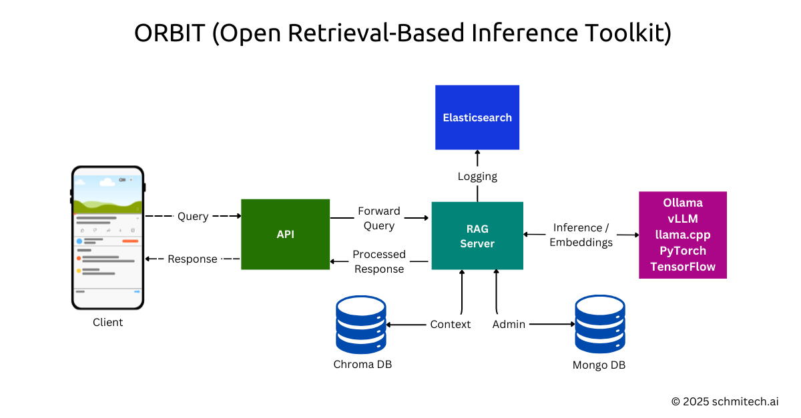

<div align="center">
  <h1>
    
    <span style="vertical-align: middle;">ORBIT: Open Retrieval-Based Inference Toolkit</span>
  </h1>
</div>

ORBIT is a modular, self-hosted toolkit that provides a unified API for open-source AI inference models, enabling you to operate without paid APIs. Host AI models on your infrastructure, maintain control over your data, and eliminate commercial dependency.

---

## 🌟 Why Choose ORBIT?

Commercial AI services often introduce limitations, pricing fluctuations, and policy changes impacting your operations. ORBIT gives you:

- 🔐 **Privacy:** Data remains within your infrastructure.
- 🔄 **Flexibility:** Deploy on cloud, on-premise, or hybrid environments.
- 🔧 **Customization:** Fully adaptable to your specific domain needs.
- 🚫 **No Vendor Lock-in:** Full control over your inference models and data.

---

## 🎯 Key Use Cases

- **Customer Support:** Integrate AI with your organization's knowledge base.
- **Internal Knowledge Management:** Intelligent document-based Q&A systems.
- **Education:** Interactive learning assistants tailored to course materials.
- **Healthcare:** HIPAA-compliant medical information systems.
- **Financial Services:** Secure financial advisory assistants.
- **Legal Services:** Confidential legal research tools.

---

## 🛠️ Technical Highlights

- **Tech Stack:** Python, FastAPI, TypeScript, React
- **Vector Search:** Semantic search with ChromaDB (Milvus support coming soon)
- **Real-Time Responses:** Streamlined user experience
- **Modular & Extensible:** Easily adapt or expand functionalities
- **Production Ready:** Robust error handling, logging, and monitoring
- **Cross-Platform Support:** Compatible with diverse infrastructures

---

## 🏗️ Architecture Overview



---

## 📌 Quick Start Guide

### ✅ Prerequisites

- Python 3.12+
- Ollama Server
- MongoDB (API Key management)
- ChromaDB

### ⚙️ Server Setup

```bash
cd backend/server
python -m venv venv
source venv/bin/activate  # Windows: venv\Scripts\activate
pip install -r requirements.txt
cp .env.example .env  # Edit configurations
```

### 📚 ChromaDB Setup

```bash
cd chroma
python -m venv venv
source venv/bin/activate
pip install -r requirements.txt

# Run ChromaDB
chroma run --host localhost --port 8000 --path ./chroma_db
```

Access dashboard at: `http://localhost:8000`

Verify ChromaDB:
```bash
python -c "import chromadb; print(chromadb.__version__)"
```

**Ingest Data:**

```bash
python create-chroma-collection.py qa-pairs.json
python query-chroma-collection.py "Test query"
```

### 🌐 Launch Server

```bash
cd server
uvicorn server:app --reload --host 0.0.0.0 --port 3000
```

### 📡 API Setup

```bash
cd api
npm install
npm run build
```

API available at `http://localhost:3000`

### 🎨 Widget Setup

```bash
cd widget
npm install
npx vite build
```

---

## 🔍 Example Applications

### Web Chatbot

```bash
cd examples/simple-chatbot
npm install
npm run dev
```

Access at: `http://localhost:5173`

### CLI Example

Check out the Python CLI example at `/examples/simple-cli`.

---

## 🧑‍💻 Development Workflow

Run locally for development:

1. **Start ChromaDB:**
    ```bash
    cd chroma && chroma run --host localhost --port 8000 --path ./chroma_db
    ```

2. **Start MongoDB:**
    ```bash
    # If using MongoDB Atlas, ensure your IP is whitelisted
    # If using local MongoDB:
    mongod --dbpath /path/to/data/directory
    ```

3. **Create API Key:**
    ```bash
    cd backend/server/admin
    python3 api_key_manager.py --url http://localhost:3000 create --collection default --name "Development" --notes "Development API Key"
    ```
    Save the generated API key for the next steps.

4. **Launch Server:**
    ```bash
    cd server && start.sh
    ```