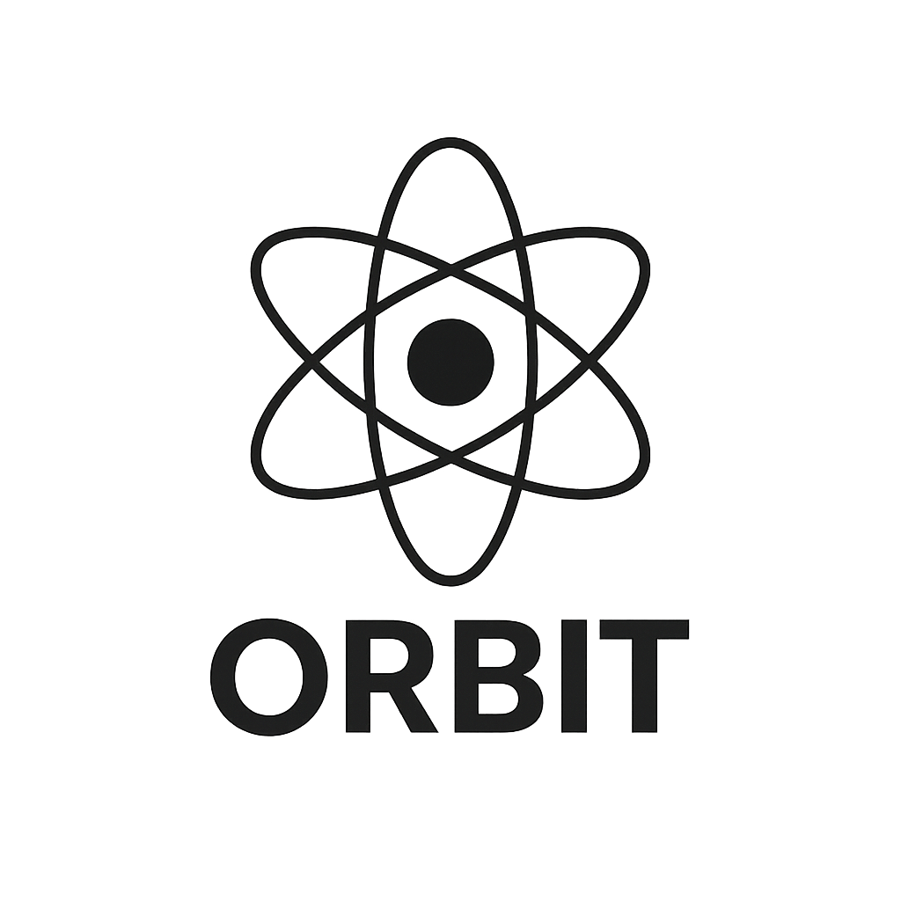

<div align="center">
  
</div>
<div align="center">
  <h2><strong>Open Retrieval-Based Inference Toolkit</strong></h2>
  
  <p>
    <a href="#overview">Overview</a> •
    <a href="#critical-risks-orbit-mitigate">Why ORBIT?</a> •
    <a href="#how-orbit-works">How It Works</a> •
    <a href="#minimum-requirements">Requirements</a> •
    <a href="#how-to-use">Quick Start</a> •
    <a href="#simple-sql-rag-example">Examples</a> •
    <a href="#documentation">Docs</a> •
    <a href="#contributing">Contributing</a> •
    <a href="#license">License</a>
  </p>
</div>

## Overview

ORBIT is a modular, self-hosted toolkit that provides a unified API for open-source AI inference models. It enables you to run AI models on your own infrastructure, maintaining complete control over your data while eliminating commercial API dependencies.

ORBIT is particularly useful for:

* **Organizations requiring sovereign AI capabilities** - *Security depends on controlling where and how your AI processes sensitive information*
* **Organizations with strict data privacy requirements** - *External AI providers can access, store, and potentially use your proprietary data to train their models*
* **Companies wanting to maintain control over their AI infrastructure** - *Avoid vendor lock-in, unpredictable pricing escalations, and sudden service terminations that can cripple your operations*

## Critical Risks ORBIT Mitigate

**Data Exposure:** Your prompts, user interactions, and business logic are transmitted to external servers, often across international borders, increasing exposure to surveillance and regulatory violations.

**Financial Vulnerability:** Commercial AI providers can change pricing overnight, throttle your access during peak demand, or discontinue services without notice, leaving your business operations stranded.

**Strategic Risk:** Your competitive advantage becomes dependent on systems controlled by entities with their own agendas, potentially including your competitors.

**Compliance Liability:** Using external AI services may violate data residency requirements, industry regulations, or government mandates in your jurisdiction.

## Development Roadmap

See the [Roadmap](docs/roadmap/README.md) for upcoming development activities. Your feedback is valuable! Please open an issue or discussion to share your thoughts on the roadmap and help shape ORBIT's future. 

## Documentation

For more detailed information, please refer to the following documentation in the `/docs` folder.

### Getting Started & Configuration
- [Server Configuration](docs/server.md) - Server setup and configuration guide
- [Configuration Reference](docs/configuration.md) - Complete configuration options and settings
- [API Keys Management](docs/api-keys.md) - Authentication and API key setup

### Retrieval & Adapters  
- [Adapters Overview](docs/adapters.md) - Understanding ORBIT's adapter system
- [SQL Retriever Architecture](docs/sql-retriever-architecture.md) - Database-agnostic SQL retrieval system
- [Vector Retriever Architecture](docs/vector-retriever-architecture.md) - Vector-based semantic search
- [File Adapter Architecture](docs/file-adapter-architecture.md) - File-based knowledge integration

### Features & Capabilities
- [Conversation History](docs/conversation_history.md) - Chat history and session management
- [Language Detection](docs/language_detection.md) - Multi-language support and detection
- [MCP Protocol](docs/mcp_protocol.md) - Model Context Protocol implementation

### Deployment & Setup
- [Docker Deployment](docs/docker-deployment.md) - Containerized deployment guide
- [Chroma Setup](docs/chroma-setup.md) - Vector database configuration

## How ORBIT Works

ORBIT offers two main ways to interact with AI while keeping your data secure in your private infrastructure and avoiding the need to pay for expensive API calls.

### Simple Chat Mode (Inference-Only)
Think of this as having a direct conversation with an AI. When you send a message:
1. Your message goes directly to the AI model
2. The AI processes your question and responds
3. The AI maintains memory of your chat session, making interactions more coherent

This mode is perfect for:
- Casual conversations
- General questions
- Creative writing
- Simple tasks

### Smart Assistant (RAG - Retrieval Augmented Generation)
An AI assistant that is aware of your organization's knowledge. When you ask a question:
1. ORBIT searches through your private knowledge base (documents, databases, internal resources)
2. It finds the most relevant information from your organization's data
3. Then it uses that information to give you a precise, informed answer while keeping everything private

This mode is ideal for:
- Getting answers from your organization's knowledge base or datasources
- Securely accessing sensitive data while maintaining complete data sovereignty
- Making decisions based on internal knowledge
- Getting context-aware responses without exposing data externally

## Minimum Requirements

- A device (Windows/Linux or Mac) with 16GB memory, GPU preferred
- Python 3.12+
- MongoDB (required for RAG mode and chat history)
- Redis (optional for caching)
- Elasticsearch (optional for logging)

## How to Use

```bash
# Download and extract the latest release
curl -L https://github.com/schmitech/orbit/releases/download/v1.1.0/orbit-1.1.0.tar.gz -o orbit.tar.gz
tar -xzf orbit.tar.gz
cd orbit-1.1.0

# Activate virtual environment
source venv/bin/activate

# Add --help for command options
./install.sh
```

#### Download HuggingFace GGUF Model:

```bash
python ./bin/download_hf_gguf_model.py --repo-id "TheBloke/TinyLlama-1.1B-Chat-v1.0-GGUF" --filename "*q4_0.gguf" --output-dir "./gguf"
```

Edit config.yaml for inference-only mode, specify `llama_cpp` as inference provider:
```yaml
general:
  port: 3000
  verbose: false
  inference_provider: "llama_cpp"
  inference_only: true
```

Specify the model and change the settings based on your requirements and model type. Pay attention to stop_tokens as these may vary based on the model (i.e., Gemma3 or MS Phi may require different settings):
```yaml
inference:
  llama_cpp:
    model_path: "gguf/tinyllama-1.1b-chat-v1.0.Q4_0.gguf"
    chat_format: "chatml"  # Chat format to use (chatml, llama-2, gemma, etc.)
    verbose: false
    temperature: 0.1
    top_p: 0.8
    top_k: 20
    max_tokens: 512  # Reduced from 1024 to get shorter responses
    repeat_penalty: 1.1
    n_ctx: 1024
    n_threads: 4
    stream: true
    n_gpu_layers: 0  # Disable GPU/Metal support
    main_gpu: 0
    tensor_split: null
    stop_tokens: [ # Model-specific
      "<|im_start|>", 
      "<|im_end|>",
      "<|endoftext|>"
    ]
```

### Enabling Chat History (Optional)
For conversation history, you need a MongoDB instance. ORBIT uses collection `orbit` by default as backend. This is configurable under the `internal_services` section in config.yaml.

```bash
# Copy .env.example to .env and add your MongoDB connection parameters:
INTERNAL_SERVICES_MONGODB_HOST=localhost
INTERNAL_SERVICES_MONGODB_PORT=27017
INTERNAL_SERVICES_MONGODB_USERNAME=mongo-user
INTERNAL_SERVICES_MONGODB_PASSWORD=mongo-password
```

Enable chat history in config.yaml. The system automatically calculates optimal message limits based on your AI model's context window:
```yaml
chat_history:
  enabled: true
  collection_name: "chat_history"
  store_metadata: true
  retention_days: 90
  max_tracked_sessions: 10000
  session:
    auto_generate: false  # Set to true for development, false for production
    required: true
    header_name: "X-Session-ID"
  user:
    header_name: "X-User-ID"
    required: false
```

For more details about conversation history configuration and usage, see [Conversation History Documentation](docs/conversation_history.md)

### Starting the ORBIT server (add --help for options):
```bash
# Logs under ./logs/orbit.log
./bin/orbit.sh start

# Run ORBIT client (default url is http://localhost:3000, use --help for options):
orbit-chat 
```


### Simple SQL RAG Example:
RAG (Retrieval-Augmented Generation) mode enhances the model's responses by integrating your knowledge base into the context. This enriches the pre-trained foundation model with your specific data. To use RAG mode:

1. Set `inference_only: false` in config.yaml to enable RAG functionality
2. Set `adapter: "qa-sql"` for the SQLite demo, or `adapter: "qa-vector"` for vector-based retrieval
3. Optionally enable `language_detection: true` to make the model respond in the same language as the input prompt

ORBIT comes with a sample QA SQL adapter (`qa-sql`), a specialized retriever for question-answering scenarios. It provides:

- **QA-Specific Search**: Prioritizes searching in question/answer fields and uses enhanced similarity matching
- **Smart Token Matching**: Uses token-based search optimization when available
- **Confidence Scoring**: Combines token matching and semantic similarity for better relevance
- **Default Schema**: Creates a QA-optimized table structure with question/answer fields
- **Field Prioritization**: Automatically detects and prioritizes QA-relevant fields in your database

The adapter is particularly effective for:
- FAQ systems
- Knowledge base queries
- Question-answering applications
- Document-based Q&A

To test this adapter, specify `qa-sql` in general settings:

```yaml
general:
  port: 3000
  inference_provider: "llama_cpp"
  language_detection: true
  inference_only: false
  adapter: "qa-sql"
```

Create demo database (you can find this example under `./utils/simple_db/sqlite`). RAG mode requires MongoDB enabled. Use the same settings described in the previous section to set up the MongoDB service.
```bash
./sample_db/setup-demo-db.sh sqlite

# Use the key generated from the previous command
orbit-chat --url http://localhost:3000 --api-key orbit_1234567ABCDE
```

Refer to [SQL Retriever Architecture](docs/sql-retriever-architecture.md) for details on the database-agnostic SQL retriever implementation and supported database types.

## Contributing

Contributions are welcome! Please read our [Code of Conduct](CODE_OF_CONDUCT.md) for details the process for submitting pull requests.

## License

This project is licensed under the Apache 2.0 License - see the [LICENSE](LICENSE) file for details.