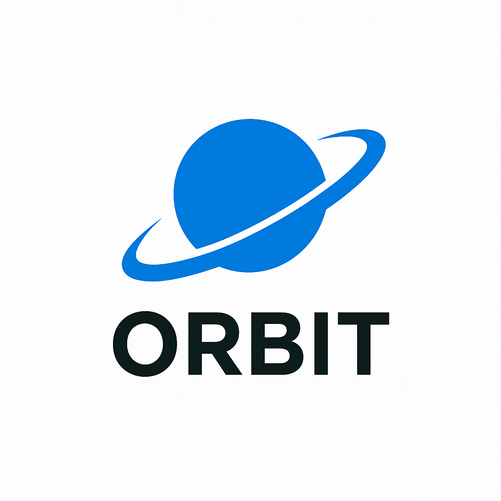
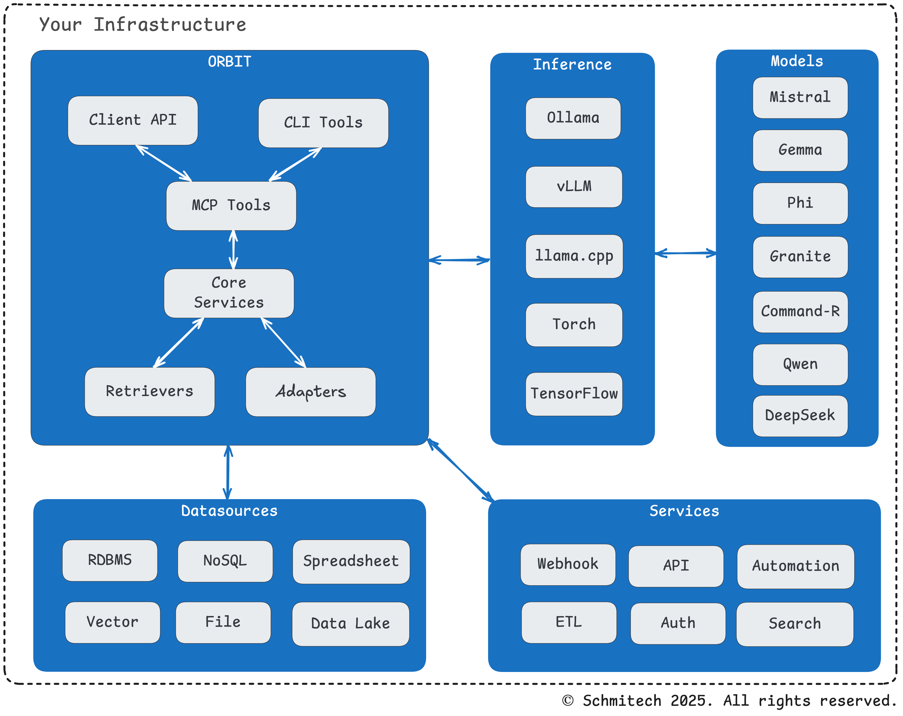
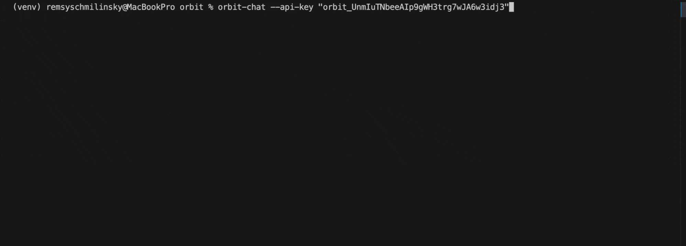
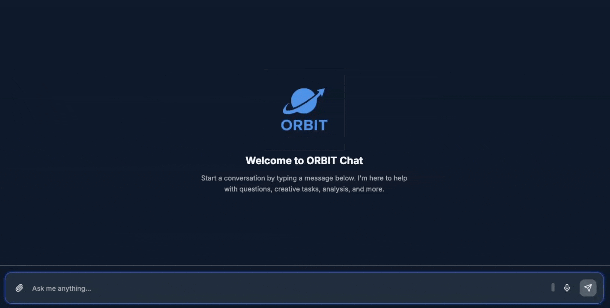

<div align="center">
  
</div>
<div align="center">
  <h1>ORBIT - Open Retrieval-Based Inference Toolkit</h1>
</div>

ORBIT is a modular, self-hosted toolkit that provides a unified API for open-source AI inference models. ORBIT enables you to run AI models on your own infrastructure, maintaining full control over your data while reducing dependency on external AI services. The project is actively maintained by [Remsy Schmilinsky](https://www.linkedin.com/in/remsy/).

## 🎉 Jun 12 2025 - Announcing ORBIT v1.1.3

### 🌍 Language Detection
- **Accuracy**: Improved language detection module for more precise multilingual support
- **Better Coverage**: Updated unit tests ensure robust language processing across all supported languages

### ⚡ vLLM Integration Fixed
- **Stable Performance**: Resolved vLLM inference issues for reliable high-performance model serving
- **Optimized Configuration**: Updated vLLM settings for better resource utilization and stability

### 🔧 Improvements
- **Retrievers Design**: Refactored SQL and vector retrievers for better inheritance patterns
- **File Adapter**: Added file upload endpoints with retrieval adapter support
- **Memory Management**: Better conversation history handling with dynamic context sizing

*Want to see what's coming next? Check out our [Development Roadmap](docs/roadmap/README.md)*


## 🚀 Key Features

<div align="center">
  
</div>

> **Note**: Currently, ORBIT supports SQL, Vector, and File-based retrieval systems. Support for additional data sources is planned for future releases. See [roadmap](https://github.com/schmitech/orbit/tree/main/docs/roadmap) for further details. ORBIT is fast evolving, so if you have a specific requirement that's not currently supported, please let us know so we can add it to our development roadmap.

### 🧠 **Retrieval-Augmented Generation (RAG)**
- **📚 Knowledge Integration**: Connect your data sources to enhance AI responses
- **🔗 Multi-Adapter Support**: SQL, Vector, and File-based retrieval systems
- **🎯 Context-Aware Responses**: Intelligent query processing with confidence scoring

### 💬 **Conversation History**
- **📝 Chat History**: Persistent conversation tracking with MongoDB
- **🔄 Session Management**: Multi-user session handling and archiving
- **🌐 Multi-Language Support**: Automatic language detection and processing

### 🔒 **Security & Moderation**
ORBIT integrates with two types of guardrail services to prevent harmful content and ensure safe AI interactions:

- **🔍 LLM Guard Service**: Advanced content scanning with real-time threat detection
- **🛡️ Moderator Service**: Multi-provider content moderation

### 🎨 **Web Integration**
- **📦 Chatbot Widget**: Ready-to-deploy web widget with theming options
- **🎯 Customizable UI**: Responsive design with configurable appearance
- **🔌 Easy Integration**: Simple npm package for website embedding

## 📋 Minimum Requirements

- A device (Windows/Linux or Mac) with 16GB memory, GPU preferred
- Python 3.12+
- MongoDB (required for RAG mode and chat history)
- Redis (optional for caching)
- Elasticsearch (optional for logging)

## ⚡ Quick Start

```bash
# Download and extract the latest release
curl -L https://github.com/schmitech/orbit/releases/download/v1.1.3/orbit-1.1.3.tar.gz
tar -xzf orbit-1.1.3.tar.gz
cd orbit-1.1.3

# Add --help for command options
./install.sh

# Activate virtual environment
source venv/bin/activate

# Get a GGUF model
python ./bin/download_hf_gguf_model.py --repo-id "TheBloke/TinyLlama-1.1B-Chat-v1.0-GGUF" --filename "*q4_0.gguf" --output-dir "./gguf"
```

Edit config.yaml specify `llama_cpp` as inference provider and your GGUF model.
```yaml
general:
  port: 3000
  verbose: false
  inference_provider: "llama_cpp"
inference:
  llama_cpp:
    model_path: "gguf/tinyllama-1.1b-chat-v1.0.Q4_0.gguf"
    chat_format: "chatml"
```

If you want to keep conversation history, you will need a MongoDB instance. This is configurable under the `internal_services` section in config.yaml.

```bash
# Copy .env.example to .env and add your MongoDB connection parameters:
INTERNAL_SERVICES_MONGODB_HOST=localhost
INTERNAL_SERVICES_MONGODB_PORT=27017
INTERNAL_SERVICES_MONGODB_USERNAME=mongo-user
INTERNAL_SERVICES_MONGODB_PASSWORD=mongo-password
```

Enable in config.yaml:
```yaml
chat_history:
  enabled: true
```

For more details about conversation history configuration and usage, see [Conversation History Documentation](docs/conversation_history.md)

### 🚀 Starting the Inference server:
```bash
# Logs under ./logs/orbit.log, use --help for options.
./bin/orbit.sh start

# Run ORBIT client (default url is http://localhost:3000, use --help for options):
orbit-chat 
```


### 🗄️ Running ORBIT in RAG Mode with Sample SQLite Adapter

RAG (Retrieval-Augmented Generation) mode enhances the model's responses by integrating your knowledge base into the context. This enriches the pre-trained foundation model with your specific data. 

The sample SQLite adapter showcases how ORBIT can be used for:
- FAQ systems
- Knowledge base queries
- Question-answering applications
- Document-based Q&A

You need an instance of MongoDB for this work. MongoDB is required when using ORBIT with retrieval adapters. Change config.yaml as follows:
```yaml
general:
  port: 3000
  verbose: false
  inference_provider: "llama_cpp"
  inference_only: false
  adapter: "qa-sql"

# Make sure adapter exists
adapters:
  - name: "qa-sql"
    type: "retriever"
    datasource: "sqlite"
    adapter: "qa"
    implementation: "retrievers.implementations.qa.QASSQLRetriever"
    config:
      confidence_threshold: 0.3
      max_results: 5
      return_results: 3

# Specify DB location location
datasources:
  sqlite:
    db_path: "examples/sqlite/sqlite_db"      
```

Restart the server:
```bash
./bin/orbit.sh restart --delete-logs
```
Load the sample question/answers sets from `./examples/city-qa-pairs.json`. RAG mode requires MongoDB enabled. Use the same settings described in the previous section to set up the MongoDB service.

```bash
# The DB creation scripts are located under /examples/sqlite/
./examples/setup-demo-db.sh sqlite

# Use the key generated from the previous command
orbit-chat --url http://localhost:3000 --api-key orbit_1234567ABCDE
```

### 🗂️ Running ORBIT in RAG Mode with Sample Chroma Vector DB Adapter
As the previous example, you need an instance of MongoDB. For this example, we'll use Ollama for both inference and embedding service.

**Prerequisites:** Make sure Ollama is installed. For installation instructions, visit [https://ollama.com/download](https://ollama.com/download).

Once Ollama is installed, run these commands to pull these models:

```bash
ollama pull nomic-embed-text
ollama pull gemma3:1b

# Make sure models exist
ollama list

NAME                       ID              SIZE      MODIFIED     
nomic-embed-text:latest    0a109f422b47    274 MB    2 months ago    
gemma3:1b                  8648f39daa8f    815 MB    2 months ago
```

Enable the chroma adapter in config.yaml:
```yaml
general:
  port: 3000
  verbose: true # More logging so you can undersatnd what's happening under the hood
  session_id:
    header_name: "X-Session-ID"
    required: true
  inference_provider: "ollama"
  language_detection: true
  inference_only: false
  adapter: "qa-vector-chroma"

# Enable embedding service needed to index documents in Chroma vector database
embedding:
  provider: "ollama"
  enabled: true

# Make sure adapter exists
adapters:
  - name: "qa-vector-chroma"
    type: "retriever"
    datasource: "chroma"
    adapter: "qa"
    implementation: "retrievers.implementations.qa.QAChromaRetriever"
    config:
      confidence_threshold: 0.3
      distance_scaling_factor: 200.0
      embedding_provider: null
      max_results: 5
      return_results: 3

# Specify DB location location
datasources:
  chroma:
    use_local: true
    db_path: "examples/chroma/chroma_db"
    host: "localhost"
    port: 8000
    embedding_provider: null # change if you want to override default Ollama embedding

# Ollama inference service settings
inference:
  ollama:
    base_url: "http://localhost:11434"
    temperature: 0.1
    top_p: 0.8
    top_k: 20
    repeat_penalty: 1.1
    num_predict: 1024
    num_ctx: 1024
    num_threads: 8
    model: "gemma3:1b"
    stream: true    
```

Restart the server:
```bash
./bin/orbit.sh restart --delete-logs
```
Load the sample question/answers sets from `./examples/city-qa-pairs.json`. RAG mode requires MongoDB enabled. Use the same settings described in the previous section to set up the MongoDB service.

```bash
# The DB creation scripts are located under /examples/sqlite/
./examples/setup-demo-db.sh chroma
```


Test with a few queries usinf orbit-chat client:
```bash
orbit-chat --url http://localhost:3000 --api-key orbit_1234567ABCDE
```



### 🛡️ **Content Moderation**

ORBIT's multi-layered safety system actively prevents abusive behavior and harmful content. The system combines **LLM Guard Service** for advanced threat detection and **Moderator Service** for content filtering, working together to ensure safe interactions.

**How it works:**
- **Real-time Scanning**: Every user input is analyzed before processing
- **Configurable Thresholds**: Adjustable safety levels for different use cases
- **Automatic Blocking**: Harmful content is intercepted and blocked with clear feedback

**Safety Features:**
- 🚫 **Abuse Prevention**: Blocks harassment, hate speech, and harmful content
- 🔒 **Prompt Injection Protection**: Prevents malicious prompt manipulation
- ⚠️ **Content Filtering**: Filters inappropriate or unsafe material
- 📊 **Risk Scoring**: Provides detailed risk assessment for each interaction

Follow this instructions to run this client:
```bash
cd clients/chat-app
npm install
npm run dev
```



**Example Security Log Output:**
```
🔍 Performing LLM Guard security check for prompt: 'Hello....'
📊 Risk threshold: 0.5
⏱️ LLM Guard security check completed in 123.45ms
✅ LLM GUARD PASSED: Content was deemed SAFE
🔍 Performing moderator safety check for query: 'Hello....' (attempt 1/3)
✅ MODERATION PASSED: Query was deemed SAFE by openai moderator
```

## 🌐 Web Chatbot Widget

ORBIT provides a customizable chatbot widget that can be easily integrated into any website. The widget offers a responsive interface with theming options and features. The widget is available as an npm package at [@schmitech/chatbot-widget](https://www.npmjs.com/package/@schmitech/chatbot-widget). Project details and build instructions can be found at [ORBIT Chat Widget](https://github.com/schmitech/orbit/tree/main/clients/chat-widget).

## 📚 Documentation

For more detailed information, please refer to the following documentation in the [Docs](docs/) folder.

### 🚀 Getting Started & Configuration
- [Server Configuration](docs/server.md) - Server setup and configuration guide
- [Configuration Reference](docs/configuration.md) - Complete configuration options and settings
- [API Keys Management](docs/api-keys.md) - Authentication and API key setup
- [Docker Deployment](docs/docker-deployment.md) - Containerized deployment guide
- [Chroma Setup](docs/chroma-setup.md) - Vector database configuration

### 🔗 Retrieval & Adapters  
- [Adapters Overview](docs/adapters.md) - Understanding ORBIT's adapter system
- [SQL Retriever Architecture](docs/sql-retriever-architecture.md) - Database-agnostic SQL retrieval system
- [Vector Retriever Architecture](docs/vector-retriever-architecture.md) - Vector-based semantic search
- [File Adapter Architecture](docs/file-adapter-architecture.md) - File-based knowledge integration

### ⚡ Features & Capabilities
- [Conversation History](docs/conversation_history.md) - Chat history and session management
- [Language Detection](docs/language_detection.md) - Multi-language support and detection
- [LLM Guard Service](docs/llm-guard-service.md) - Advanced security scanning and content sanitization
- [MCP Protocol](docs/mcp_protocol.md) - Model Context Protocol implementation

### 🗺️ Roadmap & Future Development
- [Development Roadmap](docs/roadmap/README.md) - Strategic direction and planned enhancements
- [Concurrency & Performance](docs/roadmap/concurrency-performance.md) - Scaling to handle thousands of concurrent requests
- [LLM Guard Security](docs/roadmap/llm-guard-integration.md) - Enterprise-grade AI security and threat protection
- [Async Messaging & Multi-Modal](docs/roadmap/async-messaging-integration.md) - Message queues and multi-modal processing
- [Notification Service](docs/roadmap/notification-service-integration.md) - Multi-channel communication system

## 🤝 Contributing

see the [CONTRIBUTING](CONTRIBUTING) file for details.

## 📄 License

This project is licensed under the Apache 2.0 License - see the [LICENSE](LICENSE) file for details.