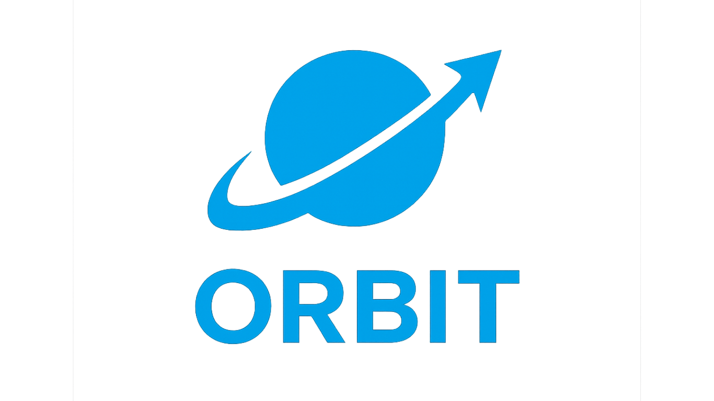
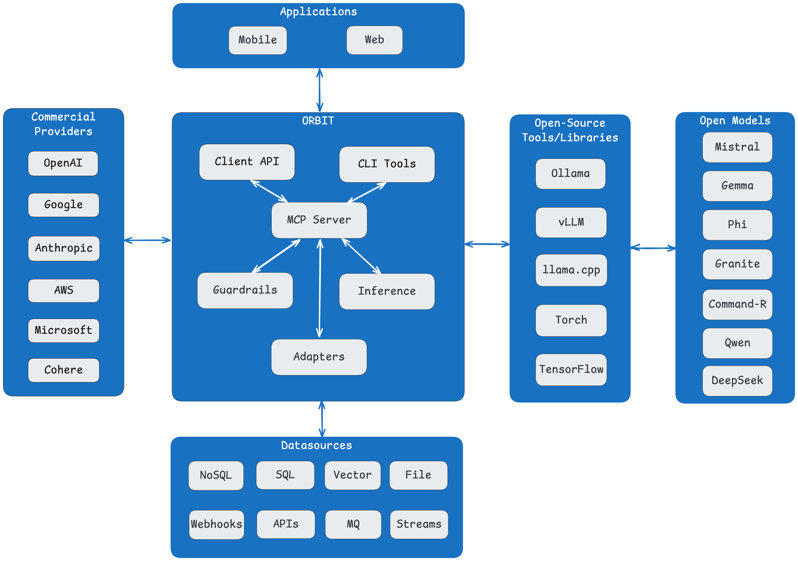

<div align="center">
  <a href="https://github.com/schmitech/orbit">
    
  </a>
</div>
  
<p align="center">
  <a href="https://opensource.org/licenses/Apache-2.0"></a>
  <a href="https://www.python.org/downloads/"></a>
  <a href="https://www.docker.com/"></a>
  <a href="https://github.com/schmitech/orbit/releases"></a>
  <a href="https://pypi.org/project/schmitech-orbit-client/"></a>
  <a href="https://www.npmjs.com/package/@schmitech/chatbot-widget"></a>
  <a href="https://github.com/schmitech/orbit" target="_blank">
    
  </a>
</p>

</div>

# ORBIT – Unified, self‑hosted AI inference with your data

ORBIT (Open Retrieval-Based Inference Toolkit) is a middleware platform that provides a unified API for AI inference. It acts as a central gateway, allowing you to connect various local and remote AI models with your private data sources like SQL databases and vector stores.

ORBIT gives you a single, consistent API to run LLMs (local or cloud) against your private data sources with portability, performance, high-availability, and security at the core.


> ⭐️ If ORBIT helps you ship faster, please consider starring the repo to support the roadmap.

## Table of Contents

- [✨ Highlights](#highlights)
- [🚀 Quick Start](#quick-start)
- [🛠️ Why ORBIT](#why-orbit)
- [🏗️ Architecture Overview](#architecture-overview)
- [✨ What Can You Build with ORBIT?](#what-can-you-build-with-orbit)
- [⭐ Support the Project](#support-the-project)
- [📖 Documentation](#documentation)
- [🤝 Community & Support](#community--support)
- [📄 License](#license)

---

## Highlights

- **Unified AI gateway** that normalizes requests across local models, cloud APIs, and hybrid deployments.
- **Bring-your-own data** with production-grade RAG adapters for SQL, vector stores, and custom datasources.
- **Secure by default** with token-based auth, role-aware API keys, and pluggable content moderation.
- **Ready for teams** thanks to batteries-included clients (CLI, React widget, Node/Python SDKs) and automation scripts.

---

## Quick Start

### Prerequisites

- Python 3.12+ (for running the server or CLI locally)
- Docker Engine 24+ (if you prefer containers)
- MongoDB (Atlas or local) to unlock authentication, RAG, and history persistence
- Optional: Redis cache plus your choice of vector DB (Chroma, Qdrant, Pinecone, Milvus)

### Docker

Refer to the [Docker Setup Guide](docker/README.md) or run the bundled scripts from the `docker/` directory:

```bash
cd docker
chmod +x docker-init.sh orbit-docker.sh
./docker-init.sh --build --profile minimal
```

### Local install

```bash
# Download the latest release archive
curl -L https://github.com/schmitech/orbit/releases/download/v1.5.9/orbit-1.5.9.tar.gz -o orbit-1.5.9.tar.gz
tar -xzf orbit-1.5.9.tar.gz
cd orbit-1.5.9

# Bootstrap dependencies and download a small model
cp env.example .env
./install/setup.sh --profile minimal --download-gguf granite4-micro

# Start the ORBIT server
source venv/bin/activate
./bin/orbit.sh start 

# Check the logs
cat ./logs/orbit.log
```

Browse to `http://localhost:3000/dashboard` to monitor the ORBIT server:
<div align="center">
  
  <br/>
  <i>ORBIT Dashboard: Monitor, search, and configure your environment.</i>
</div>

### Talk to ORBIT from the CLI

```bash
pip install schmitech-orbit-client

# Point to a running ORBIT instance (defaults to http://localhost:3000)
orbit-chat
```

<div align="center">
  <video src="https://github.com/user-attachments/assets/b3cf6a86-b173-4c0b-9dd8-061df848dba4" controls>
    Your browser does not support the video tag.
  </video>
  <br/>
  <i>Using the <code>orbit-chat</code> CLI. Run <code>orbit-chat -h</code> for options.</i>
</div>

### Spin up the React Chat app

```bash
cd clients/chat-app
npm install
npm run dev
```

<div align="center">
  <video src="https://github.com/user-attachments/assets/1a591929-c536-4de5-a3a2-0493b16edbad" controls>
    Your browser does not support the video tag.
  </video>
  <br/>
  <i>Chatting with ORBIT using the React client.</i>
</div>

#### Next steps

- Create an API key tied to the adapter you want to expose (`./bin/orbit.py key create`).
- Enable or customize adapters in `config/adapters.yaml` and redeploy to connect new datasources.
- Skim the [docs](#documentation) for deep dives on auth, configuration, and deployment patterns.

---

## Why ORBIT

- **Run securely with your data** thanks to first-class support for on-prem hardware, air-gapped installs, and strict authentication defaults.
- **Mix and match models** (local, hosted, or API) through a single contract without rewriting downstream apps.
- **Production-ready RAG** with adapters for SQL, vector databases, and pipelines that keep context fresh.
- **Dev-friendly tooling** including a CLI, SDKs, React widget, and language clients maintained in this repo.

### Built for

- **Platform & infra teams** who need a stable control plane for LLM workloads.
- **Product teams** shipping AI copilots that depend on reliable retrieval and guardrails.
- **Researchers & tinkerers** exploring local-first stacks or evaluating different foundation models.

Have a story or feature request? [Open an issue](https://github.com/schmitech/orbit/issues) or add it to the [Roadmap](docs/roadmap/README.md).

---

## Architecture Overview

<div align="center">
  
</div>

<details>
<summary><b>Click to learn more about the Core Components</b></summary>

### Core Components

**ORBIT Server** (`/server/`): FastAPI-based inference middleware
- **Inference Layer**: Supports multiple LLM providers (OpenAI, Anthropic, Cohere, Ollama, etc.) via unified interface
- **RAG System**: Retrieval-Augmented Generation with SQL and Vector DB adapters (file-based / multimodal retrieval underway, it will be available in release 2.0.0)
- **Authentication**: PBKDF2-SHA256 with bearer tokens, MongoDB-backed sessions
- **Fault Tolerance**: Circuit breaker pattern with exponential backoff for provider failures
- **Content Moderation**: Multi-layered safety with LLM Guard and configurable moderators

**Configuration** (`/config/`): YAML-based modular configuration
- Main config in `config.yaml` with environment variable support
- Separate configs for adapters, datasources, embeddings, inference, moderators, and rerankers
- Dynamic loading with validation and resolver system

**Client Libraries**:
- React-based chat application with Zustand state management
- Embeddable chat widget with theming support
- Node.js and Python API client libraries


### Dependencies

- **MongoDB** (Required): Authentication, RAG storage, conversation history
- **Redis** (Optional): Caching layer
- **Vector DBs** (Optional): Chroma, Qdrant, Pinecone, Milvus for semantic search
- **SQL DBs** (Optional): PostgreSQL, MySQL, SQLite for structured data retrieval
</details>

---

## What Can You Build with ORBIT?

ORBIT uses a flexible [adapter architecture](docs/adapters.md) to connect your data to AI models. An API key is tied to a specific adapter, effectively creating a specialized "agent" for a certain task. Here are a few examples:

### Scenario 1: Knowledge Base Q&A
Provide instant, semantically-aware answers from a knowledge base. Perfect for customer support or internal documentation.

**Sample Questions:**
- "What are the summer camp programs for kids?"
- "How do I register for the contemporary dance class?"

_NOTE: You need an instance of MongoDB to enable adapters_

### Setup the sample SQLite Database with Q/A records about a municipality.

Here's the [Sample Q/A datasets](examples/city-qa-pairs.json) for this example. The knowledge base corresponds to a municipal services assistant.

Set inference_only mode to false in `config/config.yaml`:

```yaml
inference_only: false
```

Enable the adapter in `config/adapters.yaml`:

```yaml
- name: "qa-sql"
  enabled: true
  type: "retriever"
  datasource: "sqlite"
  adapter: "qa"
  implementation: "retrievers.implementations.qa.QASSQLRetriever"
```

Restart ORBIT:

```bash
./bin/orbit.sh start --delete-logs
```

Generate sample data and API Key (Default SQLite DB in `examples/sqlite/sqlite_db`):

```bash
#Login as admin first. Default password is admin123. You should change after installing ORBIT.
./bin/orbit.sh login

# Set up SQLite database with Q&A data.
./examples/sample-db-setup.sh sqlite
```

Start chatting with your new key:

```bash
orbit-chat --url http://localhost:3000 --api-key YOUR_API_KEY
```

<div align="center">
  <video src="https://github.com/user-attachments/assets/0ffc5160-d8f9-4006-8e76-b58d89b42aa8" controls>
    Your browser does not support the video tag.
  </video>
  <br/>
  <i>Setting up the sample SQLite Q/A dataset</i>
</div>

### Scenario 2: Chat with Your SQL Database
Ask questions about your data in natural language and get answers without writing SQL.

**Sample Questions:**
- "Show me all users from Toronto"
- "What are the top 10 users by age?"
- "Find users created in the last month"

### Scenario 3: Analyze Application Logs with Elasticsearch
Transform your application logs into actionable insights using natural language queries. Perfect for DevOps teams, SREs, and developers who need to quickly understand system behavior and troubleshoot issues.

**Sample Questions:**
- "Show me recent errors from the payment service"
- "Which services have the most errors in the last hour?"
- "Find slow API requests taking more than 2 seconds"
- "What's the error trend over the last 24 hours?"
- "Show me all timeout errors with their stack traces"

#### Quick Start with Elasticsearch Log Analysis

Set up Elasticsearch and generate sample log data:

```bash
# Ensure Elasticsearch is running (Docker example)
docker run -d --name elasticsearch \
  -p 9200:9200 -p 9300:9300 \
  -e "discovery.type=single-node" \
  -e "xpack.security.enabled=false" \
  elasticsearch:8.11.0

# Generate sample application logs
python ./utils/elasticsearch-intent-template/examples/application-logs/generate_sample_data.py \
  --count 1000 \
  --use-ai \
  --provider ollama \
  --ai-usage-rate 30
```

Enable the Elasticsearch log analysis adapter in `config/adapters.yaml`:

```yaml
- name: "intent-elasticsearch-app-logs"
  enabled: true
  type: "retriever"
  datasource: "elasticsearch"
  adapter: "intent"
  implementation: "retrievers.implementations.intent.IntentElasticsearchRetriever"
  inference_provider: "ollama"
  embedding_provider: "ollama"
```

Start ORBIT and create an API key:

```bash
./bin/orbit.sh start --delete-logs

# Login and create API key
./bin/orbit.sh login
./bin/orbit.py key create \
  --intent-elasticsearch-app-logs \
  --name "Log Analysis Assistant" \
  --notes "Elasticsearch log analysis with AI insights" \
  --prompt-file examples/prompts/elasticsearch-log-assistant-prompt.txt

# Start analyzing your logs
orbit-chat --url http://localhost:3000 --api-key YOUR_API_KEY
```

### Scenario 4: Web-Based Knowledge Retrieval
Access authoritative web sources (Wikipedia, official documentation) as a structured knowledge database. Perfect for research assistants, educational tools, and information lookup systems that need reliable, curated content.

**Sample Questions:**
- "Tell me about web scraping"
- "What is machine learning?"
- "I need Python documentation"
- "Explain quantum computing"
- "What is blockchain technology?"

#### How It Works

The Firecrawl adapter treats web sources like a database, mapping natural language questions about topics to authoritative URLs. Unlike generic web scrapers, this approach:
- **Quality Control**: Only accesses curated, trusted sources
- **Structured Access**: Predefined topic-to-URL mappings ensure relevant content
- **Fresh Content**: Always retrieves the latest information from sources
- **Consistent Format**: Returns formatted markdown content with metadata

#### Quick Start with Web Knowledge Retrieval

Set up your Firecrawl API key:

```bash
# Get your API key from https://firecrawl.dev
export FIRECRAWL_API_KEY="your-api-key-here"
```

Enable the Firecrawl knowledge retrieval adapter in `config/adapters.yaml`:

```yaml
- name: "intent-firecrawl-webscrape"
  enabled: true
  type: "retriever"
  datasource: "http"
  adapter: "intent"
  implementation: "retrievers.implementations.intent.IntentFirecrawlRetriever"
  inference_provider: "ollama"
  embedding_provider: "openai"
  config:
    domain_config_path: "utils/firecrawl-intent-template/examples/web-scraping/templates/firecrawl_domain.yaml"
    template_library_path:
      - "utils/firecrawl-intent-template/examples/web-scraping/templates/firecrawl_templates.yaml"
    base_url: "https://api.firecrawl.dev/v1"
    auth:
      type: "bearer_token"
      token_env: "FIRECRAWL_API_KEY"
```

Start ORBIT and create an API key:

```bash
./bin/orbit.sh start --delete-logs

# Login and create API key
./bin/orbit.sh login
./bin/orbit.py key create \
  --intent-firecrawl-webscrape \
  --name "Knowledge Assistant" \
  --notes "Web-based knowledge retrieval from authoritative sources" \
  --prompt-file examples/prompts/firecrawl-knowledge-assistant-prompt.txt

# Start asking questions about any topic
orbit-chat --url http://localhost:3000 --api-key YOUR_API_KEY
```

#### Quick Start with Contact Example

Install Ollama and pull the `nomic-embed-text:latest` embedding model. Also pull a model of choice for inference purposes.
```bash
ollama pull nomic-embed-text:latest
ollama pull gemma3:12b
```

Enable the contact domain sample adapter in `/config/adapters.yaml`:

```yaml
- name: "intent-sql-sqlite-contact"
  enabled: true
  type: "retriever"
  datasource: "sqlite"
  adapter: "intent"
  implementation: "retrievers.implementations.intent.IntentSQLiteRetriever"
  inference_provider: "ollama"
  model: "gemma3:12b"
  embedding_provider: "ollama"
```

Start ORBIT:

```bash
./bin/orbit.sh start --delete-logs
```

Create an API Key for this adapter:

```bash
# Login admin credentials
./bin/orbit.sh login

# Create an API key for the SQL intent adapter
./bin/orbit.py key create \
  --intent-sql-sqlite-contact \
  --name "Contact Adapter Demo" \
  --notes "Demo using SQLite" \
  --prompt-file examples/prompts/contact-assistant-prompt.txt

# Generate sample data
python ./utils/sql-intent-template/examples/sqlite/contact/generate_contact_data.py \
  --records 500 \
  --output ./examples/sqlite/sqlite_db \
  --clean

# Test data exists
sqlite3 examples/sqlite/sqlite_db 'SELECT * FROM users LIMIT 5;'

# Start chatting with your new key
orbit-chat --url http://localhost:3000 --api-key YOUR_API_KEY
```

<div align="center">
  <video src="https://github.com/user-attachments/assets/0c327964-eefe-4593-8dd0-129af904b434" controls>
    Your browser does not support the video tag.
  </video>
  <br/>
  <i>Testing the SQL Intent Adapter using the ORBIT CLI tool</i>
</div>

> Looking for more samples? Browse the [`examples/`](examples) directory for data loaders, prompts, and client integrations you can adapt.

---

## Support the Project

Your support keeps ORBIT independent and focused on open-source innovation.

- ⭐ Star the repo to signal that ORBIT matters to you.
- 📣 Share a demo, blog, or tweet so other builders discover it.
- 🐛 Open issues and PRs—your feedback directly shapes the roadmap.

<a href="https://github.com/schmitech/orbit" target="_blank">
  
</a>

<a href="https://star-history.com/#schmitech/orbit&Date">
  <picture>
    <source media="(prefers-color-scheme: dark)" srcset="https://api.star-history.com/svg?repos=schmitech/orbit&type=Date&theme=dark" />
    <source media="(prefers-color-scheme: light)" srcset="https://api.star-history.com/svg?repos=schmitech/orbit&type=Date" />
    
  </picture>
</a>

---

## Documentation

For more detailed information, please refer to the official documentation.

- [Installation Guide](docs/server.md)
- [Configuration](docs/configuration.md)
- [Authentication](docs/authentication.md)
- [RAG & Adapters](docs/adapters.md)
- [Development Roadmap](docs/roadmap/README.md)
- [Contributing Guide](CONTRIBUTING.md)

<details>
<summary><b>Full API Reference</b></summary>

ORBIT provides a RESTful API for programmatic access. The full API reference with examples is available at `/docs` (Swagger UI) when the server is running.

### Core Chat & Inference
- `POST /v1/chat` - MCP protocol chat endpoint (JSON-RPC 2.0 format)
- `GET /health` - Overall system health

### Authentication
- `POST /auth/login` - User authentication  
- `POST /auth/logout` - End session
- `GET /auth/me` - Get current user info
- `POST /auth/register` - Register new user
- `POST /auth/change-password` - Change user password

### API Key Management (Admin)
- `GET /admin/api-keys` - List API keys
- `POST /admin/api-keys` - Create new API key
- `DELETE /admin/api-keys/{api_key}` - Delete API key
- `POST /admin/api-keys/deactivate` - Deactivate API key
- `GET /admin/api-keys/{api_key}/status` - Get API key status

### System Prompts (Admin)
- `GET /admin/prompts` - List system prompts
- `POST /admin/prompts` - Create system prompt
- `PUT /admin/prompts/{prompt_id}` - Update system prompt
- `DELETE /admin/prompts/{prompt_id}` - Delete system prompt

### Health & Monitoring
- `GET /health` - System health overview
- `GET /health/adapters` - Adapter health status
- `GET /health/embedding-services` - Embedding service status
- `GET /health/mongodb-services` - MongoDB connection status
- `GET /health/ready` - Readiness check
- `GET /health/system` - System resource usage

### File Management (Experimental)
- `POST /upload` - Single file upload
- `POST /upload/batch` - Batch file upload
- `GET /info/{file_id}` - File information
- `DELETE /{file_id}` - Delete file
- `GET /status` - File system status
</details>

## Community & Support

- **Questions?** Open an [issue](https://github.com/schmitech/orbit/issues)
- **Updates:** Check the [changelog](CHANGELOG.md)
- **Commercial Support:** Contact [schmitech.ai](https://schmitech.ai/)
- **Maintained by:** [Remsy Schmilinsky](https://www.linkedin.com/in/remsy/)

## License

Apache 2.0 - See [LICENSE](LICENSE) for details.
