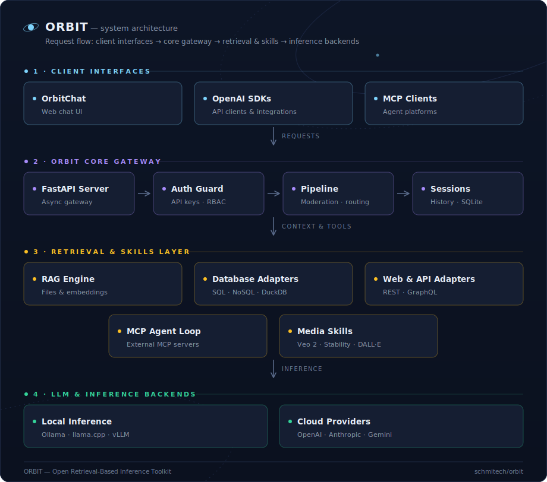

<div align="center">
  <a href="https://github.com/schmitech/orbit">
    
  </a>

  # ORBIT

  ### Open Retrieval-Based Inference Toolkit
  **Self-hosted, private AI gateway and unified RAG infrastructure for multi-model applications.**
</div>

<p align="center">
  <a href="https://opensource.org/licenses/Apache-2.0"></a>
  <a href="https://www.python.org/downloads/"></a>
  <a href="https://github.com/schmitech/orbit/releases"></a>
  <a href="https://github.com/schmitech/orbit/commits/main"></a>
  <a href="https://github.com/schmitech/orbit/stargazers"></a>
</p>

<p align="center">
  <a href="docs/tutorial.md"><strong>Quick Tutorial</strong></a>
  &nbsp;•&nbsp;
  <a href="docker/README.md"><strong>Docker Guide</strong></a>
  &nbsp;•&nbsp;
  <a href="docs/cookbook/"><strong>Cookbook Recipes</strong></a>
  &nbsp;•&nbsp;
  <a href="docs/"><strong>Full Documentation</strong></a>
</p>

<p align="center">
  Maintained by <a href="https://www.linkedin.com/in/remsy/"><strong>Remsy Schmilinsky</strong></a>
</p>

---

## 💡 What is ORBIT?

Many organizations need to connect AI to their business data without:
1. Sending sensitive data to third-party SaaS vendors or cloud providers.
2. Rewriting frontend applications every time they switch LLMs.
3. Maintaining fragile glue code between models, vector databases, SQL query engines, and file stores.

**ORBIT** provides an AI gateway and retrieval-adapter layer. Run it completely on your own hardware to deploy secure, private RAG engines, connect databases, spin up MCP tool-calling loops, and configure production safety guardrails.

### 🚀 Key Capabilities:
* **🔒 100% Private & Self-Hosted:** Run offline workloads on local servers using Ollama, llama.cpp, or vLLM.
* **🔌 Universal Data Retrievers:** Out-of-the-box adapters for PostgreSQL, MongoDB, Elasticsearch, REST APIs, GraphQL, DuckDB, vector databases, files, and web scraping.
* **🤖 Agentic MCP Tool Loops:** Connect outward to Model Context Protocol (MCP) servers to let LLMs perform multi-step, self-correcting tool operations inside chat sessions.
* **🎭 Cross-Adapter Skills:** Generate text-to-image and text-to-video  dynamically as part of a conversation workflow.
* **🛡️ Production-Grade Control Plane:** API key validation, request rate-limiting, token quotas, content moderation, circuit breakers, and detailed audit logging.

---

## 🏗️ Architecture Overview

ORBIT acts as a router and orchestration layer sitting directly between your applications, your local or hosted AI models, and your internal data repositories:

<p align="center">
  
</p>

---

## ⚡ Quick Start: Get Running in 60 Seconds

### Step 1: Spin Up with Docker
The fastest way to run ORBIT is using Docker Compose. Clone the repository and boot the service:

```bash
git clone https://github.com/schmitech/orbit.git && cd orbit/docker
docker compose up -d
```

This starts ORBIT configured with a local Ollama instance and the lightweight `SmolLM2` model, auto-pulling it on startup. 

> [!TIP]
> **GPU Acceleration:** If you have an NVIDIA GPU, spin it up using the GPU compose file:
> ```bash
> docker compose -f docker-compose.yml -f docker-compose.gpu.yml up -d
> ```

### Step 2: Query the OpenAI-Compatible API
Test the API gateway by sending a chat completion payload:

```bash
curl -X POST http://localhost:3000/v1/chat \
  -H 'Content-Type: application/json' \
  -H 'X-API-Key: default-key' \
  -H 'X-Session-ID: local-test' \
  -d '{
    "messages": [{"role": "user", "content": "Summarize ORBIT in one sentence."}],
    "stream": false
  }'
```

### Step 3: Access the Admin UI
Open your browser and navigate to **[http://localhost:3000/admin](http://localhost:3000/admin)**.
* **Username:** `admin`
* **Password:** `admin123`

The dashboard allows you to monitor API metrics, system latency, active sessions, and verify configured adapter states in real-time.

---

## 🎬 Demos

Expand the sections below to see ORBIT in action across different deployment scenarios:

<details>
<summary>📂 <strong>Multi-Source RAG & File Chat</strong></summary>
<p align="center">
  <video src="https://github.com/user-attachments/assets/bc85d24a-72dd-4a71-8c3d-017e5fadd219" controls muted playsinline width="80%"></video>
  <br />
  <em>Upload PDFs, spreadsheets, and images, and query them together in a unified thread. ORBIT chunks, embeds, and retrieves documents locally, keeping data strictly offline.</em>
</p>
</details>

<details>
<summary>🗃️ <strong>Natural Language to Database Queries</strong></summary>
<p align="center">
  <video src="https://github.com/user-attachments/assets/745a0635-fe17-432b-9b36-c7b22adcdfcc" controls muted playsinline width="80%"></video>
  <br />
  <em>Translate plain English queries into SQL, query structural databases, and generate dynamic visualizations directly in the chat using cross-adapter image skills.</em>
</p>
</details>

<details>
<summary>🤖 <strong>Agentic MCP & Tool-Calling Loops</strong></summary>
<p align="center">
  <video src="https://github.com/user-attachments/assets/a57ff84e-db9d-466d-8f82-e23473b745fb" controls muted playsinline width="80%"></video>
  <br />
  <em>Expose local filesystem commands, Slack APIs, and Postgres tools via MCP. ORBIT hosts a multi-step execution loop, allowing the model to perform complex file operations autonomously.</em>
</p>
</details>

<details>
<summary>🔍 <strong>Elasticsearch Logs Translation</strong></summary>
<p align="center">
  <video src="https://github.com/user-attachments/assets/e7fd2834-e438-4ac1-9173-0c0d56ca562b" controls muted playsinline width="80%"></video>
  <br />
  <em>Query application logs using natural English. ORBIT dynamically compiles queries to Elasticsearch Query DSL to extract server logs, error rates, and operational latency.</em>
</p>
</details>

<details>
<summary>🎥 <strong>Media & Video Generation (Google Veo 2 / DALL-E)</strong></summary>
<p align="center">
  <video src="https://github.com/user-attachments/assets/0f0c88f2-20b2-4617-9e5f-7efd823fc164" controls muted playsinline width="80%"></video>
  <br />
  <em>Generate rich videos using Google Veo 2 natively in chat threads. Prompt enhancement, video generation, and server-side binary hosting are handled automatically.</em>
</p>
<p align="center">
  <video src="https://github.com/user-attachments/assets/268801ff-5e17-4358-9e69-b2667851d611" controls muted playsinline width="80%"></video>
  <br />
  <em>Generate images as a cross-adapter skill using DALL-E or Stability AI with full conversation context.</em>
</p>
</details>

<details>
<summary>📊 <strong>Admin Panel & Monitoring Dashboard</strong></summary>
<p align="center">
  <video src="https://github.com/user-attachments/assets/f85fb880-9f76-471a-8875-a16d615c3aa8" controls muted playsinline width="80%"></video>
  <br />
  <em>Monitor cluster health, system logs, adapter statuses, active tokens, and query latencies using the real-time web dashboard.</em>
</p>
</details>

<details>
<summary>⚙️ <strong>Additional Demos (Offline PII, Model Switching, SVG, Threading)</strong></summary>
<p align="center">
  <video src="https://github.com/user-attachments/assets/565275fa-8f54-4bd6-94de-3fb27a66a5ab" controls muted playsinline width="80%"></video>
  <br />
  <em>Analyze sensitive PII data offline using local llama.cpp models.</em>
</p>
<p align="center">
  <video src="https://github.com/user-attachments/assets/1c7b4bb6-4067-40f5-982c-c9ad6faf663d" controls muted playsinline width="80%"></video>
  <br />
  <em>Render dynamic SVGs generated by LLMs inline.</em>
</p>
<p align="center">
  <video src="https://github.com/user-attachments/assets/a3fd7308-64be-4216-823b-954e2e37bad2" controls muted playsinline width="80%"></video>
  <br />
  <em>Dynamically switch inference models mid-conversation without breaking the chat history.</em>
</p>
<p align="center">
  <video src="https://github.com/user-attachments/assets/55a1f582-5ea4-411d-bbfc-4ccffbd6f81a" controls muted playsinline width="80%"></video>
  <br />
  <em>Sub-conversation threading and document caching for faster retrieval speeds.</em>
</p>
</details>

---

## ⚖️ Why ORBIT? (Compared to custom setups)

| Challenge | Standard Approach | What ORBIT Provides |
| :--- | :--- | :--- |
| **Provider Lock-In** | One SDK per provider (OpenAI, Anthropic). Codebases need total refactoring to switch LLMs. | **Unified Interface:** One OpenAI-compatible API across all local, self-hosted, and cloud-hosted model providers. |
| **Fragile Glue Code** | Stitching together separate libraries for chat history, vector storage, SQL connectors, and routing. | **Unified Gateway:** Out-of-the-box session management, RAG adapters, safety moderation, and API key routing. |
| **Limited RAG** | Vector search over standard text chunks only. No connection to live relational data. | **Universal Context:** Structured SQL/NoSQL retrievers, JSON REST API scraping, GraphQL queries, and vector store hybrid searches. |
| **Data Privacy** | Sensitive internal data processed and sent through public APIs by default. | **Self-Hosted Control:** Run 100% offline with local Ollama/llama.cpp instances, local embeddings, RBAC, and secure logging. |
| **Cascading Failures** | Slow or offline third-party APIs cause global application downtime. | **Production Resilience:** Integrated circuit breakers, fallback model routing, request queuing, and rate limits. |

---

## 📁 Repository Structure

```
orbit/
├── bin/                 # Executable scripts for managing the ORBIT server
├── clients/             # Client SDKs and UIs (orbitchat, node-api)
├── config/              # Adapter configurations and connection files
├── docker/              # Docker Compose files (CPU & GPU acceleration)
├── docs/                # Comprehensive documentation, cookbook, and tutorials
├── examples/            # Intent templates and domain examples
├── install/             # Shell scripts for manual setups
├── models/              # Local model and embedding definitions
├── server/              # FastAPI application core
│   ├── adapters/        # Database, API, RAG, and MCP adapters
│   ├── ai_services/     # Audio, TTS, STT, and media generation
│   ├── inference/       # LLM provider routing and failovers
│   ├── routes/          # API endpoint routes (chat, admin, files)
│   └── services/        # Core pipeline and orchestrators
└── uploads/             # Server-side directory for uploaded documents
```

---

## 📦 Deployment Alternatives

### 🐳 Option A: Pre-Built Docker Image
If you want to run ORBIT without cloning the entire repository, pull and run the basic release image:

```bash
docker pull schmitech/orbit:basic
docker run -d --name orbit-basic -p 3000:3000 schmitech/orbit:basic
```
*Note: If Ollama runs on your host machine, pass `-e OLLAMA_HOST=host.docker.internal:11434` to allow the container to access your local models.*

### 📦 Option B: Release Tarball (Manual Linux/macOS Install)
To install ORBIT directly into your local Python environment:

```bash
curl -LO https://github.com/schmitech/orbit/releases/download/v2.7.2/orbit-2.7.2.tar.gz
tar -xzf orbit-2.7.2.tar.gz && cd orbit-2.7.2
cp env.example .env
./install/setup.sh
./bin/orbit.sh start
tail -f ./logs/orbit.log
```

---

## 🎨 Client Integrations

| Integration Client | Repository / Package | Description |
| :--- | :--- | :--- |
| **Web Chat Client** | [clients/orbitchat/](clients/orbitchat/) | Fully featured React-based Web chat interface for talking to ORBIT. |
| **Node.js SDK** | [clients/node-api/](clients/node-api/) | Simple Node library to interface with ORBIT backend features. |

To quick-start the chat client locally, run:
```bash
ORBIT_ADAPTER_KEYS='{"simple-chat":"default-key"}' npx orbitchat
```

---

## 🗺️ Roadmap & Next Steps

Future roadmap items, planned features, and active developments are tracked directly on the [GitHub Issues](https://github.com/schmitech/orbit/issues) page as `enhancement` tasks.

Have an idea for a feature or want to see support for a new database/API provider? Feel free to **[open a new issue](https://github.com/schmitech/orbit/issues/new)** outlining your idea—we'd love to discuss it with you!

---

## 🤝 Contributing & Support
Contributions are what make the open-source community an amazing place to learn, inspire, and create.
1. Read the [Contributing Guidelines](CONTRIBUTING.md).
2. Report bugs or suggest features by opening an [Issue](https://github.com/schmitech/orbit/issues).
3. If ORBIT helps your team build private RAG systems or agentic AI apps, **please consider giving the repository a Star (⭐)**! It helps other developers discover the toolkit.

---

## 📄 License

ORBIT is licensed under the Apache 2.0 License - see the [LICENSE](LICENSE) file for details.
