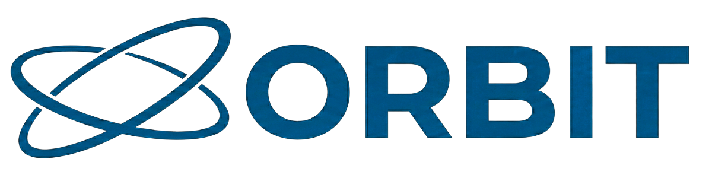

<div align="center">
  <a href="https://github.com/schmitech/orbit">
    
  </a>
</div>

<br/>

<p align="center">
  <a href="https://opensource.org/licenses/Apache-2.0"></a>
  <a href="https://www.python.org/downloads/"></a>
  <a href="https://github.com/schmitech/orbit/releases"></a>
  <a href="https://github.com/schmitech/orbit/commits/main"></a>
  <a href="https://github.com/schmitech/orbit" target="_blank">
    
  </a>
</p>

# ORBIT: Enterprise AI Gateway
**Open Retrieval-Based Inference Toolkit**

**Connect 20+ LLM providers and enterprise data through one governed API.**

ORBIT is a self-hosted gateway that eliminates vendor lock-in and integration glue code. It unifies LLMs, databases, APIs, and voice engines behind one OpenAI-compatible interface and MCP endpoint, letting teams standardize on one integration surface while keeping security, compliance, and operational controls consistent.

[**Try the Sandbox**](https://orbitsandbox.dev/) | [**API Reference**](https://orbit.schmitech.ai/redoc) | [**Docker Guide**](docker/README.md)

<p align="center">
  <a href="https://orbitsandbox.dev/">Try It Yourself!</a>
</p>
<p align="center">
  <video src="https://github.com/user-attachments/assets/1f9dfbf4-4b59-4d0c-87b6-527ea67c97c7" controls muted playsinline width="900"></video>
</p>

<p align="center">
  <a href="https://github.com/schmitech/orbit">Star ORBIT on GitHub</a> to follow new adapters, releases, and production features.
</p>

<p align="center">
  Officially backed by <a href="https://schmitech.ai/en/orbit">Schmitech</a>, the ORBIT service provider for enterprise deployment and support.
</p>

---

**Real-world example:** [**PoliceStats.ca**](https://policestats.ca) uses ORBIT to power a public chat over Canadian municipal police open data. Users ask in plain language about auto theft, break-ins, crime by neighbourhood, and cross-city comparisons.

---

### ⚡ Get Value in 60 Seconds

**A) Try hosted API now**

```bash
curl -X POST https://orbit.schmitech.ai/v1/chat \
  -H 'Content-Type: application/json' \
  -H 'X-API-Key: default-key' \
  -H 'X-Session-ID: test-session' \
  -d '{
    "messages": [{"role": "user", "content": "What is ORBIT?"}],
    "stream": false
  }'
```

**B) Run ORBIT locally with Docker Compose** (recommended — includes Ollama)

```bash
git clone https://github.com/schmitech/orbit.git && cd orbit/docker
docker compose up -d

# Wait for services to start, then test
curl -X POST http://localhost:3000/v1/chat \
  -H 'Content-Type: application/json' \
  -H 'X-API-Key: default-key' \
  -H 'X-Session-ID: local-test' \
  -d '{
    "messages": [{"role": "user", "content": "Summarize ORBIT in one sentence."}],
    "stream": false
  }'
```

For GPU acceleration (NVIDIA): `docker compose -f docker-compose.yml -f docker-compose.gpu.yml up -d`

**C) Run ORBIT from the pre-built image** (server only; point it at your own Ollama)

```bash
docker pull schmitech/orbit:basic
docker run -d --name orbit-basic -p 3000:3000 schmitech/orbit:basic
```

If Ollama runs on your host (e.g. port 11434), add `-e OLLAMA_HOST=host.docker.internal:11434` so the container can reach it. The image includes simple-chat only; for the full stack (Ollama + models), use option B or the [Docker Guide](docker/README.md).

---

### 🖥️ Admin Panel

ORBIT ships with a built-in admin panel for managing users, API keys, personas, and live server monitoring — all from your browser at `/admin`.

<p align="center">
  <video src="https://github.com/user-attachments/assets/57ddaca1-2587-449b-a273-4d70e51f1172" controls muted playsinline width="800"></video>
</p>

---

### 🚀 Key Capabilities

*   **Unified API:** Switch OpenAI, Anthropic, Gemini, Groq, or local models (Ollama/vLLM) by config.
*   **Agentic AI & MCP:** Compatible with **Model Context Protocol (MCP)** for tool-enabled agent workflows.
*   **Native RAG:** Connect Postgres, MongoDB, Elasticsearch, or Pinecone for natural-language data access.
*   **Voice-First:** Real-time, full-duplex speech-to-speech with interruption handling via PersonaPlex.
*   **Governance Built In:** RBAC, rate limiting, audit logging, and circuit breakers.
*   **Privacy First:** Self-host on your own infrastructure for full data control.

---

### 🆚 Why Enterprise Teams Choose ORBIT

| If you use... | You often get... | ORBIT gives you... |
| :--- | :--- | :--- |
| Single-provider SDKs | Vendor lock-in and provider-specific rewrites | One OpenAI-compatible API across providers |
| Basic LLM proxy only | Model routing, but no data connectivity | Unified model + retrieval + tooling gateway |
| RAG-only framework | Strong retrieval, weak multi-provider inference control | Native RAG with multi-provider and policy controls |
| In-house glue scripts | Fragile integrations and high ops cost | A production-ready gateway with RBAC, limits, and logs |

---

### 🏢 Enterprise Readiness

*   **Deployment Flexibility:** Run ORBIT in your own environment for strict data-boundary requirements.
*   **Operational Control:** Standardize access, traffic policies, and audit trails behind one gateway.
*   **Architecture Fit:** Integrates with existing data systems, identity patterns, and model providers.
*   **Service Backing:** [Schmitech](https://schmitech.ai/) provides enterprise onboarding, deployment support, and ongoing operations guidance.

---

### 🎯 Common Use Cases

*   **Enterprise RAG:** Query SQL, NoSQL, and vector stores with one natural-language API.
*   **Provider Failover:** Route between Ollama, vLLM, OpenAI, Anthropic, Gemini, Groq, etc. without rewrites.
*   **Voice Agents:** Build full-duplex speech-to-speech experiences with interruption handling.
*   **MCP Tooling Layer:** Expose data and actions to agentic apps through MCP compatibility.

---

### 🛠️ One Gateway, Many Clients

| Client | Link | Description |
| :--- | :--- | :--- |
| **Web Chat** | [ORBIT Chat](clients/orbitchat/) | React UI. |
| **CLI** | `pip install schmitech-orbit-client` | Chat directly from your terminal. |
| **Mobile** | [ORBIT Mobile](clients/orbit-mobile/) | iOS & Android app built with Expo. |
| **SDKs** | [Node SDK](clients/node-api/) | Or use any standard OpenAI-compatible SDK. |

---

### 📦 Deployment

**Docker Compose (Fastest Path)**
```bash
git clone https://github.com/schmitech/orbit.git && cd orbit/docker
docker compose up -d
```
This starts ORBIT + Ollama with SmolLM2, auto-pulls models, and exposes the API on port 3000. Connect [orbitchat](https://www.npmjs.com/package/orbitchat) from your host: `ORBIT_ADAPTER_KEYS='{"simple-chat":"default-key"}' npx orbitchat`

**Pre-built image only** (server + your own Ollama): `docker pull schmitech/orbit:basic` then `docker run -d --name orbit-basic -p 3000:3000 -e OLLAMA_HOST=host.docker.internal:11434 schmitech/orbit:basic` if Ollama runs on the host.

See the full [Docker Guide](docker/README.md) for GPU mode, volumes, single-container run, and configuration.

**Stable Release (Recommended for Production)**
```bash
curl -L https://github.com/schmitech/orbit/releases/download/v2.6.2/orbit-2.6.2.tar.gz -o orbit-2.6.2.tar.gz
tar -xzf orbit-2.6.2.tar.gz && cd orbit-2.6.2

cp env.example .env && ./install/setup.sh
source venv/bin/activate
./bin/orbit.sh start && cat ./logs/orbit.log
```

---

### 📈 Project Momentum

*   Frequent releases: [Releases](https://github.com/schmitech/orbit/releases)
*   Active roadmap and Q&A: [Discussions](https://github.com/schmitech/orbit/discussions)
*   Feature requests and bugs: [Issues](https://github.com/schmitech/orbit/issues)
*   Technical writeups: [Cookbook](docs/cookbook/) – recipes and how-tos
*   Enterprise services: [Official ORBIT provider (Schmitech)](https://schmitech.ai/en/orbit)

---

### 🧩 Supported Integrations

**Inference:** OpenAI, Anthropic, Google Gemini, Groq, DeepSeek, Mistral, AWS Bedrock, Azure, Together, Ollama, vLLM, llama.cpp.

**Data Adapters:** PostgreSQL, MySQL, MongoDB, Elasticsearch, DuckDB, Chroma, Qdrant, Pinecone, Milvus, Weaviate.

---

### 📚 Resources & Support

*   [Step-by-Step Tutorial](docs/tutorial.md) – Learn how to chat with your own data in minutes.
*   [Cookbook](docs/cookbook/) – Recipes and how-tos for configuration and real-world use cases.
*   [Documentation](docs/) – Full architecture and setup guides.
*   [GitHub Issues](https://github.com/schmitech/orbit/issues) – Bug reports and feature requests.
*   [Discussions](https://github.com/schmitech/orbit/discussions) – Community help and roadmap.
*   [Enterprise Services](https://schmitech.ai/en/orbit) – Backed by Schmitech for onboarding, deployment, and production support.
*   [Good First Issues](https://github.com/schmitech/orbit/issues?q=is%3Aissue%20is%3Aopen%20label%3A%22good%20first%20issue%22) – Starter tasks for new contributors.
*   [Help Wanted](https://github.com/schmitech/orbit/issues?q=is%3Aissue%20is%3Aopen%20label%3A%22help%20wanted%22) – High-impact tasks where contributions are needed.

> ⭐ **Help ORBIT grow:** [Star the repo](https://github.com/schmitech/orbit) to support the project and get notified of new adapters!

## 📄 License

Apache 2.0 – see [LICENSE](LICENSE).
