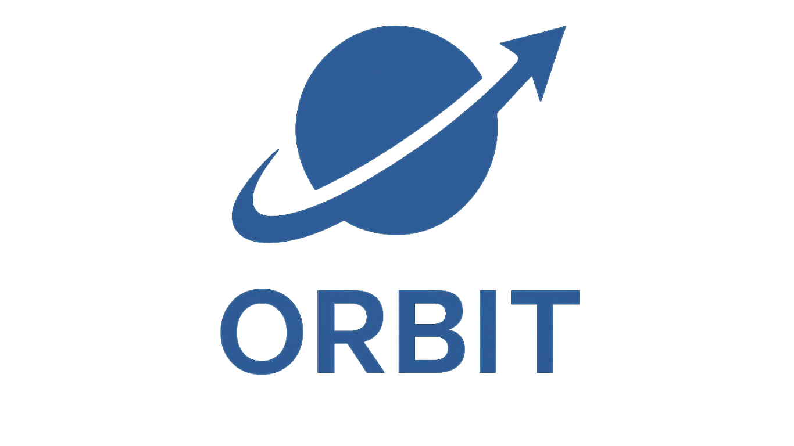

<div align="center">
  <a href="https://github.com/schmitech/orbit">
    
  </a>
</div>

<h1 align="center">ORBIT - Your Private, On-Prem AI Gateway</h1>
<h3 align="center"><em>Open Retrieval-Based Inference Toolkit</em></h3>

<div align="center">
  
<p align="center">
  <strong>Build powerful AI solutions on your own infrastructure. No subscription fees, total data control.</strong>
</p>

<p align="center">
  <a href="https://opensource.org/licenses/Apache-2.0"></a>
  <a href="https://www.python.org/downloads/"></a>
  <a href="https://www.docker.com/"></a>
  <a href="https://github.com/schmitech/orbit/releases"></a>
  <a href="https://github.com/schmitech/orbit" target="_blank">
    
  </a>
</p>

</div>

## 🛰️ What is ORBIT?

ORBIT (Open Retreival-Based Inference Toolkit) is a middleware platform that provides a unified API for AI inference. It acts as a central gateway, allowing you to connect various local and remote AI models with your private data sources like SQL databases, vector stores, and local files.

---

<div align="center">
  <video src="https://github.com/user-attachments/assets/b183678f-d2de-40c8-b969-74e71c3c96d9" controls>
    Your browser does not support the video tag.
  </video>
  <br/>
  <i>ORBIT in action extracting data insights from an e-commerce database.</i>
</div>

---

## 🚀 Quick Start

### 1. Deploy with Docker

Refer to the [Docker Setup Guide](docker/README.md).


### 2. Deploy Locally

```bash
# Download the latest release
curl -L https://github.com/schmitech/orbit/releases/download/v1.3.5/orbit-1.3.5.tar.gz -o orbit-1.3.5.tar.gz
tar -xzf orbit-1.3.5.tar.gz
cd orbit-1.3.5

# Run the quick setup script (downloads a small model)
cp env.example .env
./install/setup.sh --profile minimal --download-gguf gemma3-270m

# Start the ORBIT server
source venv/bin/activate
./bin/orbit.sh start # Logs are at /logs/orbit.log
```
Your ORBIT instance is now running at `http://localhost:3000`.

### 3. Chat with ORBIT using the CLI tool

Use the `orbit-chat` CLI tool to interact with your instance.

```bash
# The ORBIT chat client is already available after installation.
pip install schmitech-orbit-client

# Start chatting!
orbit-chat --url http://localhost:3000
```

#### ORBIT Installation:

<div align="center">
  <video src="https://github.com/user-attachments/assets/8ea103a6-8b33-4801-adc2-f0e81e03e96e" controls>
    Your browser does not support the video tag.
  </video>
  <br/>
  <i>Installing ORBIT locally using the 'orbit-chat' python tool.</i>
</div>

#### ORBIT Chat CLI Tool:

<div align="center">
  <video src="https://github.com/user-attachments/assets/db46e91c-4cb7-44b4-b576-8c1d19176f0a" controls>
    Your browser does not support the video tag.
  </video>
  <br/>
  <i>Using 'orbit-chat' tool. Add -h for usage.</i>
</div>

### 4. Chat with ORBIT using the Web Widget
```bash
cd clients/chat-widget/react-example/
npm install
npm run dev
```

<div align="center">
  <video src="https://github.com/user-attachments/assets/675861ed-c6a9-4dd7-9a46-1acf79d9b4e8" controls>
    Your browser does not support the video tag.
  </video>
  <br/>
  <i>Chatting with ORBIT using the react widget. The widget is available as an <a href="https://www.npmjs.com/package/@schmitech/chatbot-widget">NPM package</a></i>
</div>

---

## 🏗️ Architecture Overview

<div align="center">
  
</div>

<details>
<summary><b>Click to learn more about the Core Components</b></summary>

### Core Components

**ORBIT Server** (`/server/`): FastAPI-based inference middleware
- **Inference Layer**: Supports multiple LLM providers (OpenAI, Anthropic, Cohere, Ollama, etc.) via unified interface
- **RAG System**: Retrieval-Augmented Generation with SQL, Vector DB, and file-based adapters
- **Authentication**: PBKDF2-SHA256 with bearer tokens, MongoDB-backed sessions
- **Fault Tolerance**: Circuit breaker pattern with exponential backoff for provider failures
- **Content Moderation**: Multi-layered safety with LLM Guard and configurable moderators

**Configuration** (`/config/`): YAML-based modular configuration
- Main config in `config.yaml` with environment variable support
- Separate configs for adapters, datasources, embeddings, inference, moderators, and rerankers
- Dynamic loading with validation and resolver system

**Client Libraries**:
- React-based chat application with Zustand state management
- Embeddable chat widget with theming support
- Node.js and Python API client libraries

### Dependencies

- **MongoDB** (Required): Authentication, RAG storage, conversation history
- **Redis** (Optional): Caching layer
- **Vector DBs** (Optional): Chroma, Qdrant, Pinecone, Milvus for semantic search
- **SQL DBs** (Optional): PostgreSQL, MySQL, SQLite for structured data retrieval
</details>

---

## ✨ What Can You Build with ORBIT?

ORBIT uses a flexible [adapter architecture](docs/adapters.md) to connect your data to AI models. An API key is tied to a specific adapter, effectively creating a specialized "agent" for a certain task. Here are a few examples:

### Scenario 1: Knowledge Base Q&A
Provide instant, semantically-aware answers from a knowledge base. Perfect for customer support or internal documentation.

**Sample Questions:**
- "What are the summer camp programs for kids?"
- "How do I register for the contemporary dance class?"

_NOTE: You need an instance of MongoDB to enable adapters_

### Setup the sample SQLite Database with Q/A records about a municipality.

Here's the [Sample Q/A datasets](examples/city-qa-pairs.json) for this example. The knowledge base corresponds to a municipal services assistant.

```bash
#Login as admin first. Default password is admin123. You should change after installing ORBIT.
./bin/orbit.sh login

# Set up SQL Lite database with Q&A data
./examples/sample-db-setup.sh sqlite
```

<div align="center">
  <video src="https://github.com/user-attachments/assets/b54659fe-2172-4754-b9ff-68292f7efcb1" controls>
    Your browser does not support the video tag.
  </video>
  <br/>
  <i>Setting up the sample SQLite Q/A dataset</i>
</div>

### Testing with the node client:

```bash
# Test using node client
cd clients/node-api
npm install
npm run build
npm run test-query-from-pairs ../../examples/city-qa-pairs.json "http://localhost:3000" "your-api-key" 5 134444
```

<div align="center">
  <video src="https://github.com/user-attachments/assets/e6487006-02da-4927-a4f3-04be7c6a3a22"" controls>
    Your browser does not support the video tag.
  </video>
  <br/>
  <i>Testing the Q/A Adapter using the node API client</i>
</div>

### Testing with the react chat widget:

<div align="center">
  <video src="https://github.com/user-attachments/assets/e9fb6eeb-f56f-4487-9a5d-1b24f1af9f6a"" controls>
    Your browser does not support the video tag.
  </video>
  <br/>
  <i>Testing the Q/A Adapter using the ORBIT Web Widget</i>
</div>


### Scenario 2: Chat with Your SQL Database
Ask questions about your data in natural language and get answers without writing SQL.

**Sample Questions:**
- "Show me all orders from John Smith"
- "What are the top 10 customers by order value?"

```bash
# Set up PostgreSQL with a sample schema and data
cd examples/postgres

# Update with  your connection parameters
cp env.example .env

# Test connection
python test_connection.py

# Create the DB
python setup_schema.py

# Install faker to generate synthetic data
pip install faker

# Add sample data
python customer-order.py --action insert --clean --customers 100 --orders 1000

# Create an API key for the SQL intent adapter.
# Make sure you are logged in as admin if auth is enabled in `/config/config.yaml`.
python bin/orbit.py key create \
  --adapter intent-sql-postgres \
  --name "Order Management Assistant" \
  --prompt-file examples/postgres/prompts/customer-assistant-enhanced-prompt.txt

#make sure the sample SQL intent adapter is enabled in `/config/adapters.yaml`
- name: "intent-sql-postgres"
    enabled: false
    type: "retriever"
    datasource: "postgres"
    adapter: "intent"
    implementation: "retrievers.implementations.intent.IntentPostgreSQLRetriever"
    inference_provider: "ollama"

# Start or restart the server
./bin/orbit.sh start --delete-logs

# Start chatting with your new key
orbit-chat --url http://localhost:3000 --api-key YOUR_API_KEY
```

<div align="center">
  <video src="https://github.com/user-attachments/assets/d33dfb10-1668-4b05-ba83-ae3c294001ad"" controls>
    Your browser does not support the video tag.
  </video>
  <br/>
  <i>Testing the SQL Intent Adapter using the ORBIT CLI tool</i>
</div>

---

## ⭐ Like this project? Give it a star!

If you find ORBIT useful, please consider giving it a star on GitHub. It helps more people discover the project.

<a href="https://github.com/schmitech/orbit" target="_blank">
  
</a>

<a href="https://star-history.com/#schmitech/orbit&Date">
  <picture>
    <source media="(prefers-color-scheme: dark)" srcset="https://api.star-history.com/svg?repos=schmitech/orbit&type=Date&theme=dark" />
    <source media="(prefers-color-scheme: light)" srcset="https://api.star-history.com/svg?repos=schmitech/orbit&type=Date" />
    
  </picture>
</a>

---

## 📖 Documentation

For more detailed information, please refer to the official documentation.

- [Installation Guide](docs/server.md)
- [Configuration](docs/configuration.md)
- [Authentication](docs/authentication.md)
- [RAG & Adapters](docs/adapters.md)
- [Development Roadmap](docs/roadmap/README.md)
- [Contributing Guide](CONTRIBUTING.md)

<details>
<summary><b>Full API Reference</b></summary>

ORBIT provides a RESTful API for programmatic access. The full API reference with examples is available at `/docs` (Swagger UI) when the server is running.

### Core Chat & Inference
- `POST /v1/chat` - MCP protocol chat endpoint (JSON-RPC 2.0 format)
- `GET /health` - Overall system health

### Authentication
- `POST /auth/login` - User authentication  
- `POST /auth/logout` - End session
- `GET /auth/me` - Get current user info
- `POST /auth/register` - Register new user
- `POST /auth/change-password` - Change user password

### API Key Management (Admin)
- `GET /admin/api-keys` - List API keys
- `POST /admin/api-keys` - Create new API key
- `DELETE /admin/api-keys/{api_key}` - Delete API key
- `POST /admin/api-keys/deactivate` - Deactivate API key
- `GET /admin/api-keys/{api_key}/status` - Get API key status

### System Prompts (Admin)
- `GET /admin/prompts` - List system prompts
- `POST /admin/prompts` - Create system prompt
- `PUT /admin/prompts/{prompt_id}` - Update system prompt
- `DELETE /admin/prompts/{prompt_id}` - Delete system prompt

### Health & Monitoring
- `GET /health` - System health overview
- `GET /health/adapters` - Adapter health status
- `GET /health/embedding-services` - Embedding service status
- `GET /health/mongodb-services` - MongoDB connection status
- `GET /health/ready` - Readiness check
- `GET /health/system` - System resource usage

### File Management (Experimental)
- `POST /upload` - Single file upload
- `POST /upload/batch` - Batch file upload
- `GET /info/{file_id}` - File information
- `DELETE /{file_id}` - Delete file
- `GET /status` - File system status
</details>

## 🤝 Community & Support

- **Questions?** Open an [issue](https://github.com/schmitech/orbit/issues)
- **Updates:** Check the [changelog](CHANGELOG.md)
- **Commercial Support:** Contact [schmitech.ai](https://schmitech.ai/)
- **Maintained by:** [Remsy Schmilinsky](https://www.linkedin.com/in/remsy/)

## 📄 License

Apache 2.0 - See [LICENSE](LICENSE) for details.