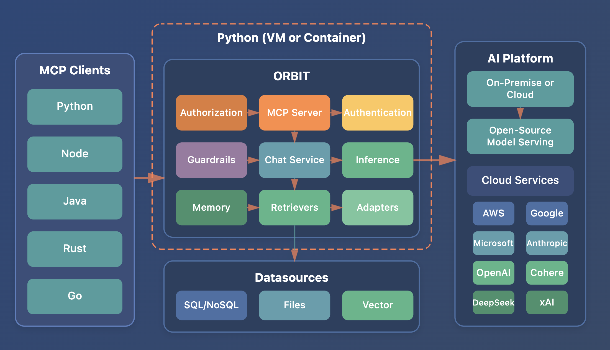

<div align="center">
  
</div>

<h1 align="center">ORBIT - Open Retrieval-Based Inference Toolkit</h1>

<div align="center">
  
<p align="center">
  <a href="https://opensource.org/licenses/Apache-2.0"></a>
  <a href="https://www.python.org/downloads/"></a>
  <a href="https://www.docker.com/"></a>
  <a href="https://github.com/schmitech/orbit/releases"></a>
</p>

**Deploy AI solutions without subscription fees. Run locally, maintain control.**

[Documentation](docs/) • [Quick Start](#-quick-start) • [Features](#-key-features) • [Demo](#-see-it-in-action) • [Support](https://schmitech.ai/)

</div>

## 🛰️ What is ORBIT?

ORBIT is a middleware platform that provides a unified API for AI inference, allowing you to:

- **Run AI models locally** - No cloud dependencies or per-token costs
- **Connect your data** - SQL databases, vector stores, and files
- **Deploy anywhere** - Locally, on-premise, or in the cloud. VM or Container.
- **Stay secure** - Built-in authentication and content moderation

ORBIT is actively maintained by [Remsy Schmilinsky](https://www.linkedin.com/in/remsy/).

## 🤔 Why ORBIT?

Unlike cloud-based AI services, ORBIT gives you:

- **No recurring costs** - Pay for hardware, not tokens
- **Complete privacy** - Your data never leaves your infrastructure  
- **Full control** - Customize everything to your needs
- **Compliance ready** - Built for regulated industries

Perfect for organizations seeking full transparency, control, and regulatory compliance when combining inference with sensitive data.

<div align="center">
  
</div>

## ✨ Key Features

- 🤖 **Model-serving options** - Ollama, vLLM, llama.ccp, and more
- 🔍 **RAG Support** - SQL, Vector DB, and Files
- 🔐 **Security** - Authentication, Authorizaton (API Keys), content moderation, and audit trails
- 🚀 **High Performance** - Async architecture with fault tolerance

## 📋 Minimum Requirements

- Python 3.12+
- CPU & 16GB RAM (GPU recommended for 3b+ models)
- MongoDB (for authentication and RAG features)
- Optional: Redis (Caching), Elasticsearch (Logging/Audit)

## 🚀 Quick Start

### Installation

```bash
# Download latest release
curl -L https://github.com/schmitech/orbit/releases/download/v1.2.1/orbit-1.2.1.tar.gz -o orbit-1.2.1.tar.gz
tar -xzf orbit-1.2.1.tar.gz
cd orbit-1.2.1

# Quick setup with a small model
cp .env.example .env
./install/setup.sh --profile minimal --download-gguf gemma3-1b

# Start ORBIT (Default is http://localhost:3000)
source venv/bin/activate
./bin/orbit.sh --help # CLI tool options
./bin/orbit.sh start # logs under /logs/orbit.log
```

<video src="https://github.com/user-attachments/assets/8ea103a6-8b33-4801-adc2-f0e81e03e96e" controls>
  Your browser does not support the video tag.
</video>

### ORBIT CLI Chat

Try the chat endpoint using ```orbit-chat``` tool. This is a [python package](https://pypi.org/project/schmitech-orbit-client/). The source is under directory `clients/python` if you owish to customize it.
```bash
orbit-chat --help
orbit-chat --url http://localhost:3000 # Default url
```
<video src="https://github.com/user-attachments/assets/db46e91c-4cb7-44b4-b576-8c1d19176f0a" controls>
  Your browser does not support the video tag.
</video>

### 🐳 Docker
See [Docker Setup Guide](docker/README.md) for details.

## 🏗️ Architecture Overview

### Core Components

**ORBIT Server** (`/server/`): FastAPI-based inference middleware
- **Inference Layer**: Supports multiple LLM providers (OpenAI, Anthropic, Cohere, Ollama, etc.) via unified interface
- **RAG System**: Retrieval-Augmented Generation with SQL, Vector DB, and file-based adapters
- **Authentication**: PBKDF2-SHA256 with bearer tokens, MongoDB-backed sessions
- **Fault Tolerance**: Circuit breaker pattern with exponential backoff for provider failures
- **Content Moderation**: Multi-layered safety with LLM Guard and configurable moderators

**Configuration** (`/config/`): YAML-based modular configuration
- Main config in `config.yaml` with environment variable support
- Separate configs for adapters, datasources, embeddings, inference, moderators, and rerankers
- Dynamic loading with validation and resolver system

**Client Libraries**:
- React-based chat application with Zustand state management
- Embeddable chat widget with theming support
- Node.js and Python API client libraries

### Dependencies

- **MongoDB** (Required): Authentication, RAG storage, conversation history
- **Redis** (Optional): Caching layer
- **Vector DBs** (Optional): Chroma, Qdrant, Pinecone, Milvus for semantic search
- **SQL DBs** (Optional): PostgreSQL, MySQL, SQLite for structured data retrieval

## 🔧 Sample Use Cases

### 💬 Local AI Assistant
Run AI models on your hardware without cloud dependencies:
```bash
# Already done in quick start!
orbit-chat
```

### 📚 Knowledge Base Q&A
Combine data with inference:
```bash
# Set up with SQLite (see docs for full config)
./examples/setup-demo-db.sh sqlite
orbit-chat --api-key orbit_YOUR_KEY
```

### 🌐 Website Chatbot
Add an AI assistant to your website:
```bash
npm install @schmitech/chatbot-widget
```
Here some examples of the chatbot widget in action:

#### AI Assistant for a Non-Profit Organization:
<video src="https://github.com/user-attachments/assets/218a7396-ec8b-474e-803c-9b4caa4ca1a7" controls>
  Your browser does not support the video tag.
</video>

#### AI Assistant for a Municipality:
<video src="https://github.com/user-attachments/assets/876d0e5b-d24f-4367-be5a-3f966d97e8b6" controls>
  Your browser does not support the video tag.
</video>

See the [widget documentation](clients/chat-widget/README.md) for integration details.

## 📖 Documentation

### Getting Started
- [Installation Guide](docs/server.md) - Detailed setup instructions
- [Configuration](docs/configuration.md) - Essential settings
- [Docker Deployment](docker/README.md) - Container setup

### Core Features
- [Authentication](docs/authentication.md) - User management and security
- [RAG & Adapters](docs/adapters.md) - Connect your data sources
- [Content Moderation](docs/llm-guard-service.md) - Safety features

### Advanced Topics
- [API Reference](docs/api-reference.md) - Complete API documentation
- [Development Roadmap](docs/roadmap/README.md) - What's coming next
- [Contributing Guide](CONTRIBUTING.md) - Join the project

## 🤝 Community & Support

- **Questions?** Open an [issue](https://github.com/schmitech/orbit/issues)
- **Updates:** Check the [changelog](CHANGELOG.md)
- **Commercial Support:** Contact [schmitech.ai](https://schmitech.ai/)
- **Maintained by:** [Remsy Schmilinsky](https://www.linkedin.com/in/remsy/)

## 📄 License

Apache 2.0 - See [LICENSE](LICENSE) for details.