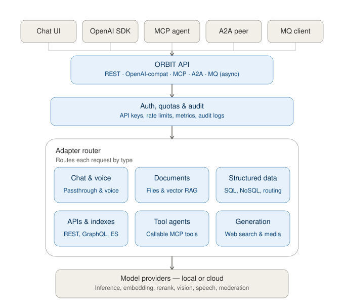

# ORBIT Capability Matrix

## Overview

**ORBIT (Open Retrieval-Based Inference Toolkit)** is an open-source AI gateway, retrieval-augmented generation (RAG) engine, and agent-protocol host. It can be deployed on-premises, in a private cloud, or fully offline.

Models, data sources, adapters, and security settings are defined as YAML files under `config/`, rather than in server code. This allows configuration to be version-controlled and reviewed in a source repository like any other code artifact, diffed between commits, and promoted across development, staging, and production environments through the organization's existing CI/CD and change-management process — supporting typical DevSecOps practices for multi-environment deployment.

This document describes ORBIT's capabilities as implemented in its configuration files (`config/*.yaml`) and documentation (`docs/`), and compares them against three reference categories:

- **LiteLLM** — an LLM API proxy and router
- **Open WebUI** — a chat user interface for local/cloud LLMs
- **Commercial managed AI platforms** (e.g., AWS Bedrock, Azure AI, Google Vertex AI, IBM watsonx)

Each row in the comparison tables is intended to describe what each platform does, not to rank them. Where a claim about a comparison platform could not be verified against that platform's own documentation or pricing page, it has been noted as such or omitted.

---

## 1. Comparison Matrix

| Dimension | **ORBIT** | **LiteLLM** | **Open WebUI** | **Commercial Managed Platforms** *(Bedrock/Azure/Vertex)* |
| :--- | :--- | :--- | :--- | :--- |
| **Primary function** | AI gateway + multi-source RAG + agent protocol host | LLM API proxy and router | Chat user interface for local/cloud LLMs | Managed cloud AI service |
| **Inference backends** | 41 provider/runtime configurations (cloud APIs, local GGUF, vLLM, TensorRT-LLM, BitNet, AirLLM, TEE) — see note in §2.1 on default-disabled backends | Broad set of cloud/proxy API routes | Ollama-native; also reaches any OpenAI-compatible endpoint (OpenAI, or a self-hosted llama.cpp/vLLM/LM Studio server) | Vendor-operated model catalog |
| **Data source integration** | SQL (9 dialects), vector DBs (6 integrated), NoSQL, REST/GraphQL, web search (provider-native for Gemini/OpenAI/xAI, plus 7 external search backends usable with any LLM) | No built-in data-source connectors; typically paired with an external RAG pipeline | Web search plugin and document-based vector RAG | Cloud-native connectors (S3/Blob/GCS) and managed vector search services |
| **Document & media processing** | Three document-parsing engines (Docling, MarkItDown, LLM/vision OCR); image, video, STT/TTS generation | Not included | Text extraction from uploaded files (e.g., PyPDF) | Cloud OCR/vision services (e.g., Textract, Form Recognizer) |
| **Agent protocols** | MCP (server and client host), Google A2A, RabbitMQ-based async messaging | Function/tool-call proxying | Tool-calling UI plugins | Vendor-specific agent frameworks |
| **Conversational UX features** | Cross-adapter skill invocation with optional automatic intent routing, query autocomplete from adapter/skill examples, and per-model dynamic conversation-history budgeting (see §2.9) | Not in scope — LiteLLM proxies inference calls and does not manage conversation state or UX | Chat UI includes model-side features (e.g., prompt templates, RAG toggles) but does not implement adapter-swapping skills, intent-based auto-routing, or dynamic per-model history budgeting | Varies by vendor SDK/console; not a standard cross-platform feature |
| **Security & identity** | 6-role RBAC (11 permissions), OIDC/SSO (Entra ID, Auth0), OS keyring integration, AES-256 file encryption — included in the open-source distribution | Key-based limits and proxy-level auth in the open-source tier; SSO/SCIM, OIDC/JWT auth, and audit logs are listed as part of the paid Enterprise tier per LiteLLM's published pricing (see §3.1) | User accounts, OAuth | Cloud IAM (AWS IAM, Azure RBAC, etc.) |
| **Safety & moderation** | Configurable moderation backends (OpenAI, Anthropic, Llama-Guard3, Shieldstral), plus a local PII-detection filter (`privacy-filter`) | Integrates with external moderation/PII services (e.g., Presidio) | Basic moderation options | Managed cloud guardrail services |
| **Hardware acceleration** | CUDA, MPS, vLLM, TensorRT-LLM (FP8/INT8), SGLang, BitNet | Routes to external inference servers; does not run hardware-accelerated inference itself | Dependent on the Ollama backend it connects to | Managed cloud GPU infrastructure |
| **Deployment model** | Docker, Kubernetes, bare-metal, air-gapped, async worker processes | Docker, Kubernetes, serverless | Docker, desktop, serverless | Managed cloud SaaS/PaaS |
| **License** | Apache 2.0 (single tier, no gated features) | Open-source core under a permissive license, with a separate paid Enterprise tier for the features listed in §3.1 (per litellm.ai/pricing) | BSD-3-Clause through v0.6.5; v0.6.6+ adds a branding-protection clause (not OSI-approved as "open source"), with a separate enterprise license for white-labeling — see §4.2 | Proprietary cloud service |

---

## 2. Capability Detail

### 2.1 LLM Gateway & Inference

ORBIT defines **41 inference provider/runtime configurations** in `config/inference.yaml`. Most are disabled by default and require an API credential or a locally running runtime (e.g., an Ollama daemon or a vLLM server) to be usable — the count reflects configured integrations, not backends active in a given deployment.

| Capability | Details | Source |
| :--- | :--- | :--- |
| Supported backends (41 entries) | Ollama, vLLM, SGLang, TensorRT-LLM, Shimmy, llama.cpp, Gemini, Groq, DeepSeek, Vertex AI, AWS Bedrock, Azure OpenAI, OpenAI, Mistral, Anthropic, Together AI, xAI Grok, Hugging Face Transformers, AirLLM, OpenRouter, Cohere, IBM watsonx, Perplexity, Fireworks AI, Replicate, NVIDIA AI Catalog, BitNet, ZAI, Cerebras, DeepInfra, LM Studio, Moonshot AI, MiniMax, NEAR AI Cloud (TEE), Nebius, Venice, Scaleway, Sakana Fugu | `config/inference.yaml` |
| Local hardware acceleration | TensorRT-LLM (FP8, INT8, AWQ 4-bit), vLLM (tensor/pipeline parallelism), SGLang, AirLLM (disk-based layer streaming) | `config/inference.yaml` |
| Quantized/low-bit runtimes | BitNet (`i2_s`, `tl1` kernels), llama.cpp GGUF | `config/inference.yaml`, `config/llama_cpp.yaml`, `docs/bitnet-setup.md` |
| Confidential computing | NEAR AI Cloud TEE integration | `config/inference.yaml` |
| Fault tolerance | Circuit breaker with exponential backoff, jitter, recovery timeout, and probe caps (`failure_threshold: 5`, `recovery_timeout: 30s`); model fallback chaining | `config/config.yaml` (`fault_tolerance`) |
| Per-adapter provider overrides | Adapters can override `inference_provider`, `embedding_provider`, `reranker_provider`, and `model` | `config/adapters.yaml` |

---

### 2.2 Data Sources & Retrieval

| Capability | Details | Source |
| :--- | :--- | :--- |
| SQL databases (9 dialects) | PostgreSQL, MySQL, MariaDB, SQLite, Supabase, Oracle, SQL Server, DuckDB, AWS Athena | `config/datasources.yaml` |
| Vector databases (6 integrated as retrievers) | Chroma, Qdrant, Milvus, Pinecone, Elasticsearch, Redis Vector. Weaviate appears in `stores.yaml` for store-lifecycle management, not as an active retriever backend. | `config/datasources.yaml`, `config/stores.yaml` |
| NoSQL databases | MongoDB (Atlas or self-hosted), Cassandra | `config/datasources.yaml` |
| Web/API sources | REST, GraphQL | — |
| Web search — provider-native | Delegates search and synthesis to the LLM provider's own built-in tool in a single call. Supported with Gemini (`google_search` grounding), OpenAI (Responses API `web_search`), and xAI (`web_search`). Other providers are not supported for this mode. | `config/adapters/web-search.yaml`, `docs/adapters/web-search.md` |
| Web search — external providers | A dedicated `WebSearchStep` calls an external search API (DuckDuckGo, SearXNG, Brave, Serper, Tavily, Google PSE, Perplexity), then any configured LLM synthesizes the answer from the results. Decouples the search backend from the synthesizing model (e.g., DuckDuckGo results summarized by a local Ollama model). | `config/adapters/web-search-providers.yaml`, `docs/adapters/web-search.md` |
| Embedding providers (11) | Ollama, llama.cpp, Jina, OpenAI, Cohere, Mistral, Gemini, Voyage AI, OpenRouter, NVIDIA, SentenceTransformers | `config/embeddings.yaml` |
| Rerankers (7) | Ollama (BGE-Reranker v2), Cohere, Jina, OpenAI, Anthropic, Voyage AI, OpenRouter | `config/rerankers.yaml` |
| Hybrid retrieval scoring | Combines dense embedding similarity, lexical similarity (Jaro-Winkler, Levenshtein), and reranking | `config/config.yaml` (`composite_retrieval`) |
| SQL query safety guard | Generated SQL is validated before execution to confirm it is a single, read-only, row-capped statement, rejecting non-query commands | `CHANGELOG.md` (v2.15.3) |
| Intent template validation | Intent template libraries are validated against a formal schema at load time; templates can optionally require explicit approval before being served | `CHANGELOG.md` (v2.15.4) |

Retrieval is implemented via **intent-based query generation**: natural-language input is mapped to SQL/NoSQL/API queries through configured templates, rather than a general-purpose text-to-SQL model call on every request.

---

### 2.3 Document Processing

| Capability | Details | Source |
| :--- | :--- | :--- |
| File formats | PDF, DOCX, PPTX, XLSX, XLS, CSV, JSON, XML, HTML, TXT, EPUB, ZIP, images, audio | `config/config.yaml` |
| Processing engines (in priority order) | 1. Docling (layout-aware parsing) 2. MarkItDown (document-to-markdown) 3. LLM/vision-based OCR (Mistral, Gemini, or vision models from OpenAI/Anthropic/Cohere/Ollama/vLLM/llama.cpp) | `config/config.yaml` (`files.processing.processor_priority`), `config/ocr.yaml` |
| Chunking strategies | Fixed-size, token-based, semantic (similarity-boundary detection), recursive, markdown-header | `config/config.yaml` (`files.default_chunking_strategy`) |
| Document security | Magika MIME-type verification, AES-256-GCM encryption at rest | `config/config.yaml` (`files.processing.magika`, `files.encryption`) |
| Storage backends | Local filesystem, AWS S3/MinIO, Azure Blob Storage, Google Cloud Storage | `config/config.yaml` (`files.storage_backend`) |

---

### 2.4 Multimodal & Media Processing

| Domain | Details | Source |
| :--- | :--- | :--- |
| Speech-to-text (12 configured) | Local Whisper (tiny–large-v3, CPU/CUDA), OpenAI API, Google STT, Gemini, xAI Grok STT, Cohere Transcribe, OpenRouter, Ollama; 4 of the 12 entries are provider placeholders without a default model set | `config/stt.yaml` |
| Text-to-speech (11 configured) | OpenAI TTS, Google TTS, Gemini TTS, ElevenLabs, Supertonic (local, 31 languages), Coqui TTS (local), vLLM Orpheus, Ollama (Piper/Kokoro), OpenRouter; 2 of the 11 entries are placeholders | `config/tts.yaml` |
| Audio content sanitization | Strips non-speech content (code blocks, tables) before TTS synthesis, with an optional spoken placeholder | `config/tts.yaml` (`tts.sanitize_content`) |
| Image generation (5 configured) | OpenAI (DALL-E 2/3, GPT Image), Gemini, xAI Grok Imagine, Ollama (Flux2/Z-Image Turbo), OpenRouter (Seedream) | `config/image.yaml` |
| Video generation (3 configured) | Gemini (Veo), xAI (Grok Imagine Video), OpenRouter (Seedance) | `config/video.yaml` |
| Vision/OCR analysis (8 configured) | OpenAI, Anthropic, Cohere, Ollama, vLLM, llama.cpp, Gemini, Mistral | `config/vision.yaml` |
| Real-time speech-to-speech | Native, interruptible voice conversations (not a separate STT-then-TTS pipeline) via OpenAI Realtime (`gpt-realtime`) and Gemini Live (`gemini-3.1-flash-live-preview`), with barge-in support so a user can interrupt the assistant mid-answer. Can be grounded in a configured retriever adapter (SQL, vector, or other data source) via a `grounding_adapter` reference, so spoken answers stay factual rather than relying only on the model's own knowledge — usable for live virtual-assistant scenarios. | `config/adapters/qa.yaml` (`qa-realtime-voice`, `qa-gemini-realtime-voice`), `docs/adapters/grounded-realtime-voice.md` |

Per-adapter allowlists (`allowed_image_models`, `allowed_video_models`, `allowed_audio_models`, `allowed_search_providers`) let a client select, at request time, from a configured set of provider/model combinations for image, video, audio, and web-search generation, rather than being fixed to one adapter-configured default. Because OpenRouter is itself an aggregator exposing many third-party models through a single provider entry, an OpenRouter-backed adapter can expose a correspondingly larger set of selectable image/video/audio models than a single-vendor provider would, subject to how many are added to that adapter's allowlist. (`CHANGELOG.md`, v2.15.6)

---

### 2.5 Protocols

| Protocol | Details | Source |
| :--- | :--- | :--- |
| REST / OpenAI-compatible | `/v1/chat`, `/v1/chat/completions` with SSE streaming | `server/routes/` |
| Model Context Protocol (MCP) | Operates as both an MCP server (`/mcp`) and an MCP client host. Pre-wired example client configs: `filesystem`, a sample REST API, and `github`. Other MCP servers (e.g., Slack, Jira, Sentry, M365) are documented as configuration templates, not pre-wired connections. | `config/mcp_clients.yaml`, `docs/mcp_protocol.md` |
| MCP agentic tool-calling | A bounded, multi-step tool-calling loop lets the model call one or more MCP tools, receive results, and continue reasoning across several rounds within a single request — implemented as ORBIT's own code path against each provider's native tool-calling API, with no external agent-orchestration library (e.g. LangChain, AutoGen, CrewAI) involved. Available either as an explicit skill the client opts into per request, or in an "opportunistic" mode where an ordinary conversational adapter decides per turn, with no client-side signal, whether a tool is needed. Supported with OpenAI, Anthropic, Gemini, xAI, Ollama, Ollama Cloud, llama.cpp (API mode), and vLLM (API mode). | `docs/adapters/mcp-agent.md` |
| Google A2A | Agent discovery (`/.well-known/agent.json`) and task execution (`/a2a`, JSON-RPC 2.0, streaming) | `docs/a2a-protocol.md` |
| Async messaging | RabbitMQ-based AMQP request/response surface for decoupled processing | `config/config.yaml` (`messaging`) |
| WebSockets | Bi-directional streaming for audio and telemetry | `/ws`, `/ws/metrics` |

---

### 2.6 Security, Governance & Identity

| Capability | Details | Source |
| :--- | :--- | :--- |
| Authentication | PBKDF2-SHA256 password hashing (600,000 iterations), 256-bit opaque bearer tokens, OS keyring integration | `docs/authentication.md` |
| SSO | OIDC/OAuth2 for Microsoft Entra ID and Auth0; admin panel SSO with PKCE | `config/config.yaml` (`auth.providers`) |
| RBAC | 6 built-in roles (`admin`, `operator`, `auditor`, `analyst`, `user-manager`, `user`), 11 permissions | `docs/rbac-architecture.md` |
| API key controls | Scoped keys, daily/monthly quotas, rate limits, user/email restrictions, adapter-level binding | `docs/api-keys.md` |
| Identity blacklisting | Wildcard pattern blocking with session revocation | `config/config.yaml` (`auth.blacklist`) |
| Audit logging | Request and admin-action logs, storable in SQLite, Postgres, MongoDB, or Elasticsearch | `config/config.yaml` (`internal_services.audit`) |
| Secrets management | Resolves `${VAR}` references from AWS Secrets Manager, Azure Key Vault, or GCP Secret Manager, falling back to `.env` | `config/config.yaml` (`secrets_management`) |
| Strict auth mode | Optional setting requiring a valid user bearer token in addition to an API key | `config/config.yaml` (`auth.require_authenticated_user`) |

All items in this table are included in ORBIT's open-source (Apache 2.0) distribution; there is no separate paid tier.

---

### 2.7 Safety, Moderation & Privacy

| Capability | Details | Source |
| :--- | :--- | :--- |
| Moderation backends | OpenAI Omni-Moderation, Anthropic moderator, Ollama Llama-Guard3, Shieldstral (via vLLM/llama.cpp) | `config/moderators.yaml`, `config/guardrails.yaml` |
| Local PII detection | Token-classification model (`openai/privacy-filter`, Apache 2.0) run on-premises; no outbound call required | `config/moderators.yaml` (`privacy_filter`) |
| Network security controls | CORS, CSP, HSTS, X-Frame-Options, X-Content-Type-Options, rate limiting, progressive throttling | `config/config.yaml` (`security`) |

---

### 2.8 Reliability & Performance

| Capability | Details | Source |
| :--- | :--- | :--- |
| Multi-worker scaling | Uvicorn process scaling with separate thread pools per workload type | `config/config.yaml` (`performance`) |
| Caching | SQLite, Redis, or Memcached backends | `config/config.yaml` (`internal_services.cache`) |
| Response optimization | GZip compression, ETag caching | `config/config.yaml` (`performance.compression`, `performance.etag_caching`) |
| Cost/token tracking | Per-request token usage and estimated cost, by provider/model | `config/pricing.yaml`, `docs/token-usage-and-cost-tracking.md` |
| Observability | WebSocket telemetry, Prometheus metrics endpoint, log rotation | `config/config.yaml` |

---

### 2.9 Conversational Behavior & Adapter Intelligence

| Capability | Details | Source |
| :--- | :--- | :--- |
| Skills (cross-adapter capability invocation) | Any adapter can invoke another adapter's function mid-conversation via a `skill` request field (e.g., a retrieval adapter invoking image generation) without switching the client's active adapter. Invocable skills are explicitly allowlisted per adapter (`available_skills`); the calling adapter's LLM/retrieval pipeline is bypassed for that single turn and the skill's output is returned instead. | `docs/adapters/skills.md`, `server/services/chat_handlers/request_context_builder.py` |
| Automatic skill/intent routing | Optional per-adapter setting that infers which skill to invoke from plain natural language (no explicit `skill` field required), using an embedding pre-filter over each skill's example phrases followed by a constrained LLM confirmation call. Falls back to a normal conversational turn on any detection error. Disabled by default; opt-in per adapter. | `docs/adapters/skills.md` (Automatic Intent Detection), `config/config.yaml` (`skill_routing`) |
| Autocomplete / query suggestions | Real-time input suggestions drawn from intent-adapter `nl_examples` and skill `routing_examples`, ranked with fuzzy string matching (Levenshtein, Jaro-Winkler) and served from the same shared cache backend as the rest of the platform (SQLite/Redis/Memcached). | `docs/autocomplete-architecture.md`, `config/config.yaml` (`autocomplete`) |
| Dynamic conversation-history token budgeting | Per-conversation history length is computed automatically from the active model's context window (read from provider-specific config, e.g. `num_ctx`/`n_ctx`/`context_window`) minus a reserved allowance for the system prompt and the model's own output-token setting, rather than a fixed message count. Adapters and per-request model selection can each apply their own budget. Old messages are automatically pruned once a session exceeds 120% of budget, with a warning surfaced to the client at 90%. | `docs/conversation_history.md` |

---

### 2.10 Reference Client: OrbitChat

ORBIT ships a standalone chat client, distributed separately as an npm package, that connects to any ORBIT deployment. It is not part of the ORBIT server itself.

| Capability | Details | Source |
| :--- | :--- | :--- |
| Distribution | Installable via `npm install -g orbitchat`; runs as a CLI (`orbitchat`) or as a daemon (`orbitchat-daemon`) | `clients/orbitchat/README.md` |
| Feature set | Streaming responses, file upload, conversation threading, voice input/output, autocomplete, feedback capture, optional Auth0-based login | `clients/orbitchat/README.md` |
| Key-handling model | The browser never receives real API keys. Requests carry an `X-Adapter-Name` header; a bundled Express proxy resolves that name to the corresponding backend API key server-side before forwarding the request. | `clients/orbitchat/README.md` (Architecture, Security) |
| API-only mode | The same proxy layer can run without serving the bundled UI (`--api-only`), exposing a documented REST contract (`GET /api/adapters`, adapter-scoped chat/file/autocomplete endpoints) for a custom frontend to build against | `clients/orbitchat/README.md` (API-Only Mode) |
| Configuration | Per-deployment branding, adapter list, and feature toggles via a single `orbitchat.yaml`; adapter secrets supplied separately via environment variables | `clients/orbitchat/README.md` (Configuring Adapters) |

This positions OrbitChat as an optional, separately maintained reference client rather than a mandatory component — an organization can use ORBIT's API directly, build a custom frontend against the same proxy contract, or adopt OrbitChat as-is.

---

### 2.11 Test Coverage & Performance Testing

| Capability | Details | Source |
| :--- | :--- | :--- |
| Automated test suite | 214 test files and approximately 3,867 test functions under `server/tests/`, organized by subsystem (adapters, admin, auth, cache, CLI, config, datasources, embeddings, fault tolerance, inference, messaging, middleware, pipeline steps, retrievers, routes, services, threads, vector stores, vision, image, document generation, chat handlers, secrets, sound). Counted directly from the repository (`grep -rE "^\s*(async )?def test_"`); excludes `__pycache__`. | `server/tests/` |
| Load testing | Locust-based load testing (`locustfile.py`) with three user profiles (general, health-check, chat-focused), plus a shell-script runner (`run_performance_tests.sh`) covering basic, stress, health, chat, admin, and endurance scenarios | `server/tests/perf/README.md`, `server/tests/perf/locustfile.py` |
| Custom load/scenario testing | `advanced_performance_test.py` supports mixed, burst, and ramp load patterns with CSV/HTML reporting; `multi_user_load_test.py` simulates concurrent multi-tenant traffic across different adapters/API keys with per-adapter latency (p50/p95/p99) and success-rate breakdown | `server/tests/perf/advanced_performance_test.py`, `server/tests/perf/multi_user_load_test.py` |
| Rate-limit/throttle verification | `rate_limit_simulation.py` drives targeted traffic patterns (burst, sustained, random, throttle, quota-exhaustion) against the rate-limiting and throttling subsystem and reports observed behavior against configured limits | `server/tests/perf/rate_limit_simulation.py` |
| Memory-leak profiling | `memray_leak_test.py` runs a load scenario against the server under memray instrumentation and produces flamegraph/table reports of allocations, including those still live at process exit | `server/tests/perf/memray_leak_test.py` |

The presence of dedicated fault-tolerance tests, load/stress tooling, rate-limit simulation, and memory-leak profiling indicates that performance and stability testing is treated as a first-class part of the test suite, not limited to functional unit tests.

---

### 2.12 Administration & Management UI/CLI

ORBIT includes a web-based admin panel and a companion command-line tool (both part of the server distribution, not separate products) for day-to-day management, gated by the RBAC permissions described in §2.6.

| Capability | Details | Source |
| :--- | :--- | :--- |
| No-code adapter creation | Adapters can be created, edited, exported, and imported from the admin panel via a form-based flow, validated, and hot-reloaded without a server restart (including propagation across multi-worker deployments) | `CHANGELOG.md` (v2.14.0, v2.15.2, v2.15.7) |
| MCP server management | External MCP servers can be added, edited, and removed from the admin panel, with live reachability/tool diagnostics and hot reload — no config-file editing or restart required | `CHANGELOG.md` (v2.14.0–v2.15.7), `docs/mcp_protocol.md` |
| Admin CLI (`orbit`) | A command-line tool covering server lifecycle (start/stop/restart/status), authentication and user management, API key lifecycle (create/list/test/rename/deactivate/delete), system prompt management, CLI configuration, and admin operations (hot-reloading adapters or intent templates without a restart) — giving the same administrative surface as the web panel for scripting, automation, and CI/CD use | `bin/orbit.py`, `bin/orbit.sh` |
| Adapter SDK CLI (`adapter-sdk`) | A separate CLI for generating adapter YAML from the same spec registry the admin panel's adapter-creation form uses, including a machine-readable spec listing (`--list --json`) for tooling integration | `bin/adapter-sdk.sh` |
| Cost & audit dashboards | API key, adapter, provider, and call-type (chat/embedding/rerank/media) cost breakdowns with drill-down filtering, alongside the audit log viewer described in §2.6 | `CHANGELOG.md` (v2.15.8–v2.15.9), `docs/token-usage-and-cost-tracking.md` |

---

### 2.13 Onboarding & Documentation

| Resource | Details | Source |
| :--- | :--- | :--- |
| Guided setup | An interactive installer (`install/setup.sh`, `install/wizard.py`) with configurable profiles, plus a prebuilt Docker path (`docker-compose.yml`, published images for Ollama/OpenAI/Gemini configurations) that starts a running instance with no manual configuration | `install/`, `docker/README.md` |
| Step-by-step tutorial series | A `docs/tutorial.md` entry point linking a sequenced set of guides — first chat, chat with files, SQL/MongoDB/DuckDB querying, MCP tool calling, auto skill routing, creating API keys, admin panel tour, and troubleshooting | `docs/tutorial.md`, `docs/tutorial/` |
| Full documentation index | A categorized index (`docs/README.md`) covering architecture, adapters, data sources, security, and advanced/protocol topics, in addition to this capability matrix | `docs/README.md` |
| Runnable examples | Client code samples for the OpenAI-compatible API (Python/Node.js, including streaming) and a sample MCP server for hands-on testing | `examples/` |

---

## 3. Architecture

Clients connect through the ORBIT API over REST, an OpenAI-compatible interface, MCP, A2A, or async MQ transports. Requests pass through auth/quota checks, then an adapter router that dispatches to chat/voice, document, structured-data, API, tool-agent, or generation handlers, which in turn call local or cloud model providers.

---

## 4. Platform-Specific Notes

### 4.1 LiteLLM

LiteLLM's core function is LLM API proxying — request/response translation, load balancing, and spend tracking across providers. It does not include built-in connectors to SQL/vector/NoSQL data sources; retrieval is typically implemented in a separate pipeline outside LiteLLM itself.

LiteLLM is distributed under an open-core model. Per LiteLLM's published pricing page ([litellm.ai/pricing](https://www.litellm.ai/pricing)), the following are listed under a separately sales-quoted "Enterprise" tier rather than the open-source tier: SSO + SCIM, OIDC/JWT authentication, audit logs, secrets-manager integration with key rotation, org/team administration, a multi-region control plane, 24/7 support with SLAs, and self-hosted/air-gapped deployment. Evaluators comparing total cost of ownership should confirm current tier boundaries directly with LiteLLM, as pricing pages are subject to change.

ORBIT includes equivalents of the items listed above — OIDC/SSO, audit logging, secrets-manager integration, RBAC-based access administration, and self-hosted/air-gapped deployment — in its single Apache 2.0 distribution.

### 4.2 Open WebUI

Open WebUI is a chat frontend. It connects to Ollama natively and to any OpenAI-compatible endpoint (which can include self-hosted llama.cpp, vLLM, or LM Studio servers exposing that API). It does not include native connectors to SQL, vector, or NoSQL databases as retrieval sources; document RAG is limited to uploaded-file vector search.

For organizations evaluating a chat frontend specifically, ORBIT's comparable offering is OrbitChat (§2.10) — a separately distributed reference client rather than a component of the ORBIT server itself. OrbitChat and Open WebUI are both frontends that can be pointed at the same class of backend model APIs; the difference in this comparison is in what sits behind them — ORBIT's data-source and governance layer versus a backend the deploying organization assembles separately.

ORBIT is a backend gateway rather than a chat frontend: it provides connection pooling for SQL databases, RabbitMQ-based async messaging, and multi-worker process scaling, none of which are part of Open WebUI's scope.

Regarding licensing: per Open WebUI's own documentation ([docs.openwebui.com/license](https://docs.openwebui.com/license/)), versions through 0.6.5 are BSD-3-Clause (fully permissive). From v0.6.6 onward, the license adds a branding-protection clause requiring "Open WebUI" branding to remain visible unless the deployment has 50 or fewer users in a 30-day period, the user is a substantive contributor with written permission, or the user holds an enterprise license granting branding rights. Open WebUI's own documentation states this version of the license is not OSI-approved as "open source" due to that clause; source code remains publicly available regardless. A separate commercial/enterprise license is offered for white-labeling. Evaluators should confirm the license version in use, since organizations forking from v0.6.5 or earlier are not subject to the branding clause.

### 4.3 Commercial Managed Platforms (AWS Bedrock, Azure AI, Google Vertex AI)

These platforms provide managed model hosting and, in most cases, managed retrieval/vector-search services (e.g., AWS OpenSearch, Azure AI Search) tied to the vendor's own cloud infrastructure. They require outbound connectivity to the vendor's services and generally price on a per-token or per-request basis.

ORBIT can be deployed on the same cloud infrastructure or fully offline, and connects to databases the organization already operates without requiring data migration into a vendor-managed store. This is a deployment-model difference rather than a feature-completeness comparison — commercial platforms offer operational guarantees (SLAs, managed scaling, vendor support) that a self-operated deployment does not provide by default.
