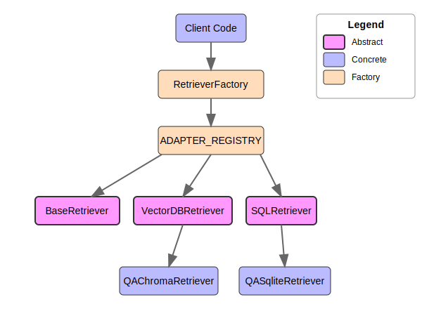

# Adapter Architecture Implementation Guide

This guide explains how to implement and use the adapter architecture for retrievers in your project. The architecture is designed to be flexible, extensible, and easy to maintain.

## Quick Start

```python
from retrievers.adapters.registry import ADAPTER_REGISTRY
from retrievers.base.base_retriever import RetrieverFactory
import yaml

# 1. Load configuration
with open('config.yaml', 'r') as file:
    config = yaml.safe_load(file)

# 2. Register adapters from configuration
ADAPTER_REGISTRY.load_from_config(config)

# 3. Create and use a retriever
async def search_documents(query):
    # Create retriever with appropriate adapter
    retriever = RetrieverFactory.create_retriever(
        retriever_type="chroma",  # Vector DB
        config=config,
        datasource='chroma',
        adapter_name='qa'
    )
    
    # Initialize and set collection
    await retriever.initialize()
    await retriever.set_collection('my_documents')
    
    # Get relevant context
    results = await retriever.get_relevant_context(query)
    return results
```

## Architecture Overview

The adapter architecture separates concerns into the following components:

1. **Base Retrievers**: Abstract base classes that define common interfaces and functionality
   - `BaseRetriever`: Core retriever interface
   - `VectorDBRetriever`: For vector database implementations
   - `SQLRetriever`: For SQL-based implementations

2. **Domain Adapters**: Components that adapt documents for specific domains
   - `DocumentAdapter`: Base interface for all domain adapters
   - Specialized adapters (e.g., `QADocumentAdapter`, `GenericDocumentAdapter`)
   - Datasource-specific adapters (e.g., `ChromaQAAdapter`, `QASqliteAdapter`)

3. **Adapter Registry**: Central registry for managing adapter types, datasources, and implementations
   - `ADAPTER_REGISTRY`: Singleton instance managing adapter registration
   - Supports hierarchical structure: type -> datasource -> adapter name
   - Handles lazy loading of adapters

4. **Retriever Factory**: Factory for creating retriever instances
   - `RetrieverFactory`: Creates retrievers with appropriate domain adapters
   - Supports both direct instantiation and lazy loading

The configuration uses a clear hierarchy:
- `type`: The adapter type (e.g., "retriever", "parser")
- `datasource`: The datasource provider (e.g., "sqlite", "chroma")
- `adapter`: The domain adapter name (e.g., "qa", "generic")
- `implementation`: The implementation class path
- `config`: Adapter-specific configuration

### Architecture Diagram



## Architecture Strengths

This adapter architecture provides several significant advantages:

1. **Clear Separation of Concerns**
   - Base retriever classes handle core functionality (retrieval mechanisms)
   - Domain adapters handle domain-specific document processing and formatting
   - Registry manages component lifecycles and relationships
   - Factory creates properly configured components on demand

2. **Extensibility**
   - New retrievers can be added without modifying existing ones
   - Domain adapters make it easy to support new data types and use cases
   - The registry handles dynamic loading and instantiation of components
   - Extending the system to new domains requires minimal changes to core code

3. **Dependency Inversion**
   - High-level components depend on abstractions, not implementation details
   - Interface-based design through abstract base classes ensures loose coupling
   - Components are easily swappable without breaking dependent code
   - Testing is simplified through the ability to mock or substitute implementations

4. **Configuration-driven**
   - Clean YAML configuration separates behavior from code
   - Dynamic loading of components based on configuration
   - Configurable thresholds and behavior parameters for each component
   - Business logic can be adjusted without code changes

5. **Lazy Loading**
   - Efficient resource usage by only instantiating components when needed
   - Makes it easy to handle heavyweight components like database connections
   - Reduces startup time and memory usage for unused components

The hierarchical structure (type → datasource → adapter name) provides clear organization and avoids naming conflicts while the registry pattern centralizes component management. This architecture scales well as the system grows in complexity.

## Using Adapters

### 1. Load Adapters in Your Application

When your application starts, load the adapters from the configuration:

```python
from retrievers.adapters.registry import ADAPTER_REGISTRY

# Load configuration
with open('config.yaml', 'r') as file:
    config = yaml.safe_load(file)

# Register adapters from configuration
ADAPTER_REGISTRY.load_from_config(config)
```

### 2. Create Retrievers with Appropriate Domain Adapters

Use the retriever factory to create retrievers with the right domain adapter:

```python
from retrievers.base.base_retriever import RetrieverFactory

# Create SQLite retriever with QA domain adapter
retriever = RetrieverFactory.create_retriever(
    retriever_type="sqlite",
    config=config,
    datasource='sqlite',
    adapter_name='qa'
)

# Initialize the retriever
await retriever.initialize()

# Set the collection to use
await retriever.set_collection('qa_data')

# Use the retriever to get relevant context
results = await retriever.get_relevant_context(
    query="How do adapters work?"
)
```

### 3. Error Handling Examples

```python
try:
    # Try to create a retriever
    retriever = RetrieverFactory.create_retriever(
        retriever_type="chroma",
        config=config,
        datasource='chroma',
        adapter_name='qa'
    )
    await retriever.initialize()
except ValueError as e:
    # Handle missing or invalid configuration
    logger.error(f"Configuration error: {e}")
    # Fallback to a default retriever
    retriever = RetrieverFactory.create_retriever(
        retriever_type="sqlite",
        config=config
    )
except ConnectionError as e:
    # Handle database connection issues
    logger.error(f"Database connection error: {e}")
    # Use in-memory fallback
    retriever = RetrieverFactory.create_retriever(
        retriever_type="memory",
        config=config
    )

try:
    # Try to get relevant context
    results = await retriever.get_relevant_context(query)
except Exception as e:
    # Handle retrieval errors
    logger.error(f"Retrieval error: {e}")
    # Return empty results as fallback
    results = []
finally:
    # Always close the retriever when done
    await retriever.close()
```

### 4. Testing Guide

```python
import pytest
from unittest.mock import AsyncMock, MagicMock
from retrievers.base.base_retriever import BaseRetriever
from retrievers.adapters.domain_adapters import DocumentAdapter

# 1. Create a mock adapter for testing
class MockAdapter(DocumentAdapter):
    def format_document(self, raw_doc, metadata):
        return {"content": raw_doc, "metadata": metadata}
        
    def extract_direct_answer(self, context):
        return context[0]["content"] if context else None
        
    def apply_domain_specific_filtering(self, context_items, query):
        return context_items

# 2. Test with a mock retriever
class MockRetriever(BaseRetriever):
    def _get_datasource_name(self):
        return "mock"
    
    async def initialize(self):
        pass
        
    async def close(self):
        pass
        
    async def set_collection(self, collection_name):
        self.collection = collection_name
        
    async def get_relevant_context(self, query, **kwargs):
        # Return test data
        return [{"content": "Test result", "confidence": 0.9}]

# 3. Test a component that uses retrievers
async def test_search_function():
    # Create a mock retriever for testing
    mock_retriever = MockRetriever(
        config={"mock": {"confidence_threshold": 0.5}},
        domain_adapter=MockAdapter()
    )
    
    # Patch the factory to return our mock
    with patch('retrievers.base.base_retriever.RetrieverFactory.create_retriever') as mock_factory:
        mock_factory.return_value = mock_retriever
        
        # Test the function that uses retrievers
        results = await search_documents("test query")
        
        # Assert expected behavior
        assert len(results) == 1
        assert results[0]["content"] == "Test result"
        assert mock_retriever.collection == "my_documents"
```

## Domain-Specific Use Cases

### 1. Question-Answering System

The QA adapter processes documents structured as question-answer pairs:

```python
# QA adapter extracts specific answers from retrieved documents
qa_retriever = RetrieverFactory.create_retriever(
    retriever_type="chroma", 
    config=config,
    adapter_name='qa'
)

# Find answers to customer questions
results = await qa_retriever.get_relevant_context(
    "What is your return policy?"
)

# QA adapter can extract direct answers
direct_answer = qa_retriever.get_direct_answer(results)
```

### 2. Legal Document Search

```python
# Legal adapter processes and formats legal documents
legal_retriever = RetrieverFactory.create_retriever(
    retriever_type="elasticsearch",
    config=config,
    adapter_name='legal'
)

# Search for specific legal precedents
results = await legal_retriever.get_relevant_context(
    "Precedents for trademark infringement in software"
)

# Legal adapter might include citation formatting
for doc in results:
    print(f"Document: {doc['title']}")
    print(f"Citation: {doc['citation']}")
    print(f"Content: {doc['content']}")
```

### 3. Technical Documentation Search

```python
# Documentation adapter specializes in API and technical docs
docs_retriever = RetrieverFactory.create_retriever(
    retriever_type="sqlite",
    config=config,
    adapter_name='technical'
)

# Search API documentation
results = await docs_retriever.get_relevant_context(
    "How to use the RetrieverFactory class"
)

# Technical adapter might extract code examples
for doc in results:
    print(f"Section: {doc['section']}")
    print(f"Example: {doc['code_example']}")
```

## Extending the Architecture

Adapters should follow this pattern:

```yaml
- name: "adapter-name"
  type: "retriever"
  datasource: "data-source-type"
  adapter: "adapter-type"
  implementation: "path.to.implementation.Class"
  config:
    # Adapter-specific configuration options
    confidence_threshold: 0.5
    max_results: 5
    return_results: 3
    # Other adapter-specific settings
```

### Creating a New Domain Adapter

To create a new domain adapter:

1. Create a new class that extends `DocumentAdapter`
2. Implement the required methods: `format_document()`, `extract_direct_answer()`, and `apply_domain_specific_filtering()`
3. Register the adapter with both the factory and registry

Example:

```python
from retrievers.adapters.domain_adapters import DocumentAdapter, DocumentAdapterFactory
from retrievers.adapters.registry import ADAPTER_REGISTRY

class CustomDomainAdapter(DocumentAdapter):
    """Custom domain adapter for specialized document handling"""
    
    def __init__(self, config: Dict[str, Any] = None, **kwargs):
        super().__init__(config=config, **kwargs)
        self.custom_threshold = self.config.get('custom_threshold', 0.6)
    
    def format_document(self, raw_doc: str, metadata: Dict[str, Any]) -> Dict[str, Any]:
        # Custom document formatting logic
        item = {
            "raw_document": raw_doc,
            "content": raw_doc,
            "metadata": metadata.copy() if metadata else {},
            "custom_field": "custom value"
        }
        return item
    
    def extract_direct_answer(self, context: List[Dict[str, Any]]) -> Optional[str]:
        # Custom direct answer extraction logic
        if not context:
            return None
        return context[0].get("content", None)
    
    def apply_domain_specific_filtering(self, context_items: List[Dict[str, Any]], query: str) -> List[Dict[str, Any]]:
        # Custom filtering logic
        filtered_items = [item for item in context_items 
                         if item.get("confidence", 0) >= self.custom_threshold]
        return filtered_items

# Register with the factory
DocumentAdapterFactory.register_adapter("custom", lambda **kwargs: CustomDomainAdapter(**kwargs))

# Register with the registry
ADAPTER_REGISTRY.register(
    adapter_type="retriever",
    datasource="sqlite",
    adapter_name="custom",
    factory_func=lambda **kwargs: CustomDomainAdapter(**kwargs)
)
```

For domain-specific adapters, consider placing your implementation in the appropriate directory structure:

```
server/retrievers/adapters/
└── domain_name/
    └── datasource_domain_adapter.py
```

For example, a legal adapter for Elasticsearch might be placed at:
```
server/retrievers/adapters/legal/elastic_legal_adapter.py
```

### Creating a New Retriever Implementation

To create a new retriever implementation:

1. Choose the appropriate base class to extend:
   - `BaseRetriever`: For general custom retrievers
   - `VectorDBRetriever`: For vector database implementations (requires embeddings)
   - `SQLRetriever`: For SQL-based implementations
   
2. Implement the required abstract methods:
   - `_get_datasource_name()`: Return the name used in config.yaml
   - `initialize()`: Set up connections and services
   - `close()`: Clean up resources
   - `set_collection()`: Switch to a specific collection/table
   - `get_relevant_context()`: Retrieve relevant documents for a query

3. Register the retriever with the factory

Example for a vector database retriever:

```python
from retrievers.base.vector_retriever import VectorDBRetriever
from retrievers.base.base_retriever import RetrieverFactory
from embeddings.base import EmbeddingService

class CustomVectorRetriever(VectorDBRetriever):
    """A custom vector database retriever implementation"""
    
    def __init__(self, 
                config: Dict[str, Any],
                embeddings: Optional[EmbeddingService] = None,
                domain_adapter=None,
                **kwargs):
        # Call parent constructor with required parameters
        super().__init__(config=config, embeddings=embeddings, domain_adapter=domain_adapter, **kwargs)
        
        # Extract custom settings from config
        datasource_config = self.datasource_config
        self.custom_parameter = datasource_config.get('custom_parameter', 'default_value')
        
        # Initialize connection lazily (will be created in initialize())
        self.client = None
        self.collection = None
    
    def _get_datasource_name(self) -> str:
        """Return the name of this datasource for config lookup"""
        return 'custom_vector_db'
    
    async def initialize(self) -> None:
        """Initialize the vector database connection and embedding service"""
        # Call parent to initialize API key service and embeddings
        await super().initialize()
        
        # Set up database connection
        try:
            connection_string = self.datasource_config.get('connection_string', 'default_connection')
            self.client = CustomVectorDBClient(connection_string)
            await self.client.connect()
        except Exception as e:
            logger.error(f"Failed to initialize custom vector database: {str(e)}")
            raise
    
    async def close(self) -> None:
        """Close the vector database connection and embedding service"""
        # Close the database connection
        if self.client:
            await self.client.close()
        
        # Call parent to close embedding service
        await super().close()
    
    async def set_collection(self, collection_name: str) -> None:
        """Set the current collection/index for queries"""
        if not self.client:
            raise ValueError("Client not initialized")
            
        try:
            self.collection = await self.client.get_collection(collection_name)
        except Exception as e:
            logger.error(f"Failed to set collection {collection_name}: {str(e)}")
            raise
    
    async def get_relevant_context(self, 
                                 query: str, 
                                 api_key: Optional[str] = None,
                                 collection_name: Optional[str] = None,
                                 **kwargs) -> List[Dict[str, Any]]:
        """Get relevant context for the query"""
        # Resolve collection based on API key or collection name
        resolved_collection = await self._resolve_collection(api_key, collection_name)
        
        if resolved_collection != self.collection:
            await self.set_collection(resolved_collection)
        
        # Generate query embedding
        query_embedding = await self.embed_query(query)
        
        # Perform vector search
        try:
            raw_results = await self.client.search(
                self.collection,
                query_embedding,
                limit=self.max_results
            )
            
            # Process results through the domain adapter
            context_items = []
            for result in raw_results:
                # Format document using adapter
                confidence = result.get("score", 0)
                doc_item = self.format_document(
                    result.get("document", ""),
                    result.get("metadata", {})
                )
                doc_item["confidence"] = confidence
                context_items.append(doc_item)
            
            # Apply domain-specific filtering
            filtered_items = self.apply_domain_filtering(context_items, query)
            
            # Return only the specified number of results
            return filtered_items[:self.return_results]
            
        except Exception as e:
            logger.error(f"Error retrieving context: {str(e)}")
            raise

# Register the retriever with the factory
RetrieverFactory.register_retriever("custom_vector_db", CustomVectorRetriever)
```

For SQL-based retrievers, extend the `SQLRetriever` class and implement token-based search:

```python
from retrievers.base.sql_retriever import SQLRetriever

class CustomSQLRetriever(SQLRetriever):
    """Custom SQL-based retriever implementation"""
    
    def _tokenize_text(self, text: str) -> List[str]:
        """Tokenize text for better matching"""
        # Remove punctuation and split into tokens
        tokens = re.sub(r'[^\w\s]', '', text.lower()).split()
        return [token for token in tokens if token not in self.stopwords]
    
    def _calculate_similarity(self, query: str, text: str) -> float:
        """Calculate similarity between query and text"""
        # Use sequence matcher for similarity
        return SequenceMatcher(None, query.lower(), text.lower()).ratio()
```

Remember to place your implementation in the proper directory:

```
server/retrievers/implementations/
└── your_implementation_name.py
```