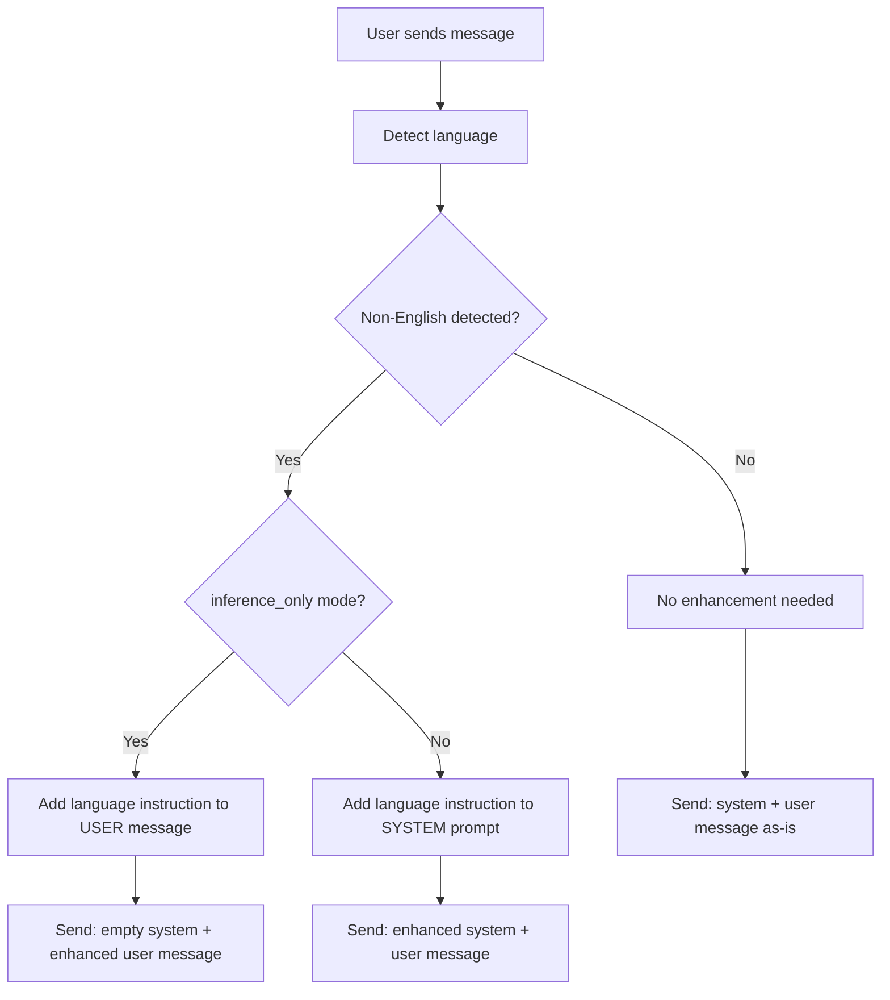

# Chat Service System Prompts & Language Detection

This document explains how the Orbit chat service handles system prompts and language detection, including the priority order and fallback mechanisms.

## Overview

The chat service supports both **inference-only mode** (no database) and **full mode** (with MongoDB), providing flexible system prompt management with automatic language detection and enhancement.

## System Prompt Priority Order

The chat service follows a specific priority order when determining which system prompt to use:



## Priority Levels (Highest to Lowest)

### 1. **Stored System Prompt** (Highest Priority)
- **When**: `system_prompt_id` is provided AND `prompt_service` is available (full mode)
- **Source**: Retrieved from MongoDB via `prompt_service`
- **Enhancement**: Gets language-specific instructions appended if non-English detected

### 2. **No System Prompt** (Inference-Only Mode)
- **When**: 
  - `inference_only: true` AND no `system_prompt_id` provided
- **Behavior**: User message becomes the prompt directly with language instructions added
- **Enhancement**: Language-specific instructions are appended to user message if non-English detected

## Configuration

### Message Configuration

Edit your `config.yaml`:

```yaml
messages:
  no_results_response: "I'm sorry, but I don't have any specific information about that topic in my knowledge base."
  # ... other message configs
```

### Language Detection

```yaml
general:
  language_detection: true  # Enable/disable language detection
  inference_only: true     # Works in both modes
```

## How Language Detection Works

### 1. Language Detection Process

1. **Message Analysis**: User's message is analyzed by the language detector
2. **Language Identification**: Detects the primary language (e.g., 'de', 'fr', 'es')
3. **Prompt Enhancement**: If non-English, adds language-specific instructions

### 2. Language Enhancement Example

**Original Prompt:**
```
You are a helpful assistant that provides accurate information.
```

**Enhanced for German:**
```
You are a helpful assistant that provides accurate information.

IMPORTANT: The user's message is in German. You MUST respond in German only.
```

## Deployment Modes

### Inference-Only Mode (`inference_only: true`)

- **No Database Required**: Works without MongoDB
- **System Prompts**: No system prompts used - user query becomes the prompt directly
- **Language Detection**: ✅ Fully supported - language instructions are added to user message
- **Use Case**: Simple deployments, testing, lightweight setups

### Full Mode (`inference_only: false`)

- **Database Required**: Requires MongoDB for stored prompts
- **System Prompts**: Can use stored prompts + fallback to default
- **Language Detection**: ✅ Fully supported
- **Use Case**: Production deployments with custom prompt management

## API Examples

### Basic Request (Uses Default Prompt)

```json
POST /chat
{
  "message": "Was ist der Preis für eine Anwohnerparkkarte?",
  "collection_name": "default"
}
```

**Internal Flow (Inference-Only Mode):**
1. Detects German language
2. `inference_only: true` → adds language instruction to user message
3. Sends to LLM: `system=""` + `user="Was ist der Preis für eine Anwohnerparkkarte?\n\nIMPORTANT: The user's message is in German. You MUST respond in German only."`
4. Responds in German

### Request with Stored Prompt

```json
POST /chat
{
  "message": "What is the price of a parking permit?",
  "collection_name": "default",
  "system_prompt_id": "64f1b2c3d4e5f6a7b8c9d0e1"
}
```

**Internal Flow:**
1. Detects English language
2. Retrieves stored prompt from MongoDB
3. No enhancement needed (English)
4. Uses stored prompt as-is

## Implementation Details

### System Prompt Override Mechanism

The chat service uses an `override_system_prompt` mechanism:

```python
# Language detection enhances prompts in memory
self.llm_client.override_system_prompt = enhanced_prompt

# LLM client checks for override before using stored/default prompts
if hasattr(self, 'override_system_prompt') and self.override_system_prompt:
    return self.override_system_prompt
```

### Supported Languages

The language detector supports major languages including:

- **English** (en) - Default, no enhancement
- **German** (de) - Enhanced with German instructions
- **Spanish** (es) - Enhanced with Spanish instructions  
- **French** (fr) - Enhanced with French instructions
- **Italian** (it) - Enhanced with Italian instructions
- **And many more...**

## Configuration Examples

### Minimal Inference-Only Setup

```yaml
general:
  inference_only: true
  language_detection: true
  inference_provider: "openai"

messages:
  no_results_response: "I don't have information about that topic."
```

### Full Setup with MongoDB

```yaml
general:
  inference_only: false
  language_detection: true
  inference_provider: "openai"

messages:
  no_results_response: "I don't have information about that topic."

internal_services:
  mongodb:
    host: "your-mongodb-host"
    database: "orbit"
```

## Troubleshooting

### Language Detection Not Working

1. **Check Configuration**: Ensure `language_detection: true` in config
2. **Check Dependencies**: Verify language detection libraries are installed
3. **Check Logs**: Look for language detection warnings in logs

### Language Enhancement Not Working

1. **Check Mode**: Verify `inference_only` setting matches your intended behavior
2. **Check Language Detection**: Ensure `language_detection: true` in config
3. **Check Logs**: Look for language detection and enhancement messages in logs

### Stored Prompts Not Working

1. **Check Mode**: Ensure `inference_only: false` for stored prompts
2. **Check MongoDB**: Verify MongoDB connection and prompt_service availability
3. **Check Prompt ID**: Verify the `system_prompt_id` exists in database

## Best Practices

1. **Choose the Right Mode**: Use `inference_only: true` for direct prompting, `inference_only: false` for RAG with stored prompts
2. **Test Both Modes**: Test your setup in both inference-only and full modes
3. **Language Testing**: Test with non-English messages to verify language detection
4. **Prompt Management**: In full mode, ensure you have proper stored prompts in MongoDB
5. **Monitoring**: Monitor logs for language detection and prompt selection behavior