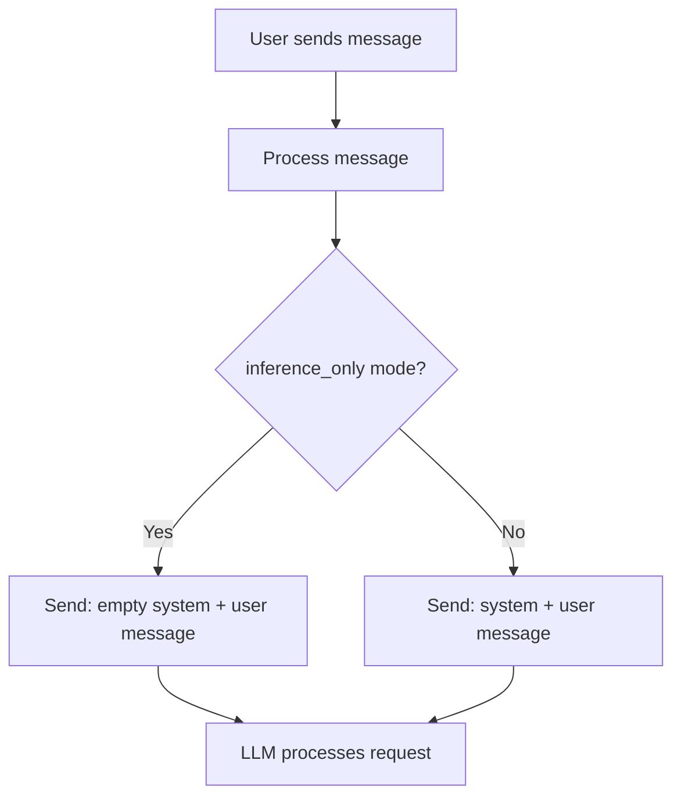

# Chat Service System Prompts

This document explains how the Orbit chat service handles system prompts, including the priority order and fallback mechanisms.

## Overview

The chat service supports both **inference-only mode** (no database) and **full mode** (with MongoDB), providing flexible system prompt management.

## System Prompt Priority Order

The chat service follows a specific priority order when determining which system prompt to use:



## Priority Levels (Highest to Lowest)

### 1. **Stored System Prompt** (Highest Priority)
- **When**: `system_prompt_id` is provided AND `prompt_service` is available (full mode)
- **Source**: Retrieved from MongoDB via `prompt_service`

### 2. **No System Prompt** (Inference-Only Mode)
- **When**: 
  - `inference_only: true` AND no `system_prompt_id` provided
- **Behavior**: User message becomes the prompt directly

## Configuration

### Message Configuration

Edit your `config.yaml`:

```yaml
messages:
  no_results_response: "I'm sorry, but I don't have any specific information about that topic in my knowledge base."
  # ... other message configs
```

### General Configuration

```yaml
general:
  inference_only: true     # Works in both modes
```

## Deployment Modes

### Inference-Only Mode (`inference_only: true`)

- **No Database Required**: Works without MongoDB
- **System Prompts**: No system prompts used - user query becomes the prompt directly
- **Use Case**: Simple deployments, testing, lightweight setups

### Full Mode (`inference_only: false`)

- **Database Required**: Requires MongoDB for stored prompts
- **System Prompts**: Can use stored prompts + fallback to default
- **Use Case**: Production deployments with custom prompt management

## API Examples

### Basic Request (Uses Default Prompt)

```json
POST /chat
{
  "message": "What is the price of a parking permit?",
  "collection_name": "default"
}
```

**Internal Flow (Inference-Only Mode):**
1. `inference_only: true` → no system prompt used
2. Sends to LLM: `system=""` + `user="What is the price of a parking permit?"`
3. Responds with information

### Request with Stored Prompt

```json
POST /chat
{
  "message": "What is the price of a parking permit?",
  "collection_name": "default",
  "system_prompt_id": "64f1b2c3d4e5f6a7b8c9d0e1"
}
```

**Internal Flow:**
1. Retrieves stored prompt from MongoDB
2. Uses stored prompt as system prompt
3. Sends to LLM with stored system prompt

## Implementation Details

### System Prompt Handling

The chat service handles system prompts based on the configuration:

```python
# In inference-only mode, no system prompt is used
if inference_only:
    system_prompt = ""
else:
    # Use stored system prompt if available
    system_prompt = get_stored_prompt(system_prompt_id)
```

## Configuration Examples

### Minimal Inference-Only Setup

```yaml
general:
  inference_only: true
  inference_provider: "openai"

messages:
  no_results_response: "I don't have information about that topic."
```

### Full Setup with MongoDB

```yaml
general:
  inference_only: false
  inference_provider: "openai"

messages:
  no_results_response: "I don't have information about that topic."

internal_services:
  mongodb:
    host: "your-mongodb-host"
    database: "orbit"
```

## Troubleshooting

### Stored Prompts Not Working

1. **Check Mode**: Ensure `inference_only: false` for stored prompts
2. **Check MongoDB**: Verify MongoDB connection and prompt_service availability
3. **Check Prompt ID**: Verify the `system_prompt_id` exists in database

## Best Practices

1. **Choose the Right Mode**: Use `inference_only: true` for direct prompting, `inference_only: false` for RAG with stored prompts
2. **Test Both Modes**: Test your setup in both inference-only and full modes
3. **Prompt Management**: In full mode, ensure you have proper stored prompts in MongoDB
4. **Monitoring**: Monitor logs for prompt selection behavior