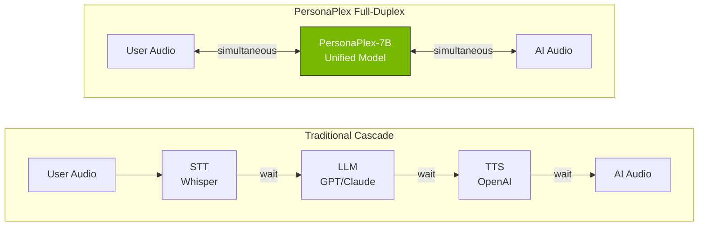
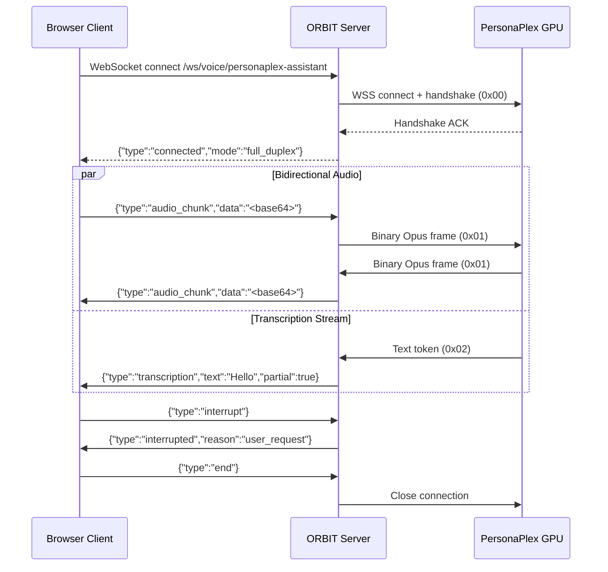

# Build a Full-Duplex Voice Assistant With ORBIT and PersonaPlex

Most voice AI works like a walkie-talkie — you talk, it thinks, it responds, you wait. PersonaPlex throws that away. Powered by NVIDIA's PersonaPlex-7B model, ORBIT can run real-time voice conversations where the AI listens and speaks simultaneously, handles interruptions mid-sentence, and produces natural backchannels like "mm-hmm" while you're still talking. This guide deploys a production full-duplex voice assistant from GPU server to browser client.

## Architecture

Traditional voice pipelines chain three separate models — STT, LLM, TTS — adding latency at every handoff. PersonaPlex replaces the entire cascade with a single unified model that processes audio bidirectionally over one WebSocket connection.



The ORBIT server sits between the client and the PersonaPlex GPU server, handling protocol translation, sample rate conversion, session management, and API key authentication. Clients send JSON-encoded audio over WebSocket; ORBIT translates that into PersonaPlex's binary Opus protocol behind the scenes.



## Prerequisites

| Component | Requirement | Notes |
|---|---|---|
| ORBIT Server | Python 3.10+, 4+ CPU cores, 8 GB RAM | No GPU needed in proxy mode |
| PersonaPlex GPU Server | NVIDIA GPU with 16 GB+ VRAM, CUDA 12.0+ | A100/H100 recommended for production |
| System libraries | `libopus-dev` (Ubuntu) or `brew install opus` (macOS) | Required for Opus audio codec |
| Python packages | `aiohttp>=3.10`, `sphn>=0.1`, `numpy>=1.26` | Installed with ORBIT requirements |
| HuggingFace token | Account at huggingface.co | Required to download PersonaPlex-7B weights |

PersonaPlex has been tested on these GPU configurations:

| GPU | VRAM | Suitability |
|---|---|---|
| NVIDIA H100 | 80 GB | Best performance, production |
| NVIDIA A100 | 40/80 GB | Recommended for production |
| NVIDIA RTX 4090 | 24 GB | Development and small deployments |
| NVIDIA RTX 3090 | 24 GB | Development only |

## Step-by-step implementation

### Step 1 — Deploy the PersonaPlex GPU server

The GPU server runs independently from ORBIT. Deploy it with Docker on a machine with an NVIDIA GPU.

```bash
# On the GPU server
cd /path/to/orbit/personaplex

# Set your HuggingFace token
echo "HF_TOKEN=hf_your_token_here" > .env

# Build and start the PersonaPlex container
docker-compose up --build -d

# Verify the server is running (first start downloads ~15 GB of model weights)
curl -k https://localhost:8998/health
```

If you prefer a manual install without Docker:

```bash
cd /path/to/orbit/personaplex/moshi
pip install -e .

export HF_TOKEN=hf_your_token_here

# Start with SSL (production)
python -m moshi.server --host 0.0.0.0 --port 8998 --ssl /path/to/ssl/certs

# Or without SSL (development only)
python -m moshi.server --host 0.0.0.0 --port 8998
```

### Step 2 — Configure ORBIT for proxy mode

Proxy mode is recommended for production because the GPU server scales independently from ORBIT. Edit `config/personaplex.yaml` to point at your GPU server.

```yaml
# config/personaplex.yaml
personaplex:
  enabled: true
  mode: "proxy"

  proxy:
    server_url: "wss://your-gpu-server:8998/api/chat"
    ssl_verify: true          # false for self-signed certs
    connection_timeout: 30
    reconnect_attempts: 3
    reconnect_delay: 1.0

  audio:
    sample_rate: 32000        # PersonaPlex native rate — do not change
    frame_rate: 12.5          # 80ms frames
    opus_enabled: true        # Opus codec for efficient streaming

  defaults:
    voice_prompt: "NATF2.pt"  # Bright, upbeat female voice
    text_prompt: ""
    temperature: 0.8          # Audio generation temperature
    temperature_text: 0.7     # Text generation temperature
    top_k: 250
    top_k_text: 25

  session:
    max_duration: 3600        # 1 hour max per session
    idle_timeout: 300         # 5 minute idle disconnect
    max_concurrent_sessions: 4
```

### Step 3 — Create a voice persona adapter

Each persona is a separate adapter with its own voice, personality, and system prompt. Add one to `config/adapters/personaplex.yaml`.

```yaml
# config/adapters/personaplex.yaml
adapters:
  - name: "voice-helpdesk"
    enabled: true
    type: "speech_to_speech"
    datasource: "none"
    adapter: "personaplex"
    implementation: "ai_services.implementations.speech_to_speech.PersonaPlexService"

    capabilities:
      retrieval_behavior: "none"
      supports_realtime_audio: true
      supports_full_duplex: true
      supports_interruption: true
      supports_backchannels: true
      requires_api_key_validation: true

    persona:
      voice_prompt: "NATM1.pt"    # Warm, friendly male voice
      text_prompt: |
        You are Alex, a senior IT helpdesk agent for Acme Corp. You help
        employees troubleshoot VPN issues, reset passwords, and resolve
        common software problems. Be concise, patient, and confirm each
        step before moving to the next. If a problem requires escalation,
        tell the user you are creating a ticket and provide a reference number.

    config:
      websocket_enabled: true
      max_session_duration_seconds: 3600
      ping_interval_seconds: 30
      audio_chunk_size_ms: 80
      orbit_sample_rate: 24000
      personaplex_sample_rate: 32000
```

ORBIT ships with six pre-built personas you can enable immediately:

| Adapter Name | Voice | Use Case |
|---|---|---|
| `personaplex-assistant` | NATF2.pt (bright female) | General-purpose assistant |
| `personaplex-customer-service` | NATM1.pt (warm male) | Customer support agent |
| `personaplex-language-tutor` | NATF1.pt (friendly female) | Language learning conversations |
| `personaplex-chat` | NATF3.pt (calm female) | Casual conversation companion |
| `personaplex-interview-coach` | NATM2.pt (authoritative male) | Job interview practice |
| `personaplex-storyteller` | VARM1.pt (expressive male) | Interactive storytelling |

PersonaPlex includes 16 voice embeddings across four categories: Natural Female (NATF0–3), Natural Male (NATM0–3), Variety Female (VARF0–4), and Variety Male (VARM0–4).

### Step 4 — Start ORBIT and verify the voice endpoint

```bash
# Restart ORBIT to load the PersonaPlex configuration
./bin/orbit.sh restart

# Check that voice adapters are live
curl http://localhost:3000/voice/status
```

The `/voice/status` response confirms which adapters are available and their capabilities:

```json
{
  "available": true,
  "global_audio_enabled": true,
  "adapters": [
    {
      "name": "voice-helpdesk",
      "type": "speech_to_speech",
      "enabled": true,
      "full_duplex": true,
      "mode": "speech_to_speech",
      "voice": "NATM1.pt"
    }
  ],
  "websocket_endpoint": "/ws/voice/{adapter_name}"
}
```

### Step 5 — Connect a Python voice client

ORBIT includes a ready-made client at `examples/realtime_voice_client.py`. It uses PyAudio for microphone and speaker access and streams bidirectional audio over WebSocket.

```bash
pip install pyaudio websockets

python examples/realtime_voice_client.py \
  --host localhost \
  --port 3000 \
  --adapter voice-helpdesk \
  --session-id demo-session
```

To build your own client, the core loop sends and receives audio in parallel:

```python
import asyncio, json, base64, websockets, pyaudio

SAMPLE_RATE = 24000
CHUNK = 2400  # 100ms at 24kHz

async def voice_session(url: str):
    audio = pyaudio.PyAudio()
    async with websockets.connect(url) as ws:
        msg = json.loads(await ws.recv())
        assert msg["type"] == "connected"
        print(f"Full-duplex session active: {msg['capabilities']}")

        async def send_mic():
            mic = audio.open(format=pyaudio.paFloat32, channels=1,
                             rate=SAMPLE_RATE, input=True,
                             frames_per_buffer=CHUNK)
            while True:
                data = mic.read(CHUNK, exception_on_overflow=False)
                await ws.send(json.dumps({
                    "type": "audio_chunk",
                    "data": base64.b64encode(data).decode(),
                    "format": "pcm"
                }))
                await asyncio.sleep(0.01)

        async def recv_speaker():
            spk = audio.open(format=pyaudio.paFloat32, channels=1,
                             rate=SAMPLE_RATE, output=True,
                             frames_per_buffer=CHUNK)
            async for raw in ws:
                msg = json.loads(raw)
                if msg["type"] == "audio_chunk":
                    spk.write(base64.b64decode(msg["data"]))
                elif msg["type"] == "transcription":
                    print(f"[transcript] {msg['text']}")

        await asyncio.gather(send_mic(), recv_speaker())

asyncio.run(voice_session(
    "ws://localhost:3000/ws/voice/voice-helpdesk?api_key=your-key"
))
```

### Step 6 — Connect a browser client

For web deployments, use the WebSocket API and the Web Audio API to stream microphone audio directly from the browser.

```javascript
const ws = new WebSocket(
  "ws://localhost:3000/ws/voice/voice-helpdesk?api_key=your-key"
);
const ctx = new AudioContext({ sampleRate: 24000 });

ws.onmessage = (event) => {
  const msg = JSON.parse(event.data);
  if (msg.type === "connected") {
    console.log("Full-duplex active:", msg.capabilities);
    startMicrophone();
  } else if (msg.type === "audio_chunk") {
    playAudio(msg.data);
  }
};

async function startMicrophone() {
  const stream = await navigator.mediaDevices.getUserMedia({ audio: true });
  const source = ctx.createMediaStreamSource(stream);
  const processor = ctx.createScriptProcessor(2400, 1, 1);
  processor.onaudioprocess = (e) => {
    const pcm = e.inputBuffer.getChannelData(0);
    const bytes = new Uint8Array(pcm.buffer);
    ws.send(JSON.stringify({
      type: "audio_chunk",
      data: btoa(String.fromCharCode(...bytes)),
      format: "pcm"
    }));
  };
  source.connect(processor);
  processor.connect(ctx.destination);
}

function playAudio(base64Data) {
  const bytes = Uint8Array.from(atob(base64Data), c => c.charCodeAt(0));
  const pcm = new Float32Array(bytes.buffer);
  const buffer = ctx.createBuffer(1, pcm.length, 24000);
  buffer.getChannelData(0).set(pcm);
  const src = ctx.createBufferSource();
  src.buffer = buffer;
  src.connect(ctx.destination);
  src.start();
}
```

## Validation checklist

- [ ] PersonaPlex GPU server responds: `curl -k https://your-gpu-server:8998/health`
- [ ] ORBIT voice status shows adapter: `curl http://localhost:3000/voice/status`
- [ ] WebSocket connects: `websocat ws://localhost:3000/ws/voice/voice-helpdesk`
- [ ] Client receives `{"type":"connected","mode":"full_duplex"}` on connection
- [ ] Microphone audio reaches the server (check ORBIT logs for `audio_chunk` messages)
- [ ] AI audio plays back through speakers with sub-second latency
- [ ] Interruption works: speak while the AI is talking and it stops mid-sentence
- [ ] Transcription stream arrives: client receives `{"type":"transcription"}` messages
- [ ] Session idle timeout fires after 5 minutes of silence
- [ ] Multiple concurrent sessions work up to `max_concurrent_sessions` limit

## Troubleshooting

### First request takes 30+ seconds, then hangs

**Symptom:** The WebSocket connects but the first audio response never arrives, or arrives after a very long delay.

**Fix:** PersonaPlex processes the `text_prompt` (system prompt) during the handshake before sending the 0x00 acknowledgement byte. Large prompts with knowledge injection — such as 20+ Q&A pairs or long instructions — can exceed 3,000 characters and require significant tokenization time. Increase `connection_timeout` to `120` in `config/personaplex.yaml`. If the prompt is extremely large, shorten it or move knowledge into a separate retrieval adapter that feeds context via the text channel.

### "PersonaPlex service unavailable" on startup

**Symptom:** ORBIT starts but `/voice/status` shows no adapters.

**Fix:** Verify `config/personaplex.yaml` has `enabled: true` and `mode: "proxy"`. Then confirm the GPU server is reachable: `curl -k https://your-gpu-server:8998/health`. If using a self-signed certificate, set `ssl_verify: false` in the proxy config. Check ORBIT logs for connection errors — the most common cause is a firewall blocking port 8998. Run `sudo ufw allow 8998` on the GPU server.

### Audio sounds robotic or choppy

**Symptom:** The AI voice is distorted, stutters, or has metallic artifacts.

**Fix:** This is almost always a sample rate mismatch. Ensure your client sends audio at 24 kHz (ORBIT's expected rate), not 44.1 kHz or 48 kHz. Verify the audio format is float32 PCM. If using PyAudio, set `format=pyaudio.paFloat32` and `rate=24000`. Also confirm the Opus codec library is installed — run `python -c "import sphn"` to check. Network jitter between ORBIT and the GPU server can also cause choppy playback; deploy them in the same datacenter or on the same machine if possible.

### GPU out-of-memory in embedded mode

**Symptom:** ORBIT crashes with `CUDA out of memory` when starting a voice session.

**Fix:** PersonaPlex-7B needs approximately 16 GB of VRAM. If your GPU has exactly 16 GB, enable CPU offloading in `config/personaplex.yaml` under `embedded.cpu_offload: true` — this trades latency for memory by running parts of the model on system RAM. Also reduce `max_concurrent_sessions` to `2`. For production with multiple simultaneous users, use proxy mode with a dedicated A100 or H100 server instead.

## Security and compliance considerations

- **API key enforcement:** Set `requires_api_key_validation: true` on every public-facing voice adapter. Without this, anyone who discovers the WebSocket URL can start a session and consume GPU resources.
- **TLS everywhere:** Use `wss://` between ORBIT and the PersonaPlex GPU server. Audio streams contain spoken content that may include sensitive information — PII, account numbers, health details — and must be encrypted in transit.
- **Session limits:** Configure `max_concurrent_sessions` and `max_duration` to prevent resource exhaustion. An uncapped deployment lets a single user monopolize GPU memory indefinitely.
- **No audio storage by default:** ORBIT does not record or persist voice audio. If your compliance framework requires call recording, implement it at the client layer or add a recording middleware — but be aware of two-party consent laws in many jurisdictions.
- **Network isolation:** In proxy mode, place the PersonaPlex GPU server in a private subnet accessible only from the ORBIT server. The GPU server does not need public internet access after the initial model download.
