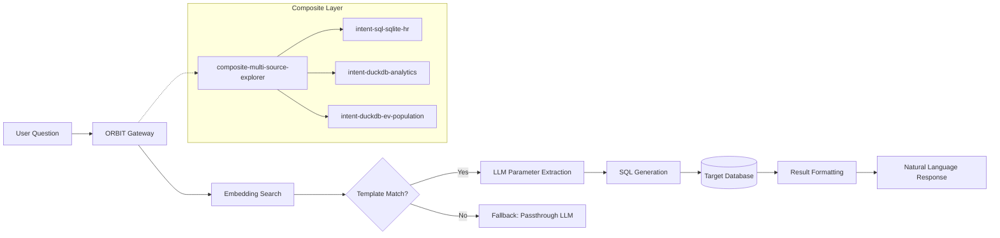

# Build a Natural Language Database Copilot With ORBIT

Turn plain-English questions into live SQL queries across SQLite, PostgreSQL, and DuckDB — without writing a single line of glue code. ORBIT's intent adapters handle template matching, parameter extraction, and query execution through declarative YAML, so your analysts get a conversational BI layer in minutes. This guide walks through a production-ready setup that routes natural language to the right database automatically.

## Architecture

The copilot pipeline has four stages: the user's question enters ORBIT, an embedding search matches it to a query template, the LLM extracts parameters, and the generated SQL runs against the target database. A composite adapter sits on top when you need to query multiple databases from a single chat interface.



## Prerequisites

| Requirement | Version | Purpose |
|---|---|---|
| Python | 3.12+ | ORBIT server runtime |
| Node.js | 18+ | orbitchat CLI and dashboard |
| Ollama | Latest | Local embeddings (`nomic-embed-text`) |
| Chroma | Bundled | Vector store for template matching |
| DuckDB or SQLite | Bundled | Target analytical databases |

You also need at least one LLM inference provider configured. ORBIT supports OpenAI, Anthropic, Gemini, Groq, Cohere, Mistral, Ollama, and 20+ others — set the API key in your `.env` file and reference the provider in `config/inference.yaml`.

```bash
# Pull the embedding model used for template matching
ollama pull nomic-embed-text:latest

# Verify ORBIT is installed and running
./bin/orbit.sh status
```

## Step-by-step implementation

### Step 1 — Define your domain

A domain file tells ORBIT what the database contains. Create a YAML file that describes the schema, tables, and business context. ORBIT uses this context when the LLM generates SQL.

```yaml
# config/domains/sales_domain.yaml
domain:
  name: "sales_analytics"
  description: "Sales transaction database for revenue analysis"
  database_type: "duckdb"
  tables:
    - name: "orders"
      description: "Customer orders with amounts and dates"
      columns:
        - name: "order_id"
          type: "INTEGER"
          description: "Unique order identifier"
        - name: "customer_name"
          type: "VARCHAR"
          description: "Full name of the customer"
        - name: "amount"
          type: "DECIMAL"
          description: "Order total in USD"
        - name: "region"
          type: "VARCHAR"
          description: "Sales region (APAC, EMEA, NA, LATAM)"
        - name: "order_date"
          type: "DATE"
          description: "Date the order was placed"
  guardrails:
    - "Never execute DELETE, UPDATE, or DROP statements"
    - "Limit results to 1000 rows maximum"
    - "Do not expose internal IDs in customer-facing responses"
```

### Step 2 — Create query templates

Templates map natural language patterns to parameterized SQL. Each template includes example questions so the embedding model can match user intent accurately.

```yaml
# config/templates/sales_templates.yaml
templates:
  - id: "revenue_by_region"
    description: "Total revenue grouped by sales region"
    nl_examples:
      - "What is the total revenue by region?"
      - "Show me sales broken down by territory"
      - "How much did each region sell?"
      - "Revenue per region this year"
    query: >
      SELECT region, SUM(amount) AS total_revenue, COUNT(*) AS order_count
      FROM orders
      WHERE order_date >= '{start_date}'
      GROUP BY region
      ORDER BY total_revenue DESC
    parameters:
      - name: "start_date"
        type: "date"
        required: false
        default: "2024-01-01"
        description: "Filter orders from this date"

  - id: "top_customers"
    description: "Highest-spending customers"
    nl_examples:
      - "Who are our top customers?"
      - "Show the biggest spenders"
      - "Top 10 customers by order value"
      - "Which customers spent the most last quarter?"
    query: >
      SELECT customer_name, SUM(amount) AS total_spent, COUNT(*) AS orders
      FROM orders
      WHERE order_date >= '{start_date}'
      GROUP BY customer_name
      ORDER BY total_spent DESC
      LIMIT {limit}
    parameters:
      - name: "start_date"
        type: "date"
        required: false
        default: "2024-01-01"
      - name: "limit"
        type: "integer"
        required: false
        default: "10"
```

### Step 3 — Register the intent adapter

Add your adapter to the ORBIT adapter configuration. The key fields are `implementation`, `database`, and the paths to your domain and template files.

```yaml
# In config/adapters/intent.yaml — add under adapters:
- name: "intent-duckdb-sales"
  enabled: true
  type: "retriever"
  datasource: "duckdb"
  adapter: "intent"
  implementation: "retrievers.implementations.intent.IntentDuckDBRetriever"
  database: "data/sales.duckdb"
  inference_provider: "ollama_cloud"
  model: "gpt-oss:120b"
  embedding_provider: "ollama"
  embedding_model: "nomic-embed-text:latest"
  capabilities:
    retrieval_behavior: "always"
    formatting_style: "standard"
    supports_threading: true
    supports_autocomplete: true
    requires_api_key_validation: true
  config:
    domain_config_path: "config/domains/sales_domain.yaml"
    template_library_path:
      - "config/templates/sales_templates.yaml"
    template_collection_name: "sales_intent_templates"
    store_name: "chroma"
    confidence_threshold: 0.4
    max_templates: 5
    return_results: 100
    reload_templates_on_start: true
    force_reload_templates: true
    read_only: true
    access_mode: "READ_ONLY"
    enable_query_monitoring: true
    query_timeout: 5000
```

### Step 4 — Add multi-database routing (optional)

If you have multiple databases — say HR in SQLite, sales in DuckDB, and analytics in PostgreSQL — a composite adapter routes each question to the correct source automatically using multi-stage scoring.

```yaml
# In config/adapters/composite.yaml — add under adapters:
- name: "composite-business-copilot"
  enabled: true
  type: "retriever"
  adapter: "composite"
  implementation: "retrievers.implementations.composite.CompositeIntentRetriever"
  inference_provider: "ollama_cloud"
  model: "gpt-oss:120b"
  embedding_provider: "ollama"
  embedding_model: "nomic-embed-text:latest"
  capabilities:
    retrieval_behavior: "always"
    supports_threading: true
    supports_autocomplete: true
    requires_api_key_validation: true
  config:
    child_adapters:
      - "intent-sql-sqlite-hr"
      - "intent-duckdb-sales"
      - "intent-duckdb-analytics"
    confidence_threshold: 0.4
    max_templates_per_source: 3
    parallel_search: true
    search_timeout: 5.0
```

### Step 5 — Test the copilot

Restart ORBIT and send queries through the API or the `orbitchat` CLI.

```bash
# Restart to load new adapters
./bin/orbit.sh restart

# Test via cURL (select your adapter with the endpoint or default routing)
curl -X POST http://localhost:3000/v1/chat \
  -H 'Content-Type: application/json' \
  -H 'X-API-Key: your-api-key' \
  -H 'X-Session-ID: copilot-test' \
  -d '{
    "messages": [{"role": "user", "content": "What is the total revenue by region for Q1 2025?"}],
    "stream": false
  }'
```

The response contains the natural language answer, the generated SQL in metadata, and any source citations — all formatted for display in `orbitchat` or your own frontend.

### Step 6 — Enable conversation threading

Threading lets users ask follow-up questions against cached result sets. Enable it in the adapter capabilities and configure the threading backend.

```yaml
# Add to your adapter's capabilities section
capabilities:
  supports_threading: true

# In config/config.yaml — configure the threading backend
threading:
  enabled: true
  backend: "sqlite"        # or "redis", "mongodb"
  ttl_hours: 24            # Cache datasets for 24 hours
  max_cached_rows: 10000   # Limit cached result size
```

Now a user can ask "What is the total revenue by region?" followed by "Drill into APAC" and ORBIT will operate on the cached result set without re-executing the original query.

## Validation checklist

- [ ] Domain YAML loads without errors on `./bin/orbit.sh start`
- [ ] Templates are indexed in Chroma (check logs for `Loaded N templates into collection`)
- [ ] Embedding model responds locally (`ollama run nomic-embed-text "test"`)
- [ ] Single-adapter queries return correct SQL and results
- [ ] Composite routing selects the correct child adapter for cross-domain questions
- [ ] `confidence_threshold` filters out low-quality matches (test with off-topic questions)
- [ ] Autocomplete returns suggestions from `nl_examples` when typing partial queries
- [ ] Threading follow-ups reference the cached dataset, not re-execute
- [ ] Query timeout fires for long-running SQL (set `query_timeout: 5000` and verify)
- [ ] Dashboard at `http://localhost:3000/dashboard` shows adapter health and query metrics

## Troubleshooting

### Template never matches — confidence always below threshold

**Symptom:** Every question returns a passthrough LLM response instead of querying the database.

**Fix:** Lower `confidence_threshold` from `0.4` to `0.3` temporarily and check logs. If templates still do not match, verify that `nl_examples` in your templates are semantically close to the questions you are asking. Add 5–8 diverse example phrasings per template. Ensure the embedding model is loaded — run `ollama list` and confirm `nomic-embed-text:latest` appears.

### Composite adapter routes to the wrong database

**Symptom:** An HR question hits the sales database.

**Fix:** Enable multi-stage selection in `config/config.yaml` under `composite_retrieval`. The reranking stage (Stage 2) uses an LLM to disambiguate templates with similar vocabulary. Set `reranking.enabled: true` and `string_similarity.enabled: true` to activate all three scoring stages. Also verify that each child adapter's templates have distinct `nl_examples` that do not overlap across domains.

### DuckDB "database is locked" error

**Symptom:** Concurrent requests fail with a lock error.

**Fix:** Set `read_only: true` and `access_mode: "READ_ONLY"` in the adapter config. DuckDB supports unlimited concurrent readers but only one writer. For analytical copilots that only run SELECT queries, read-only mode eliminates lock contention entirely.

### LLM extracts wrong parameter values

**Symptom:** The generated SQL contains incorrect dates, names, or limits.

**Fix:** Improve the `description` field on each parameter in your template YAML. The LLM uses these descriptions during extraction. Be explicit — use `"ISO 8601 date, e.g. 2025-01-15"` instead of `"start date"`. Also verify your `inference_provider` model is powerful enough for parameter extraction; models under 7B parameters often struggle with structured extraction tasks.

## Security and compliance considerations

- **Read-only access:** Always set `read_only: true` and `access_mode: "READ_ONLY"` for analytical adapters. ORBIT's intent retrievers generate SQL from templates, but defense-in-depth means the database connection itself should prohibit writes.
- **Domain guardrails:** The `guardrails` section in the domain YAML instructs the LLM to reject dangerous operations. Combine this with database-level permissions (a read-only database user) for layered protection.
- **API key scoping:** Use ORBIT's per-key RBAC to restrict which adapters each API key can access. An analyst key should not reach the HR database unless explicitly granted.
- **Query monitoring:** Enable `enable_query_monitoring: true` and set `query_timeout` to prevent runaway queries. Monitor via the dashboard at `/dashboard` or Prometheus metrics at `/metrics`.
- **Data sovereignty:** Because ORBIT is self-hosted, all data stays on your infrastructure. No query text or results leave your network unless you configure a cloud inference provider — and even then, only the natural language question is sent, not raw database rows.
- **Audit trail:** Enable audit logging in `config/config.yaml` to record every query, the generated SQL, and the response. Supports SQLite, MongoDB, or Elasticsearch backends with configurable retention.
