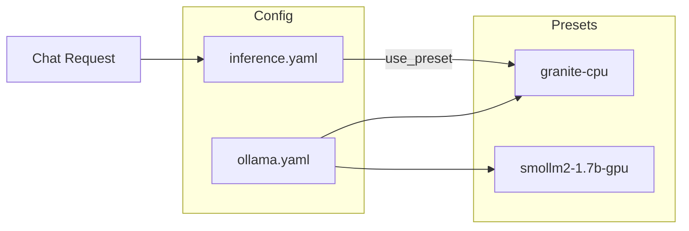

# Configure Ollama Presets for ORBIT

ORBIT uses named Ollama presets so you can switch between CPU and GPU setups, different models, and remote Ollama hosts without editing inference code. Presets live in `config/ollama.yaml`; `config/inference.yaml` selects which preset the default Ollama provider uses. This guide shows how to add a preset, switch the active one, and tune timeouts and retries for cold starts.

## Architecture

Presets are key-value entries under `ollama_presets` in `config/ollama.yaml`. The inference layer reads the preset by name and applies its `base_url`, `model`, and generation parameters. One preset is active at a time for the default `ollama` provider; adapters can override the inference provider and model per adapter.



| File | Role |
|------|------|
| `config/ollama.yaml` | Defines `ollama_presets` (base_url, model, temperature, num_ctx, num_gpu, retry, timeout, etc.). |
| `config/inference.yaml` | Sets `inference.ollama.enabled` and `inference.ollama.use_preset` to the preset name. |

## Prerequisites

- ORBIT installed and Ollama running (see [how-to-deploy-with-ollama.md](how-to-deploy-with-ollama.md)).
- At least one model pulled in Ollama (e.g. `ollama pull granite4:1b` or `ollama pull SmolLM2:latest`).
- Write access to `config/ollama.yaml` and `config/inference.yaml`.

## Step-by-step implementation

### 1. Open the preset file

Edit `config/ollama.yaml`. Presets are under the top-level key `ollama_presets:`.

### 2. Add or copy a preset

Each preset is a named block. Example for a CPU-oriented small model:

```yaml
ollama_presets:
  my-cpu-preset:
    base_url: "http://localhost:11434"
    model: "granite4:1b"
    stream: true
    think: false
    temperature: 0.7
    top_p: 0.9
    top_k: 30
    num_predict: 4096
    num_ctx: 8192
    num_threads: 6
    num_batch: 64
    num_gpu: 0
    retry:
      enabled: true
      max_retries: 5
      initial_wait_ms: 2000
      max_wait_ms: 30000
      exponential_base: 2
    timeout:
      connect: 10000
      total: 120000
      warmup: 120000
```

For GPU, set `num_gpu: -1` (all layers on GPU), increase `num_batch` (e.g. 512), and optionally reduce `num_threads`. Use the same `model` name as in `ollama list`.

### 3. Point inference at the preset

In `config/inference.yaml`, set the default Ollama provider to use your preset:

```yaml
inference:
  ollama:
    enabled: true
    use_preset: "my-cpu-preset"
```

Save both files and restart ORBIT.

### 4. Use a remote Ollama host

To use Ollama on another machine, set `base_url` in the preset to that host:

```yaml
  my-remote-preset:
    base_url: "http://192.168.1.10:11434"
    model: "granite4:1b"
    stream: true
    # ... same generation and retry/timeout as needed
```

Ensure ORBIT can reach the host and port (firewall, Docker networking). Alternatively, use `inference.ollama_remote` in `config/inference.yaml` with `enabled: true` and its own `base_url` and `model`.

### 5. Reduce cold-start timeouts

If the first request after idle fails with a timeout, increase the preset’s `timeout.warmup` (milliseconds) and keep `retry.enabled: true`:

```yaml
    timeout:
      connect: 10000
      total: 120000
      warmup: 120000
    retry:
      enabled: true
      max_retries: 5
      initial_wait_ms: 2000
      max_wait_ms: 30000
```

Restart ORBIT after editing.

## Validation checklist

- [ ] `config/ollama.yaml` is valid YAML and each preset name under `ollama_presets` is unique.
- [ ] The preset’s `model` matches a model in `ollama list` (or on the remote host).
- [ ] `config/inference.yaml` has `inference.ollama.use_preset` set to an existing preset name.
- [ ] After restart, a chat request to an adapter using Ollama succeeds; check logs for "ollama" or the preset name if needed.
- [ ] For remote presets: `curl <base_url>/api/tags` from the ORBIT host returns the model list.

## Troubleshooting

**Preset not found or "unknown preset"**  
The name in `use_preset` must match exactly a key under `ollama_presets` in `config/ollama.yaml` (case-sensitive). Restart ORBIT after adding or renaming presets.

**Model not found (404 or empty response)**  
Confirm the preset’s `model` string matches Ollama’s model name (e.g. `granite4:1b` or `SmolLM2:latest`). Run `ollama list` on the host that serves `base_url` and fix the preset or pull the model.

**First request times out, later ones work**  
Ollama loads the model on first use. Increase `timeout.warmup` and `timeout.total` in the preset and ensure `retry.enabled: true` with sufficient `max_retries` and `max_wait_ms`. Optionally set a longer `keep_alive` in the preset so Ollama keeps the model loaded.

**Remote Ollama connection refused**  
Check firewall and that Ollama is listening on the right interface (e.g. `OLLAMA_HOST=0.0.0.0:11434`). From the ORBIT server, run `curl http://<remote>:11434/api/tags` to verify connectivity.

## Security and compliance considerations

- Do not expose Ollama’s port to the public internet; restrict access to the ORBIT host or internal network.
- Presets can contain a `base_url` pointing to another machine; ensure that host is trusted and traffic is on a private network or encrypted (e.g. reverse proxy with TLS).
- Keep config files out of version control if they contain internal IPs or hostnames; use env-based config or secrets where appropriate.

