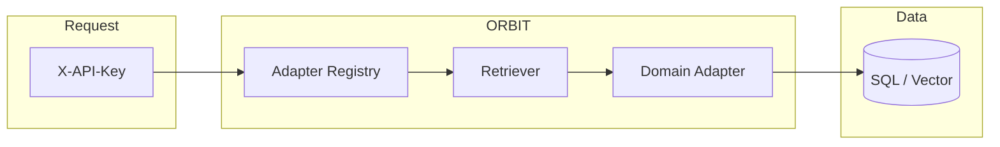

# Configure ORBIT Adapters and RAG

ORBIT routes chat and tool requests through adapters: each adapter is a named configuration that ties an API key to a retriever, inference provider, and optional guardrails. Configuring adapters and RAG lets you add question-answering over SQL or vector stores, intent-based retrieval, and composite flows without changing application code. This guide walks through the adapter layout, where to edit config, and how to enable your first RAG adapter.

## Architecture

Adapters are defined in YAML and loaded at startup. The registry resolves an adapter by name when a request carries an API key linked to that adapter. For RAG, the adapter points to a retriever implementation (e.g. QA over SQLite or Qdrant) and a domain adapter (e.g. `qa` or `intent`).



| Layer | Role | Config location |
|-------|------|-----------------|
| Adapter definition | Name, type, datasource, implementation | `config/adapters.yaml` or `config/adapters/*.yaml` |
| API key | Binds a key to an adapter name | CLI: `./bin/orbit.sh key create --adapter <name>` |
| Retriever implementation | Connects to DB and fetches data | `implementation` in adapter YAML |
| Domain adapter | Formats and filters results (qa, intent, composite) | `adapter` key in adapter YAML |

## Prerequisites

- ORBIT server installed and running (see [how-to-deploy-with-ollama.md](how-to-deploy-with-ollama.md)).
- For vector RAG: a vector store (Chroma, Qdrant, etc.) and embeddings configured (e.g. Ollama `nomic-embed-text` in `config/embeddings.yaml`).
- For SQL RAG: target database (SQLite, PostgreSQL, MySQL) and, for intent-based SQL, domain and template YAML files.

## Step-by-step implementation

### 1. Locate adapter config

The main config imports adapter files. In `config/config.yaml` you should see:

```yaml
import:
  - "adapters.yaml"
  # and often:
  # - "adapters/passthrough.yaml"
  # - "adapters/qa.yaml"
  # - "adapters/intent.yaml"
```

Adapter entries can live in `config/adapters.yaml` or in separate files under `config/adapters/` (e.g. `config/adapters/qa.yaml`). Use the same structure in either place.

### 2. Enable a simple RAG adapter (QA over SQLite)

Example: enable the built-in QA-over-SQLite adapter so an API key can answer questions against a table.

Add or uncomment an entry like this (in `config/adapters.yaml` or an imported file):

```yaml
adapters:
  - name: "qa-sql"
    enabled: true
    type: "retriever"
    datasource: "sqlite"
    adapter: "qa"
    implementation: "retrievers.implementations.qa.QASSQLRetriever"
    config:
      confidence_threshold: 0.3
      max_results: 5
      table: "your_table_name"
```

Replace `your_table_name` with the actual table. Ensure the SQLite datasource is configured in `config/datasources.yaml` (or equivalent) and points to the DB file. Restart ORBIT so the adapter loads.

### 3. Create an API key for the adapter

Create a key that uses this adapter:

```bash
./bin/orbit.sh key create --adapter qa-sql --name "QA SQL Key"
```

Use the returned key as `X-API-Key` in chat requests. The server will route those requests to the `qa-sql` retriever.

### 4. Add a vector RAG adapter (e.g. Qdrant)

For QA over a vector store, add an adapter that uses a vector retriever and the `qa` domain adapter:

```yaml
- name: "qa-vector-qdrant"
  enabled: true
  type: "retriever"
  datasource: "qdrant"
  adapter: "qa"
  implementation: "retrievers.implementations.qa.QAQdrantRetriever"
  config:
    collection: "your_collection"
    confidence_threshold: 0.3
    max_results: 5
```

Configure the Qdrant connection and embedding provider in `config/datasources.yaml` and `config/embeddings.yaml`. Create a key with `--adapter qa-vector-qdrant`.

### 5. Override inference or embeddings per adapter

You can point an adapter at a specific LLM or embedding provider so RAG uses local Ollama:

```yaml
- name: "qa-sql-local"
  enabled: true
  type: "retriever"
  datasource: "sqlite"
  adapter: "qa"
  implementation: "retrievers.implementations.qa.QASSQLRetriever"
  config:
    table: "city"
    max_results: 5
  inference_provider: "ollama"
  embedding_provider: "ollama"
```

Restart ORBIT after any adapter or config change.

## Validation checklist

- [ ] Adapter YAML is valid and under `config/` (or an imported path); no duplicate `name` values.
- [ ] For retriever adapters: `enabled: true`, `type: "retriever"`, correct `implementation` and `datasource`.
- [ ] Datasource (SQL DB or vector store) is reachable and credentials in config or env are set.
- [ ] API key created with `--adapter <adapter-name>`; chat request with that key returns RAG-backed answers when applicable.
- [ ] If using embeddings: `config/embeddings.yaml` has the chosen provider (e.g. `ollama`) and model (e.g. `nomic-embed-text`) and the model is pulled.

## Troubleshooting

**Adapter not found or 404**  
Ensure the adapter `name` in YAML matches the name passed to `key create --adapter`. List adapters with `./bin/orbit.sh key list-adapters` (or equivalent). Restart the server after adding or renaming adapters.

**Empty or irrelevant RAG results**  
Raise `max_results` or lower `confidence_threshold` in the adapter `config`. For vector RAG, confirm the collection has been embedded with the same embedding model and dimensions as in `config/embeddings.yaml`. For SQL, check that the `table` (and schema) exist and that the domain adapter’s behavior matches your data.

**SQL or vector connection errors**  
Check datasource URLs, credentials, and network access. For SQLite, ensure the file path is correct and the process has read access. For Qdrant/Chroma, ensure the service is running and the collection name exists.

**Inference or embedding timeout**  
If using Ollama, ensure the service is up and the model is loaded. Increase timeouts in `config/ollama.yaml` or `config/embeddings.yaml` (e.g. `timeout.warmup`) if the first request after idle times out.

## Security and compliance considerations

- Restrict who can edit `config/adapters.yaml` and datasource credentials; use env vars or a secrets manager for passwords.
- API keys are bound to adapter names; use separate adapters (and keys) per tenant or use case to limit data access.
- RAG data stays on your infrastructure when inference and embeddings use local Ollama; audit logging is available for request tracking.

