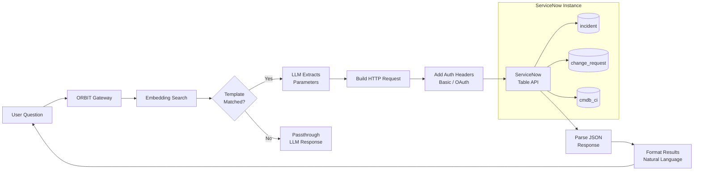

# Connect ServiceNow to Natural Language Queries Using ORBIT HTTP Intent Adapters

ServiceNow has a powerful REST API, but your support team still has to click through five menus to find an incident. ORBIT's HTTP intent adapter turns questions like "Show me all P1 incidents assigned to the network team" into live ServiceNow Table API calls — with parameter extraction, authentication, and response formatting handled entirely through YAML configuration. This guide builds a working ServiceNow adapter from domain definition to production deployment, covering incidents, change requests, and the CMDB.

## Architecture

The HTTP intent adapter sits between the user and ServiceNow's REST API. When a question arrives, ORBIT matches it to a pre-defined API template using embedding similarity, the LLM extracts parameters (incident numbers, priorities, date ranges), and ORBIT constructs the authenticated HTTP request. ServiceNow's JSON response is then parsed and summarized back to the user in natural language.



## Prerequisites

| Component | Requirement | Notes |
|---|---|---|
| ORBIT Server | v2.4.0+, Python 3.12+ | HTTP adapter included by default |
| ServiceNow instance | Any supported release (Tokyo+) | Developer instance works for testing |
| ServiceNow credentials | Basic auth or OAuth token | Needs read access to target tables |
| Embedding model | Ollama `nomic-embed-text` or any provider | For matching questions to templates |
| LLM provider | Any ORBIT-supported provider | For parameter extraction from questions |

Set your ServiceNow credentials in the `.env` file:

```bash
# .env — ServiceNow credentials
SERVICENOW_USERNAME=api.orbit
SERVICENOW_PASSWORD=your-secure-password
SERVICENOW_INSTANCE=https://your-instance.service-now.com
```

## Step-by-step implementation

### Step 1 — Define the ServiceNow domain

The domain file tells ORBIT what ServiceNow tables exist, what fields they contain, and how users might refer to them in natural language. This context drives both template matching and parameter extraction accuracy.

```yaml
# examples/intent-templates/http-intent-template/examples/servicenow/templates/servicenow_domain.yaml
domain_name: "servicenow_itsm"
domain_type: "rest_api"
version: "1.0.0"
description: "ServiceNow IT Service Management - incidents, changes, and configuration items"

api_config:
  base_url: "https://your-instance.service-now.com"
  api_version: "v2"
  protocol: "https"
  default_timeout: 30
  rate_limit:
    requests_per_hour: 1000

authentication:
  type: "basic_auth"
  username_env: "SERVICENOW_USERNAME"
  password_env: "SERVICENOW_PASSWORD"

entities:
  incident:
    entity_type: "resource"
    endpoint_base: "/api/now/table/incident"
    primary_key: "sys_id"
    display_name: "Incident"
    description: "IT incident tickets for outages, issues, and service requests"
    searchable_fields:
      - number
      - short_description
      - description
    filterable_fields:
      - state
      - priority
      - category
      - assignment_group
      - assigned_to
      - caller_id

  change_request:
    entity_type: "resource"
    endpoint_base: "/api/now/table/change_request"
    primary_key: "sys_id"
    display_name: "Change Request"
    description: "Change management tickets for planned infrastructure changes"
    searchable_fields:
      - number
      - short_description
    filterable_fields:
      - state
      - type
      - priority
      - assignment_group

  cmdb_ci:
    entity_type: "resource"
    endpoint_base: "/api/now/table/cmdb_ci"
    primary_key: "sys_id"
    display_name: "Configuration Item"
    description: "CMDB configuration items — servers, applications, services"
    searchable_fields:
      - name
      - sys_class_name
    filterable_fields:
      - operational_status
      - sys_class_name
      - environment

vocabulary:
  entity_synonyms:
    incident: ["incident", "ticket", "issue", "problem", "INC"]
    change_request: ["change", "change request", "CR", "CHG", "RFC"]
    cmdb_ci: ["CI", "config item", "server", "asset", "device"]

  action_synonyms:
    list: ["list", "show", "get", "find", "display", "search"]
    create: ["create", "open", "submit", "raise", "new", "log"]
    update: ["update", "modify", "change", "edit", "reassign"]
    close: ["close", "resolve", "complete", "cancel"]

  field_synonyms:
    short_description: ["title", "summary", "subject", "description"]
    priority: ["priority", "urgency", "severity", "P1", "P2", "P3", "P4"]
    state: ["status", "state", "open", "closed", "resolved"]
    assigned_to: ["assignee", "assigned to", "owner", "who owns"]
    assignment_group: ["team", "group", "queue", "department"]

common_parameters:
  limit:
    name: "sysparm_limit"
    type: "integer"
    description: "Maximum number of records to return"
    default: 10
  offset:
    name: "sysparm_offset"
    type: "integer"
    description: "Starting record for pagination"
    default: 0

error_handling:
  401:
    description: "Authentication failed — check SERVICENOW_USERNAME and SERVICENOW_PASSWORD"
    action: "Return auth error to user"
  403:
    description: "Insufficient ACL permissions on the target table"
    action: "Inform user that the API account lacks access"
  404:
    description: "Record or table not found"
    action: "Return empty result"
```

### Step 2 — Create query templates

Each template maps a category of natural language question to a specific ServiceNow API call. The `nl_examples` field is critical — these are the phrases the embedding model uses to match incoming questions.

```yaml
# examples/intent-templates/http-intent-template/examples/servicenow/templates/servicenow_templates.yaml
templates:
  # ── List incidents with optional filtering ──────────────────────
  - id: list_incidents
    version: "1.0.0"
    description: "List ServiceNow incidents with optional state and priority filters"
    category: "incident_queries"

    http_method: "GET"
    endpoint_template: "/api/now/table/incident"

    headers:
      Accept: "application/json"

    query_params:
      sysparm_limit: "{{limit}}"
      sysparm_offset: "{{offset}}"
      sysparm_display_value: "true"
      sysparm_fields: "number,short_description,state,priority,assigned_to,assignment_group,sys_created_on"
      sysparm_query: "ORDERBYDESCsys_created_on"

    parameters:
      - name: limit
        type: integer
        required: false
        default: 10
        description: "Maximum number of incidents to return (1-100)"
        location: "query"
        min: 1
        max: 100
      - name: offset
        type: integer
        required: false
        default: 0
        description: "Number of records to skip for pagination"
        location: "query"

    response_mapping:
      items_path: "result"
      fields:
        - name: "number"
          path: "number"
          type: "string"
        - name: "short_description"
          path: "short_description"
          type: "string"
        - name: "state"
          path: "state"
          type: "string"
        - name: "priority"
          path: "priority"
          type: "string"
        - name: "assigned_to"
          path: "assigned_to.display_value"
          type: "string"
        - name: "assignment_group"
          path: "assignment_group.display_value"
          type: "string"

    nl_examples:
      - "List all incidents"
      - "Show me recent tickets"
      - "Get the latest incidents"
      - "Display open incidents"
      - "What incidents were created today?"

    result_format: "table"
    display_fields: ["number", "short_description", "state", "priority", "assigned_to"]
    tags: ["incident", "list"]

  # ── Get incident by number ──────────────────────────────────────
  - id: get_incident_by_number
    version: "1.0.0"
    description: "Retrieve a specific incident by its INC number"
    category: "incident_queries"

    http_method: "GET"
    endpoint_template: "/api/now/table/incident"

    headers:
      Accept: "application/json"

    query_params:
      sysparm_query: "number={{incident_number}}"
      sysparm_display_value: "true"
      sysparm_limit: "1"

    parameters:
      - name: incident_number
        type: string
        required: true
        description: "ServiceNow incident number in INC format, e.g. INC0012345"
        location: "query"
        example: "INC0012345"
        pattern: "^INC[0-9]{7}$"

    response_mapping:
      items_path: "result"
      fields:
        - name: "number"
          path: "number"
        - name: "short_description"
          path: "short_description"
        - name: "description"
          path: "description"
        - name: "state"
          path: "state"
        - name: "priority"
          path: "priority"
        - name: "caller_id"
          path: "caller_id.display_value"
        - name: "assigned_to"
          path: "assigned_to.display_value"
        - name: "assignment_group"
          path: "assignment_group.display_value"
        - name: "sys_created_on"
          path: "sys_created_on"

    nl_examples:
      - "Show me incident INC0012345"
      - "Get details for INC0098765"
      - "Look up ticket INC0054321"
      - "What is the status of INC0011111?"
      - "Pull up INC0067890"

    result_format: "single"
    tags: ["incident", "get", "number"]

  # ── Filter incidents by priority ────────────────────────────────
  - id: filter_incidents_by_priority
    version: "1.0.0"
    description: "List incidents filtered by priority level"
    category: "incident_queries"

    http_method: "GET"
    endpoint_template: "/api/now/table/incident"

    headers:
      Accept: "application/json"

    query_params:
      sysparm_query: "priority={{priority}}^ORDERBYDESCsys_created_on"
      sysparm_display_value: "true"
      sysparm_limit: "{{limit}}"
      sysparm_fields: "number,short_description,state,priority,assigned_to,assignment_group"

    parameters:
      - name: priority
        type: integer
        required: true
        description: "Priority level: 1=Critical, 2=High, 3=Moderate, 4=Low, 5=Planning"
        location: "query"
        allowed_values: [1, 2, 3, 4, 5]
      - name: limit
        type: integer
        required: false
        default: 20
        description: "Maximum number of results"
        location: "query"

    response_mapping:
      items_path: "result"
      fields:
        - name: "number"
          path: "number"
        - name: "short_description"
          path: "short_description"
        - name: "state"
          path: "state"
        - name: "priority"
          path: "priority"
        - name: "assigned_to"
          path: "assigned_to.display_value"

    nl_examples:
      - "Show me all P1 incidents"
      - "List critical priority tickets"
      - "Get high priority incidents"
      - "Find all P2 issues"
      - "What are the critical incidents right now?"

    result_format: "table"
    tags: ["incident", "filter", "priority"]

  # ── Filter incidents by assignment group ────────────────────────
  - id: filter_incidents_by_group
    version: "1.0.0"
    description: "List incidents assigned to a specific support group"
    category: "incident_queries"

    http_method: "GET"
    endpoint_template: "/api/now/table/incident"

    headers:
      Accept: "application/json"

    query_params:
      sysparm_query: "assignment_group.name={{group_name}}^ORDERBYDESCsys_created_on"
      sysparm_display_value: "true"
      sysparm_limit: "{{limit}}"
      sysparm_fields: "number,short_description,state,priority,assigned_to,assignment_group"

    parameters:
      - name: group_name
        type: string
        required: true
        description: "Assignment group name exactly as it appears in ServiceNow, e.g. Network Operations"
        location: "query"
        example: "Network Operations"
      - name: limit
        type: integer
        required: false
        default: 20
        location: "query"

    response_mapping:
      items_path: "result"
      fields:
        - name: "number"
          path: "number"
        - name: "short_description"
          path: "short_description"
        - name: "state"
          path: "state"
        - name: "assigned_to"
          path: "assigned_to.display_value"

    nl_examples:
      - "Show incidents assigned to Network Operations"
      - "List tickets for the database team"
      - "What incidents does the helpdesk have?"
      - "Get incidents in the security queue"
      - "Tickets assigned to the infrastructure group"

    result_format: "table"
    tags: ["incident", "filter", "group"]

  # ── Create a new incident ───────────────────────────────────────
  - id: create_incident
    version: "1.0.0"
    description: "Create a new ServiceNow incident"
    category: "incident_mutations"

    http_method: "POST"
    endpoint_template: "/api/now/table/incident"

    headers:
      Accept: "application/json"
      Content-Type: "application/json"

    body_template:
      short_description: "{{title}}"
      description: "{{description}}"
      priority: "{{priority}}"
      category: "{{category}}"
      assignment_group: "{{assignment_group}}"

    parameters:
      - name: title
        type: string
        required: true
        description: "Short one-line summary of the incident"
        location: "body"
        example: "VPN connection dropping intermittently"
      - name: description
        type: string
        required: false
        description: "Detailed description of the incident including steps to reproduce"
        location: "body"
      - name: priority
        type: integer
        required: false
        default: 4
        description: "Priority: 1=Critical, 2=High, 3=Moderate, 4=Low"
        location: "body"
        allowed_values: [1, 2, 3, 4]
      - name: category
        type: string
        required: false
        description: "Incident category such as Hardware, Software, Network"
        location: "body"
        example: "Network"
      - name: assignment_group
        type: string
        required: false
        description: "Support group name to assign the incident to"
        location: "body"

    response_mapping:
      items_path: "result"
      fields:
        - name: "number"
          path: "number"
        - name: "sys_id"
          path: "sys_id"
        - name: "short_description"
          path: "short_description"
        - name: "state"
          path: "state"

    nl_examples:
      - "Create an incident for VPN not working"
      - "Open a ticket about email being down"
      - "Log a new incident for printer issues on floor 3"
      - "Submit a P2 incident for the billing system outage"
      - "Raise a ticket — the dev database is not responding"

    result_format: "single"
    tags: ["incident", "create", "post"]

  # ── List recent change requests ─────────────────────────────────
  - id: list_change_requests
    version: "1.0.0"
    description: "List recent change requests"
    category: "change_queries"

    http_method: "GET"
    endpoint_template: "/api/now/table/change_request"

    headers:
      Accept: "application/json"

    query_params:
      sysparm_display_value: "true"
      sysparm_limit: "{{limit}}"
      sysparm_fields: "number,short_description,state,type,priority,assignment_group,start_date,end_date"
      sysparm_query: "ORDERBYDESCsys_created_on"

    parameters:
      - name: limit
        type: integer
        required: false
        default: 10
        location: "query"

    response_mapping:
      items_path: "result"
      fields:
        - name: "number"
          path: "number"
        - name: "short_description"
          path: "short_description"
        - name: "state"
          path: "state"
        - name: "type"
          path: "type"
        - name: "priority"
          path: "priority"
        - name: "start_date"
          path: "start_date"
        - name: "end_date"
          path: "end_date"

    nl_examples:
      - "List recent change requests"
      - "Show me upcoming changes"
      - "What changes are scheduled?"
      - "Get the latest CRs"
      - "Display change tickets"

    result_format: "table"
    tags: ["change", "list"]

  # ── Search CMDB configuration items ─────────────────────────────
  - id: search_cmdb
    version: "1.0.0"
    description: "Search CMDB for configuration items by name or class"
    category: "cmdb_queries"

    http_method: "GET"
    endpoint_template: "/api/now/table/cmdb_ci"

    headers:
      Accept: "application/json"

    query_params:
      sysparm_query: "nameLIKE{{search_term}}"
      sysparm_display_value: "true"
      sysparm_limit: "{{limit}}"
      sysparm_fields: "name,sys_class_name,operational_status,environment,ip_address"

    parameters:
      - name: search_term
        type: string
        required: true
        description: "Name or partial name of the configuration item to search for"
        location: "query"
        example: "prod-web"
      - name: limit
        type: integer
        required: false
        default: 20
        location: "query"

    response_mapping:
      items_path: "result"
      fields:
        - name: "name"
          path: "name"
        - name: "class"
          path: "sys_class_name"
        - name: "status"
          path: "operational_status"
        - name: "environment"
          path: "environment"
        - name: "ip_address"
          path: "ip_address"

    nl_examples:
      - "Search CMDB for prod-web servers"
      - "Find configuration items named database"
      - "Look up the server called app-node-01"
      - "What CIs match load-balancer?"
      - "Show me all assets with prod in the name"

    result_format: "table"
    tags: ["cmdb", "search", "ci"]
```

### Step 3 — Register the adapter

Add the ServiceNow adapter entry to your ORBIT adapter configuration. The `auth` block reads credentials from environment variables — they are never stored in YAML.

```yaml
# Add to config/adapters/intent.yaml under adapters:
  - name: "intent-http-servicenow"
    enabled: true
    type: "retriever"
    datasource: "http"
    adapter: "intent"
    implementation: "retrievers.implementations.intent.IntentHTTPJSONRetriever"
    inference_provider: "ollama_cloud"
    model: "gpt-oss:120b"
    embedding_provider: "ollama"
    embedding_model: "nomic-embed-text:latest"
    capabilities:
      retrieval_behavior: "always"
      formatting_style: "standard"
      supports_file_ids: false
      supports_session_tracking: false
      supports_threading: true
      supports_autocomplete: true
      requires_api_key_validation: true
    config:
      domain_config_path: "examples/intent-templates/http-intent-template/examples/servicenow/templates/servicenow_domain.yaml"
      template_library_path:
        - "examples/intent-templates/http-intent-template/examples/servicenow/templates/servicenow_templates.yaml"

      template_collection_name: "servicenow_http_templates"
      store_name: "chroma"
      confidence_threshold: 0.4
      max_templates: 5
      return_results: 20

      reload_templates_on_start: true
      force_reload_templates: true

      # ServiceNow instance URL
      base_url: "https://your-instance.service-now.com"
      default_timeout: 30
      enable_retries: true
      max_retries: 3
      retry_delay: 1.0

      # Authentication — reads from environment variables
      auth:
        type: "basic_auth"
        username_env: "SERVICENOW_USERNAME"
        password_env: "SERVICENOW_PASSWORD"

    fault_tolerance:
      operation_timeout: 30.0
      failure_threshold: 5
      recovery_timeout: 60.0
      max_retries: 3
      retry_delay: 1.0
```

If your ServiceNow instance uses OAuth instead of basic auth, swap the `auth` block:

```yaml
      # OAuth bearer token alternative
      auth:
        type: "bearer_token"
        token_env: "SERVICENOW_OAUTH_TOKEN"
        header_name: "Authorization"
        token_prefix: "Bearer"
```

### Step 4 — Start ORBIT and test

```bash
# Restart to load the new adapter
./bin/orbit.sh restart

# Verify the adapter loaded — look for "servicenow" in the output
curl http://localhost:3000/health

# Test: list incidents
curl -X POST http://localhost:3000/v1/chat \
  -H 'Content-Type: application/json' \
  -H 'X-API-Key: your-orbit-key' \
  -H 'X-Session-ID: snow-test' \
  -d '{
    "messages": [{"role":"user","content":"Show me the latest P1 incidents"}],
    "stream": false
  }'
```

ORBIT returns a natural language summary of the ServiceNow response along with the structured data. The autocomplete endpoint also works — partial queries like "show me inc" will suggest completions from your `nl_examples`.

### Step 5 — Add the adapter to a composite router (optional)

If you already run database or other API adapters, add ServiceNow as a child of your composite adapter so users can query everything from one chat.

```yaml
# In config/adapters/composite.yaml
  - name: "composite-it-ops"
    enabled: true
    type: "retriever"
    adapter: "composite"
    implementation: "retrievers.implementations.composite.CompositeIntentRetriever"
    inference_provider: "ollama_cloud"
    model: "gpt-oss:120b"
    embedding_provider: "ollama"
    embedding_model: "nomic-embed-text:latest"
    capabilities:
      retrieval_behavior: "always"
      supports_threading: true
      supports_autocomplete: true
      requires_api_key_validation: true
    config:
      child_adapters:
        - "intent-http-servicenow"
        - "intent-duckdb-analytics"
        - "intent-elasticsearch-app-logs"
      confidence_threshold: 0.4
      max_templates_per_source: 3
      parallel_search: true
      search_timeout: 8.0
```

Now a user can ask "Show me P1 incidents and check the app logs for related errors" and the composite adapter routes each part to the right backend.

## Validation checklist

- [ ] `.env` contains `SERVICENOW_USERNAME`, `SERVICENOW_PASSWORD`, and `SERVICENOW_INSTANCE`
- [ ] ServiceNow API user has `rest_api_explorer` and table read roles (`itil` or `snc_read_only`)
- [ ] Templates indexed in Chroma (logs show `Loaded N templates into collection servicenow_http_templates`)
- [ ] `list_incidents` template returns data: test "Show me recent incidents"
- [ ] `get_incident_by_number` resolves an INC number: test "Show me INC0012345"
- [ ] `filter_incidents_by_priority` correctly maps "P1" to priority value `1`
- [ ] `create_incident` POSTs successfully and returns the new INC number
- [ ] Autocomplete suggests ServiceNow queries when typing "show me inc"
- [ ] Fault tolerance retries on ServiceNow 5xx errors (check logs for retry attempts)
- [ ] Composite routing (if enabled) correctly sends ServiceNow questions to the right adapter

## Troubleshooting

### 401 Unauthorized on every request

**Symptom:** All ServiceNow API calls fail with `401`. ORBIT logs show `Authentication failed`.

**Fix:** Verify the environment variables are set and accessible to the ORBIT process. Run `echo $SERVICENOW_USERNAME` from the same shell that starts ORBIT. If using systemd, add the variables to the service file's `Environment=` directive. Also confirm the ServiceNow user has the `rest_api_explorer` role — without it, the Table API rejects all requests regardless of credentials. Test credentials directly: `curl -u "$SERVICENOW_USERNAME:$SERVICENOW_PASSWORD" "https://your-instance.service-now.com/api/now/table/incident?sysparm_limit=1"`.

### LLM extracts "P1" as a string instead of integer 1

**Symptom:** The priority filter query sends `priority=P1` to ServiceNow, which returns no results because the API expects an integer.

**Fix:** Improve the parameter `description` field to be explicit about the mapping. Use `"Priority level as integer: 1=Critical (P1), 2=High (P2), 3=Moderate (P3), 4=Low (P4)"` instead of just `"Priority level"`. The LLM uses these descriptions during extraction, and explicit type mapping eliminates ambiguity. Also add `allowed_values: [1, 2, 3, 4, 5]` so the LLM knows the valid range. If the problem persists, try a more capable inference model — models under 7B parameters struggle with this kind of structured extraction.

### Template matches the wrong ServiceNow operation

**Symptom:** Asking "Create a ticket for VPN issues" matches the `list_incidents` template instead of `create_incident`.

**Fix:** Add more diverse `nl_examples` to the `create_incident` template — aim for 6–8 phrasings that clearly signal creation intent ("open", "raise", "submit", "log", "new"). Also check that your existing templates don't have overlapping examples. If templates across different operations share similar vocabulary, enable multi-stage selection in `config/config.yaml` under `composite_retrieval` with `reranking.enabled: true` — the reranker uses an LLM to disambiguate semantically similar templates.

### `sysparm_display_value` returns sys_ids instead of names

**Symptom:** The `assigned_to` field shows a 32-character sys_id like `6816f79cc0a8016401c5a33be04be441` instead of a human-readable name.

**Fix:** Ensure `sysparm_display_value: "true"` is in your `query_params` block (it must be the string `"true"`, not a YAML boolean). Then update `response_mapping` to use the `.display_value` path: `path: "assigned_to.display_value"` instead of just `path: "assigned_to"`. When `sysparm_display_value` is enabled, ServiceNow returns reference fields as objects with both `value` (sys_id) and `display_value` (name).

## Security and compliance considerations

- **Credential isolation:** ServiceNow credentials are read from environment variables (`SERVICENOW_USERNAME`, `SERVICENOW_PASSWORD`) at runtime. They never appear in YAML config files, version control, or logs.
- **Least-privilege API user:** Create a dedicated ServiceNow user with only the roles needed — `snc_read_only` for read-only adapters, `itil` if you need create/update. Never use an admin account.
- **Write operation guardrails:** The `create_incident` and `update_incident` templates use POST/PATCH methods. If you want a read-only deployment, simply omit these templates from your template library file. ORBIT only calls endpoints defined in your templates — it cannot construct arbitrary API requests.
- **ORBIT API key scoping:** Use per-key RBAC so that a helpdesk team's key can access the ServiceNow adapter but not the finance database adapter. Create keys with `./bin/orbit.sh key create`.
- **Audit trail:** With audit logging enabled in `config/config.yaml`, every ServiceNow query — including the user's question, the matched template, extracted parameters, and the response — is recorded. This is critical for change management compliance (ITIL, SOX) where you need to prove who queried what and when.
- **Network security:** ORBIT connects to ServiceNow over HTTPS. If your instance is behind a VPN or private network, ensure the ORBIT server has network access to the ServiceNow instance URL. No ServiceNow data is cached by ORBIT beyond the current session unless conversation threading is explicitly enabled.

