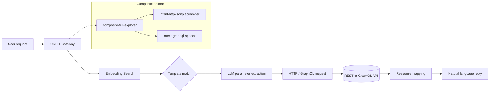

# Add a Conversational Layer to REST and GraphQL APIs With ORBIT

Expose any REST or GraphQL API through natural language so users can ask "What posts did user 3 write?" or "List the next five SpaceX launches" without knowing endpoints or query syntax. ORBIT's intent adapters match questions to YAML-defined templates, extract parameters with the LLM, and execute the correct HTTP or GraphQL request—so you get a single conversational gateway for internal tools, partner APIs, or open data. This guide walks through wiring one REST and one GraphQL adapter, then combining them with a composite adapter for a unified API chat.

## Architecture

User messages hit the ORBIT gateway; embedding search finds the best-matching template in Chroma. The LLM fills in path/query/body parameters, and the intent retriever runs the request against the configured base URL or GraphQL endpoint. When multiple APIs are in play, the composite retriever searches all child template stores and routes to the adapter with the highest-confidence match.



## Prerequisites

| Requirement | Version / note | Purpose |
|-------------|----------------|---------|
| ORBIT server | 2.2+ | Hosts intent and composite adapters |
| Python | 3.12+ | Server runtime |
| Chroma | Bundled | Vector store for template matching |
| Embedding provider | Ollama or OpenRouter | For template similarity (e.g. `nomic-embed-text`) |
| Inference provider | OpenAI, Anthropic, Cohere, Ollama, etc. | Parameter extraction and optional synthesis |

Ensure at least one LLM and one embedding provider are set in `config/inference.yaml` and `config/embeddings.yaml`, and that `config/adapters/intent.yaml` is included via `config/adapters.yaml`.

```bash
# If using Ollama for embeddings
ollama pull nomic-embed-text:latest

# Confirm ORBIT is up
./bin/orbit.sh status
```

## Step-by-step implementation

### Step 1 — Enable a REST intent adapter

ORBIT ships with an HTTP JSON intent retriever that uses domain YAML and template YAML. The JSONPlaceholder adapter is a good first test (no auth). In `config/adapters/intent.yaml` ensure the block exists and is enabled:

```yaml
- name: "intent-http-jsonplaceholder"
  enabled: true
  type: "retriever"
  datasource: "http"
  adapter: "intent"
  implementation: "retrievers.implementations.intent.IntentHTTPJSONRetriever"
  inference_provider: "ollama_cloud"   # or openai, anthropic, etc.
  model: "gpt-oss:20b"
  embedding_provider: "ollama"
  embedding_model: "nomic-embed-text:latest"
  config:
    domain_config_path: "examples/intent-templates/http-intent-template/examples/jsonplaceholder/templates/jsonplaceholder_domain.yaml"
    template_library_path:
      - "examples/intent-templates/http-intent-template/examples/jsonplaceholder/templates/jsonplaceholder_templates.yaml"
    template_collection_name: "jsonplaceholder_http_templates"
    store_name: "chroma"
    confidence_threshold: 0.4
    max_templates: 5
    base_url: "https://jsonplaceholder.typicode.com"
    default_timeout: 30
    enable_retries: true
    max_retries: 3
```

Restart ORBIT so templates load into Chroma. Then call the chat API with an adapter key that allows this adapter and ask e.g. "Get post 5" or "List posts by user 3."

### Step 2 — Add a GraphQL intent adapter

For a GraphQL API, use `IntentGraphQLRetriever` and point it at the GraphQL endpoint. The SpaceX public API is a ready-made example:

```yaml
- name: "intent-graphql-spacex"
  enabled: true
  type: "retriever"
  datasource: "http"
  adapter: "intent"
  implementation: "retrievers.implementations.intent.IntentGraphQLRetriever"
  inference_provider: "cohere"   # or your preferred provider
  embedding_provider: "ollama"
  embedding_model: "nomic-embed-text:latest"
  config:
    domain_config_path: "examples/intent-templates/graphql-intent-template/examples/spacex/templates/spacex_domain.yaml"
    template_library_path:
      - "examples/intent-templates/graphql-intent-template/examples/spacex/templates/spacex_templates.yaml"
    template_collection_name: "graphql_spacex_templates"
    store_name: "chroma"
    confidence_threshold: 0.4
    max_templates: 5
    base_url: "https://spacex-production.up.railway.app"
    graphql_endpoint: "/graphql"
    default_timeout: 30
```

Templates use `graphql_template` (the operation string) and `parameters` with `location: variable`. After restart, try "Next 5 SpaceX launches" or similar against an API key that has access to this adapter.

### Step 3 — Combine APIs with a composite adapter

To let one chat session hit both REST and GraphQL backends, add a composite retriever that lists both as children. In `config/adapters/composite.yaml`:

```yaml
- name: "composite-api-explorer"
  enabled: true
  type: "retriever"
  adapter: "composite"
  implementation: "retrievers.implementations.composite.CompositeIntentRetriever"
  inference_provider: "ollama_cloud"
  model: "gpt-oss:120b"
  embedding_provider: "openrouter"
  embedding_model: "openai/text-embedding-3-small"
  config:
    child_adapters:
      - "intent-http-jsonplaceholder"
      - "intent-graphql-spacex"
    confidence_threshold: 0.35
    max_templates_per_source: 3
    parallel_search: true
    search_timeout: 5.0
```

Use an API key that is allowed to use `composite-api-explorer`. The composite retriever searches both template stores, picks the best match, and runs the query on the corresponding adapter.

### Step 4 — Define templates for your own API

For a new REST API, add a domain file and a template file. Domain describes the API and parameter patterns; templates map natural language to method, path, and parameters.

| Field | Purpose |
|-------|---------|
| `domain_config_path` | Domain name, description, parameter normalizers |
| `template_library_path` | List of YAML files with `templates` |
| `endpoint_template` | Path with placeholders e.g. `/posts/{{post_id}}` |
| `nl_examples` | Example user phrases for embedding match |
| `parameters` | name, type, required, location (path/query/body) |

For GraphQL, use `graphql_template` (full operation text) and `operation_name`, and put parameters in `parameters` with `location: variable`. Run the GraphQL template generator from `examples/intent-templates/graphql-intent-template/` to scaffold from an existing `.graphql` file.

## Validation checklist

- [ ] ORBIT starts without adapter load errors; intent and composite adapters appear in the dashboard.
- [ ] Request to `/v1/chat` with a message like "Get post 1" returns data from JSONPlaceholder when using an key for `intent-http-jsonplaceholder`.
- [ ] Request with "Next SpaceX launches" returns launch data when using a key for `intent-graphql-spacex`.
- [ ] When using a key for `composite-api-explorer`, both "Show post 2" and "Upcoming SpaceX missions" are answered by the correct backend.
- [ ] Response includes `metadata` (e.g. `template_id`, source adapter) and readable content.
- [ ] Templates reload after changing YAML if `reload_templates_on_start: true` and `force_reload_templates: true`, then restart.

## Troubleshooting

| Symptom | Cause | Action |
|--------|--------|--------|
| "No matching template" or fallback to passthrough | Confidence below threshold or no close template | Lower `confidence_threshold` (e.g. to 0.35); add more `nl_examples` to templates; check embedding model is loaded. |
| Wrong adapter chosen in composite | Overlapping phrasing across APIs | Tighten `nl_examples` per adapter; enable multi-stage selection in `config.yaml` (`composite_retrieval.reranking`, `string_similarity`) for better disambiguation. |
| HTTP 4xx/5xx from upstream API | Bad URL, auth, or parameters | Check `base_url`, `graphql_endpoint`, and auth (e.g. `auth.token_env`) in adapter config; validate path/query/body with a direct `curl` or GraphQL client. |
| Timeouts or slow responses | Upstream slow or template search broad | Increase `default_timeout`; reduce `max_templates` or `max_templates_per_source`; enable `parallel_search` and tune `search_timeout`. |
| Parameters not extracted | LLM or template mismatch | Ensure parameter names and types match the template; add extraction patterns in domain if needed; try a stronger inference model. |

## Security and compliance considerations

- **Secrets:** Store API keys in environment variables and reference them in config with `auth.token_env` (e.g. `"${MY_API_KEY}"`). Do not commit secrets to template or adapter YAML.
- **Access control:** Use per-adapter or per-composite API keys so only authorized clients can hit specific backends. Restrict which adapters each key can use in your auth layer.
- **Data sensitivity:** If the conversational layer calls internal or regulated APIs, run ORBIT in your own network, use TLS for the gateway and for outbound calls where supported, and consider audit logging for chat and adapter usage.
- **Rate and abuse:** Apply ORBIT rate limits and quotas per key; configure `fault_tolerance` and retries so one bad upstream does not overwhelm the gateway.
