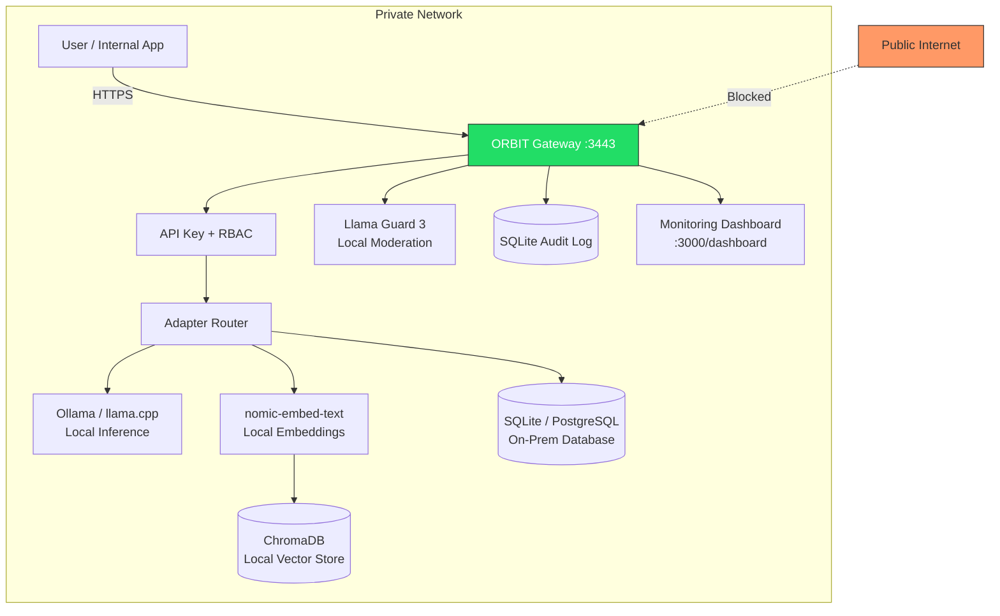

# Deploy a Private AI Gateway for Regulated Data With ORBIT and Local Models

Healthcare records, financial transactions, classified government documents — some data cannot touch the public internet under any circumstances. ORBIT can run as a fully air-gapped AI gateway where every component — inference, embeddings, vector search, moderation, and audit logging — runs on your own hardware with zero outbound network calls. This guide builds that stack from scratch using Ollama, llama.cpp, and SQLite so you can serve a production RAG pipeline from behind a firewall.

## Architecture

Every request stays on-premises. The user's question enters ORBIT over HTTPS, hits a local LLM for inference, matches templates against a local Chroma vector store, queries an on-prem database, and returns the answer — with every interaction written to an audit log for compliance.



## Prerequisites

| Component | Option | Why Local Matters |
|---|---|---|
| Inference | Ollama, llama.cpp, vLLM, TensorRT-LLM, Shimmy, BitNet, HuggingFace Transformers | No tokens sent to OpenAI/Anthropic |
| Embeddings | Ollama (`nomic-embed-text`), llama.cpp (GGUF), Sentence Transformers (`BAAI/bge-m3`) | Document vectors never leave your network |
| Vector store | ChromaDB (embedded mode), Qdrant (local) | Semantic search with no cloud dependency |
| Database | SQLite (bundled), PostgreSQL, MySQL, DuckDB | Query data stays on-prem |
| Moderation | Ollama + `llama-guard3:8b` | Content safety without external API calls |
| Backend | SQLite | User accounts, sessions, audit — no MongoDB required |

Pre-download all models and dependencies on a machine with internet access, then transfer them to the air-gapped host via USB or internal artifact server.

```bash
# On an internet-connected staging machine — pull everything you need
ollama pull granite4:1b
ollama pull nomic-embed-text:latest
ollama pull llama-guard3:8b

# Package the Ollama model cache for transfer
tar -czf ollama-models.tar.gz ~/.ollama/models/

# Transfer to air-gapped host
scp ollama-models.tar.gz admin@airgapped-host:/tmp/
```

## Step-by-step implementation

### Step 1 — Install ORBIT on the air-gapped host

Transfer the release tarball and install without network access. The `setup.sh` script creates a Python virtual environment and installs dependencies from the bundled wheels.

```bash
# On the air-gapped host
tar -xzf /tmp/orbit-2.4.0.tar.gz && cd orbit-2.4.0
cp env.example .env

# Install Ollama from the pre-downloaded binary
sudo install /tmp/ollama-linux-amd64 /usr/local/bin/ollama

# Restore pre-downloaded models
tar -xzf /tmp/ollama-models.tar.gz -C ~/

# Start Ollama as a service
ollama serve &

# Install ORBIT (uses bundled dependencies)
./install/setup.sh && source venv/bin/activate
```

### Step 2 — Lock inference to local providers

Edit `config/inference.yaml` to use only Ollama or llama.cpp. Remove or comment out every cloud provider entry.

```yaml
# config/inference.yaml — local providers only
providers:
  ollama:
    type: ollama
    base_url: "http://localhost:11434"
    default_model: "granite4:1b"
    request_timeout: 120
    retry_attempts: 3
    retry_delay: 2
    keep_alive: "5m"

  llama_cpp:
    type: llama_cpp
    mode: "direct"
    model_path: "models/granite-4.0-1b-Q4_K_M.gguf"
    n_ctx: 8192
    n_gpu_layers: -1        # Use all GPU layers if available
    acceleration: "metal"   # or "cuda", "cpu"
```

### Step 3 — Configure local embeddings

Point the embedding provider at Ollama or Sentence Transformers in local mode. No embedding request will leave the host.

```yaml
# config/embeddings.yaml — local only
providers:
  ollama:
    type: ollama
    base_url: "http://localhost:11434"
    model: "nomic-embed-text"
    dimensions: 768

  sentence_transformers:
    type: sentence_transformers
    mode: "local"
    model: "BAAI/bge-m3"
    dimensions: 1024
    device: "auto"
    cache_folder: "~/.cache/huggingface"
    normalize_embeddings: true
```

### Step 4 — Switch the backend to SQLite

By default ORBIT can use MongoDB for users and sessions. For an air-gapped deployment, switch everything to SQLite so you need zero external services.

```yaml
# config/config.yaml — internal services
internal_services:
  backend:
    type: "sqlite"
    database: "orbit.db"
  redis:
    enabled: false          # No Redis dependency
  elasticsearch:
    enabled: false          # No Elasticsearch dependency
```

### Step 5 — Enable audit logging for compliance

Regulators want proof that AI interactions are recorded. ORBIT's audit system logs every query, the adapter used, the generated response, and timing metadata.

```yaml
# config/config.yaml — audit section
audit:
  enabled: true
  storage_backend: "database"    # Uses SQLite from backend config
  collection_name: "audit_logs"
  compress_responses: true       # Gzip responses to save disk
  clear_on_startup: false        # Never clear in production
```

Every chat interaction now produces an audit record with: timestamp, user ID, session ID, adapter name, input query, output response (gzip-compressed), and processing time. Export these records for compliance reviews using the admin API or direct SQLite queries.

### Step 6 — Enable HTTPS and security headers

Encrypt all traffic with TLS and enable the full suite of security headers.

```yaml
# config/config.yaml — HTTPS
https:
  enabled: true
  port: 3443
  cert_file: "./certs/orbit.pem"
  key_file: "./certs/orbit-key.pem"

# Security headers
security:
  headers:
    enabled: true
    content_security_policy: "default-src 'self'; script-src 'self'"
    strict_transport_security: "max-age=31536000; includeSubDomains"
    x_content_type_options: "nosniff"
    x_frame_options: "SAMEORIGIN"
    x_xss_protection: "1; mode=block"
    referrer_policy: "strict-origin-when-cross-origin"
    permissions_policy: "geolocation=(), microphone=(), camera=()"
```

Generate a self-signed certificate for internal use, or use your organization's CA:

```bash
openssl req -x509 -newkey rsa:4096 -nodes \
  -keyout certs/orbit-key.pem \
  -out certs/orbit.pem \
  -days 365 \
  -subj "/CN=orbit.internal.corp"
```

### Step 7 — Enable local content moderation

Use Llama Guard 3 running in Ollama to filter harmful content without any external API call.

```yaml
# config/guardrails.yaml
safety:
  enabled: true
  mode: "fuzzy"
  moderator: "ollama"
  max_retries: 3
  request_timeout: 10
  allow_on_timeout: false

# config/moderators.yaml
providers:
  ollama:
    type: ollama
    base_url: "http://localhost:11434"
    model: "llama-guard3:8b"
    temperature: 0.0
```

### Step 8 — Verify the air gap

Before going live, confirm that ORBIT makes zero outbound connections.

```bash
# Start ORBIT
./bin/orbit.sh start

# Monitor all outbound connections from the ORBIT process
# (should show ONLY localhost connections)
ss -tnp | grep orbit

# Or use a stricter test — block all outbound traffic and confirm ORBIT still works
sudo iptables -A OUTPUT -m owner --uid-owner $(id -u) -d 127.0.0.0/8 -j ACCEPT
sudo iptables -A OUTPUT -m owner --uid-owner $(id -u) -j DROP

curl -k https://localhost:3443/v1/chat \
  -H 'Content-Type: application/json' \
  -H 'X-API-Key: your-key' \
  -d '{"messages":[{"role":"user","content":"Hello"}],"stream":false}'

# Clean up iptables after testing
sudo iptables -D OUTPUT -m owner --uid-owner $(id -u) -j DROP
sudo iptables -D OUTPUT -m owner --uid-owner $(id -u) -d 127.0.0.0/8 -j ACCEPT
```

## Validation checklist

- [ ] Ollama responds locally: `curl http://localhost:11434/api/tags` returns models
- [ ] Embedding model loaded: `ollama run nomic-embed-text "test"` returns a vector
- [ ] Llama Guard loaded: `ollama run llama-guard3:8b "test"` returns a safety classification
- [ ] HTTPS active: `curl -k https://localhost:3443/health` returns `200 OK`
- [ ] Security headers present: `curl -kI https://localhost:3443/health` shows `Strict-Transport-Security`, `X-Content-Type-Options`
- [ ] Audit logging active: check `orbit.db` for records in the `audit_logs` table after sending a test query
- [ ] No outbound connections: `ss -tnp | grep orbit` shows only `127.0.0.1` and `::1` destinations
- [ ] Dashboard accessible: `https://localhost:3443/dashboard` loads without external CDN calls
- [ ] API key auth enforced: requests without `X-API-Key` header return `401 Unauthorized`
- [ ] Adapters healthy: dashboard shows green status for all enabled adapters

## Troubleshooting

### Ollama model loads slowly on first request

**Symptom:** The first chat request takes 30–60 seconds, then subsequent requests are fast.

**Fix:** This is normal cold-start behavior — Ollama loads the model into GPU/CPU memory on first use. Set `keep_alive: "60m"` in `config/inference.yaml` to keep the model resident for 60 minutes between requests. For always-on deployments, send a warm-up request in your systemd `ExecStartPost` script. If the model consistently fails to load, verify GPU memory is sufficient with `nvidia-smi` or check CPU RAM — a 7B model needs approximately 4 GB in Q4 quantization.

### ChromaDB "collection not found" after restart

**Symptom:** Template matching fails after restarting ORBIT with errors about missing collections.

**Fix:** Set `reload_templates_on_start: true` and `force_reload_templates: true` in each adapter's config section. ChromaDB in embedded mode persists data to disk, but if the persist directory was on a tmpfs or was cleared, templates must be re-indexed. Verify the Chroma persist path in `config/stores.yaml` points to a durable filesystem location.

### TLS handshake failures from internal clients

**Symptom:** Clients receive `SSL: CERTIFICATE_VERIFY_FAILED` when connecting.

**Fix:** Distribute your CA certificate to all client machines and add it to their trust store. For Python clients: `export REQUESTS_CA_BUNDLE=/path/to/ca.pem`. For curl: `curl --cacert /path/to/ca.pem`. Alternatively, if using self-signed certificates in a trusted internal network, clients can skip verification with `verify=False` — but this should only be done in fully isolated networks.

### Audit log grows too large on disk

**Symptom:** The `orbit.db` file grows rapidly with high query volumes.

**Fix:** Enable `compress_responses: true` in the audit config — this gzip-compresses the response field, which is typically 80% of each record's size. For long-term storage, schedule a cron job to export and archive older records, then vacuum the database: `sqlite3 orbit.db "DELETE FROM audit_logs WHERE timestamp < datetime('now', '-90 days'); VACUUM;"`. For higher-volume deployments, consider switching the audit backend to a local MongoDB or Elasticsearch instance with built-in TTL indexes.

## Security and compliance considerations

- **NIST SP 800-63B compliance:** ORBIT hashes API keys and passwords with PBKDF2-SHA256 using 600,000 iterations, exceeding the OWASP 2023 minimum. Constant-time comparison prevents timing attacks.
- **FIPS 140-2 compatible:** All cryptographic operations use approved algorithms (SHA-256, PBKDF2, AES for TLS). No custom or experimental cryptography.
- **Network isolation:** With all providers set to `localhost`, ORBIT makes zero DNS lookups and zero outbound TCP connections. Verify this with the iptables test in Step 8.
- **Principle of least privilege:** Create separate API keys for each team or application using `./bin/orbit.sh key create`. Assign RBAC roles so analysts can only access their designated adapters.
- **Data retention:** The audit system supports configurable retention. Set a retention policy that matches your regulatory framework — 7 years for financial services (SOX), 6 years for healthcare (HIPAA), or as defined by your organization's records management policy.
- **Encryption at rest:** Use filesystem-level encryption (LUKS on Linux, FileVault on macOS, BitLocker on Windows) for the directories containing `orbit.db`, Chroma data, and model files. ORBIT does not encrypt SQLite at the application layer.

| Regulation | Key Requirement | How ORBIT Addresses It |
|---|---|---|
| GDPR (EU) | Data must not leave the EU | Self-hosted, all processing on-prem |
| HIPAA (US) | PHI requires encryption + audit trail | TLS in transit, audit logs, filesystem encryption at rest |
| PIPEDA (Canada) | Consent + data residency | No third-party data sharing, Canadian hosting |
| SOX (US Financial) | 7-year audit retention | SQLite/MongoDB audit backend with configurable retention |
| ITAR (US Defense) | No foreign access to controlled data | Air-gapped, no outbound network calls |
