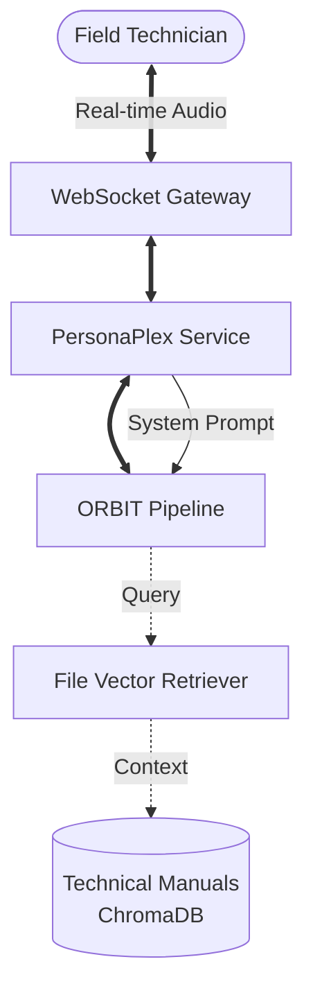

# Deploying Full-Duplex Voice Assistants for Hands-Free Field Service with ORBIT

Field technicians often operate in high-stakes environments where manual searching through physical or digital technical documentation is both slow and hazardous. By integrating NVIDIA’s PersonaPlex-7B with ORBIT’s multimodal file retrieval system, organizations can deploy full-duplex voice assistants that handle simultaneous listening and speaking. This implementation enables hands-free troubleshooting by synthesizing real-time speech with relevant context extracted from complex technical manuals and schematics.

## Architecture

The system utilizes a low-latency WebSocket gateway to manage bidirectional audio streams. PersonaPlex provides the unified speech-to-speech model, which eliminates the traditional STT-LLM-TTS cascade latency, while ORBIT’s File Vector Retriever injects precise technical data from the knowledge base into the active conversation.



## Prerequisites

Before starting the deployment, verify your infrastructure matches the following specifications:

- **GPU Resources**: NVIDIA A100 or RTX 4090 (16GB+ VRAM) for the PersonaPlex backend.
- **ORBIT Server**: Version 2.4.0+ with `sphn` and `aiohttp` dependencies installed.
- **System Audio**: `libopus-dev` (Linux) or `brew install opus` (macOS) for codec support.
- **Data Ingestion**: Technical documentation uploaded to ORBIT via the `file-document-qa` adapter.
- **Environment**: A valid `HF_TOKEN` with access to the `nvidia/personaplex-7b-v1` repository.

## Step-by-step implementation

### 1. Configure the PersonaPlex Service
Edit `config/personaplex.yaml` to enable the unified speech-to-speech engine. For field use, proxy mode is recommended to allow the edge device to remain lightweight.

```yaml
personaplex:
  enabled: true
  mode: "proxy"
  proxy:
    server_url: "wss://gpu-cluster.internal:8998/api/chat"
    ssl_verify: true
    handshake_timeout: 120
  audio:
    sample_rate: 32000
    opus_enabled: true
```

### 2. Define the Field Service Voice Adapter
Create a specialized adapter in `config/adapters/personaplex.yaml`. This adapter uses `retrieval_behavior: "always"` to ensure technical manuals are searched for every user utterance.

```yaml
- name: "field-technician-assistant"
  enabled: true
  type: "speech_to_speech"
  adapter: "personaplex"
  implementation: "ai_services.implementations.speech_to_speech.PersonaPlexService"
  
  capabilities:
    retrieval_behavior: "always"
    supports_realtime_audio: true
    supports_full_duplex: true
    supports_interruption: true
    supports_backchannels: true

  persona:
    voice_prompt: "NATM2.pt"  # Deep, authoritative male voice
    text_prompt: |
      You are an expert field service engineer. Use the provided technical 
      context to give precise, step-by-step troubleshooting instructions.
      Keep answers concise and prioritize safety warnings.
```

### 3. Ingest Technical Manuals
Prepare the knowledge base by uploading PDF manuals using the ORBIT CLI. The system will automatically chunk and embed the content for retrieval.

```bash
# Upload service manuals for the 'field-technician-assistant' scope
./bin/orbit.sh file upload --path ./manuals/turbine-gen-v4.pdf --api-key technician_prod_key
```

### 4. Connect the Audio Client
Use the ORBIT Python SDK to connect a field device (e.g., tablet or smart glasses) to the WebSocket endpoint.

```python
import websockets
import json

async def start_voice_session(adapter="field-technician-assistant"):
    uri = f"ws://orbit-gateway:3000/ws/voice/{adapter}"
    async with websockets.connect(uri) as ws:
        # Initial handshake
        await ws.send(json.dumps({"type": "ping"}))
        print("Connected to Field Assistant")
        # Start bidirectional streaming (Implementation details in docs/audio)
```

## Validation checklist

- [ ] `GET /voice/status` returns `available: true` for the technician adapter.
- [ ] AI correctly processes "mm-hmm" backchannels without breaking the flow.
- [ ] Assistant stops speaking immediately when the technician interrupts with a safety command.
- [ ] Technical queries like "What is the torque for the bolt on panel B?" return data-specific answers from the uploaded PDF.
- [ ] GPU VRAM usage remains stable under concurrent session testing.

## Troubleshooting

| Failure Mode | Likely Cause | Resolution |
|--------------|--------------|------------|
| Distorted Audio | Sample rate mismatch | Ensure client sends audio at 24000Hz; ORBIT resamples to 32000Hz internally. |
| No Context in Speech | Retrieval threshold | Lower `confidence_threshold` in `adapters.yaml` to allow broader matching. |
| Interruption Lag | Network jitter | Switch to `mode: "proxy"` with a dedicated local network or fiber backbone. |
| Out of Memory | Session limit hit | Adjust `max_concurrent_sessions` in `personaplex.yaml` based on VRAM capacity. |

**Important**: If the AI hallucinates technical specs, check the `formatting_style` in capabilities. Use `clean` to ensure the LLM doesn't try to cite non-existent page numbers in a voice-only interface.

## Security and compliance considerations

- **On-Premise Deployment**: Run the entire stack in an air-gapped environment to protect proprietary service manuals and operational data.
- **Audio Encryption**: Use `wss://` for all field communication to prevent interception of sensitive site descriptions.
- **Session Isolation**: Each technician should use a unique `session_id` to prevent cross-contamination of conversation context.
- **Audit Logs**: Enable `internal_services.audit` with `compress_responses: true` to record troubleshooting sessions for quality assurance and training.
