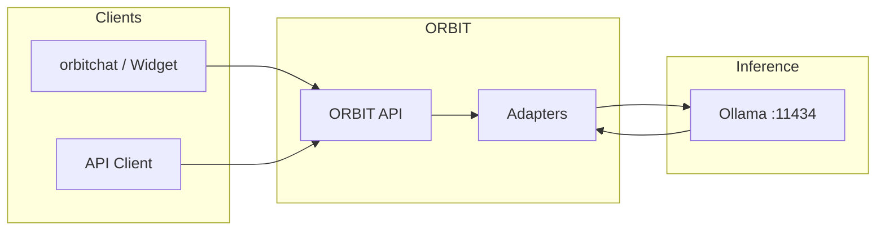

# How to Deploy ORBIT with Ollama

ORBIT is a self-hosted gateway that unifies AI providers, databases, and APIs behind one OpenAI-compatible API. Deploying ORBIT with Ollama lets you run chat, embeddings, and optional RAG entirely on your own infrastructure with no cloud API keys. This guide covers the recommended deployment paths: the all-in-one Docker image and the install-from-release setup with a separate Ollama service.

## Architecture

ORBIT sits between your clients and Ollama. The API handles routing, guardrails, adapters, and optional RAG; Ollama serves local LLM and embedding models. The diagram below shows the flow for a typical chat deployment.



| Component | Role | Default endpoint |
|-----------|------|------------------|
| ORBIT API | Request handling, auth, adapters, audit | `http://localhost:3000` |
| orbitchat | Browser chat UI (Docker basic image) | `http://localhost:5173` |
| Ollama | LLM and embedding models | `http://localhost:11434` |

## Prerequisites

- **Docker** 20.10+ (for Docker path), or **Python 3.12+**, Node 18+, and npm (for install path).
- **Ollama** installed and running (for install path); the basic Docker image includes Ollama.
- **Resources:** 4GB+ RAM for Docker; 8GB+ recommended for install path with a small model (e.g. Granite 4.0-1B). Pull at least one chat model and optionally `nomic-embed-text` for embeddings.

For install path, install Ollama first:

```bash
curl -fsSL https://ollama.com/install.sh | sh
ollama serve
```

In another terminal, pull a model: e.g. `ollama pull granite4:1b` and `ollama pull nomic-embed-text`.

## Step-by-step implementation

### Option A: Docker (fastest)

The basic image includes ORBIT, orbitchat, and Ollama with pre-pulled models (`granite4:1b`, `nomic-embed-text`). No API key is required for the default simple-chat adapter.

1. **Pull and run**

```bash
docker pull schmitech/orbit:basic
docker run -d --name orbit-basic -p 5173:5173 -p 3000:3000 schmitech/orbit:basic
```

2. **Use the app**  
   Open `http://localhost:5173` for the chat UI. The API is at `http://localhost:3000`.

3. **Optional: use your own Ollama**  
   To point ORBIT at an external Ollama (e.g. on the host), set `OLLAMA_BASE_URL` and ensure the container can reach that host:

```bash
docker run -d --name orbit-basic \
  -p 5173:5173 -p 3000:3000 \
  -e OLLAMA_BASE_URL=http://host.docker.internal:11434 \
  schmitech/orbit:basic
```

### Option B: Install from release

1. **Download and unpack**

```bash
curl -L https://github.com/schmitech/orbit/releases/download/v2.4.0/orbit-2.4.0.tar.gz -o orbit-2.4.0.tar.gz
tar -xzf orbit-2.4.0.tar.gz && cd orbit-2.4.0
```

2. **Configure environment**

```bash
cp env.example .env
./install/setup.sh
source venv/bin/activate
```

3. **Point ORBIT at Ollama**  
   Ensure `config/ollama.yaml` presets use the correct `base_url` (default `http://localhost:11434`). For a remote Ollama, set the preset’s `base_url` or use `config/inference.yaml` and `ollama_remote` with `base_url: "http://your-ollama-host:11434"`.  
   In `config/inference.yaml`, set the default provider and preset:

```yaml
inference:
  ollama:
    enabled: true
    use_preset: "granite-cpu"   # or another preset from config/ollama.yaml
```

4. **Embeddings (optional)**  
   In `config/embeddings.yaml`, `provider: "ollama"` and `embeddings.ollama.base_url` (e.g. `http://localhost:11434`) and `model: "nomic-embed-text"` are typically already set. Pull the model: `ollama pull nomic-embed-text`.

5. **Start ORBIT**

```bash
./bin/orbit.sh start
tail -f ./logs/orbit.log
```

6. **Create an API key (optional)**  
   For production, create a key and attach an adapter:

```bash
./bin/orbit.sh key create --adapter passthrough --name "Ollama Chat"
```

Use the returned key as `X-API-Key` in requests. The dashboard is at `http://localhost:3000/dashboard`.

### Option C: Docker Compose with external Ollama

When Ollama runs on the host or another container, use a compose file so ORBIT and the chat UI share the same network as Ollama.

```yaml
services:
  orbit:
    image: schmitech/orbit:basic
    ports:
      - "3000:3000"
      - "5173:5173"
    environment:
      ORBIT_ENV: production
      OLLAMA_BASE_URL: http://ollama:11434
    depends_on:
      - ollama
  ollama:
    image: ollama/ollama
    ports:
      - "11434:11434"
    volumes:
      - ollama_data:/root/.ollama
volumes:
  ollama_data: {}
```

Run: `docker compose up -d`. Then open `http://localhost:5173` (or the host port mapped to 5173).

## Validation checklist

- [ ] Ollama is running and reachable: `curl http://localhost:11434/api/tags` returns a list of models.
- [ ] At least one chat model is pulled (e.g. `granite4:1b`, `smollm2:1.7b`).
- [ ] ORBIT health is OK: `curl http://localhost:3000/health` returns a healthy status.
- [ ] Chat request succeeds: `curl -X POST http://localhost:3000/v1/chat -H 'Content-Type: application/json' -H 'X-API-Key: default-key' -H 'X-Session-ID: test' -d '{"messages":[{"role":"user","content":"Hello"}],"stream":false}'`.
- [ ] If using embeddings/RAG, `nomic-embed-text` is pulled and `config/embeddings.yaml` uses `ollama` with the correct `base_url`.
- [ ] For production: API key created, `ORBIT_ENV=production` set, and `OLLAMA_BASE_URL` (or preset `base_url`) verified.

## Troubleshooting

**ORBIT returns 503 or "model unavailable"**  
Ollama may not be reachable or the model may not be loaded. Check: `curl http://localhost:11434/api/tags`. If using Docker, ensure `OLLAMA_BASE_URL` is correct (e.g. `http://host.docker.internal:11434` for host Ollama on Mac/Windows). Restart Ollama and, if needed, run `ollama pull <model>` again.

**Ollama "permission denied" or service won’t start**  
On Linux, create the ollama user and directories: `sudo useradd -r -s /bin/false -m -d /usr/share/ollama ollama`, `sudo mkdir -p /usr/share/ollama/.ollama`, `sudo chown -R ollama:ollama /usr/share/ollama`. Use the systemd service from `docs/ollama-installation-manual.md` and run `sudo systemctl start ollama`.

**Port 11434 already in use**  
Find the process: `sudo lsof -i :11434` or `ss -tlnp | grep 11434`. Stop the conflicting service or run Ollama on another port and set `base_url` (and `OLLAMA_HOST`) accordingly.

**Cold start timeouts**  
The first request after idle can be slow while Ollama loads the model. In `config/ollama.yaml`, presets support `retry` and `timeout.warmup`; increase `timeout.warmup` (e.g. 120000 ms) and ensure `retry.enabled: true` if you see timeouts on first request.

**Docker: "model not found" in container**  
The basic image includes pre-pulled models. If you overrode the image or use a custom setup, run inside the container: `docker exec orbit-basic ollama list`, then `docker exec orbit-basic ollama pull granite4:1b` (and `nomic-embed-text` if using embeddings).

## Security and compliance considerations

- **Network:** Restrict access to port 11434 (Ollama) to the ORBIT host or Docker network only. Do not expose Ollama to the public internet unless you add auth or a proxy.
- **Data:** All inference and embeddings run on your infrastructure; no prompts or data are sent to third-party LLM APIs when using only the Ollama provider.
- **Secrets:** Do not put API keys or passwords in config files committed to source control. Use environment variables (e.g. `OLLAMA_BASE_URL`, `ORBIT_DEFAULT_ADMIN_PASSWORD`) or a secrets manager.
- **Hardening:** For production, use TLS for the ORBIT API, set a strong admin password, create scoped API keys per adapter, and follow the rate-limiting and audit logging options in the main docs.

