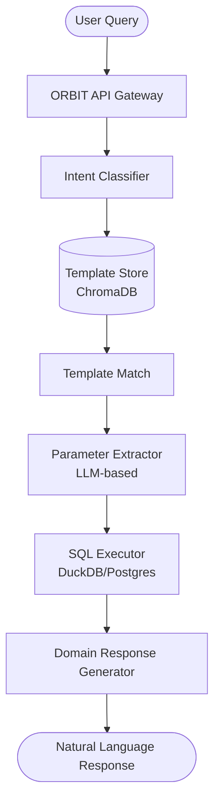

# Building an AI Database Copilot for Natural Language Business Intelligence with ORBIT

Transforming raw database tables into actionable business insights usually requires specialized SQL knowledge or complex BI tools. By leveraging ORBIT's Intent SQL Retriever system, organizations can build a "Database Copilot" that allows non-technical users to query structured data using natural language. This implementation provides a secure, self-hosted gateway that translates human intent into optimized SQL queries across DuckDB, PostgreSQL, or MySQL.

## Architecture

The ORBIT Database Copilot operates as a semantic middleware layer between the user and the data warehouse. It uses a vector-based matching system to map user queries to pre-validated SQL templates, ensuring both performance and safety.



## Prerequisites

Before implementing the Database Copilot, ensure your environment meets the following requirements:

- **ORBIT Server**: Version 2.4.0+ installed and running.
- **Database Access**: A functional DuckDB file, PostgreSQL, or MySQL instance.
- **Inference Provider**: API keys for an LLM provider (e.g., OpenAI, Anthropic) or a local Ollama instance with `gpt-oss:120b` or `llama3.1`.
- **Vector Store**: A running ChromaDB instance (default) for template matching.
- **Python 3.12+**: Required for the core toolkit and template generators.

## Step-by-step implementation

### 1. Define the Business Domain
Create a `domain.yaml` file to define your entities and vocabulary. This helps the LLM understand your business context and synonyms.

```yaml
domain_name: "Sales Analytics"
description: "Analysis of revenue, orders, and customer behavior"

entities:
  order:
    table_name: "orders"
    primary_key: "id"
    display_name_field: "order_number"
  revenue:
    description: "Financial transactions and earnings"

vocabulary:
  entity_synonyms:
    revenue: ["sales", "income", "turnover"]
    order: ["transaction", "purchase"]
  action_verbs:
    calculate: ["sum", "total", "count"]
```

### 2. Configure the Intent SQL Adapter
Add a new adapter definition to `config/adapters/intent.yaml`. This tells ORBIT where your data lives and which templates to use.

```yaml
- name: "intent-duckdb-sales-bi"
  enabled: true
  type: "retriever"
  datasource: "duckdb"
  adapter: "intent"
  implementation: "retrievers.implementations.intent.IntentDuckDBRetriever"
  database: "data/sales_warehouse.duckdb"
  
  config:
    domain_config_path: "config/domains/sales_domain.yaml"
    template_library_path:
      - "config/templates/sales_queries.yaml"
    template_collection_name: "sales_bi_templates"
    confidence_threshold: 0.4
    read_only: true
```

### 3. Create SQL Intent Templates
Define templates that map natural language examples to parameterized SQL. Use the `sql_template` field for dynamic rendering.

```yaml
templates:
  - id: "revenue_by_region"
    description: "Get total revenue for a specific region"
    nl_examples:
      - "What was the revenue in EMEA last month?"
      - "Show total sales for North America"
    sql_template: |
      SELECT region, SUM(amount) as total
      FROM sales
      WHERE region = :region
      AND sale_date >= :start_date
      GROUP BY region
    parameters:
      - name: "region"
        type: "string"
        required: true
      - name: "start_date"
        type: "date"
        default: "2025-01-01"
```

### 4. Initialize and Create API Key
Restart the ORBIT server to load the new configuration and create an API key scoped to your new BI adapter.

```bash
# Restart server to load new adapter
./bin/orbit.sh restart

# Create an API key for the Sales BI team
./bin/orbit.sh key create 
  --adapter intent-duckdb-sales-bi 
  --name "Sales BI Assistant" 
  --prompt-text "You are a specialized Sales BI assistant. Always provide data in formatted tables when possible."
```

## Validation checklist

- [ ] Adapter `intent-duckdb-sales-bi` appears as "active" in `GET /health/adapters`.
- [ ] Template collection is successfully indexed in ChromaDB (check logs for "Template loading complete").
- [ ] Test query "What are the total sales?" returns valid data from the underlying table.
- [ ] Parameter extraction correctly identifies dates like "last month" or "Q1".
- [ ] Response metadata includes `template_id` and `confidence` score.

## Troubleshooting

| Issue | Potential Cause | Resolution |
|-------|----------------|------------|
| "No matching template" | `confidence_threshold` too high | Lower threshold in `adapters.yaml` or add more `nl_examples`. |
| SQL Execution Error | Parameter mismatch | Verify parameter names in `sql_template` match the `parameters` list. |
| Slow Response Time | Cold start on LLM | Ensure `num_ctx` is set appropriately in `inference.yaml` for large schemas. |
| Result Truncation | `max_results` too low | Increase `return_results` in the adapter configuration. |

**Failure Mode**: If the system consistently picks the wrong template, check for overlapping `nl_examples` between templates. Use the `TemplateReranker` logs to see the scoring breakdown.

## Security and compliance considerations

- **Read-Only Access**: Always set `read_only: true` for DuckDB or use a restricted database user for PostgreSQL/MySQL to prevent `DROP` or `DELETE` operations.
- **SQL Injection**: ORBIT's `TemplateProcessor` uses parameterized queries. Never use f-strings or manual string concatenation inside your SQL templates.
- **API Key Scoping**: Ensure the API key used in the BI dashboard is restricted solely to the `intent-duckdb-*` adapter.
- **Audit Logs**: Enable `internal_services.audit` to track every natural language query and the generated SQL for compliance reviews.