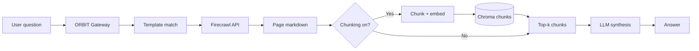

# Query the Web in Natural Language With ORBIT and Firecrawl

Turn "What is quantum computing?" or "Summarize the Python Wikipedia page" into answers without building a scraper or hand-writing prompts. ORBIT's Firecrawl intent adapter turns natural language into a scrape request, fetches the page via the Firecrawl API (or your self-hosted instance), and optionally chunks large content for semantic retrieval so the LLM gets only the relevant sections. This guide gets the intent-firecrawl adapter running with intelligent chunking and shows how to add your own URL templates for docs, wikis, or public sites.

## Architecture

The user asks a question; ORBIT embeds it and finds the best-matching Firecrawl template in Chroma. Each template maps to a URL (fixed or parameterized). Firecrawl fetches the page and returns markdown; if chunking is enabled, content is split into token-sized chunks, embedded, and stored in a vector collection. The query is run against that collection so only the top-k relevant chunks go to the LLM. Response quality improves and context size drops compared to sending the full page.



## Prerequisites

| Requirement | Version / note | Purpose |
|-------------|----------------|---------|
| ORBIT server | 2.2+ | Hosts Firecrawl intent adapter |
| Firecrawl | Cloud API or self-hosted | Fetches and converts pages to markdown |
| Chroma | Bundled | Template store + optional chunk store |
| Embedding provider | Ollama, OpenRouter, etc. | Template similarity and chunk embeddings |
| Inference provider | Any ORBIT-supported LLM | Final answer synthesis |

Set `FIRECRAWL_API_KEY` in your environment if using the cloud API, or point `base_url` in the adapter config to your Firecrawl instance.

```bash
# Optional: pull local embedding model for template + chunk search
ollama pull nomic-embed-text:latest

# Ensure ORBIT can load the Firecrawl adapter
./bin/orbit.sh status
```

## Step-by-step implementation

### Step 1 — Enable the Firecrawl intent adapter

In `config/adapters/intent.yaml` the Firecrawl block is present but disabled by default. Enable it and set your Firecrawl base URL and auth:

```yaml
- name: "intent-firecrawl-webscrape"
  enabled: true
  type: "retriever"
  datasource: "http"
  adapter: "intent"
  implementation: "retrievers.implementations.intent.IntentFirecrawlRetriever"
  inference_provider: "ollama_cloud"
  model: "gpt-oss:20b"
  embedding_provider: "ollama"
  config:
    domain_config_path: "examples/intent-templates/firecrawl-intent-template/examples/web-scraping/templates/firecrawl_domain.yaml"
    template_library_path:
      - "examples/intent-templates/firecrawl-intent-template/examples/web-scraping/templates/firecrawl_templates.yaml"
    template_collection_name: "firecrawl_test_templates"
    store_name: "chroma"
    confidence_threshold: 0.3
    max_templates: 5
    return_results: 1
    base_url: "https://api.firecrawl.dev/v1"
    default_timeout: 60
    default_formats: ["markdown"]
    auth:
      type: "bearer_token"
      token_env: "FIRECRAWL_API_KEY"
      header_name: "Authorization"
      token_prefix: "Bearer"
```

Restart ORBIT so templates load. Create an API key that can use this adapter and send a chat request with a phrase that matches a template `nl_examples` (e.g. "What is Python?" for the Python Wikipedia template).

### Step 2 — Turn on intelligent chunking for large pages

For long articles, enable chunking so the adapter splits content into token-sized chunks, embeds them, and retrieves only the most relevant ones. Add or adjust the chunking section under the same adapter `config`:

```yaml
config:
  # ... template and base_url settings above ...
  enable_chunking: true
  max_chunk_tokens: 4000
  chunk_overlap_tokens: 200
  min_chunk_tokens: 500
  max_embedding_tokens: 7500
  chunks_collection: "firecrawl_chunks"
  chunk_cache_ttl_hours: 24
  top_chunks_to_return: 3
  min_chunk_similarity: 0.3
```

| Setting | Role |
|--------|------|
| `max_chunk_tokens` | Cap per chunk to stay under context and embedding limits |
| `max_embedding_tokens` | Must match your embedding model (e.g. 7500 for OpenAI, 450 for Cohere v3) |
| `top_chunks_to_return` | Number of chunks sent to the LLM |
| `min_chunk_similarity` | Minimum score for a chunk to be included |

Restart after changing these. The first query that hits a chunked template will populate the chunks collection; later queries reuse cached chunks until TTL expires.

### Step 3 — Add templates for your own URLs

Templates link natural language to a target URL. Each entry has an `id`, `description`, `nl_examples`, and `url_mapping`. Optional: `formats`, `timeout`.

Create or edit a YAML file under your template path and list templates:

```yaml
templates:
  - id: "company_faq"
    description: "Answer questions from the company FAQ page"
    nl_examples:
      - "What is your refund policy?"
      - "How do I contact support?"
      - "FAQ"
    url_mapping:
      url: "https://example.com/faq"
    formats: ["markdown"]
    timeout: 30
```

Add this file to `template_library_path` for the adapter and set `reload_templates_on_start: true` and `force_reload_templates: true` if you want templates to refresh on each restart. Then ask in natural language; the best-matching template drives which URL Firecrawl fetches.

### Step 4 — Optional: combine with other adapters via composite

To let users query both the web and a database or API in one chat, add the Firecrawl adapter as a child of a composite retriever in `config/adapters/composite.yaml`:

```yaml
- name: "composite-web-and-data"
  enabled: true
  type: "retriever"
  adapter: "composite"
  implementation: "retrievers.implementations.composite.CompositeIntentRetriever"
  inference_provider: "ollama_cloud"
  model: "gpt-oss:120b"
  embedding_provider: "openrouter"
  embedding_model: "openai/text-embedding-3-small"
  config:
    child_adapters:
      - "intent-firecrawl-webscrape"
      - "intent-duckdb-analytics"
    confidence_threshold: 0.35
    max_templates_per_source: 3
    parallel_search: true
```

Use an API key that can call this composite; the router will choose Firecrawl or the other adapter based on template match scores.

## Validation checklist

- [ ] `intent-firecrawl-webscrape` is enabled and ORBIT starts with no adapter load errors.
- [ ] `FIRECRAWL_API_KEY` is set (cloud) or `base_url` points to your Firecrawl server.
- [ ] A chat message that matches a template `nl_examples` (e.g. "What is machine learning?") returns content derived from the scraped page.
- [ ] With chunking enabled, a query about a long page returns an answer and logs or metadata indicate chunk retrieval.
- [ ] New template file is in `template_library_path` and, after reload/restart, a new phrase triggers the correct URL.
- [ ] If using a composite, both web-style and data-style questions route to the correct adapter.

## Troubleshooting

| Symptom | Cause | Action |
|--------|--------|--------|
| "No matching template" or passthrough reply | Low confidence or no similar `nl_examples` | Lower `confidence_threshold` (e.g. 0.25); add more and varied `nl_examples` for the target template. |
| Firecrawl 401 or 403 | Missing or invalid API key | Set `FIRECRAWL_API_KEY`; confirm `auth.token_env` and header name in config. |
| Empty or truncated answers | Chunking too aggressive or wrong embedding limit | Increase `top_chunks_to_return`; ensure `max_embedding_tokens` fits your embedding model; check `min_chunk_similarity` (lower it to allow more chunks). |
| Timeouts on large pages | Default timeout too low or slow network | Raise `default_timeout` and adapter `fault_tolerance.operation_timeout`; consider a higher per-template `timeout`. |
| Stale content | Chunk cache serving old data | Reduce `chunk_cache_ttl_hours` or use a separate collection name when you change templates so chunks are rebuilt. |

## Security and compliance considerations

- **API keys:** Keep `FIRECRAWL_API_KEY` in environment variables or a secrets manager; do not commit it. For self-hosted Firecrawl, use TLS and restrict network access.
- **URL allowlisting:** Templates explicitly list URLs; avoid user-supplied URLs in templates unless you validate and constrain them to prevent abuse or SSRF.
- **Rate and cost:** Firecrawl cloud usage can incur cost; apply ORBIT rate limits and quotas per API key to avoid runaway scraping.
- **Content and retention:** Scraped content may include PII or sensitive material; consider retention and logging policies for chunk stores and audit logs. For regulated environments, run Firecrawl and ORBIT in your own network and align with data-residency requirements.
