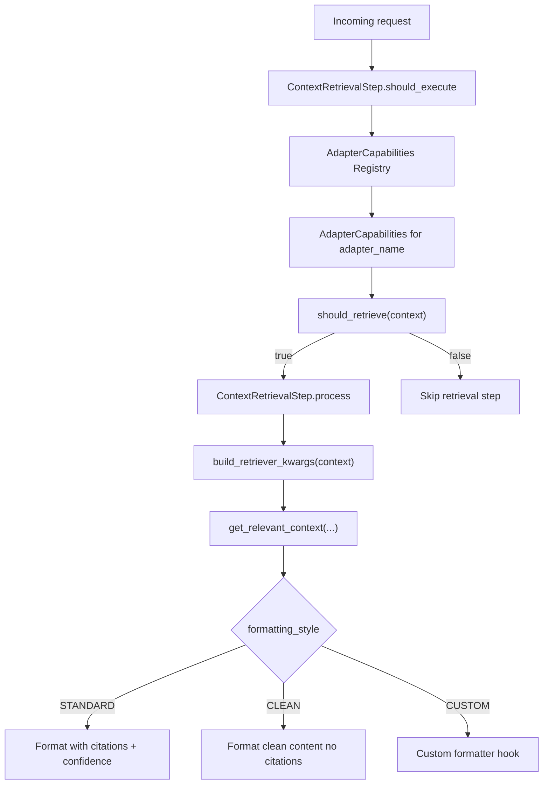

# ORBIT Adapter Capability Architecture Deep Dive

ORBIT's capability-based adapter architecture removes brittle adapter-specific branching from the retrieval pipeline and replaces it with declarative behavior. Instead of hardcoded checks like `if adapter == "multimodal"`, the pipeline asks a capability object how to behave for retrieval, formatting, and request kwargs. This design makes new adapters easier to add, easier to test, and safer to evolve as your adapter catalog grows.

## Architecture



## Prerequisites

| Requirement | Why |
|---|---|
| ORBIT repo with adapter configs | Capability inference and registration are driven by adapter configuration |
| Familiarity with `config/adapters/*.yaml` | Capabilities are declared or inferred from adapter type/name |
| Pipeline context understanding | `should_execute()` and `process()` depend on request context like `file_ids` |
| Test harness (unit + integration) | Capability behavior is intentionally easy to validate in isolation |

Recommended source files to keep open while implementing:

| File | Use in this deep dive |
|---|---|
| `docs/adapters/capabilities/adapter-capability-architecture.md` | Architecture and behavior model |
| `config/adapters/passthrough.yaml` | Passthrough and multimodal adapter patterns |
| `config/adapters/composite.yaml` | Retriever routing patterns that consume capability decisions |
| `config/config.yaml` | Runtime settings that interact with retrieval execution |

## Step-by-step implementation

### 1. Map capability decisions to pipeline touchpoints

In this architecture, the pipeline should ask capability objects two key questions:

1. `should_retrieve(context)`
2. `build_retriever_kwargs(context)`

That gives you this minimal flow:

```python
capabilities = capability_registry.get(adapter_name)
if not capabilities.should_retrieve(context):
    return skip_step()

kwargs = capabilities.build_retriever_kwargs(context)
docs = retriever.get_relevant_context(query=context.message, **kwargs)
formatted = format_context(docs, style=capabilities.formatting_style)
```

The important engineering shift is ownership: `ContextRetrievalStep` orchestrates; `AdapterCapabilities` decides behavior.

### 2. Define retrieval behavior and formatting as explicit enums

The architecture describes three retrieval modes and three formatting styles:

- Retrieval: `NONE`, `ALWAYS`, `CONDITIONAL`
- Formatting: `STANDARD`, `CLEAN`, `CUSTOM`

A practical capability declaration for a file-aware conditional adapter looks like:

```yaml
- name: "simple-chat-with-files"
  type: "passthrough"
  adapter: "multimodal"
  capabilities:
    retrieval_behavior: "conditional"
    formatting_style: "clean"
    supports_file_ids: true
    skip_when_no_files: true
    requires_api_key_validation: true
```

Why this is better than string matching:
- The behavior contract is visible in config.
- Reviewers can detect retrieval and formatting changes in YAML diffs.
- Tests can assert capability fields directly without parsing adapter-name conventions.

### 3. Use inference rules for defaults, explicit config for exceptions

The documented inference model gives sensible defaults:

- passthrough + multimodal -> conditional retrieval, clean formatting, file ID support
- non-multimodal passthrough -> no retrieval
- file adapters -> always retrieve + clean formatting
- default retrievers -> always retrieve + standard formatting

Use these inference rules to reduce config noise, then override only when behavior differs from defaults.

```python
def infer_capabilities(adapter_config):
    if adapter_config.type == "passthrough":
        if adapter_config.adapter == "multimodal":
            return conditional_clean_file_capabilities()
        return no_retrieval_capabilities()

    if adapter_config.adapter == "file" or "file" in adapter_config.name.lower():
        return always_retrieve_clean_capabilities()

    return always_retrieve_standard_capabilities()
```

This pattern keeps startup inference O(1) per adapter and prevents accidental drift between code and config expectations.

### 4. Build kwargs through capability gates, not adapter heuristics

The doc's core improvement is removing hardcoded kwargs logic from the retrieval step. Instead, `build_retriever_kwargs(context)` exposes only what the adapter claims it supports.

Example behavior matrix:

| Capability flag | Context input | Resulting retriever kwargs |
|---|---|---|
| `supports_file_ids: true` | `file_ids=["f1"]` | `{"file_ids": ["f1"]}` |
| `supports_file_ids: false` | `file_ids=["f1"]` | `{}` |
| `requires_api_key_validation: true` | `api_key="orbit_x"` | include `api_key` in kwargs only where adapter contract needs it |
| custom params declared | context contains custom values | include only declared params |

Reference implementation shape:

```python
def build_retriever_kwargs(self, context):
    kwargs = {}
    if self.supports_file_ids and context.file_ids:
        kwargs["file_ids"] = context.file_ids
    if self.requires_api_key_validation and context.api_key:
        kwargs["api_key"] = context.api_key
    for key in self.custom_parameters:
        if hasattr(context, key):
            kwargs[key] = getattr(context, key)
    return kwargs
```

This keeps data exposure tight and avoids cross-adapter parameter leakage.

### 5. Choose formatting style intentionally per adapter family

Formatting is not cosmetic; it affects downstream prompt quality and user trust.

- `STANDARD` style is best for retrievers where source transparency matters (citations, confidence).
- `CLEAN` style is best for file and multimodal flows where noisy citation wrappers can degrade UX.
- `CUSTOM` style is for advanced domain formatting with explicit hooks.

Configuration example for a custom formatter adapter contract:

```yaml
- name: "compliance-review-adapter"
  type: "retriever"
  adapter: "custom"
  capabilities:
    retrieval_behavior: "always"
    formatting_style: "custom"
    supports_file_ids: true
    custom_parameters:
      - "policy_scope"
      - "jurisdiction"
```

If you use `CUSTOM`, treat formatter code as part of your API contract and cover it with integration tests.

### 6. Register once at startup and cache in a registry

The architecture emphasizes startup initialization and O(1) lookup. That is the right tradeoff for high-throughput request paths:

- Build capability map once from adapter configs.
- Serve lookups from dictionary/registry during request handling.
- Avoid reparsing YAML in request code paths.

Startup-oriented pseudocode:

```python
def initialize_capabilities(adapter_configs):
    registry = {}
    for name, config in adapter_configs.items():
        registry[name] = infer_capabilities(config)
    return registry
```

Operationally, this also makes capability snapshots auditable: you can print or expose registry state for debugging.

### 7. Add extension hooks only where static flags are insufficient

For most adapters, static capability flags are enough. Use custom hooks when retrieval eligibility depends on runtime business logic.

Examples that justify hooks:
- premium-tier-only retrieval
- tenant-level policy gates
- dynamic formatting based on jurisdiction or data class

Hook pattern from the architecture:

```python
def custom_should_execute(context):
    return context.user_id in premium_users

def custom_format_context(docs, truncation_info):
    return "\n---\n".join([d["content"] for d in docs])
```

Keep these rules narrow and observable. If hooks become large policy engines, move that logic to dedicated services.

### 8. Test behavior contracts, not just happy-path responses

The architecture provides straightforward tests because behavior is data-driven.

A practical test plan:

- Unit tests for capability objects:
  - `CONDITIONAL + skip_when_no_files` returns false without files.
  - `build_retriever_kwargs` includes only supported fields.
  - formatting style selection maps to expected renderer.
- Integration tests for pipeline:
  - `should_execute()` tracks capability outcomes for each adapter family.
  - `process()` output matches standard/clean/custom expectations.
  - no hardcoded adapter-name branching remains.

Sample executable checks:

```bash
# Unit tests for capability logic
pytest tests/adapters/capabilities -q

# Integration tests for retrieval pipeline
pytest tests/pipeline/test_context_retrieval.py -q
```

## Validation checklist

- [ ] `ContextRetrievalStep` does not contain adapter-name-specific branches for retrieval decisions.
- [ ] Every adapter resolves to a capability profile (declared or inferred) at startup.
- [ ] Capability registry lookups are cached and O(1) during request handling.
- [ ] `build_retriever_kwargs` emits only contract-supported params.
- [ ] Formatting style is explicit and verified for `STANDARD`, `CLEAN`, and `CUSTOM`.
- [ ] At least one test asserts `CONDITIONAL` behavior with and without `file_ids`.
- [ ] Extension hooks are covered by tests and observability logging.
- [ ] New adapters can be added via YAML capability declaration without editing retrieval orchestration.

## Troubleshooting

### Retrieval never runs for multimodal/file workflows

Symptoms:
- Uploaded files exist, but retrieval step is skipped.

Likely causes:
- Capabilities inferred as passthrough `NONE` because adapter fields are misdeclared.
- `skip_when_no_files` is true while `file_ids` are missing from context.

Fix:
- Verify adapter `type` and `adapter` values align with inference rules.
- Confirm `file_ids` are propagated from API layer to processing context.
- Explicitly declare `retrieval_behavior: "conditional"` and `supports_file_ids: true` if inference is ambiguous.

### Failure mode: noisy context formatting degrades answer quality

Symptoms:
- Responses include excessive citation wrappers where clean content is expected.
- Downstream prompts show source metadata clutter.

Likely causes:
- Adapter got default `STANDARD` formatting when `CLEAN` was needed.
- Custom formatter not registered or not selected.

Fix:
- Set `formatting_style: "clean"` for file/multimodal experiences.
- Add regression tests for formatted context shape.
- If using `CUSTOM`, assert formatter path is executed in integration tests.

### Capability config changes do not affect runtime behavior

Symptoms:
- YAML updated, but behavior remains unchanged.

Likely causes:
- Capabilities are cached at startup and service was not restarted.
- Wrong adapter name was edited.

Fix:
- Restart ORBIT after capability config changes.
- Add startup logs showing resolved capabilities per adapter.
- Validate adapter names match active runtime adapter registry.

## Security and compliance considerations

- Keep capability declarations explicit for adapters handling sensitive files to avoid accidental retrieval bypass or over-collection.
- Restrict kwargs propagation to declared parameters only; this reduces accidental leakage of auth/session metadata to adapters that do not require it.
- Use adapter-level API key validation flags consistently so security posture does not vary unpredictably by adapter type.
- Treat custom hooks as privileged execution paths: code review, test coverage, and observability should be mandatory.
- For compliance audits, preserve a startup snapshot of resolved capability profiles to show how retrieval and formatting behavior were configured at runtime.
