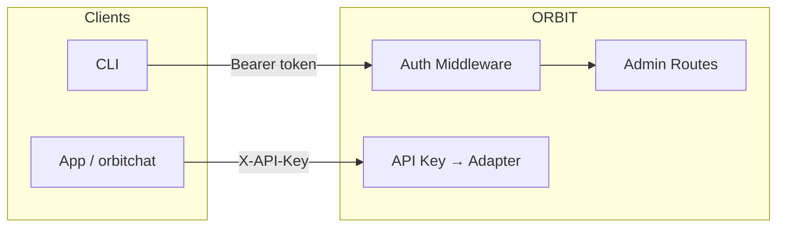

# ORBIT API Keys and Authentication

ORBIT uses API keys to route requests to adapters and optional user authentication (login, RBAC) for admin and CLI operations. API keys are created via the CLI or admin API and bound to an adapter name; user auth uses PBKDF2-SHA256 and bearer tokens stored in MongoDB. This guide covers creating and managing API keys, associating system prompts, and (optionally) enabling login and roles for operators.

## Architecture

API keys are the primary way clients access the chat and RAG APIs. Each key is linked to an adapter; the server resolves the adapter by key and runs the request through that adapter’s retriever and inference. User authentication is separate: it protects admin endpoints and the CLI (login, key create, user management) with username/password and a bearer token.



| Mechanism | Purpose | Where used |
|-----------|---------|------------|
| API key (`X-API-Key`) | Identify client and resolve adapter for chat/RAG | All chat and adapter requests |
| Bearer token | Authenticate admin/CLI user after login | Admin API, `./bin/orbit.sh` |
| System prompt | Optional prompt attached to a key | Applied when key is used for chat |

## Prerequisites

- ORBIT server running (see [how-to-deploy-with-ollama.md](how-to-deploy-with-ollama.md)).
- For API keys: at least one adapter enabled in `config/adapters.yaml` or `config/adapters/*.yaml`.
- For user auth: MongoDB configured and reachable; admin user created (or default admin password set, e.g. in Docker).

## Step-by-step implementation

### 1. Create an API key

Create a key bound to an adapter so chat requests using that key use that adapter:

```bash
./bin/orbit.sh key create --adapter passthrough --name "My Chat Key"
```

Use the returned key as the `X-API-Key` header in requests. List adapters: `./bin/orbit.sh key list-adapters`. List keys: `./bin/orbit.sh key list`.

### 2. Attach a system prompt (optional)

Associate a system prompt so all chat with that key gets the same instructions. Create the prompt first, then attach it to the key:

```bash
./bin/orbit.sh prompt create --name "Support Bot" --file prompts/support.txt --version "1.0"
./bin/orbit.sh key create --adapter passthrough --name "Support Key" --prompt-id <PROMPT_ID>
```

Or create key and prompt in one step:

```bash
./bin/orbit.sh key create --adapter qa-sql --name "QA Key" \
  --prompt-file prompts/qa.txt --prompt-name "QA Assistant"
```

### 3. Test and manage keys

Verify a key and check its status:

```bash
./bin/orbit.sh key test --key orbit_xxxx
./bin/orbit.sh key status --key orbit_xxxx
```

Deactivate or delete a key when it’s compromised or no longer needed:

```bash
./bin/orbit.sh key deactivate --key orbit_xxxx
./bin/orbit.sh key delete --key orbit_xxxx --force
```

### 4. Enable user authentication (admin/CLI)

If your deployment uses MongoDB and you want login for the CLI and admin API, ensure auth is enabled in config and create an admin user:

```bash
./bin/orbit.sh login --username admin --password your-secure-password
```

After login, the CLI stores a bearer token and uses it for key create, user list, etc. Admin endpoints require the same token (e.g. `Authorization: Bearer <token>`). Register additional users (admin-only): `./bin/orbit.sh register --username operator --password secret --role user`.

### 5. Use the key in requests

Send the API key on every chat request:

```bash
curl -X POST http://localhost:3000/v1/chat \
  -H "Content-Type: application/json" \
  -H "X-API-Key: orbit_your_key_here" \
  -H "X-Session-ID: optional-session-id" \
  -d '{"messages":[{"role":"user","content":"Hello"}],"stream":false}'
```

## Validation checklist

- [ ] At least one API key created with `key create --adapter <name>` and the adapter exists and is enabled.
- [ ] Chat request with `X-API-Key` returns a successful response (not 401 or "invalid key").
- [ ] If using system prompts: prompt created and attached to the key; chat behavior reflects the prompt.
- [ ] If using user auth: login succeeds and CLI commands (e.g. `key list`) work without re-login until token expiry.
- [ ] Compromised or unused keys deactivated or deleted.

## Troubleshooting

**401 Unauthorized or "Invalid API key"**  
Confirm the key is active: `./bin/orbit.sh key status --key <key>`. Ensure the header name is `X-API-Key` (or the value set in config). If the key was deleted or deactivated, create a new one.

**Adapter not found when using key**  
The key’s adapter name must match an enabled adapter in `config/adapters.yaml` or imported adapter files. Run `./bin/orbit.sh key list-adapters` and fix the key’s adapter or add the adapter and restart ORBIT.

**Login fails or CLI says not authenticated**  
Check MongoDB is running and auth config is enabled. Ensure the user exists and the password is correct. Use `./bin/orbit.sh auth-status` to see if the CLI has a stored token. Logout and login again: `./bin/orbit.sh logout` then `./bin/orbit.sh login`.

**Prompt not applied to responses**  
Verify the prompt is associated with the key: use the admin API or CLI to get the key details and confirm `prompt_id`. Ensure the adapter and chat pipeline use the key’s system prompt (see server docs for pipeline behavior).

## Security and compliance considerations

- Treat API keys as secrets: do not commit them to source control or log them. Rotate keys periodically and after suspected exposure.
- Use strong passwords for admin users; change the default admin password in Docker or install scripts.
- User auth uses PBKDF2-SHA256 (e.g. 600k iterations) and bearer tokens stored server-side; tokens expire and are invalidated on logout or password change.
- Restrict admin endpoints and CLI access to trusted networks or VPN; use TLS for the ORBIT API in production.
