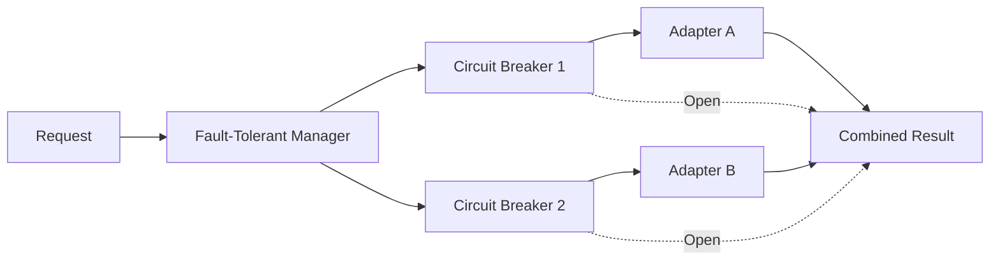

# ORBIT Fault Tolerance and Circuit Breakers

ORBIT can run adapters with fault tolerance: parallel execution, timeouts, and circuit breakers that stop calling failing adapters until they recover. This reduces cascading failures and improves resilience when one data source or LLM is slow or down. This guide covers enabling fault tolerance, configuring circuit breakers and timeouts, and interpreting adapter health.

## Architecture

When fault tolerance is enabled, a fault-tolerant adapter manager wraps the base adapter logic. It can run multiple adapters in parallel and protect each with a circuit breaker. If an adapter fails repeatedly, its circuit opens and requests skip that adapter (returning a defined result or error) until a recovery period has passed and a probe succeeds.



| Component | Role |
|-----------|------|
| Fault tolerance config | Master switch and execution strategy. |
| Circuit breaker | Per-adapter: failure threshold, recovery timeout, success threshold to close, and half-open probe limit. |
| Parallel executor | Runs adapters concurrently with timeouts and resource cleanup. |

## Prerequisites

- ORBIT server and access to `config/config.yaml` (or the main config that includes fault tolerance).
- Understanding of which adapters you run together (e.g. composite or multi-adapter flows) so you can tune thresholds.

## Step-by-step implementation

### 1. Enable fault tolerance

In `config/config.yaml`, under `fault_tolerance`, enable the feature and choose an execution strategy:

```yaml
fault_tolerance:
  enabled: true
  execution:
    strategy: "all"           # Only implemented strategy; see note below
    timeout: 35
    max_retries: 3
  circuit_breaker:
    failure_threshold: 5     # Failures before opening circuit
    recovery_timeout: 30      # Seconds before trying again (base; exponential backoff applied)
    success_threshold: 3     # Successes in HALF_OPEN before closing circuit
    max_recovery_timeout: 300.0
    enable_exponential_backoff: true
    max_half_open_calls: 1   # Max concurrent probes when HALF_OPEN (default: 1)
```

**Execution strategy:** `all` is the only currently implemented strategy — all available adapters run in parallel and results are combined. `first_success` (stop after first success, cancel the rest) and `best_effort` (return whatever finishes within a shorter window) are planned for a future release.

**Timeout allocation:** Each adapter call splits its `operation_timeout` into two budgets: 30% for adapter lookup/initialization and 70% for query execution. A query against a 30 s timeout adapter will time out at 21 s if the adapter lookup itself completes quickly. Document adapter-level `operation_timeout` with this split in mind.

### 2. Set adapter-level timeouts (optional)

Adapters can define their own fault tolerance and timeouts so one slow adapter doesn’t block others. In the adapter’s config (e.g. under `config/adapters/`):

```yaml
  fault_tolerance:
    operation_timeout: 15.0      # 30% for lookup (4.5 s), 70% for query (10.5 s)
    failure_threshold: 10
    recovery_timeout: 30.0
    success_threshold: 5
    max_recovery_timeout: 120.0
    enable_exponential_backoff: true
    max_half_open_calls: 1       # Probe limit; increase only for high-traffic adapters
    max_retries: 3
```

Adjust values to match how long you’re willing to wait for that adapter and how many failures should open the circuit.

### 3. Restart and observe

Restart ORBIT so the fault tolerance and circuit breaker config is loaded. Trigger failures (e.g. stop Ollama or a datasource) and watch logs: you should see circuits open and requests skipping the failing adapter. When the dependency is back, the circuit should close after `success_threshold` successes.

### 4. Check health and status

Use the dashboard or health/status endpoints to see adapter and circuit state. Open circuits are typically reflected in adapter health so you can alert or scale dependencies.

### 5. Tune for production

- Increase `failure_threshold` if transient errors are common so the circuit doesn’t open too quickly.
- Increase `recovery_timeout` for slow-recovering services.
- Set `operation_timeout` and `max_retries` so that one stuck adapter doesn’t hold the request too long. Remember the 30/70 split: 30% of `operation_timeout` is reserved for adapter initialization.
- Leave `max_half_open_calls` at 1 (the default) unless you have high traffic and need faster recovery; increasing it lets more concurrent probes hit a recovering dependency.

## Validation checklist

- [ ] `fault_tolerance.enabled` is `true` and config is valid; ORBIT starts without errors.
- [ ] When a dependency fails repeatedly, the circuit for that adapter opens and requests no longer call it (check logs or health).
- [ ] After the dependency recovers, the circuit closes after the configured number of successes.
- [ ] Request timeouts and combined results behave as expected (e.g. partial results when some adapters are open).
- [ ] Adapter-level `fault_tolerance` overrides (if used) are applied correctly.

## Troubleshooting

**Circuit opens too quickly**  
Increase `failure_threshold` and ensure transient network or timeout issues aren’t counted as hard failures. Check whether retries are enabled and sufficient for the dependency.

**Circuit never closes**  
Verify the dependency is actually healthy and that ORBIT can reach it. Ensure `success_threshold` is achievable; if every request still fails, the circuit will stay open. Check `recovery_timeout` and that probes or normal traffic are retried after that period.

**Requests hang despite timeouts**  
Confirm `operation_timeout` (and global `execution.timeout`) are set and that the executor enforces them. Look for code paths that don’t respect the timeout (e.g. blocking calls). See fault-tolerance troubleshooting docs for async/timeout details.

**Partial or empty results**  
Open circuits mean fewer adapters run; results may be partial. Check that the pipeline correctly merges or selects results when some adapters are skipped.

## Security and compliance considerations

- Fault tolerance and circuit breakers improve availability and prevent one bad dependency from taking down the API; they do not replace auth or input validation.
- Logging of circuit state and failures may contain adapter names and error details; ensure logs are protected and retention complies with policy.
- Timeouts and retries can mask slow or overloaded backends; monitor latency and error rates to detect capacity or dependency issues.
