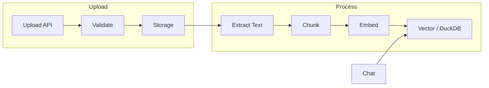

# ORBIT File Upload and RAG

ORBIT’s file adapter lets users upload documents (PDF, DOCX, TXT, images, audio, etc.), which are chunked and indexed into a vector store or DuckDB. Chat requests can then query that content via natural language. This guide covers enabling the file adapter, supported formats, storage, and how to query uploaded files through the API or orbitchat.

## Architecture

Uploaded files are validated, stored on disk (or an S3-compatible backend), and processed through extractors and chunkers. Unstructured content goes to a vector store for semantic search; structured data (CSV, Parquet) can go to DuckDB for SQL-style queries. Adapters like multimodal or file-specific adapters expose upload and chat endpoints that use this pipeline.



| Path | File types | Storage | Query |
|------|------------|---------|--------|
| Vector | PDF, DOCX, TXT, HTML, MD, images, audio | Vector store | Semantic search |
| DuckDB | CSV, Parquet | DuckDB | SQL / intent templates |

## Prerequisites

- ORBIT server with the file adapter and required processors (e.g. pypdf, python-docx); embeddings and a vector store configured for the vector path (see [orbit-vector-store-embeddings-setup.md](orbit-vector-store-embeddings-setup.md)).
- An API key bound to an adapter that supports file upload and retrieval (e.g. multimodal or file adapter).
- Sufficient disk space for uploads and optional Docling/OCR if used.

## Step-by-step implementation

### 1. Enable an adapter that supports files

Use a built-in adapter that includes file upload and retrieval (e.g. from `config/adapters/multimodal.yaml` or `config/adapters/file.yaml`). Ensure the adapter is enabled and has the correct inference and embedding providers:

```yaml
adapters:
  - name: simple-chat-with-files
    enabled: true
    type: conversational
    # ... inference_provider, embedding_provider, config with file support
```

Create an API key for that adapter: `./bin/orbit.sh key create --adapter simple-chat-with-files --name "File Chat"`.

### 2. Upload a file via API

Upload a file using the ORBIT files API (path may vary by deployment; typically under `/api/files/upload` or similar):

```bash
curl -X POST http://localhost:3000/api/files/upload \
  -H "X-API-Key: orbit_your_key" \
  -F "file=@/path/to/document.pdf"
```

Store the returned file ID for use in chat. The server will extract text, chunk, embed, and index according to the adapter and config.

### 3. Chat with file context

Send a chat message and include the file ID(s) so the adapter can retrieve from the indexed content:

```bash
curl -X POST http://localhost:3000/v1/chat \
  -H "Content-Type: application/json" \
  -H "X-API-Key: orbit_your_key" \
  -H "X-Session-ID: session-1" \
  -d '{
    "messages": [{"role": "user", "content": "Summarize the main points."}],
    "file_ids": ["file-uuid-here"],
    "stream": false
  }'
```

The adapter uses the vector store (or DuckDB) to fetch relevant chunks and includes them in the context for the LLM.

### 4. Use orbitchat with upload enabled

If using the orbitchat CLI, enable the upload button and connect to the same API:

```bash
orbitchat --api-url http://localhost:3000 --api-key orbit_your_key --enable-upload --open
```

Users can attach files in the UI; the app sends them to the upload endpoint and then includes `file_ids` in chat requests.

### 5. Configure limits and storage (optional)

Limit file size and count per conversation or globally via adapter config or server config (e.g. `max_file_size_mb`, `max_files_per_conversation`). Ensure the storage backend (filesystem or S3) has enough space and that cleanup or retention policies are set if required.

## Validation checklist

- [ ] File adapter (or multimodal adapter with file support) is enabled and has an API key.
- [ ] Upload request returns a file ID and no processing errors; check server logs if indexing fails.
- [ ] Chat request with `file_ids` returns answers that reference the uploaded content.
- [ ] For vector path: embeddings and vector store are configured; for DuckDB path: structured files are ingested correctly.
- [ ] File size and type are within supported limits; unsupported formats are rejected with a clear error.

## Troubleshooting

**Upload fails or returns 4xx**  
Check file size and type against the adapter’s limits. Ensure the API key is valid and bound to an adapter that supports upload. Verify storage path is writable and disk space is available.

**Processing timeout or extraction error**  
Large or complex documents may take longer; increase timeouts if needed. For PDF/DOCX, ensure pypdf and python-docx are installed. For OCR or advanced layout, Docling may be required; check that it’s configured and that no outbound calls block startup (see file-adapter-guide).

**Chat ignores file content**  
Confirm `file_ids` are sent in the request and match IDs returned by upload. Ensure the adapter’s retrieval and pipeline use file_ids to filter or retrieve chunks. Check that indexing completed (no errors in logs after upload).

**Unsupported format**  
See the file adapter guide for the full list: PDF, DOCX, PPTX, XLSX, TXT, CSV, JSON, HTML, MD, images (PNG, JPEG, TIFF), audio (WAV, MP3, etc.). Use the correct MIME type or extension so the server selects the right processor.

## Security and compliance considerations

- Validate file types and size server-side; do not trust client-provided type alone. Scan for malware if accepting untrusted uploads.
- Store files in a dedicated directory or bucket with restricted access; use environment variables or secrets for S3 credentials.
- File content is embedded and sent to the LLM; keep data on your infrastructure (e.g. local embeddings and inference) for sensitive documents.
- Associate uploads with API key or user so access control and retention can be applied per tenant.
