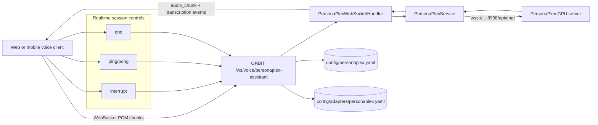

# Build a Full-Duplex Voice Assistant With ORBIT and PersonaPlex

If you want natural voice conversations, turn-based pipelines (STT -> LLM -> TTS) add latency and make interruptions awkward. ORBIT supports PersonaPlex as a speech-to-speech adapter so the system can listen and speak at the same time, with backchannels and interruption handling. This guide shows a production-oriented proxy deployment that keeps ORBIT on a CPU node while a GPU PersonaPlex server handles realtime audio generation.

## Architecture



## Prerequisites

| Requirement | Minimum | Why it matters |
|---|---|---|
| ORBIT server | Python 3.10+ (3.11+ recommended in docs) | Hosts `/ws/voice/{adapter}` and routes audio sessions |
| PersonaPlex server | NVIDIA GPU with 16 GB VRAM (A100/H100 recommended) | Runs full-duplex speech-to-speech model |
| Network path | ORBIT can reach `wss://<personaplex-host>:8998/api/chat` | Required for proxy mode |
| Opus dependency | `libopus` installed on host | Needed for efficient streaming/audio codec support |
| Config files | `config/personaplex.yaml` and `config/adapters/personaplex.yaml` | Enables service mode and adapter personas |

Install base dependencies on Linux/macOS before first start:

```bash
# Ubuntu/Debian
sudo apt install -y libopus-dev

# macOS
brew install opus
```

If you run PersonaPlex as a separate service, ensure its process is reachable and TLS is configured for production traffic.

## Step-by-step implementation

### 1. Enable PersonaPlex proxy mode in ORBIT

Edit `config/personaplex.yaml` so ORBIT connects to your GPU server in proxy mode:

```yaml
personaplex:
  enabled: true
  mode: "proxy"

  proxy:
    server_url: "wss://voice-gpu.example.com:8998/api/chat"
    ssl_verify: true
    connection_timeout: 30
    handshake_timeout: 120
    reconnect_attempts: 3
    reconnect_delay: 1.0
    supports_control_messages: false

  audio:
    sample_rate: 32000
    frame_rate: 12.5
    opus_enabled: true

  defaults:
    voice_prompt: "NATF2.pt"
    text_prompt: ""
```

Why these values are practical:
- `handshake_timeout: 120` protects sessions when long prompts are injected before handshake.
- `supports_control_messages: false` matches deployments where the remote PersonaPlex server ignores control packets.
- `sample_rate` and `frame_rate` should stay at PersonaPlex native defaults from ORBIT docs.

### 2. Choose or create a PersonaPlex adapter

ORBIT already includes adapters in `config/adapters/personaplex.yaml` such as `personaplex-assistant`, `personaplex-customer-service`, and `personaplex-interview-coach`.

Use or extend one adapter with a clear persona and conservative session limits:

```yaml
adapters:
  - name: "personaplex-support-prod"
    enabled: true
    type: "speech_to_speech"
    datasource: "none"
    adapter: "personaplex"
    implementation: "ai_services.implementations.speech_to_speech.PersonaPlexService"

    capabilities:
      retrieval_behavior: "none"
      supports_session_tracking: true
      supports_realtime_audio: true
      supports_full_duplex: true
      supports_interruption: true
      supports_backchannels: true
      requires_api_key_validation: true

    persona:
      voice_prompt: "NATM1.pt"
      text_prompt: |
        You are a customer support voice assistant.
        Speak clearly, confirm the caller's request, and avoid guessing.
        If information is missing, ask one clarifying question.

    config:
      websocket_enabled: true
      max_session_duration_seconds: 1800
      ping_interval_seconds: 30
      audio_chunk_size_ms: 80
      orbit_sample_rate: 24000
      personaplex_sample_rate: 32000
```

This keeps the adapter aligned with ORBIT's documented full-duplex capabilities while forcing API-key validation for production access control.

### 3. Restart ORBIT and verify voice service registration

```bash
./bin/orbit.sh restart

curl -s http://localhost:3000/voice/status | jq
```

You want to see:
- `available: true`
- your adapter listed as `enabled: true`
- `full_duplex: true`
- `websocket_endpoint: "/ws/voice/{adapter_name}"`

If `/voice/status` shows adapters but `available: false`, the usual issue is ORBIT failing to connect to the PersonaPlex proxy target.

### 4. Connect a client to the WebSocket endpoint

Open a session against your adapter:

```bash
wscat -c "ws://localhost:3000/ws/voice/personaplex-support-prod?session_id=voice-test-2026-02-11&api_key=YOUR_API_KEY"
```

On connect, ORBIT should emit a `connected` event with `mode: "full_duplex"` and sample rate metadata.

Send an audio message frame (base64 PCM) and a control event:

```json
{"type":"audio_chunk","data":"<base64_pcm_data>","format":"pcm"}
{"type":"interrupt"}
```

A healthy session returns streamed `audio_chunk` responses and, depending on config, optional `transcription` events.

### 5. Add operational safeguards before launch

Use this baseline before exposing voice endpoints to users:

| Control | Recommended setting | Outcome |
|---|---|---|
| API key enforcement | `requires_api_key_validation: true` | Blocks anonymous voice sessions |
| Session cap | `max_session_duration_seconds: 1800` | Prevents runaway calls |
| Keepalive | `ping_interval_seconds: 30` | Detects stale clients quickly |
| Timeout policy | `connection_timeout`, `handshake_timeout` configured | Reduces hanging websocket sessions |
| TLS to PersonaPlex | `wss://` + `ssl_verify: true` | Protects audio in transit |

At this point, test from one browser client and one mobile client to confirm packet timing and interruption behavior are consistent across network conditions.

## Validation checklist

- [ ] `config/personaplex.yaml` has `enabled: true` and `mode: "proxy"`.
- [ ] ORBIT can reach PersonaPlex at the configured `server_url` over `wss://`.
- [ ] `GET /voice/status` reports `available: true` and lists your adapter as enabled.
- [ ] `connected` event includes full-duplex capabilities (`full_duplex`, `interruption`, `backchannels`).
- [ ] Client can send `audio_chunk` frames and receive streamed `audio_chunk` responses.
- [ ] `interrupt` messages stop current playback and return an `interrupted` event.
- [ ] Session closes cleanly with `{"type":"end"}` and no orphaned websocket connections.
- [ ] Load test confirms stable behavior at expected concurrent session levels.

## Troubleshooting

### Handshake timeout during session start

Symptoms:
- Client connects, then receives timeout/error before `connected`.
- ORBIT logs mention handshake expiry.

Likely causes:
- PersonaPlex prompt processing is slow.
- `handshake_timeout` is too low for your prompt length.

Fix:
- Increase `proxy.handshake_timeout` in `config/personaplex.yaml` (for example, 120 seconds).
- Shorten verbose `text_prompt` payloads during first-token path.

### Failure mode: No audio returned, only connect event

Symptoms:
- `connected` event arrives, but no `audio_chunk` response after client sends audio.

Likely causes:
- Wrong input format/sample rate from client.
- Client frames are not base64 PCM.
- PersonaPlex upstream session is connected but not decoding frames.

Fix:
- Confirm client sends `{"type":"audio_chunk","format":"pcm"}`.
- Keep adapter timings aligned with documented values (`audio_chunk_size_ms: 80`, ORBIT 24kHz, PersonaPlex 32kHz).
- Capture one websocket trace and verify payload sizes are non-zero.

### Frequent disconnects in long calls

Symptoms:
- Sessions drop around network jitter spikes or after idle gaps.

Likely causes:
- Missing heartbeat behavior.
- Aggressive timeouts.

Fix:
- Keep `ping_interval_seconds: 30` enabled in adapter config.
- Validate client sends periodic ping messages and handles pong responses.
- Review proxy timeout/retry values and tune for your WAN latency.

## Security and compliance considerations

- Enforce adapter-level API keys for all public voice endpoints. ORBIT adapters support `requires_api_key_validation`; keep it enabled in production.
- Use TLS end-to-end (`wss://`) between client->ORBIT and ORBIT->PersonaPlex proxy to protect raw audio and generated speech.
- Keep voice sessions bounded with explicit max durations and idle policies to reduce abuse risk and resource exhaustion.
- Avoid logging raw audio payloads or full transcript content in plaintext logs; collect only operational metadata unless policy requires retention.
- For regulated environments, run PersonaPlex and ORBIT in your controlled network boundary so audio never traverses third-party SaaS endpoints.
- If you add custom persona prompts, review them as controlled configuration artifacts because they can alter behavior, disclosure style, and policy compliance.
