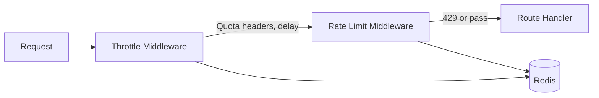

# ORBIT Rate Limiting and Quotas

ORBIT can enforce rate limits (per IP and per API key) and optional quotas (daily/monthly per key) with progressive throttling. Both use Redis for counters; limits are configured in `config/config.yaml` under `security.rate_limiting` and `security.throttling`. This guide covers enabling Redis, turning on rate limiting and throttling, and tuning limits for production.

## Architecture

Two middleware layers run in order: throttle (quotas and delay) then rate limit (hard caps). Throttling adds delay as usage approaches the quota; rate limiting returns 429 when per-minute or per-hour limits are exceeded. Both rely on Redis; if Redis is unavailable, the middleware passes requests through (fail-open).



| Layer | Purpose | Config section |
|-------|---------|----------------|
| Throttling | Per-key daily/monthly quotas; progressive delay | `security.throttling` |
| Rate limiting | Per-IP and per-key requests per minute/hour | `security.rate_limiting` |

## Prerequisites

- ORBIT server and write access to `config/config.yaml`.
- Redis installed and running; ORBIT config must have Redis enabled under `internal_services.redis` (host, port, and optionally password).

## Step-by-step implementation

### 1. Enable Redis

In `config/config.yaml`, ensure Redis is enabled and reachable:

```yaml
internal_services:
  redis:
    enabled: true
    host: "localhost"
    port: 6379
    # password: "${REDIS_PASSWORD}"  # optional
```

Set `password` via environment variable if your Redis instance requires auth. Restart ORBIT and confirm Redis is used (check logs for Redis connection).

### 2. Enable rate limiting

Under `security.rate_limiting`, turn on rate limiting and set IP and API-key limits:

```yaml
security:
  rate_limiting:
    enabled: true
    ip_limits:
      requests_per_minute: 60
      requests_per_hour: 1000
    api_key_limits:
      requests_per_minute: 120
      requests_per_hour: 5000
    exclude_paths:
      - "/health"
      - "/favicon.ico"
      - "/metrics"
      - "/static"
    retry_after_seconds: 60
```

When a client exceeds the limit, ORBIT returns 429 with `Retry-After`. Excluded paths are not counted.

### 3. Enable throttling (quotas)

Under `security.throttling`, enable throttling and set default quotas and delay behavior:

```yaml
security:
  throttling:
    enabled: true
    default_quotas:
      daily_limit: 10000
      monthly_limit: 100000
    delay:
      min_ms: 100
      max_ms: 5000
      curve: "exponential"
      threshold_percent: 70
    exclude_paths: []
    redis_key_prefix: "quota:"
    usage_sync_interval_seconds: 60
```

Clients receive quota headers (e.g. `X-Quota-Daily-Remaining`, `X-Throttle-Delay`). Delay increases as usage approaches the threshold and quota limits.

### 4. Restart and verify

Restart ORBIT so the new security config is loaded. Send requests with and without an API key; check response headers for rate-limit and quota headers. Trigger a 429 by exceeding the per-minute limit (e.g. many requests in one minute).

### 5. Tune for production

Adjust limits to match your traffic and capacity:

- Lower `requests_per_minute` / `requests_per_hour` for stricter protection.
- Set `daily_limit` or `monthly_limit` to `null` for unlimited quota while keeping rate limits.
- Increase `retry_after_seconds` to back off clients longer on 429.
- Use `exclude_paths` so health checks and metrics do not consume limit budget.

## Validation checklist

- [ ] Redis is running and `internal_services.redis.enabled` is `true`; ORBIT starts without Redis connection errors.
- [ ] `security.rate_limiting.enabled` is `true`; requests return `X-RateLimit-*` headers and 429 when limits are exceeded.
- [ ] `security.throttling.enabled` is `true`; requests return quota headers and delay when near or over quota.
- [ ] Excluded paths (e.g. `/health`) do not return 429 under load.
- [ ] After changing config, ORBIT was restarted and behavior matches the new limits.

## Troubleshooting

**Rate limiting or throttling not applied**  
Confirm both `rate_limiting.enabled` and `throttling.enabled` are `true` and Redis is enabled and reachable. If Redis is down, middleware fails open and does not enforce limits; check logs for Redis errors.

**429 too often or too early**  
Increase `requests_per_minute` / `requests_per_hour` or `daily_limit` / `monthly_limit`. Ensure health checks and monitoring are in `exclude_paths` so they don’t consume quota.

**Clients not seeing quota headers**  
Response headers are set by the throttling middleware; verify the request path is not in `exclude_paths` and that the client is sending `X-API-Key` when using per-key quotas. Check for a reverse proxy stripping headers.

**Redis connection refused**  
Verify Redis host and port; if ORBIT runs in Docker, use the correct host (e.g. service name or host.docker.internal). Set `password` if required. Restart Redis and ORBIT.

## Security and compliance considerations

- Rate limiting helps mitigate abuse and DDoS; tune limits to your capacity and abuse profile.
- Quotas allow fair use and cost control when inference is expensive; use per-key quotas for multi-tenant deployments.
- Keep Redis accessible only to ORBIT and admin tools; use a strong password and TLS if Redis is on the network.
- Fixed-window counting can allow up to 2× the limit at window boundaries; for strict guarantees consider a different strategy (documented in rate-limiting docs).
