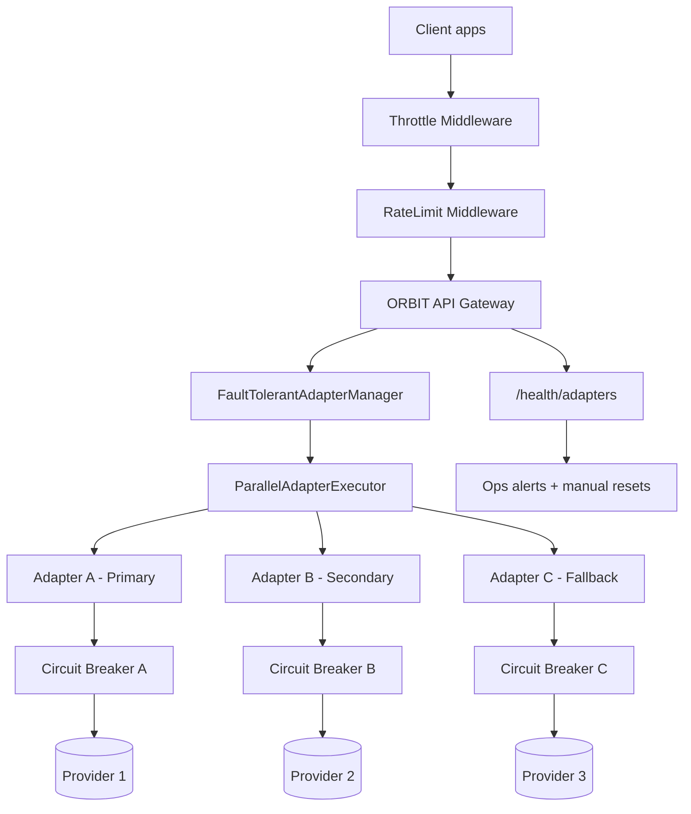

# Build a Resilient AI Gateway in ORBIT With Failover, Circuit Breakers, and Rate Limits

Most AI outages are not full outages, they are partial failures: one provider slows down, one adapter times out, and traffic spikes trigger cascading latency. ORBIT already ships with the controls you need to absorb this in production: adapter-level fault tolerance, execution strategies, Redis-backed throttling, and dual-key rate limiting. This guide shows how to combine these features into a single resilient gateway profile that degrades gracefully instead of failing hard.

## Architecture



## Prerequisites

| Requirement | Recommended baseline | Why |
|---|---|---|
| ORBIT server | Current repo configuration with `config/config.yaml` | Enables fault tolerance and security middleware knobs |
| Redis | Enabled under `internal_services.redis` | Required for throttling and rate-limit counters |
| At least 2 adapters/providers | Primary + fallback paths | Prevents single-provider outage from taking down chat |
| API key discipline | `X-API-Key` for clients | Unlocks API-key-aware traffic controls |
| Monitoring endpoint access | `/health/adapters` available to ops | Needed for circuit-breaker observability and recovery |

Quick sanity checks before configuration:

```bash
# Confirm ORBIT config is present
ls config/config.yaml config/inference.yaml

# Check Redis reachability (example local)
redis-cli -h 127.0.0.1 -p 6379 ping
```

If Redis is unavailable, ORBIT's rate limiting and throttling middleware fail open by design, which is convenient for development but risky for production traffic governance.

## Step-by-step implementation

### 1. Enable and tune fault tolerance in `config/config.yaml`

Start with explicit fault-tolerance settings so adapter failures are isolated and recover automatically:

```yaml
fault_tolerance:
  enabled: true
  circuit_breaker:
    failure_threshold: 5
    recovery_timeout: 30
    success_threshold: 3
    timeout: 30
    max_recovery_timeout: 300.0
    enable_exponential_backoff: true
  execution:
    strategy: "first_success"
    timeout: 35
    max_retries: 3
    retry_delay: 1
```

How to pick strategy:
- `first_success`: fastest user experience under degraded conditions; returns as soon as one adapter succeeds.
- `all`: best for exhaustive multi-source aggregation but can amplify tail latency.
- `best_effort`: middle ground when partial results are acceptable.

For high-traffic customer chat, `first_success` is usually the safest default.

### 2. Configure adapters for primary and fallback inference paths

Use at least two adapters that can answer similar requests. For example, define a primary conversational adapter and a fallback conversational adapter using another inference provider/model.

```yaml
adapters:
  - name: "chat-primary"
    enabled: true
    type: "passthrough"
    datasource: "none"
    adapter: "conversational"
    implementation: "implementations.passthrough.conversational.ConversationalImplementation"
    inference_provider: "ollama_cloud"
    model: "glm-4.7"
    capabilities:
      retrieval_behavior: "none"
      requires_api_key_validation: true

  - name: "chat-fallback"
    enabled: true
    type: "passthrough"
    datasource: "none"
    adapter: "conversational"
    implementation: "implementations.passthrough.conversational.ConversationalImplementation"
    inference_provider: "llama_cpp"
    model: "granite-4.0-1b-Q4_K_M.gguf"
    capabilities:
      retrieval_behavior: "none"
      requires_api_key_validation: true
```

The exact provider pair is flexible. The important design is that they are operationally independent enough that one provider outage does not affect the other.

### 3. Enable dual-layer traffic control (throttling + hard limits)

ORBIT executes throttling before hard rate limiting. Throttling adds delay as usage approaches quota; rate limiting returns `429` when limits are exceeded.

```yaml
security:
  rate_limiting:
    enabled: true
    trust_proxy_headers: false
    ip_limits:
      requests_per_minute: 60
      requests_per_hour: 1000
    api_key_limits:
      requests_per_minute: 120
      requests_per_hour: 5000
    exclude_paths:
      - "/health"
      - "/metrics"
    retry_after_seconds: 60

  throttling:
    enabled: true
    default_quotas:
      daily_limit: 10000
      monthly_limit: 100000
    delay:
      min_ms: 100
      max_ms: 5000
      curve: "exponential"
      threshold_percent: 70
    priority_multipliers:
      1: 0.5
      5: 1.0
      10: 2.0
    redis_key_prefix: "quota:"
```

Why this matters in incident scenarios:
- Throttling softens bursts and buys recovery time before hard failures.
- Dual-key checks (IP + API key) reduce abuse vectors such as key rotation from one IP.
- Keeping `trust_proxy_headers: false` is safer unless you are behind a trusted proxy chain configured with explicit trusted CIDRs.

### 4. Restart and validate health + circuit behavior

```bash
./bin/orbit.sh restart

# Health and circuit visibility
curl -s http://localhost:3000/health/adapters | jq
```

Then run a basic request stream with a fixed API key and session header:

```bash
for i in {1..20}; do
  curl -s -X POST http://localhost:3000/v1/chat \
    -H 'Content-Type: application/json' \
    -H 'X-API-Key: orbit_demo_key' \
    -H 'X-Session-ID: resiliency-test-2026-02-11' \
    -d '{"messages":[{"role":"user","content":"Summarize today\u0027s queued orders"}],"stream":false}' >/dev/null
done
```

During tests, watch for:
- `X-RateLimit-*` headers (hard limit state)
- `X-Throttle-Delay` and quota headers (soft throttling state)
- open/half-open/closed transitions in adapter health or logs

### 5. Define failure playbooks for operators

Prepare an explicit operator matrix before launch:

| Failure signal | Likely root cause | Immediate action |
|---|---|---|
| Circuit for one adapter opens repeatedly | Provider outage or timeout too strict | Route traffic to fallback adapter, then tune timeout/retries |
| Elevated latency without 429s | Throttling active near quota threshold | Scale workers, review quota tiers, or lower burst clients |
| Frequent 429 on API key but not IP | Key-specific heavy consumer | Apply per-key quota changes and tiering |
| Frequent 429 on IP across many keys | Shared NAT or abuse | Raise trusted-client limits selectively or block source |
| All adapters timing out | Upstream network issue or inference layer outage | Trigger incident mode, return degraded responses, page on-call |

Document these actions with concrete ownership: who resets circuits, who adjusts quotas, and who communicates customer impact.

## Validation checklist

- [ ] `fault_tolerance.enabled` is set to `true` and loaded at startup.
- [ ] Execution strategy is intentionally selected (`first_success`, `all`, or `best_effort`) and documented.
- [ ] At least one fallback adapter exists and is routable in production traffic.
- [ ] Redis is healthy; throttling and rate-limit counters are updating.
- [ ] `security.rate_limiting.enabled` and `security.throttling.enabled` are both active.
- [ ] Responses include rate/usage headers (`X-RateLimit-*`, quota headers, throttle delay headers).
- [ ] `/health/adapters` is monitored by alerting or dashboard checks.
- [ ] Runbook includes circuit reset and quota override procedures.

## Troubleshooting

### Circuits open too aggressively

Symptoms:
- Adapter flips to open state under moderate load.
- Fallback is used too often, despite provider being mostly healthy.

Potential cause:
- `failure_threshold` is too low for your latency variance.
- `timeout` is shorter than realistic provider response time.

Fix:
- Increase `circuit_breaker.timeout` and/or `failure_threshold` gradually.
- Keep exponential backoff enabled to prevent immediate reopen loops.

### Failure mode: traffic storms bypass expected client identity

Symptoms:
- Many requests appear from one IP or as `unknown`, causing unfair limits.
- Legitimate users receive frequent 429 responses.

Potential cause:
- Incorrect proxy/header handling.
- `trust_proxy_headers` misconfigured for your ingress architecture.

Fix:
- If behind a trusted reverse proxy, enable `trust_proxy_headers` and define trusted proxy CIDRs.
- If not behind trusted ingress, keep it disabled to avoid spoofed `X-Forwarded-For` abuse.
- Validate inbound headers at the load balancer layer.

### Throttling delays feel random to clients

Symptoms:
- Users report uneven response times before any hard quota errors.

Potential cause:
- Exponential delay curve activates once `threshold_percent` is crossed.
- Priority multipliers differ across API keys/tenants.

Fix:
- Review `threshold_percent` and delay bounds for your product SLA.
- Harmonize priority policies so equivalent plans experience similar latency.
- Expose quota usage in client dashboards to reduce confusion.

## Security and compliance considerations

- Use API-key validation on public-facing adapters so abuse controls and attribution remain tied to authenticated tenants.
- Keep `trust_proxy_headers: false` unless your network path is controlled and trusted proxy CIDRs are explicitly configured.
- Protect Redis and internal health endpoints with network controls; they are part of your enforcement plane.
- Preserve auditability for incident review by retaining relevant request metadata and circuit-breaker events.
- Apply least privilege to ops actions: circuit reset and quota changes should require authenticated admin workflows.
- For regulated workloads, combine rate governance with strict transport security and sensitive-error suppression in production.
