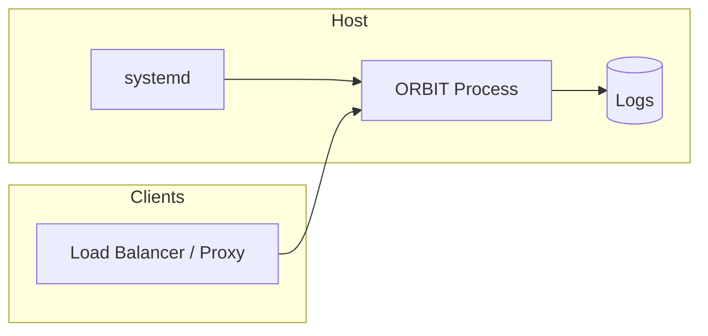

# ORBIT Server Production Deployment

Running ORBIT in production means making the server resilient, manageable, and optionally secured with TLS. This guide covers running ORBIT under systemd for auto-start and restarts, enabling HTTPS with your own certificates, and where to find logging and configuration options so you can harden and monitor the deployment.

## Architecture

In production, ORBIT typically runs as a long-lived process managed by systemd (or another supervisor). Optional TLS termination can happen at ORBIT (using `general.https` in config) or at a reverse proxy (e.g. Nginx, AWS ALB). Logs go to the filesystem (and optionally to Elasticsearch); the dashboard and health endpoints support monitoring.



| Component | Role |
|-----------|------|
| systemd | Starts ORBIT on boot, restarts on failure, captures stdout/stderr. |
| ORBIT | Serves API on `general.port` (e.g. 3000); optional HTTPS on `general.https.port`. |
| config | YAML + imports; TLS paths, logging, and inference set in config or env. |

## Prerequisites

- ORBIT installed (e.g. from release tarball or from source) with `./bin/orbit.sh` and config under `config/`.
- A dedicated user and directory for the install (e.g. `/opt/orbit` or `/home/orbit/orbit`).
- For HTTPS: certificate and private key (e.g. from Let’s Encrypt or your CA); ORBIT does not obtain certificates for you.

## Step-by-step implementation

### 1. Run ORBIT under systemd

Create a systemd unit so ORBIT starts on boot and restarts on failure.

Create the service file:

```bash
sudo tee /etc/systemd/system/orbit-server.service > /dev/null << 'EOF'
[Unit]
Description=ORBIT AI Server
After=network.target

[Service]
Type=forking
User=YOUR_USERNAME
WorkingDirectory=/path/to/orbit
ExecStart=/path/to/orbit/bin/orbit.sh start --config config.yaml
ExecStop=/path/to/orbit/bin/orbit.sh stop
ExecReload=/path/to/orbit/bin/orbit.sh restart
Restart=always
RestartSec=3
StandardOutput=append:/var/log/orbit.log
StandardError=append:/var/log/orbit.error.log

[Install]
WantedBy=multi-user.target
EOF
```

Replace `YOUR_USERNAME` with the user that will run ORBIT and `/path/to/orbit` with the full path to the ORBIT install (e.g. `/opt/orbit`). Ensure that user owns the install directory and can write to `logs/` and any data directories.

Reload systemd, enable the service, and start it:

```bash
sudo systemctl daemon-reload
sudo systemctl enable orbit-server
sudo systemctl start orbit-server
sudo systemctl status orbit-server
```

Tail logs: `sudo journalctl -u orbit-server -f` or inspect `StandardOutput`/`StandardError` paths (e.g. `/var/log/orbit.log`).

### 2. Enable HTTPS in ORBIT

To terminate TLS inside ORBIT, set `general.https` in your config (e.g. `config/config.yaml` or the file passed to `--config`):

```yaml
general:
  port: 3000
  https:
    enabled: true
    port: 3443
    cert_file: "/etc/letsencrypt/live/your-domain.example.com/fullchain.pem"
    key_file: "/etc/letsencrypt/live/your-domain.example.com/privkey.pem"
```

Replace paths with your certificate and key. Restart ORBIT (e.g. `sudo systemctl restart orbit-server`). Clients should connect to `https://your-host:3443`. Ensure the firewall allows the HTTPS port.

### 3. Obtain and renew Let’s Encrypt certificates (optional)

If you use Let’s Encrypt, install certbot and obtain a certificate (HTTP or DNS challenge). Example for a single domain:

```bash
sudo apt-get update && sudo apt-get install -y certbot
sudo certbot certonly --standalone -d your-domain.example.com
```

Certificates live under `/etc/letsencrypt/live/your-domain.example.com/`. Point `cert_file` and `key_file` at `fullchain.pem` and `privkey.pem`. Let’s Encrypt certs expire in 90 days; renew with:

```bash
sudo certbot renew
```

Consider a cron job or systemd timer for renewal; reload ORBIT after renewing if you use the same paths.

### 4. Logging and observability

ORBIT writes logs under the install’s `logs/` directory (and optionally to Elasticsearch if configured). Log locations and rotation are configurable. Use the dashboard for a quick view:

- Dashboard: `http://your-host:3000/dashboard` (or HTTPS on the configured port).
- Health: `GET /health` and adapter health as documented in the API reference.

For production, ensure log directories have enough disk space and consider log aggregation (e.g. shipping `logs/` to a central store or using Elasticsearch integration).

### 5. Background run without systemd

If you prefer not to use systemd, you can run ORBIT in the background and redirect output:

```bash
cd /path/to/orbit
nohup ./bin/orbit.sh start --config config.yaml >> orbit.log 2>&1 &
./bin/orbit.sh status
```

Use a process supervisor (systemd, supervisord, or a container) in production for restarts and resource limits.

## Validation checklist

- [ ] `sudo systemctl status orbit-server` shows `active (running)` (or equivalent when using systemd).
- [ ] `curl http://localhost:3000/health` (or HTTPS on the configured port) returns a healthy status.
- [ ] After enabling HTTPS, `curl -k https://localhost:3443/health` (or your domain) succeeds and clients can connect over TLS.
- [ ] Log files are written under the install’s `logs/` (or configured paths) and are readable by the run user.
- [ ] After a reboot, ORBIT comes up automatically (systemd `WantedBy=multi-user.target` and `enable`).

## Troubleshooting

**Service fails to start (ExecStart)**  
Check paths in the unit: `WorkingDirectory` and `ExecStart` must point to the real install; `User` must exist and have access. Run `./bin/orbit.sh start --config config.yaml` manually as that user to see errors. Inspect `journalctl -u orbit-server -n 50`.

**ORBIT exits soon after start**  
Often a config or dependency issue: missing env vars, bad YAML, or a required service (e.g. Ollama, DB) unreachable. Check `logs/orbit.log` and stderr. Fix config or start dependencies first (e.g. add `After=network.target` and optional `After=ollama.service` if you use a separate Ollama unit).

**HTTPS not listening**  
Confirm `general.https.enabled` is `true`, `cert_file` and `key_file` exist and are readable by the ORBIT user, and no other process is bound to `general.https.port`. Restart ORBIT after changing config.

**Certificate renewal and ORBIT**  
If you point ORBIT at the same cert paths, renewal only replaces files in place; no config change is needed. Restart ORBIT after renewal so it reloads the new cert (or use a reload mechanism if you add one).

## Security and compliance considerations

- Run ORBIT as a non-root user; set file ownership and permissions on config and data directories appropriately.
- Prefer TLS for all client traffic; use strong ciphers and keep certificates and private keys protected (e.g. restricted permissions on `key_file`).
- Do not commit secrets (API keys, DB passwords, TLS keys) to config in version control; use environment variable substitution (e.g. `${VAR_NAME}`) and a secrets manager or env files.
- Restrict network access: firewall the ORBIT and HTTPS ports to trusted IPs or load balancers; restrict access to the dashboard and admin endpoints.
- Review rate limiting, audit logging, and RBAC options in the main docs for multi-tenant or regulated environments.
