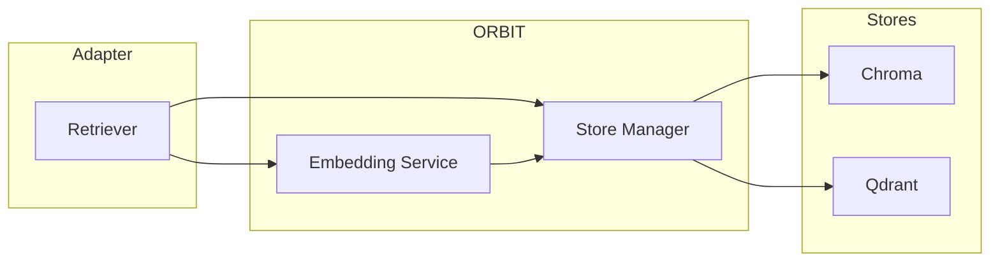

# ORBIT Vector Store and Embeddings Setup

ORBIT uses embeddings to index and search text in vector stores (Chroma, Qdrant, Pinecone, Milvus, Weaviate). You configure an embedding provider (e.g. Ollama with `nomic-embed-text`) and one or more vector stores; adapters then use them for QA and intent retrieval. This guide walks through enabling embeddings, connecting a vector store, and verifying RAG over vectors.

## Architecture

Embeddings are produced by a configured provider (Ollama, OpenAI, Cohere, etc.); the results are written to and queried from a vector store. The store manager and datasources config define connections; adapters reference the store and (optionally) override the embedding provider per adapter.



| Component | Config file | Role |
|-----------|------------|------|
| Embedding provider | `config/embeddings.yaml` | Global default and per-provider (Ollama, OpenAI, etc.). |
| Vector stores | `config/stores.yaml`, `config/datasources.yaml` | Store connections and collection names. |
| Adapters | `config/adapters/*.yaml` | Reference datasource (e.g. qdrant) and optionally `embedding_provider`. |

## Prerequisites

- ORBIT server installed and running.
- For local embeddings: Ollama running and an embedding model pulled (e.g. `ollama pull nomic-embed-text`).
- For a vector store: Chroma, Qdrant, or another supported store installed and reachable; collection created if required.

## Step-by-step implementation

### 1. Set the default embedding provider

In `config/embeddings.yaml`, set the global provider and the provider’s options:

```yaml
embedding:
  provider: "ollama"
  enabled: true

embeddings:
  ollama:
    base_url: "http://localhost:11434"
    model: "nomic-embed-text"
    dimensions: 768
    retry:
      enabled: true
      max_retries: 5
      initial_wait_ms: 2000
      max_wait_ms: 30000
    timeout:
      connect: 10000
      total: 60000
      warmup: 45000
```

Use `base_url` and `model` that match your Ollama instance. For cloud embeddings (OpenAI, Jina, Cohere), set `provider` and the corresponding block with `api_key` (e.g. `${OPENAI_API_KEY}`).

### 2. Configure a vector store (e.g. Chroma or Qdrant)

In `config/datasources.yaml` (or the file that defines datasources), add the store and optional embedding override:

```yaml
# Example: Qdrant
qdrant:
  url: "http://localhost:6333"
  collection_name: "orbit"
  embedding_provider: "ollama"
  embedding_model: "nomic-embed-text"
```

For Chroma, ensure the Chroma store is enabled in `config/stores.yaml` and the adapter’s datasource points to it. Create the collection (e.g. via Qdrant API or Chroma client) and ensure dimensions match the embedding model (768 for `nomic-embed-text`).

### 3. Enable an adapter that uses the vector store

In `config/adapters/qa.yaml` or similar, enable a QA vector adapter:

```yaml
adapters:
  - name: qa-vector-qdrant
    enabled: true
    type: retriever
    datasource: qdrant
    adapter: qa
    implementation: retrievers.implementations.qa.QAQdrantRetriever
    config:
      collection: "orbit"
      confidence_threshold: 0.3
      max_results: 5
    embedding_provider: ollama
    embedding_model: nomic-embed-text
```

Restart ORBIT so it loads the adapter and connects to the store.

### 4. Index documents or use existing data

If the collection is empty, you need to index documents (e.g. via file upload adapter, a script that calls the embedding API and the store’s index API, or an ORBIT ingestion path). For file-based RAG, use the file adapter and upload documents so they are chunked and embedded into the configured store.

### 5. Create an API key and test

Create a key for the vector adapter and send a question that should be answered from the indexed content:

```bash
./bin/orbit.sh key create --adapter qa-vector-qdrant --name "Vector QA Key"
curl -X POST http://localhost:3000/v1/chat \
  -H "Content-Type: application/json" \
  -H "X-API-Key: orbit_xxxx" \
  -H "X-Session-ID: test" \
  -d '{"messages":[{"role":"user","content":"Your question here"}],"stream":false}'
```

## Validation checklist

- [ ] `config/embeddings.yaml` has `embedding.provider` and the chosen provider’s block (e.g. `ollama`) with correct `base_url` and `model`.
- [ ] Embedding model is available (e.g. `ollama list` shows `nomic-embed-text`).
- [ ] Vector store is reachable (e.g. `curl http://localhost:6333` for Qdrant) and the collection exists with the right dimensions.
- [ ] At least one adapter uses the store and (if needed) `embedding_provider`/`embedding_model`; adapter is enabled.
- [ ] A chat request with the adapter’s key returns answers that reflect indexed content (or a clear “no results” if the collection is empty).

## Troubleshooting

**Embedding timeout or connection refused**  
Check Ollama is running and `base_url` is correct. For cold starts, increase `timeout.warmup` in the embedding provider config. Confirm the model is pulled: `ollama list`.

**Vector store connection error**  
Verify the store URL and port in datasources config. For Qdrant, ensure the service is listening; for Chroma, check path or host/port. Ensure ORBIT can reach the store (firewall, Docker networking).

**Dimension mismatch**  
The store collection must use the same dimensions as the embedding model (e.g. 768 for `nomic-embed-text`). Recreate the collection with the correct dimension or switch to a model that matches the existing collection.

**Empty or irrelevant RAG results**  
Confirm documents are indexed in the collection and the query is semantically related. Lower `confidence_threshold` or increase `max_results` in the adapter config. Check that the adapter uses the intended embedding provider and collection name.

## Security and compliance considerations

- Keep embedding API keys (OpenAI, Cohere, etc.) in environment variables or a secrets manager; do not commit them in config.
- Restrict network access to the vector store and to Ollama when used for embeddings; data stays on your infrastructure when using local Ollama only.
- Ensure the store supports authentication and TLS if it’s exposed or holds sensitive data.
