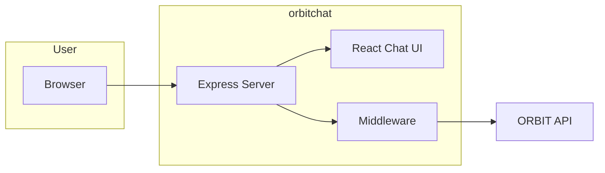

# Run the ORBIT Chat CLI (orbitchat)

The orbitchat CLI is a standalone browser-based chat app that talks to the ORBIT API. You install it via npm and run it with `orbitchat`, optionally passing API URL, API key, and port. This guide covers installation, basic usage, and protecting API keys with the built-in middleware and adapter selector.

## Architecture

orbitchat runs a small Node server that serves the React chat UI and can either call the ORBIT API directly (with the API key in the browser) or proxy requests through middleware that injects the key so the browser never sees it. Configuration is layered: CLI args override config file and env vars.



| Mode | API key location | Use case |
|------|------------------|----------|
| Direct | Browser (config or UI) | Local dev, trusted users |
| Middleware | Server-only (`adapters.yaml`) | Production; keys never sent to client |

## Prerequisites

- Node.js 18+ and npm.
- ORBIT server running and reachable (e.g. `http://localhost:3000`).
- An API key that has access to at least one adapter (or use `default-key` if your deployment provides it).

## Step-by-step implementation

### 1. Install orbitchat

Install globally so the `orbitchat` command is available:

```bash
npm install -g orbitchat
```

Or install locally in a project and run via `npx orbitchat`.

### 2. Run with default settings

Start the app; it listens on port 5173 and uses `http://localhost:3000` as the API URL by default:

```bash
orbitchat
```

Open `http://localhost:5173` in a browser. If your ORBIT server uses the default key, you can chat immediately; otherwise set the API key via the UI or config.

### 3. Point at your ORBIT server and API key

Use CLI options to set the API URL and key and optionally open the browser:

```bash
orbitchat --api-url http://localhost:3000 --api-key your-api-key --open
```

Replace `your-api-key` with the key returned by `./bin/orbit.sh key create` (or your deployment’s key). Use `--port 8080` to change the port.

### 4. Persist settings with a config file

Create `~/.orbit-chat-app/config.json` so you don’t pass the key on the command line:

```json
{
  "apiUrl": "http://localhost:3000",
  "defaultKey": "your-api-key",
  "port": 5173,
  "host": "localhost",
  "enableUploadButton": false,
  "maxFilesPerConversation": 5,
  "maxFileSizeMB": 50
}
```

Then run:

```bash
orbitchat --open
```

CLI arguments still override config file values.

### 5. Protect keys with middleware and adapters

To avoid sending API keys to the browser, use the built-in middleware and an adapters file.

Create `~/.orbit-chat-app/adapters.yaml` (or next to `bin/orbitchat.js`, or in the current working directory):

```yaml
adapters:
  local:
    apiKey: orbit_your_real_key_here
    apiUrl: http://localhost:3000
    description: Local ORBIT
    notes: Chat with local ORBIT and Ollama.
  production:
    apiKey: orbit_prod_key
    apiUrl: https://api.example.com
    description: Production agent
    notes: Production ORBIT instance.
```

Start with middleware enabled so the server proxies requests and injects the key:

```bash
orbitchat --enable-api-middleware --open
```

The UI shows an adapter selector (no raw API key field); users pick an adapter and the server uses the corresponding `apiKey` for requests. Keep `adapters.yaml` out of source control and run orbitchat behind HTTPS in production.

## Validation checklist

- [ ] `orbitchat` runs without errors and the UI loads at `http://localhost:5173` (or your `--port`).
- [ ] With a valid `--api-key` (or `defaultKey` in config), sending a message returns a streaming response from ORBIT.
- [ ] If using middleware: `adapters.yaml` exists, `--enable-api-middleware` is set, and the adapter selector appears; selecting an adapter allows chat without entering a key in the browser.
- [ ] For remote ORBIT: `--api-url` (or config) points to the correct base URL and the host is reachable (no CORS issues when using middleware proxy).

## Troubleshooting

**"Command not found" after install**  
Ensure npm global bin directory is on your PATH (e.g. `npm config get prefix` and add `bin` to PATH), or use `npx orbitchat`.

**Chat never loads or "Failed to fetch"**  
Confirm the ORBIT server is running and the URL is correct (`--api-url` or config). If the browser calls ORBIT directly, check CORS; using middleware avoids CORS by proxying through the same origin.

**Invalid API key or 401**  
Verify the key with `./bin/orbit.sh key list` (or your admin API). Ensure the key is associated with an adapter that accepts chat. In middleware mode, check that the adapter’s `apiKey` in `adapters.yaml` is correct and that you selected that adapter in the UI.

**Port already in use**  
Pick another port: `orbitchat --port 8080`. If 5173 is in use by another app, change it or stop the other process.

**Middleware not proxying**  
Start with `--enable-api-middleware` (or set `VITE_ENABLE_API_MIDDLEWARE=true` before starting). Ensure the adapters file is in a location orbitchat looks for (e.g. `~/.orbit-chat-app/adapters.yaml` or next to the executable). Restart the CLI after changing `adapters.yaml`.

## Security and compliance considerations

- In direct mode the API key is in the browser or config file; use only for development or trusted environments.
- In production use middleware mode: keep `adapters.yaml` on the server only, do not commit it, and run orbitchat behind HTTPS (or a reverse proxy with TLS).
- Restrict network access to the orbitchat server so only intended users can reach it; a compromised host could expose the adapters file or proxy traffic.
