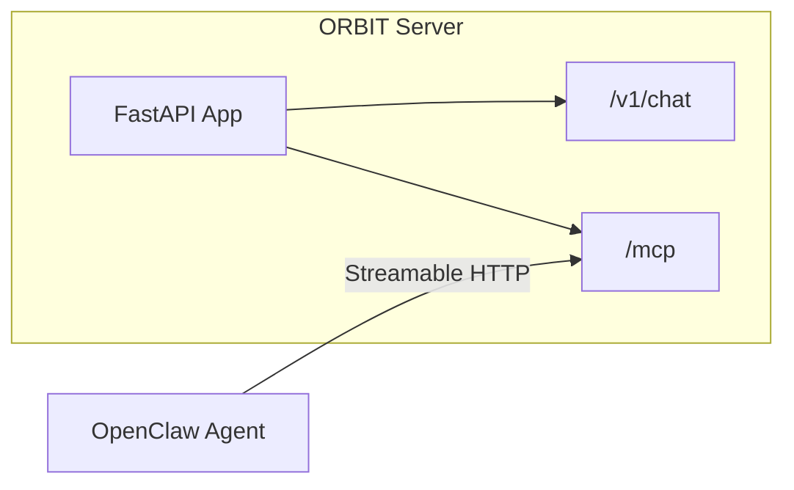

# Use ORBIT with OpenClaw as an MCP Agent

OpenClaw is a popular self-hosted AI assistant that supports the Model Context Protocol (MCP). ORBIT exposes an MCP-compatible endpoint so OpenClaw agents can use ORBIT as an MCP server: they get access to ORBIT’s chat, RAG, and adapter-backed tools through one protocol. This recipe shows how to connect OpenClaw to ORBIT’s MCP endpoint.

## How ORBIT Exposes MCP

ORBIT’s server uses [fastmcp](https://github.com/jlowin/fastmcp) to expose the MCP protocol over HTTP. The MCP server is initialized at startup and mounted at `/mcp` on the same FastAPI app that serves the chat and health endpoints.



Relevant code in the server:

- **Initialization** (`server/inference_server.py`): After middleware and routes are configured, the app creates a `FastMCP` instance from the FastAPI app and mounts it at `/mcp`:

```python
self.mcp_server = FastMCP.from_fastapi(self.app, name="ORBIT")
self.app.mount("/mcp", self.mcp_server.http_app())
```

- **Transport**: `http_app()` implements the MCP Streamable HTTP specification. Clients that support Streamable HTTP can connect to `http(s)://ORBIT_HOST:PORT/mcp`.
- **Authentication**: The same API key used for `/v1/chat` applies to MCP: ORBIT’s chat endpoint (exposed as an MCP tool) validates the `X-API-Key` header. When configuring OpenClaw (or any MCP client) to talk to ORBIT, you must pass this key if your ORBIT instance has API keys enabled.

References: [Server setup](../server.md) (MCP Protocol Chat), [ORBIT flow diagrams](../orbit-flow-diagrams.md).

## Prerequisites

- ORBIT server running and reachable (e.g. `http://localhost:3000` or your deployed base URL).
- An ORBIT API key that has access to at least one adapter (create one with `./bin/orbit.sh key create --adapter <adapter_name>` or use your deployment’s default key). See [ORBIT API Keys and Authentication](orbit-api-keys-and-authentication.md).
- OpenClaw installed and configured (gateway running, agents set up). OpenClaw must support connecting to remote MCP servers over HTTP (Streamable HTTP / URL-based MCP). If your OpenClaw version only supports stdio MCP servers, you will need to run a local bridge or wait for HTTP MCP support in your client.

## Step-by-step implementation

### 1. Confirm ORBIT’s MCP endpoint

Ensure ORBIT is up and the MCP mount is active. The server logs should show something like:

```
Initializing MCP server with fastmcp
```

The MCP endpoint is:

- **URL**: `http://<ORBIT_HOST>:<PORT>/mcp`  
  Example: `http://localhost:3000/mcp` for a local default install.

Use TLS in production (e.g. `https://orbit.example.com/mcp`) and ensure OpenClaw can reach that URL.

### 2. Create an API key for the adapter you want OpenClaw to use

If you haven’t already, create an API key bound to the adapter that should back the agent’s chat/RAG:

```bash
./bin/orbit.sh key create --adapter simple-chat --name "OpenClaw MCP"
```

Save the returned key; you’ll pass it to OpenClaw so it can send `X-API-Key` when calling ORBIT’s MCP endpoint.

### 3. Add ORBIT as an MCP server in OpenClaw

OpenClaw reads MCP server configuration from `~/.openclaw/openclaw.json`. To add ORBIT as a remote MCP server, add an entry under `mcpServers` that points at ORBIT’s `/mcp` URL.

If your OpenClaw version supports **URL-based (HTTP) MCP servers**, use a shape like:

```json
{
  "mcpServers": {
    "orbit": {
      "url": "http://localhost:3000/mcp",
      "transport": "http"
    }
  }
}
```

Replace `http://localhost:3000` with your ORBIT base URL (e.g. `https://orbit.example.com`). The path must be `/mcp`.

If your client expects a different key for the URL (e.g. `endpoint` or `serverUrl`), use the key documented in your OpenClaw/MCP client docs; the important part is that the URL is `ORBIT_BASE_URL/mcp`.

### 4. Pass the ORBIT API key to the MCP client

ORBIT requires a valid API key for chat (and thus for the MCP tool that wraps chat). OpenClaw often lets you set environment variables or headers per MCP server. For example, you might have:

```json
{
  "mcpServers": {
    "orbit": {
      "url": "http://localhost:3000/mcp",
      "transport": "http",
      "env": {
        "ORBIT_API_KEY": "your-orbit-api-key-here"
      }
    }
  }
}
```

Whether the key is sent as a header depends on how OpenClaw’s MCP client works: some clients send custom headers from an `env` or `headers` config, others may require a small adapter. If your OpenClaw build does not yet send `X-API-Key` for HTTP MCP, check the OpenClaw docs and issue trackers for “MCP HTTP headers” or “remote MCP authentication.” The ORBIT server expects the same header as for direct `/v1/chat` calls: `X-API-Key` (or the name set in `config.api_keys.header_name`).

### 5. Restart OpenClaw and verify

Restart the OpenClaw gateway so it picks up the new MCP server:

```bash
openclaw gateway restart
```

List MCP servers and confirm `orbit` is present:

```bash
openclaw mcp list
```

If available, run a quick test:

```bash
openclaw mcp test orbit
```

Then use an agent that has the `orbit` MCP server attached; the agent should be able to call ORBIT’s tools (e.g. chat backed by your configured adapter).

### 6. (Optional) Restrict ORBIT to specific agents

OpenClaw supports per-agent MCP server lists. To give only certain agents access to ORBIT:

```json
{
  "mcpServers": {
    "orbit": {
      "url": "https://orbit.example.com/mcp",
      "transport": "http"
    }
  },
  "agents": {
    "support-agent": {
      "mcpServers": ["orbit", "filesystem", "memory"]
    },
    "coder": {
      "mcpServers": ["orbit", "github", "git"]
    }
  }
}
```

Agents that don’t list `orbit` won’t see ORBIT’s tools.

## Troubleshooting

| Issue | What to check |
|-------|----------------|
| OpenClaw doesn’t support `url` / HTTP MCP | OpenClaw is adding broader MCP config support; check release notes and [OpenClaw MCP issues](https://github.com/openclaw/openclaw/issues) for Streamable HTTP or URL-based remote servers. Until then, you may need a local stdio-to-HTTP bridge that forwards to `ORBIT_BASE_URL/mcp`. |
| 401 Unauthorized from ORBIT | Ensure the client sends `X-API-Key` with a key that exists and is bound to an adapter. Test the key with `curl -H "X-API-Key: YOUR_KEY" http://localhost:3000/v1/chat` (with a minimal JSON body). |
| Connection refused / timeout | Confirm ORBIT is listening on the host/port you use in the URL and that firewalls allow OpenClaw to reach it. For Docker, use the host’s IP or `host.docker.internal` if OpenClaw runs in a container. |
| Tools not listed in agent | Verify the agent’s `mcpServers` includes `"orbit"` and that the gateway was restarted after editing `openclaw.json`. |

## Summary

- ORBIT exposes MCP at **`/mcp`** via fastmcp’s `http_app()` (see `server/inference_server.py`).
- OpenClaw can use ORBIT as an MCP server by pointing it at `ORBIT_BASE_URL/mcp` when your OpenClaw version supports HTTP/URL MCP.
- Use an ORBIT API key (and send it as `X-API-Key`) so ORBIT can route requests to the correct adapter.
- Restrict which agents see ORBIT by configuring per-agent `mcpServers` in `openclaw.json`.

For more on ORBIT’s server and MCP, see [Server Setup](../server.md) and [ORBIT flow diagrams](../orbit-flow-diagrams.md). For API keys and adapters, see [ORBIT API Keys and Authentication](orbit-api-keys-and-authentication.md) and [Configure ORBIT Adapters and RAG](configure-orbit-adapters-and-rag.md).
