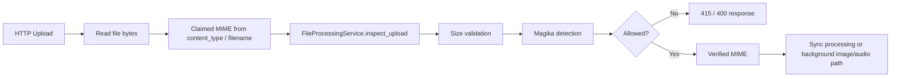

# File Upload Magika Inspection

## Overview

ORBIT now supports Magika-based inspection for uploaded files before they enter the file-processing pipeline. This capability was added to reduce trust in client-provided MIME types and filename extensions, which are easy to spoof and were previously used as the main signal for routing uploads.

The implementation adds a server-side content inspection step that runs after the upload bytes are read but before ORBIT decides whether to:

- reject the upload,
- process it synchronously, or
- hand it off to background image/audio processing.

The current implementation is intentionally strict. In the active workspace configuration, Magika is enabled and upload inspection is fail-closed.

## Goals

- Verify file content on the server instead of trusting `UploadFile.content_type`.
- Catch obvious MIME spoofing before extraction, chunking, embedding, or external service calls.
- Preserve the existing file-processing architecture with minimal disruption.
- Keep the first version operationally simple by using one global policy for all upload-capable adapters.

## Non-Goals

- Malware scanning or sandboxed execution analysis.
- Per-adapter Magika policy overrides.
- Expanding ORBIT's list of supported upload formats.
- Advisory-only behavior in the default active configuration.

## Previous Behavior

Before this change, `server/routes/file_routes.py` determined upload MIME type using:

1. `file.content_type`
2. `mimetypes.guess_type(filename)`
3. a hardcoded extension fallback map

That result was then passed into `FileProcessingService`, which validated the MIME type against `supported_types` and selected a processor. This worked for normal uploads but still trusted client-controlled metadata too much.

## New Architecture

The new upload path is:



### Main Components

#### `server/services/file_processing/magika_detector.py`

This is a thin integration layer around the optional `magika` dependency. It exists to keep Magika-specific logic out of the route and out of the core processing pipeline.

Responsibilities:

- initialize `Magika` with the configured prediction mode,
- normalize raw Magika results into a small internal dataclass,
- define generic fallback labels (`txt`, `unknown`),
- provide MIME and label canonicalization helpers,
- define `FileValidationError` for route-friendly upload failures.

#### `server/services/file_processing/file_processing_service.py`

This service now owns upload inspection through `inspect_upload(...)`.

Responsibilities:

- enforce maximum file size before deeper inspection,
- initialize Magika from `files.processing.magika`,
- run detection when enabled,
- map Magika output into ORBIT-supported MIME types,
- reject mismatches and unsupported detections,
- return the verified MIME type that downstream processing should use.

This keeps validation policy in the service layer instead of scattering it across routes.

#### `server/routes/file_routes.py`

The upload route still derives a claimed MIME type the same way as before, but it no longer treats that value as authoritative. After reading the file bytes, it now calls:

```python
mime_type = processing_service.inspect_upload(
    file_data=file_data,
    filename=file.filename,
    claimed_mime_type=mime_type,
)
```

The route then uses the returned verified MIME type for:

- sync file processing,
- image background processing,
- audio background processing,
- response payloads.

If inspection fails, the route converts `FileValidationError` into an HTTP error, currently `415 Unsupported Media Type`.

## Configuration

The feature is configured under `files.processing.magika`.

Example:

```yaml
files:
  processing:
    magika:
      enabled: true
      enforcement: "block"
      prediction_mode: "HIGH_CONFIDENCE"
      allow_generic_text_fallback: false
      allow_generic_binary_fallback: false
      log_detection_details: true
```

### Current Defaults

- `config/config.yaml`: enabled
- `install/default-config/config.yaml`: disabled

This was a deliberate compatibility decision:

- the active workspace gets the new safety control immediately,
- fresh installs are not forced into stricter behavior unless the operator opts in.

## Key Design Decisions

### 1. Global Policy Instead of Adapter Overrides

The first version uses one global policy under `files.processing`.

Reasoning:

- `FileProcessingService` is initialized once from the root config in `service_factory.py`,
- upload validation happens before adapter-specific retrieval behavior matters,
- introducing adapter precedence rules in v1 would add complexity without changing the core safety model.

This keeps the implementation easy to reason about and avoids inconsistent security posture across adapters.

### 2. Fail-Closed Blocking Behavior

When Magika is enabled, the current implementation rejects:

- content/type mismatches,
- unsupported detected types,
- generic text fallback (`txt`),
- generic binary fallback (`unknown`).

Reasoning:

- the point of the feature is to reduce trust in spoofable client metadata,
- advisory-only behavior would keep risky files flowing through the system,
- generic fallback labels are not strong enough for safe processor selection.

This is why the active config uses:

- `enforcement: "block"`
- `allow_generic_text_fallback: false`
- `allow_generic_binary_fallback: false`

### 3. Use `output.label` Semantics, Not Only MIME Type

Magika's documentation recommends integrating primarily on the final `output.label`, not just `mime_type`. The implementation follows that guidance.

Reasoning:

- Magika may intentionally downgrade uncertain results to generic labels,
- label-based handling makes it easier to detect generic fallback states,
- MIME type alone hides part of the confidence and overwrite semantics.

The implementation still considers Magika's MIME type, but it treats label normalization as part of the decision path.

### 4. Verify Before Routing to Image or Audio Paths

Inspection happens before ORBIT decides whether the upload should be processed as:

- image,
- audio,
- or normal document/text content.

Reasoning:

- without this, a spoofed upload could still reach special-case processing,
- image/audio paths may trigger slower or external downstream services,
- early rejection is cheaper and safer.

### 5. Return a Verified MIME Type

Successful inspection returns the MIME type that ORBIT should actually use.

Example:

- client sends `application/octet-stream`
- Magika identifies Markdown
- ORBIT proceeds with `text/markdown`

This preserves usability for clients that send weak MIME metadata while still enforcing server-side verification.

## MIME Normalization Strategy

Magika labels and MIME types do not always exactly match ORBIT's existing `supported_types` list. To avoid broad changes to processor registration, the implementation introduces canonicalization helpers.

Examples:

- `javascript` -> `application/javascript`
- `python` -> `text/x-python`
- `jpeg` -> `image/jpeg`
- `sql` -> `application/x-sql`

This normalization layer was chosen instead of changing all processors and configs to Magika-native labels.

## Error Handling

There are two main validation failure classes:

- `ValueError`
  - used for generic validation such as size limits
- `FileValidationError`
  - used for Magika-related upload rejection
  - carries an HTTP-friendly status code

The route maps `FileValidationError` to a client-visible `415`.

Typical failure messages:

- `Uploaded file content does not match the declared file type`
- `Uploaded file content was detected as unsupported type '...'`
- `Uploaded file content could not be confidently classified beyond generic text`
- `Uploaded file content could not be confidently classified and appears to be unknown binary data`

## Dependency Wiring

`magika` was added to the existing `files` dependency profile in `install/dependencies.toml`.

Reasoning:

- Magika is only needed for upload inspection,
- the `files` profile is already the installation path for document upload support,
- this avoids adding it to minimal/default installations that do not use file uploads.

## Testing Strategy

The implementation adds coverage in two layers.

### Service-Level Tests

`server/tests/file-adapter/test_file_processing.py` covers:

- Magika-enabled initialization from config,
- disabled behavior preserving current MIME handling,
- replacing `application/octet-stream` with a verified MIME type,
- rejecting MIME mismatches,
- rejecting generic `txt`,
- rejecting generic `unknown`.

These tests use a fake in-memory Magika module injected through `sys.modules`, which keeps the tests fast and deterministic.

### Route-Level Tests

`server/tests/file-adapter/test_file_routes_unit.py` covers:

- converting validation failures into HTTP `415`,
- ensuring the upload route uses the verified MIME returned by inspection.

This confirms the route wiring without requiring the full processing stack.

## Tradeoffs And Limitations

### Strictness May Reject Some Legitimate Files

Small, ambiguous, or uncommon files may resolve to generic labels and be rejected. This is expected under the current fail-closed policy.

### No Per-Adapter Policy Yet

Some deployments may want stricter rules for one adapter and looser rules for another. That is not supported in this version.

### No Full Security Scanning

Magika improves type identification, but it is not malware detection, archive sandboxing, or content disarm and reconstruction.

### Canonicalization Is Curated

The label/MIME mapping is intentionally conservative and only covers formats ORBIT already supports. New supported upload types may require map updates.

## Future Extensions

Potential follow-up work:

- adapter-level override support,
- advisory mode with structured logging only,
- metadata persistence of Magika detection results,
- metrics for rejection counts by reason,
- admin diagnostics endpoint for recent upload validation failures,
- integration with malware scanning for untrusted deployments.

## Files Changed

- `server/services/file_processing/magika_detector.py`
- `server/services/file_processing/file_processing_service.py`
- `server/routes/file_routes.py`
- `config/config.yaml`
- `install/default-config/config.yaml`
- `install/dependencies.toml`
- `server/tests/file-adapter/test_file_processing.py`
- `server/tests/file-adapter/test_file_routes_unit.py`

## Summary

The Magika integration adds a dedicated server-side verification step to ORBIT's upload pipeline. The design keeps policy centralized in `FileProcessingService`, keeps Magika-specific details isolated in a helper module, and enforces a strict global safety posture with minimal changes to the rest of the file-processing architecture.
