# 🛡️ LLM Guard Service

## Overview

The LLM Guard Service provides advanced security scanning and content sanitization capabilities for the Orbit server. It integrates with external LLM Guard API services to detect and mitigate security risks in user prompts and AI responses, including prompt injection attacks, toxic content, sensitive data exposure, and other security threats.

## 🌟 Core Capabilities

- **🔍 Security Scanning**
  - Prompt injection detection
  - Toxicity screening
  - Sensitive data detection (API keys, passwords, PII)
  - Content bias analysis
  - Topic filtering and banned content detection

- **🧹 Content Sanitization**
  - Automatic removal or masking of sensitive information
  - Configurable sanitization rules
  - PII anonymization
  - Secret detection and redaction

- **⚡ Performance & Reliability**
  - Async HTTP client with connection pooling
  - Configurable retry logic with exponential backoff
  - Health monitoring and circuit breaker patterns
  - Graceful fallback behavior when service unavailable

- **🔧 Simple Configuration**
  - Minimal configuration with sensible defaults
  - Easy setup with just essential settings
  - Automatic fallback behavior configuration

---

## 🏗️ Architecture

### Service Integration

The LLM Guard Service is integrated into Orbit's service factory pattern and follows the same architectural principles as other core services:

```
┌─────────────────┐    ┌──────────────────┐    ┌─────────────────┐
│   Chat Service  │───▶│ LLM Guard Service│───▶│ External LLM    │
│                 │    │                  │    │ Guard API       │
└─────────────────┘    └──────────────────┘    └─────────────────┘
        │                        │
        ▼                        ▼
┌─────────────────┐    ┌──────────────────┐
│   LLM Client    │    │ Health Monitor   │
│                 │    │ & Retry Logic    │
└─────────────────┘    └──────────────────┘
```


### Safety Check Flow

```mermaid
graph TD
    A[User Message] --> B[Chat Service]
    B --> C{Security Check<br/>FIRST LINE OF DEFENSE}
    C -->|UNSAFE| D[🛑 Block Immediately<br/>NO LLM CALL]
    C -->|SAFE| E[LLM Client]
    E --> F[Generate Response]
    F --> G{LLM Client Security<br/>OUTGOING CHECK}
    G -->|UNSAFE| H[🛑 Block Response]
    G -->|SAFE| I[Store & Return]
    D --> J[Return Error]
    H --> K[Return Security Error]
    I --> L[Return Response]
```


### Components

1. **LLMGuardService**: Main service class that handles security operations
2. **HTTP Client**: Async aiohttp client for API communication
3. **Health Monitor**: Periodic health checks with caching
4. **Retry Handler**: Exponential backoff retry logic
5. **Error Handler**: Fallback behavior configuration
6. **Validator**: Input validation and sanitization

---

## 📋 Configuration

### Simple Configuration

Add the following section to your `config.yaml`:

```yaml
llm_guard:
  enabled: true                           # Enable/disable the service
  service:
    base_url: "http://localhost:8000"     # LLM Guard API base URL
    timeout: 30                           # Backward-compatible total timeout (seconds)
    # Optional fine-grained timeouts and resiliency settings
    # connect_timeout: 5                  # TCP connect timeout (seconds)
    # read_timeout: 30                    # Socket read timeout (seconds); defaults to `timeout`
    # total_timeout: 30                   # Session total timeout (seconds); defaults to `timeout`
    # request_timeout: 10                 # Per-request timeout (seconds); defaults to min(total_timeout, 10)

    # Retry behavior
    # max_attempts: 2                     # Number of attempts per request
    # backoff_factor: 0.4                 # Exponential backoff base for retries
    # retry_status_codes:                 # HTTP codes that should trigger retry
    #   - 500
    #   - 502
    #   - 503
    #   - 504

    # Health check settings
    # health_interval: 30                 # Seconds to cache positive health status
    # health_timeout: 5                   # Timeout for /health endpoint (seconds)

    # Circuit breaker
    # failure_threshold: 3                # Consecutive failures before opening the circuit
    # circuit_reset_timeout: 60           # Seconds to keep circuit open before retrying
  security:
    risk_threshold: 0.6                   # Default risk threshold (0.0-1.0)
  fallback:
    on_error: "allow"                     # Fallback behavior: "allow" or "block"
```

### Configuration Options

| Setting | Type | Default | Description |
|---------|------|---------|-------------|
| `service.base_url` | string | `"http://localhost:8000"` | LLM Guard API base URL |
| `service.timeout` | integer | `30` | Session total timeout in seconds (backward compatible) |
| `service.request_timeout` | integer | `min(total_timeout, 10)` | Per-request timeout in seconds |
| `service.max_attempts` | integer | `2` | Max attempts per request |
| `service.backoff_factor` | float | `0.4` | Exponential backoff base |
| `service.retry_status_codes` | list | `[500, 502, 503, 504]` | HTTP codes that trigger retry |
| `service.health_interval` | integer | `30` | Cache TTL for successful health check |
| `service.health_timeout` | integer | `5` | Health check timeout |
| `service.failure_threshold` | integer | `3` | Failures before opening circuit |
| `service.circuit_reset_timeout` | integer | `60` | Seconds to keep circuit open |
| `security.risk_threshold` | float | `0.6` | Default risk threshold (0.0-1.0) |
| `fallback.on_error` | string | `"allow"` | Fallback behavior when service unavailable |

### Default Settings

The service uses sensible defaults for all other settings:

- **API Version**: `v1`
- **Connect Timeout**: `5` seconds (configurable)
- **Per-request Timeout**: `min(total_timeout, 10)` seconds
- **Retry Attempts**: `2` with exponential backoff (configurable)
- **Health Check**: `/health` endpoint, 30s interval, 5s timeout (configurable)
- **Available Scanners**: 7 input scanners, 4 output scanners
- **Content Validation**: 10,000 character limit, `["prompt", "response"]` types
- **Metadata**: Client name `"orbit-server"`, version `"1.0.0"`

---

## 🚀 Usage

### Service Integration

The LLM Guard Service is automatically initialized by the service factory when the `llm_guard` section exists in your configuration and `enabled` is set to `true`. It's available through the application state:

```python
# Access the service in your code
llm_guard_service = app.state.llm_guard_service
```

### Security Checking

```python
# Basic security check
result = await llm_guard_service.check_security(
    content="User input to check",
    content_type="prompt"
)

# Advanced security check with custom parameters
result = await llm_guard_service.check_security(
    content="Potentially risky content",
    content_type="prompt",
    scanners=["prompt_injection", "toxicity", "secrets"],
    risk_threshold=0.7,
    user_id="user123",
    metadata={"session_id": "sess_456", "source": "chat"}
)

# Process the result
if result["is_safe"]:
    print("Content is safe to process")
else:
    print(f"Content flagged by: {result['flagged_scanners']}")
    print(f"Risk score: {result['risk_score']}")
    print(f"Recommendations: {result['recommendations']}")
```

### Content Sanitization

```python
# Sanitize content to remove sensitive information
sanitized = await llm_guard_service.sanitize_content(
    "My phone number is 555-123-4567 and API key is sk-abc123"
)

print(f"Original: {content}")
print(f"Sanitized: {sanitized['sanitized_content']}")
print(f"Changes made: {sanitized['changes_made']}")
print(f"Removed items: {sanitized['removed_items']}")
```

### Service Health and Information

```python
# Check service health
is_healthy = await llm_guard_service.is_service_healthy()

# Get service information
info = await llm_guard_service.get_service_info()
print(f"Service enabled: {info['enabled']}")
print(f"Base URL: {info['base_url']}")
print(f"Available scanners: {info['available_input_scanners']}")

# Get available scanners dynamically
scanners = await llm_guard_service.get_available_scanners()
print(f"Input scanners: {scanners['input_scanners']}")
print(f"Output scanners: {scanners['output_scanners']}")
```

---

## 🔌 API Integration

### LLM Guard API Endpoints

The service integrates with the following LLM Guard API endpoints:

#### Security Check
- **Method**: POST
- **Endpoint**: `/v1/security/check`
- **Purpose**: Perform security analysis on content

**Request:**
```json
{
  "content": "Text to analyze",
  "content_type": "prompt",
  "risk_threshold": 0.6,
  "scanners": ["prompt_injection", "toxicity"],
  "user_id": "user123",
  "metadata": {
    "client_name": "orbit-server",
    "timestamp": "2024-01-15T10:30:00Z"
  }
}
```

**Response:**
```json
{
  "is_safe": false,
  "risk_score": 0.8,
  "sanitized_content": "Text to analyze",
  "flagged_scanners": ["secrets"],
  "recommendations": [
    "Content contains potential API key",
    "Consider sanitizing before processing"
  ],
  "scan_details": {
    "secrets": {
      "score": 0.9,
      "detected_items": ["api_key"]
    }
  }
}
```

#### Content Sanitization
- **Method**: POST
- **Endpoint**: `/v1/security/sanitize`
- **Purpose**: Remove or mask sensitive information

**Request:**
```json
{
  "content": "My API key is sk-1234567890abcdef"
}
```

**Response:**
```json
{
  "sanitized_content": "My API key is [REDACTED]",
  "changes_made": true,
  "removed_items": ["api_key"],
  "sanitization_log": [
    {
      "type": "api_key",
      "original": "sk-1234567890abcdef",
      "replacement": "[REDACTED]",
      "position": [13, 35]
    }
  ]
}
```

#### Health Check
- **Method**: GET
- **Endpoint**: `/health`
- **Purpose**: Check service availability and status

**Response:**
```json
{
  "status": "healthy",
  "version": "1.0.0",
  "uptime": 3600,
  "scanners": {
    "input": ["anonymize", "ban_substrings", "prompt_injection"],
    "output": ["bias", "relevance", "sensitive"]
  }
}
```

---

## ⚙️ Scanner Types

### Input Scanners (Prompt Analysis)

| Scanner | Purpose | Description |
|---------|---------|-------------|
| `anonymize` | Detect and anonymize PII data | Identifies and masks personal information |
| `ban_substrings` | Block content with banned phrases | Filters content containing banned substrings |
| `ban_topics` | Block content about banned topics | Prevents discussion of prohibited topics |
| `code` | Detect code injection attempts | Identifies potential code injection attacks |
| `prompt_injection` | Detect prompt injection attacks | Detects attempts to manipulate the AI system |
| `secrets` | Detect API keys, passwords, tokens | Identifies sensitive credentials and secrets |
| `toxicity` | Detect toxic/harmful content | Filters harmful, offensive, or inappropriate content |

### Output Scanners (Response Analysis)

| Scanner | Purpose | Description |
|---------|---------|-------------|
| `bias` | Detect biased or unfair content | Identifies biased or discriminatory responses |
| `no_refusal` | Ensure appropriate refusals | Checks that the AI appropriately refuses harmful requests |
| `relevance` | Check response relevance to prompt | Ensures responses are relevant to the original query |
| `sensitive` | Detect sensitive information leaks | Prevents disclosure of sensitive information |

---

## 🛠️ Error Handling

### Fallback Behaviors

When the LLM Guard service is unavailable, you can configure different fallback behaviors:

#### Allow (Default)
- **Behavior**: Allow content to pass through unscanned
- **Use Case**: Non-critical applications where availability is prioritized
- **Configuration**: `on_error: "allow"`

```python
# Returns safe response when service is down
{
  "is_safe": true,
  "risk_score": 0.0,
  "sanitized_content": original_content,
  "flagged_scanners": [],
  "recommendations": ["Service temporarily unavailable - content not scanned"]
}
```

#### Block
- **Behavior**: Block all content when service is unavailable
- **Use Case**: High-security applications where safety is prioritized
- **Configuration**: `on_error: "block"`

```python
# Returns unsafe response when service is down
{
  "is_safe": false,
  "risk_score": 1.0,
  "sanitized_content": original_content,
  "flagged_scanners": ["service_unavailable"],
  "recommendations": ["Service temporarily unavailable - content blocked as precaution"]
}
```

### Retry Logic & Circuit Breaker

The service implements exponential backoff with a small number of attempts, plus a circuit breaker to prevent cascading failures:

```yaml
llm_guard:
  service:
    max_attempts: 2           # attempts per request
    backoff_factor: 0.4       # retry backoff
    failure_threshold: 3      # open circuit after 3 consecutive failures
    circuit_reset_timeout: 60 # keep circuit open for 60s
```

While the circuit is open, security checks short‑circuit and follow the configured fallback behavior (e.g., `on_error: "allow"`).

---

## 📊 Monitoring and Logging

### Health Monitoring

The service automatically monitors the health of the LLM Guard API:

```python
# Health check results are cached for efficiency
health_cache_ttl = 30  # seconds

# Health check endpoint
GET /health
```

### Logging

The service provides comprehensive logging:

```python
# Info level logs
logger.info("LLM Guard service initialized - Base URL: http://localhost:8000")
logger.info("Security check completed in 250.5ms")

# Warning level logs
logger.warning("LLM Guard service health check failed with status: 503")
logger.warning("Service unavailable, falling back to 'allow'")

# Error level logs
logger.error("Security check failed: Connection timeout")
logger.error("Failed to initialize LLM Guard Service: Service unreachable")
```

### Performance Metrics

Track service performance with built-in metrics:

- **Request Duration**: Time taken for security checks
- **Success Rate**: Percentage of successful requests
- **Health Status**: Service availability over time
- **Scanner Usage**: Which scanners are most frequently used

---

## 🔐 Security Considerations

### Network Security

- **HTTPS**: Always use HTTPS in production
- **Firewall**: Restrict access to LLM Guard service
- **VPN**: Use VPN for communication between services

```yaml
llm_guard:
  service:
    base_url: "https://llm-guard.internal.company.com"  # HTTPS endpoint
```

### Data Privacy

- **Content Logging**: The service does not log actual content by default
- **PII Handling**: Ensure PII is properly anonymized by the LLM Guard service
- **Data Retention**: Configure data retention on the LLM Guard service side

---

## 🐛 Troubleshooting

### Common Issues

#### Service Not Starting
```bash
# Check if LLM Guard is configured
grep -A5 "llm_guard:" config.yaml

# Verify the base URL is correct
curl -X GET "http://localhost:8000/health"
```

#### Connection Timeouts
```yaml
# Increase timeout in config.yaml
llm_guard:
  service:
    timeout: 60  # Increase from default 30 seconds
```

### Debug Mode

Enable debug logging for detailed troubleshooting:

```yaml
logging:
  level: "DEBUG"
  loggers:
    services.llm_guard_service:
      level: "DEBUG"
```

### Health Check Command

```bash
# Test LLM Guard service health
curl -X GET "http://localhost:8000/health"

# Test security check endpoint
curl -X POST "http://localhost:8000/v1/security/check" \
  -H "Content-Type: application/json" \
  -d '{"content": "test", "content_type": "prompt"}'
```

### Service Status

Check service status through Orbit:

```python
# In your application
llm_guard_service = app.state.llm_guard_service
if llm_guard_service:
    health = await llm_guard_service.is_service_healthy()
    info = await llm_guard_service.get_service_info()
    print(f"Service healthy: {health}")
    print(f"Service info: {info}")
```

---

## 📈 Performance Optimization

### Connection Pooling

The service uses connection pooling for optimal performance:

```python
# aiohttp connector settings (hardcoded defaults)
connector = aiohttp.TCPConnector(
    limit=100,              # Total connection pool size
    limit_per_host=30,      # Connections per host
    keepalive_timeout=30,   # Keep connections alive
    enable_cleanup_closed=True
)
```

### Caching

Health check results are cached to reduce API calls:

```python
# Health check caching (hardcoded default)
health_cache_ttl = 30  # Cache health status for 30 seconds
```

### Content Batching

For high-volume scenarios, consider batching requests:

```python
# Process multiple content items together
contents = ["text1", "text2", "text3"]
tasks = [
    llm_guard_service.check_security(content, "prompt")
    for content in contents
]
results = await asyncio.gather(*tasks)
```

---

## 🔄 Updates and Maintenance

### Service Updates

When updating the LLM Guard service:

1. Update the base URL if changed
2. Check for new scanner types
3. Review configuration changes
4. Test fallback behavior

### Monitoring

Set up monitoring for:

- Service availability
- Response times
- Error rates
- Scanner effectiveness

### Backup and Recovery

Ensure your LLM Guard service has:

- High availability setup
- Backup instances
- Load balancing
- Disaster recovery plan

---

## 📚 Examples

### Complete Integration Example

```python
from services.llm_guard_service import LLMGuardService

class SecureChatService:
    def __init__(self, config, llm_guard_service):
        self.config = config
        self.llm_guard = llm_guard_service
    
    async def process_user_input(self, user_input: str, user_id: str) -> dict:
        """Process user input with security checking"""
        
        # Check input security
        security_result = await self.llm_guard.check_security(
            content=user_input,
            content_type="prompt",
            scanners=["prompt_injection", "toxicity", "secrets"],
            risk_threshold=0.6,
            user_id=user_id
        )
        
        if not security_result["is_safe"]:
            return {
                "error": "Input rejected due to security concerns",
                "details": security_result["recommendations"],
                "risk_score": security_result["risk_score"]
            }
        
        # Sanitize input before processing
        sanitized = await self.llm_guard.sanitize_content(user_input)
        safe_input = sanitized["sanitized_content"]
        
        # Process with LLM (your existing logic)
        response = await self.generate_response(safe_input)
        
        # Check response security
        response_security = await self.llm_guard.check_security(
            content=response,
            content_type="response",
            scanners=["bias", "sensitive", "relevance"],
            user_id=user_id
        )
        
        if not response_security["is_safe"]:
            return {
                "error": "Response blocked due to security concerns",
                "details": response_security["recommendations"]
            }
        
        return {
            "response": response,
            "security_passed": True,
            "sanitization_applied": sanitized["changes_made"]
        }
```

### Configuration Examples

#### Basic Setup
```yaml
llm_guard:
  enabled: true
  service:
    base_url: "http://localhost:8000"
    timeout: 30
  security:
    risk_threshold: 0.6
  fallback:
    on_error: "allow"
```

#### Production Setup
```yaml
llm_guard:
  enabled: true
  service:
    base_url: "https://llm-guard.prod.company.com"
    timeout: 60
  security:
    risk_threshold: 0.7
  fallback:
    on_error: "block"
```

#### High-Security Setup
```yaml
llm_guard:
  enabled: true
  service:
    base_url: "https://llm-guard.secure.company.com"
    timeout: 45
  security:
    risk_threshold: 0.5
  fallback:
    on_error: "block"
```

## 🔗 Chat Service Integration

The LLM Guard service is now fully integrated into the chat flow to provide real-time security checking for both user prompts and AI responses. This ensures unsafe content is blocked before processing or storage.

### Security Check Points

1. **User Message Validation**: Before LLM processing
   - Checks user input for security violations
   - Blocks unsafe messages immediately
   - No LLM inference occurs for blocked messages

2. **Response Validation**: Before chat history storage
   - Checks AI responses for security violations
   - Blocks unsafe responses from being stored
   - Prevents harmful content from entering chat history

### Integration Flow


### Implementation Details

#### Service Dependencies
The ChatService now accepts an `llm_guard_service` parameter:

```python
chat_service = ChatService(
    config, 
    llm_client, 
    logger_service,
    chat_history_service,
    llm_guard_service  # New parameter
)
```

#### Security Check Method
A new `_check_message_security()` method handles security validation:

```python
security_result = await self._check_message_security(
    content=message,
    content_type="prompt",  # or "response"
    user_id=user_id,
    session_id=session_id
)

if not security_result.get("is_safe", True):
    # Block and return error
    return {"error": "Message blocked by security scanner"}
```

#### Blocked Content Handling

When content is flagged as unsafe:

1. **Detailed Error Messages**: Include risk score, flagged scanners, and recommendations
2. **Logging**: Security violations are logged with full context
3. **No Storage**: Unsafe content is never stored in MongoDB chat history
4. **Audit Trail**: Blocked attempts are logged for security monitoring

#### Error Response Format

Blocked messages return user-friendly error responses without exposing sensitive security details:

```json
{
  "error": {
    "code": -32603,
    "message": "Message blocked by security scanner. Reason: prompt injection"
  }
}
```

**Note**: Detailed security information (risk scores, scanner names, technical recommendations) is logged for administrators but not exposed to clients for security reasons.

#### Streaming Support

The security integration works seamlessly with streaming responses:

- User messages are checked before streaming begins
- Complete responses are validated after streaming completes
- Security errors are streamed as proper JSON chunks
- Blocked responses don't interrupt the streaming protocol

### Configuration

LLM Guard integration is automatically enabled when the service is configured:

```yaml
llm_guard:
  enabled: true
  service:
    base_url: "http://localhost:8000"
    timeout: 30
  security:
    risk_threshold: 0.6
  fallback:
    on_error: "allow"
```

### Benefits

✅ **Comprehensive Protection**: Both input and output validation  
✅ **Zero Storage Pollution**: Unsafe content never enters chat history  
✅ **Transparent Integration**: Works with existing chat endpoints  
✅ **Streaming Compatible**: Full support for real-time responses  
✅ **Detailed Reporting**: Rich error messages and audit trails  
✅ **Graceful Fallbacks**: Continues working if LLM Guard is unavailable

This documentation provides comprehensive coverage of the LLM Guard Service integration with Orbit, including the simplified configuration, usage examples, and troubleshooting guidance.

#### Security Logging for Administrators

While clients receive user-friendly error messages, detailed security information is logged for administrators:

**Log Example:**
```
WARNING: Message blocked for session sess_123: Risk score: 0.85, Flagged by: toxicity, prompt_injection, Recommendations: Potential prompt injection detected. Review and sanitize user input.
```

**Logged Information:**
- Session ID for tracking
- Risk score (0.0-1.0)
- Specific scanners that flagged the content
- Technical recommendations for investigation
- Full security check results in metadata

This provides administrators with the information needed for security monitoring and incident response while keeping sensitive details away from end users.

## 🔄 Bidirectional Security Checking

ORBIT implements a **comprehensive bidirectional security system** that protects against threats from both user inputs and AI outputs. This dual-layer approach ensures that unsafe content is blocked at both entry and exit points of the system.

### 🛡️ Dual-Layer Security Architecture

The security system consists of two complementary services working together:

1. **🔍 LLM Guard Service** - Advanced content scanning with specialized scanners
2. **🛡️ Moderator Service** - Multi-provider content moderation (OpenAI, Anthropic, Ollama)

### 📍 Security Check Points

#### 1. **Input Validation (User Prompts)**
```python
# Before LLM processing - Line ~675 in ChatService
security_result = await self._check_message_security(
    content=message,
    content_type="prompt",  # ← Checking incoming user input
    user_id=user_id,
    session_id=session_id
)
```

#### 2. **Output Validation (LLM Responses)**
```python
# After LLM generation - Line ~583 in ChatService
response_security_result = await self._check_message_security(
    content=response,
    content_type="response",  # ← Checking AI-generated output
    user_id=user_id,
    session_id=session_id
)
```

### 🔍 LLM Guard Service - Specialized Scanners

The LLM Guard Service uses different scanner configurations optimized for each content type:

#### **Prompt Scanners (Input Protection)**
```yaml
scanners:
  prompt:  # Scanners for user input (prompts)
    - "ban_substrings"      # Blocks specific harmful phrases
    - "ban_topics"          # Blocks dangerous topics
    - "prompt_injection"    # Prevents prompt injection attacks
    - "toxicity"            # Detects toxic language
    - "secrets"             # Prevents data leakage
```

#### **Response Scanners (Output Protection)**
```yaml
scanners:
  response:  # Scanners for AI output (responses)
    - "no_refusal"          # Ensures AI doesn't refuse legitimate requests
    - "sensitive"           # Detects sensitive information in responses
    - "bias"                # Identifies biased content
    - "relevance"           # Ensures responses are relevant
```

### 🛡️ Moderator Service - Content Moderation

The Moderator Service provides additional content moderation using multiple providers:

- **OpenAI Moderation API** - Industry-standard content filtering
- **Anthropic Claude** - Advanced safety analysis
- **Ollama Models** - Local content moderation capabilities

### 🔄 Security Flow

```
┌─────────────────┐    ┌──────────────────┐    ┌─────────────────┐
│   User Input    │───▶│ LLM Guard        │───▶│ Moderator       │
│                 │    │ (Prompt Scanners)│    │ Service         │
└─────────────────┘    └──────────────────┘    └─────────────────┘
        │                        │                        │
        ▼                        ▼                        ▼
┌─────────────────┐    ┌──────────────────┐    ┌─────────────────┐
│   LLM Guard     │    │   Moderator      │    │   LLM Client    │
│   BLOCKED       │    │   BLOCKED        │    │   PROCESSING    │
└─────────────────┘    └──────────────────┘    └─────────────────┘
        │                        │                        │
        ▼                        ▼                        ▼
┌─────────────────┐    ┌──────────────────┐    ┌─────────────────┐
│   Error to      │    │   Error to       │    │   AI Response   │
│   User          │    │   User           │    │   Generated     │
└─────────────────┘    └──────────────────┘    └─────────────────┘
                                                        │
                                                        ▼
                                        ┌─────────────────────────┐
                                        │ Response Security Check │
                                        │ LLM Guard + Moderator   │
                                        └─────────────────────────┘
                                                        │
                                                        ▼
                                        ┌─────────────────────────┐
                                        │   Safe Response         │
                                        │   to User               │
                                        └─────────────────────────┘
```

### 🚨 Blocking Behavior

#### **For Unsafe Prompts (Input Blocking)**
- **Immediate Block**: Processing stops before LLM inference
- **No Storage**: Content never enters chat history
- **Error Response**: User receives immediate feedback
- **Audit Logging**: Security violations logged for monitoring

#### **For Unsafe Responses (Output Blocking)**
- **Response Block**: AI output blocked before delivery
- **No Storage**: Unsafe responses never stored in history
- **Error Response**: User receives error message
- **Audit Logging**: Response violations logged for monitoring

### 📊 Scanner Differences Explained

#### **Input Scanners (Protecting Against User Threats)**
| Scanner | Purpose | Protection |
|---------|---------|------------|
| `ban_substrings` | Blocks harmful phrases | Prevents specific dangerous content |
| `ban_topics` | Blocks dangerous topics | Prevents discussion of prohibited subjects |
| `prompt_injection` | Detects manipulation attempts | Prevents AI system manipulation |
| `toxicity` | Detects harmful language | Filters offensive or inappropriate content |
| `secrets` | Detects sensitive data | Prevents accidental data leakage |

#### **Output Scanners (Protecting Against AI Threats)**
| Scanner | Purpose | Protection |
|---------|---------|------------|
| `no_refusal` | Ensures appropriate refusals | Prevents AI from refusing legitimate requests |
| `sensitive` | Detects information leaks | Prevents disclosure of sensitive information |
| `bias` | Detects biased content | Ensures fair and unbiased responses |
| `relevance` | Checks response relevance | Ensures responses match the query |

### 🔧 Configuration Examples

#### **Basic Bidirectional Setup**
```yaml
llm_guard:
  enabled: true
  service:
    base_url: "http://localhost:8000"
    timeout: 30
  security:
    risk_threshold: 0.6
    scanners:
      prompt:  # Input protection
        - "ban_substrings"
        - "prompt_injection"
        - "toxicity"
        - "secrets"
      response:  # Output protection
        - "no_refusal"
        - "sensitive"
        - "bias"
        - "relevance"
  fallback:
    on_error: "allow"

safety:
  enabled: true
  mode: "strict"
  moderator: "openai"  # or "anthropic", "ollama"
```

#### **High-Security Bidirectional Setup**
```yaml
llm_guard:
  enabled: true
  service:
    base_url: "https://llm-guard.secure.company.com"
    timeout: 45
  security:
    risk_threshold: 0.5  # Lower threshold for stricter checking
    scanners:
      prompt:
        - "ban_substrings"
        - "ban_topics"
        - "prompt_injection"
        - "toxicity"
        - "secrets"
        - "code"
      response:
        - "no_refusal"
        - "sensitive"
        - "bias"
        - "relevance"
  fallback:
    on_error: "block"  # Block when service unavailable

safety:
  enabled: true
  mode: "strict"
  moderator: "anthropic"  # Multiple moderators for redundancy
```

### 📈 Benefits of Bidirectional Security

✅ **Comprehensive Protection**: Covers both input and output threats  
✅ **Specialized Scanning**: Different scanners for different content types  
✅ **Zero Storage Pollution**: Unsafe content never enters chat history  
✅ **Real-time Blocking**: Immediate response to security violations  
✅ **Audit Trail**: Complete logging for security monitoring  
✅ **Graceful Degradation**: Continues working if services are unavailable  
✅ **Multi-Provider Redundancy**: Multiple moderation services for reliability  

### 🔍 Monitoring and Analytics

#### **Security Metrics to Track**
- **Input Block Rate**: Percentage of user messages blocked
- **Output Block Rate**: Percentage of AI responses blocked
- **Scanner Effectiveness**: Which scanners catch the most violations
- **False Positive Rate**: Legitimate content incorrectly blocked
- **Service Availability**: Uptime of security services

#### **Log Analysis**
```bash
# Monitor input security violations
grep "Message blocked for session" logs/orbit.log

# Monitor output security violations  
grep "Response blocked for session" logs/orbit.log

# Track security service health
grep "LLM Guard service health check" logs/orbit.log
```

### 🚀 Implementation Example

```python
class SecureChatService:
    def __init__(self, llm_guard_service, moderator_service):
        self.llm_guard = llm_guard_service
        self.moderator = moderator_service
    
    async def process_chat(self, user_message: str, user_id: str) -> dict:
        """Process chat with bidirectional security checking"""
        
        # 1. INPUT SECURITY CHECK
        input_security = await self.llm_guard.check_security(
            content=user_message,
            content_type="prompt",
            user_id=user_id
        )
        
        if not input_security["is_safe"]:
            return {
                "error": "Input blocked by security scanner",
                "risk_score": input_security["risk_score"],
                "flagged_by": input_security["flagged_scanners"]
            }
        
        # 2. MODERATOR CHECK
        is_safe, refusal_msg = await self.moderator.check_safety(user_message)
        if not is_safe:
            return {
                "error": f"Content flagged by moderator: {refusal_msg}"
            }
        
        # 3. LLM PROCESSING
        ai_response = await self.generate_response(user_message)
        
        # 4. OUTPUT SECURITY CHECK
        output_security = await self.llm_guard.check_security(
            content=ai_response,
            content_type="response",
            user_id=user_id
        )
        
        if not output_security["is_safe"]:
            return {
                "error": "Response blocked by security scanner",
                "risk_score": output_security["risk_score"],
                "flagged_by": output_security["flagged_scanners"]
            }
        
        # 5. STORE SAFE CONTENT
        await self.store_conversation(user_message, ai_response)
        
        return {
            "response": ai_response,
            "security_passed": True
        }
```

This bidirectional security approach ensures that ORBIT provides enterprise-grade protection against both malicious user inputs and potentially harmful AI outputs, while maintaining detailed audit trails for security monitoring and compliance. 
