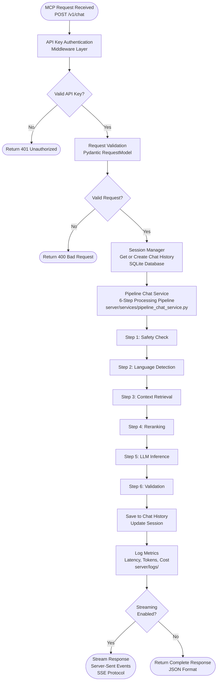
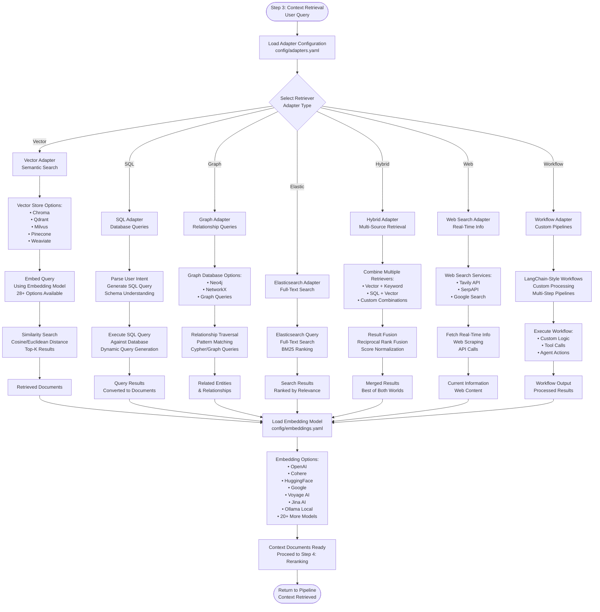

# ORBIT MCP Flow - Detailed Diagrams

This document contains three focused diagrams for better readability and higher resolution exports.

---

## Diagram 1: High-Level Request Flow



**Timeline**: Total 700-12,500ms
- Authentication: 1-3ms
- Validation: 1-3ms
- Session Management: 5-10ms
- Pipeline Processing: 600-12,000ms
- Logging: 10-50ms

---

## Diagram 2: Six-Step Pipeline Details

```mermaid
flowchart TD
    PipelineStart([Pipeline Input<br/>User Query + Session]) --> Step1

    Step1[Step 1: Safety Check<br/>Pre-Moderation] --> SafetyServices

    SafetyServices[Moderation Services] --> SafetyProviders

    SafetyProviders[OpenAI Moderation<br/>Google Perspective API<br/>Azure Content Safety] --> SafetyCheck{Content<br/>Safe?}

    SafetyCheck -->|No| BlockRequest[Block Request<br/>Return Moderation Error<br/>HTTP 400]
    SafetyCheck -->|Yes| Step2Start

    Step2Start[Step 2: Language Detection<br/>Identify User Language] --> LangDetect[Language Detector<br/>Detect Query Language]

    LangDetect --> LangResult[Language Identified<br/>Used for Localized Responses]

    LangResult --> Step3Start[Step 3: Context Retrieval<br/>RAG Pipeline]

    Step3Start --> RetrievalDetails[See Diagram 3<br/>Context Retrieval Flow]

    RetrievalDetails --> ContextGathered[Context Documents Retrieved<br/>Relevant Information]

    ContextGathered --> Step4Start[Step 4: Reranking<br/>Optional Context Refinement]

    Step4Start --> RerankerCheck{Reranker<br/>Enabled?}

    RerankerCheck -->|No| Step5Start
    RerankerCheck -->|Yes| RerankerService[Cohere Reranker<br/>or<br/>Jina Reranker]

    RerankerService --> RerankResult[Documents Scored & Sorted<br/>Top-K Selected]

    RerankResult --> Step5Start[Step 5: LLM Inference<br/>Generate Response]

    Step5Start --> PromptBuilder[Build Prompt Template<br/>System Message<br/>+ Context Documents<br/>+ Chat History<br/>+ User Query]

    PromptBuilder --> LLMSelection[Select LLM Provider<br/>Based on Config<br/>24+ Providers Available]

    LLMSelection --> LLMCall[Call LLM API<br/>Generate Response<br/>Stream or Non-Stream]

    LLMCall --> LLMResponse[LLM Response Generated]

    LLMResponse --> Step6Start[Step 6: Validation<br/>Post-Moderation]

    Step6Start --> PostModeration[Output Guardrails<br/>Safety Validation<br/>Content Filtering]

    PostModeration --> PostCheck{Response<br/>Safe?}

    PostCheck -->|No| Sanitize[Sanitize Response<br/>Remove Unsafe Content<br/>or Block Entirely]
    PostCheck -->|Yes| FinalResponse

    Sanitize --> FinalResponse[Final Response Ready]

    FinalResponse --> PipelineEnd([Pipeline Output<br/>Response + Metadata])

    BlockRequest --> PipelineEnd
```



**Step Latencies**:
- Step 1 (Safety): 50-200ms
- Step 2 (Language): 10-50ms
- Step 3 (Retrieval): 100-2000ms
- Step 4 (Reranking): 50-300ms
- Step 5 (LLM): 500-10,000ms (largest)
- Step 6 (Validation): 50-200ms

---

## Diagram 3: Context Retrieval Adapters



**Adapter Locations**:
- Vector: `server/adapters/vector_adapter.py`
- SQL: `server/adapters/sql_adapter.py`
- Graph: `server/adapters/graph_adapter.py`
- Elastic: `server/adapters/elastic_adapter.py`
- Hybrid: `server/adapters/hybrid_adapter.py`
- Web: `server/adapters/web_adapter.py`
- Workflow: `server/adapters/workflow_adapter.py`

**Configuration**: `config/adapters.yaml`

---

## Export Instructions

### For High-Quality SVG (Recommended):
1. Visit https://mermaid.live
2. Copy each diagram's mermaid code
3. Click "Actions" → "Export SVG"
4. SVG files scale infinitely without pixelation

### For High-Resolution PNG:
Use mermaid-cli with increased dimensions:
```bash
# Install mermaid-cli first
npm install -g @mermaid-js/mermaid-cli

# Export each diagram
mmdc -i diagram.md -o diagram.png -w 3000 -H 4000 -b white
```

### PNG Export Settings:
- Width: 3000-4000px
- Height: 4000-6000px
- Background: white
- Scale: 2x or 3x for retina displays
