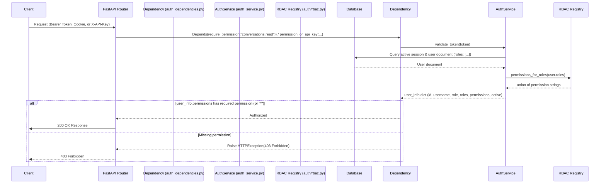

# ORBIT Role-Based Access Control (RBAC) Technical Guide

This document details the design, architecture, and enforcement of Role-Based Access Control (RBAC) in ORBIT.

---

## 1. Overview & Core Model

ORBIT implements a **permission-based RBAC model**: every user is just a *user* — there is no separate "admin account type." What a user can do is determined entirely by the **roles** assigned to them, where each role grants a fixed set of **permission** strings. A user may hold multiple roles; their effective permissions are the union of each role's permissions.

Roles and their permission grants are defined in a code registry — `server/auth/rbac.py` — not editable at runtime. This keeps authorization auditable and versioned in git, mirroring the existing `AdapterCapabilityRegistry` pattern (`server/adapters/capabilities.py`).

### Built-in roles

| Role | Permissions | Intent |
|---|---|---|
| `admin` | `*` (wildcard — every permission) | Full administrative access |
| `operator` | `config.manage`, `adapters.manage`, `apikeys.manage`, `prompts.manage`, `system.manage`, `metrics.read` | Runs day-to-day system operations (config, adapters, API keys, prompts, restart/shutdown); **cannot** read user conversations/feedback, server logs, or the audit trail — that visibility belongs to `auditor` |
| `auditor` | `logs.read`, `audit.read`, `metrics.read` | Read-only diagnostics, for compliance/observability roles |
| `analyst` | `conversations.read`, `feedback.read` | Reads conversation transcripts and feedback analytics; cannot touch config |
| `user-manager` | `users.manage` | Delegated identity administration — create/deactivate/reset/assign roles |
| `user` | (none) | Standard, non-administrative access — `/auth/me`, `/auth/change-password` |

### Permission vocabulary

| Permission | Gates |
|---|---|
| `users.manage` | Register/delete/reset/deactivate/activate users, assign roles |
| `apikeys.manage` | `/admin/api-keys*`, quota routes |
| `adapters.manage` | `/admin/adapters/*`, reload-adapters, reload-templates, test-query |
| `prompts.manage` | `/admin/prompts*`, render-markdown |
| `config.manage` | `/admin/config*`, config sections |
| `system.manage` | `/admin/info`, `/admin/jobs`, shutdown, restart |
| `logs.read` | `/admin/logs/*` |
| `audit.read` | `/admin/audit/events` |
| `metrics.read` | Metrics WebSocket stream |
| `conversations.read` | `/admin/chat-history/{session_id}`, conversation excerpts in feedback analytics |
| `feedback.read` | Feedback-analytics aggregates |

This decomposition is what makes it possible, for example, to let an `operator` fully run the system — configuration, adapters, API keys, prompts, restart/shutdown — without ever being able to read another user's conversation, server logs, or the audit trail. That's the sensitivity concern that motivated this design: some admin-panel users should not have permission to read or view conversations (or operational history), without resorting to an all-or-nothing admin flag. Logs and audit visibility are scoped to `auditor` instead, on the same reasoning: someone who restarts the server or edits config doesn't automatically need to see every admin action ever taken, or raw log content.

---

## 2. Architecture & Data Flow



Every authorization checkpoint in the codebase reads from a single choke point: `AuthService._user_info()` (`server/services/auth_service.py`), which resolves a user's `roles` and computes `permissions = permissions_for_roles(roles)` once. All three enforcement paths below build on top of that projection.

---

## 3. Database Schema

Users are stored in the `users` collection (MongoDB) or `users` table (SQLite/PostgreSQL).

### Schema representation:
```javascript
{
  "_id": ObjectId("..."),
  "username": "developer",
  "password": "base64_encoded_pbkdf2_hash",
  "role": "admin",                      // primary/display role (backward compat, first entry of roles)
  "roles": ["admin"],                   // source of truth: full list of assigned roles
  "active": true,                       // inactive users cannot validate tokens
  "created_at": ISODate("2026-07-09T12:00:00Z"),
  "last_login": ISODate("2026-07-09T19:24:00Z")
}
```

> [!NOTE]
> The database enforces a `UNIQUE` index on the `username` field. For standard local logins, the username is chosen by an administrator. For external users, it follows a `"{provider}:{subject}"` format.

`roles` is the source of truth; `role` is kept as a denormalized primary/display value (`roles[0]`) for backward compatibility with older UI and API surfaces. On SQLite/PostgreSQL, `roles` is stored as a JSON-encoded string column (both are `TEXT`, with no native array type) and transparently encoded/decoded by `sqlite_service.py` / `postgres_service.py`; MongoDB stores it as a native array.

A one-time, idempotent backfill (`AuthService._backfill_roles()`, run on every service `initialize()`) assigns `roles = [role]` to any user row created before multi-role support existed, so legacy single-role users keep working without manual migration.

---

## 4. Key Code Components & References

### A. RBAC Registry
[`server/auth/rbac.py`](file:///Users/remsyschmilinsky/Downloads/orbit/server/auth/rbac.py) is the single source of truth for role → permission mappings:
*   **`ROLE_PERMISSIONS`**: dict of role name → set of permission strings (the table in section 1).
*   **`permissions_for_roles(roles)`**: computes the union of permissions across a list of roles; expands to every permission if any role holds the `*` wildcard.
*   **`has_permission(user_info, permission)`** / **`has_any_permission(user_info)`**: the checks used throughout the route dependencies.
*   **`is_valid_role(role)`** / **`get_role_names()`**: used wherever role input is validated (user creation, CLI, admin panel).

### B. FastAPI Dependencies
Defined in [auth_dependencies.py](file:///Users/remsyschmilinsky/Downloads/orbit/server/routes/auth_dependencies.py):

*   **[`get_current_user`](file:///Users/remsyschmilinsky/Downloads/orbit/server/routes/auth_dependencies.py)**: Extracts and validates the bearer token, returning the `user_info` dict (including `roles`/`permissions`).
*   **[`require_permission(*permissions)`](file:///Users/remsyschmilinsky/Downloads/orbit/server/routes/auth_dependencies.py)**: Dependency factory — bearer-token only, no API-key bypass. Used for routes where a leaked API key must never grant access, such as reading conversation transcripts.
*   **[`permission_or_api_key(*permissions)`](file:///Users/remsyschmilinsky/Downloads/orbit/server/routes/auth_dependencies.py)**: Dependency factory — authorizes via a bearer token holding all listed permissions, **or** a valid `X-API-Key` header for programmatic/automation access.
*   **`require_admin`**: Retained as a thin alias requiring the wildcard permission (`*`), for any code path that genuinely needs "must be a full admin."

`server/routes/admin_routes.py` builds one dependency instance per resource group (`apikeys_auth`, `adapters_auth`, `prompts_auth`, `config_auth`, `system_auth`, `logs_auth`, `audit_auth`) via `permission_or_api_key(...)`, and a bearer-only `conversations_auth = require_permission("conversations.read")` for the chat-history route — the one place a compromised API key must not be able to reach.

### C. Admin & Route Helpers (cookie/WebSocket)
Cookie-based authentication for the server-rendered admin panel lives in [auth_helpers.py](file:///Users/remsyschmilinsky/Downloads/orbit/server/routes/auth_helpers.py):

*   **`get_admin_user`**: Validates the `dashboard_token` cookie and allows panel entry to anyone holding **at least one** admin permission (`has_any_permission`) — not just `role == "admin"`. Per-tab/per-route access is enforced separately by the specific permission each route or tab requires.
*   **`authenticate_websocket_admin`**: Restricts WebSocket channels (live metrics) to users holding `metrics.read`.

### D. Authentication Service
User and role management lives in [auth_service.py](file:///Users/remsyschmilinsky/Downloads/orbit/server/services/auth_service.py):

*   **`_user_info`**: Builds the auth-context dict returned by every login/validate call, including `roles` and the computed `permissions` list.
*   **`create_user(username, password, role="user", roles=None)`**: Validates all assigned roles against the registry (`is_valid_role`); `roles` defaults to `[role]` when omitted.
*   **`set_role(user_id, role)`** / **`set_roles(user_id, roles)`**: Atomically replace a user's role assignment; `set_role` is a single-role convenience wrapper over `set_roles`.
*   **`_backfill_roles()`**: One-time migration described in section 3.

### E. Admin Panel UI Gating
`server/admin/admin_panel.js`'s `TABS` array declares a `permission` per tab (e.g. Feedback → `feedback.read`, Users → `users.manage`, Settings → `config.manage`); tabs the current user's `permissions` don't satisfy are hidden from navigation entirely. The feedback-analytics endpoint additionally gates the conversation-excerpt enrichment block (rated prompt/response text, user identity) on `conversations.read`, separately from the `feedback.read` permission required for the aggregate stats — so an `operator` can see satisfaction trends without ever reading a transcript.

A tab can also bundle sub-sections gated by a *different* permission than the tab itself. The Ops tab is visible on `system.manage` alone (it holds restart/shutdown), but its server-log viewer additionally requires `logs.read` — `renderOps()` checks this client-side and skips building the log viewer (and its network calls) entirely rather than rendering a panel that would just 401, since `operator` has `system.manage` but not `logs.read`.

### F. CLI
`orbit register --roles operator,auditor` and `orbit user set-roles --username NAME --roles operator,auditor` assign multiple roles; `orbit user roles` lists all registered role names from the server (`GET /auth/roles`).

---

## 5. External Identity Providers (OIDC / SSO) Role Mapping

ORBIT supports external token validation and Admin Panel SSO via **Microsoft Entra ID** and **Auth0**. Roles are handled as follows:

1.  **JIT Provisioning Role**:
    When a user signs in for the first time via an external provider, a local user account is automatically provisioned just-in-time (JIT). The role defaults to the configured `default_role` parameter (defined in the `auth.providers.default_role` block in `config.yaml`, defaulting to `"user"`), stored as `roles: [default_role]`.
2.  **SSO Admin Promotion**:
    When users sign in through the Admin Panel SSO (`/admin/auth/{provider}/login`), ORBIT verifies their email or provider subject against the `auth.providers.admin_sso.admin_users` allowlist:
    *   If they match, they are provisioned or **re-promoted** to `roles: ["admin"]` on every login using `provision_sso_user()` — the allowlist is authoritative and always wins. If an admin has manually assigned a non-admin role to an allowlisted identity, it is overwritten back to `admin` on their next SSO login; remove the identity from `admin_users` to make a demotion stick.
    *   If they do not match, the login is **not automatically rejected**: ORBIT still looks up/JIT-provisions the account and admits it if the identity already holds *any* admin-panel permission (e.g. `operator`, `auditor`, `analyst` assigned manually via the Users tab or `orbit user set-roles`). Only an identity with no admin-panel permissions at all (the default for a brand-new external user, who is provisioned with the plain `user` role) is rejected with `not_authorized`.
3.  **Role Permanence**:
    Once provisioned, a non-allowlisted external user's roles are managed entirely locally within ORBIT and are **never** overwritten on subsequent logins — an admin can assign, change, or revoke their roles at any time via the Users tab or CLI, and it takes effect on their next login. This permanence does **not** apply to allowlisted identities (see above), which are always forced back to `admin`.

---

## 6. Architecture & Design Rationale

### A. Security Isolation (Principle of Least Privilege)
*   **Fine-grained administrative safeguards**: Each admin capability area (config, adapters, API keys, prompts, system control, logs, audit, conversations, feedback) is gated by its own permission, so a role can be granted exactly the operations it needs and nothing more.
*   **Conversation content isolation**: `conversations.read` is a distinct permission from every other admin capability, including `feedback.read` — an `operator` running the system day-to-day never needs, and never gets, the ability to read what users said to the assistant.
*   **Operational history isolation**: `logs.read` and `audit.read` are likewise excluded from `operator` — running the system does not require seeing server logs or a history of every admin action. That visibility is scoped to `auditor`.
*   **Mitigation of compromised credentials**: Front-end client applications (e.g. `orbitchat`) consume the API using standard `user` bearer tokens with no admin permissions. The chat-history route additionally accepts bearer tokens only (no `X-API-Key` bypass), so a leaked programmatic API key cannot be used to read conversation transcripts even if it can reach other admin-automation routes.

### B. Just-in-Time (JIT) Provisioning and SSO Allowlisting
*   **Organization-wide access**: When external identity providers are enabled, any authenticated organization member is JIT-provisioned with the configured default role (typically `user`, granting no admin permissions).
*   **Allowlisted administrators**: Identities on the `auth.providers.admin_sso.admin_users` allowlist are always promoted to (and kept at) `admin`, regardless of any role assigned to them locally.
*   **Non-allowlisted admin-panel access**: An identity that is *not* on the allowlist can still log into the Admin Panel via SSO once an admin assigns it a scoped role (`operator`, `auditor`, `analyst`, `user-manager`) locally — the allowlist only controls automatic promotion to full `admin`, not eligibility for the admin panel in general.

### C. Attribution & Auditing
*   **Audit separation**: Distinguishes administrative configuration changes from routine API consumption or chat interactions.
*   **User attribution**: Enables fine-grained attribution of query logs, quotas, and chat histories to specific standard users, while roles like `operator` and `user-manager` maintain control over global quotas, resources, and account administration without needing conversation access.

---

## 7. Future Roadmap Items

### A. Group/Claim Role Mapping for SSO
*   **Goal**: Automatically map external OIDC token group/role claims (e.g. Azure AD groups or Auth0 metadata roles) directly to one or more ORBIT roles.
*   **Implementation**: Inspect the decoded claims inside `oidc_validator.py` and `admin_sso_service.py` to assign roles based on configured group memberships.

### B. Namespace/Collection Scoping for API Keys & Users
*   **Goal**: Enforce fine-grained permissions for specific database adapters or prompt collections based on resource scoping, beyond the current per-adapter binding on API keys.
*   **Implementation**: Extend `permission_or_api_key` to match resource targets against the key's allowed scopes list.

### C. Role-Based Rate Limiting & Quota Bypassing
*   **Goal**: Ensure high-volume client chat interactions do not starve system resources or lock out administrative tasks.
*   **Implementation**: Update `quota_service.py` checking logic to bypass rate limits and quota verification for users holding `system.manage` (or the wildcard).

### D. DB-editable custom roles
*   **Goal**: Allow organizations to define additional roles or adjust permission grants without a code change, for deployments whose administrative structure doesn't fit the built-in roles.
*   **Implementation**: Introduce `roles`/`role_permissions` tables alongside the code registry, with the registry acting as the immutable set of built-in defaults.
