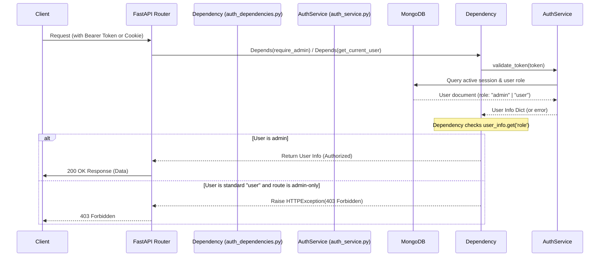

# ORBIT Role-Based Access Control (RBAC) Technical Guide

This document details the design, architecture, and enforcement of Role-Based Access Control (RBAC) in ORBIT.

---

## 1. Overview & Core Roles

ORBIT implements a simple, robust RBAC model with exactly **two** built-in roles:
*   **`admin`**: Full administrative access. Admins can manage other users, register new users, configure programmatic API keys, modify system prompts, reload adapters, and view system metrics/logs.
*   **`user`**: Standard access. Standard users are restricted to standard, non-administrative endpoints (like checking their own info via `/auth/me` or changing their own password via `/auth/change-password`).

---

## 2. Architecture & Data Flow

When a client sends a request to the ORBIT API, the following flow enforces the appropriate RBAC constraints:



---

## 3. Database Schema

User roles are stored directly in the `users` collection (MongoDB) or the `users` table (SQLite). 

### Schema representation:
```javascript
{
  "_id": ObjectId("..."),
  "username": "developer",
  "password": "base64_encoded_pbkdf2_hash",
  "role": "admin" | "user",            // Must be one of: "admin", "user"
  "active": true,                      // Inactive users cannot validate tokens
  "created_at": ISODate("2026-07-09T12:00:00Z"),
  "last_login": ISODate("2026-07-09T19:24:00Z")
}
```

> [!NOTE]
> The database enforces a `UNIQUE` index on the `username` field. For standard local logins, the username is chosen by the admin. For external users, it follows a `"{provider}:{subject}"` format.

---

## 4. Key Code Components & References

### A. FastAPI Dependencies
FastAPI dependencies are defined in [auth_dependencies.py](file:///Users/remsyschmilinsky/Downloads/orbit/server/routes/auth_dependencies.py):

*   **[`get_current_user`](file:///Users/remsyschmilinsky/Downloads/orbit/server/routes/auth_dependencies.py#L28-L70)**: 
    Extracts the bearer token from the `Authorization` header, verifies it, and returns the basic user info dict.
*   **[`require_admin`](file:///Users/remsyschmilinsky/Downloads/orbit/server/routes/auth_dependencies.py#L116-L147)**:
    Requires the user to be authenticated and strictly asserts that the user's role is `"admin"`:
    ```python
    if current_user.get('role') != 'admin':
        raise HTTPException(
            status_code=403,
            detail="Admin access required"
        )
    ```
*   **[`check_admin_or_api_key`](file:///Users/remsyschmilinsky/Downloads/orbit/server/routes/auth_dependencies.py#L183-L218)**:
    Enables dual-path authorization for admin endpoints. It passes if the user has an `"admin"` role **OR** if a valid programmatic API key is supplied in the `X-API-Key` header.

### B. Admin & Route Helpers
Administrative GUI page access and WebSockets are guarded by cookie-based authentication helpers in [auth_helpers.py](file:///Users/remsyschmilinsky/Downloads/orbit/server/routes/auth_helpers.py):

*   **[`get_admin_user`](file:///Users/remsyschmilinsky/Downloads/orbit/server/routes/auth_helpers.py#L106-L124)**: Validates the `dashboard_token` cookie and confirms that `user_info.get("role") == "admin"`.
*   **[`authenticate_websocket_admin`](file:///Users/remsyschmilinsky/Downloads/orbit/server/routes/auth_helpers.py#L140-L182)**: Restricts WebSocket channels (like live streaming logs or system metrics) to admin-only connections.

### C. Authentication Service
The logic to manage users and modify roles is implemented in [auth_service.py](file:///Users/remsyschmilinsky/Downloads/orbit/server/services/auth_service.py):

*   **[`_create_default_admin`](file:///Users/remsyschmilinsky/Downloads/orbit/server/services/auth_service.py#L240-L275)**: Creates the default admin account (configured via `auth.default_admin_username` / `auth.default_admin_password`) on system startup if it does not already exist.
*   **[`set_role`](file:///Users/remsyschmilinsky/Downloads/orbit/server/services/auth_service.py#L377-L399)**: Atomically updates a user's role in the database:
    ```python
    if role not in {"user", "admin"}:
        return False
    # DB update code ...
    ```
*   **[`create_user`](file:///Users/remsyschmilinsky/Downloads/orbit/server/services/auth_service.py#L588-L651)**: Standard method to provision users, strictly validating that the assigned role is one of `{"user", "admin"}`.

---

## 5. External Identity Providers (OIDC / SSO) Role Mapping

ORBIT supports external token validation and Admin Panel SSO via **Microsoft Entra ID** and **Auth0**. Roles are handled as follows:

1.  **JIT Provisioning Role**:
    When a user signs in for the first time via an external provider, a local user account is automatically provisioned just-in-time (JIT). The role defaults to the configured `default_role` parameter (defined in the `auth.providers.default_role` block in `config.yaml`, defaulting to `"user"`).
2.  **SSO Admin Promotion**:
    When users sign in through the Admin Panel SSO (`/admin/auth/{provider}/login`), ORBIT verifies their email or provider subject against the `auth.providers.admin_sso.admin_users` allowlist:
    *   If they match, they are provisioned or promoted to the `"admin"` role using `provision_sso_user()`.
    *   If they do not match, the login is rejected.
3.  **Role Permanence**:
    Once provisioned, an external user's role is managed locally within ORBIT. Promoting an external user to `"admin"` via `orbit user` command will persist and will **not** be overwritten on subsequent logins.

---

## 6. Architecture & Design Rationale

Having distinct `user` and `admin` roles provides several key architectural and security benefits:

### A. Security Isolation (Principle of Least Privilege)
*   **Administrative Safeguards**: Endpoints that configure database adapters, modify global system prompts, register programmatic API keys, or view system logs are protected from standard consumers.
*   **Mitigation of Compromised Client Tokens**: Front-end client applications (e.g. `orbitchat`) consume the API using standard `user` bearer tokens. If a token is leaked on the client side, the attacker lacks the privileges required to modify system configuration or create new API keys.

### B. Just-in-Time (JIT) Provisioning and SSO Allowlisting
*   **Organization-wide Access**: When external identity providers (Auth0 or Entra ID) are enabled, any authenticated organization member can access the client-facing APIs, and ORBIT automatically provisions a standard `user` profile for them.
*   **Allowlisted Administrators**: Only specific, trusted identities listed under the `auth.providers.admin_sso.admin_users` allowlist are promoted to the `admin` role, preventing unauthorized access to administrative configuration interfaces.

### C. Attribution & Auditing
*   **Audit Separation**: Distinguishes administrative configuration changes (e.g., modifying prompt personas) from routine API consumption or chat interactions.
*   **User Attribution**: Enables fine-grained attribution of query logs, quotas, and chat histories to specific standard users, while administrators maintain control over global quotas and resources.

---

## 7. Future Roadmap Items (Lightweight RBAC Enhancements)

To improve ORBIT's access control without introducing unnecessary complexity, the following roadmap items are planned:

### A. Group/Claim Role Mapping for SSO
*   **Goal**: Automatically map external OIDC token group/role claims (e.g. Azure AD groups or Auth0 metadata roles) directly to ORBIT's local `admin` role.
*   **Implementation**: Inspect the decoded claims inside `oidc_validator.py` and `admin_sso_service.py` to promote any user possessing configured administrative group memberships.

### B. Read-Only Administrative Role (`auditor` or `operator`)
*   **Goal**: Support a low-privilege administrative persona to view diagnostic configurations and query logs without edit/delete permissions.
*   **Implementation**: Add a third string role (`"auditor"`) and enforce read-only access checks across `admin_routes.py` via a new `require_auditor_or_admin` dependency helper.

### C. Namespace/Collection Scoping for API Keys & Users
*   **Goal**: Enforce fine-grained permissions for specific database adapters or prompt collections based on resource scoping.
*   **Implementation**: Enhance `check_admin_or_api_key` to match resource targets against the key's allowed scopes list.

### D. Role-Based Rate Limiting & Quota Bypassing
*   **Goal**: Ensure high-volume client chat interactions do not starve system resources or lock out administrative tasks.
*   **Implementation**: Update `quota_service.py` checking logic to bypass rate limits and quota verification for users authenticated as `admin`.


