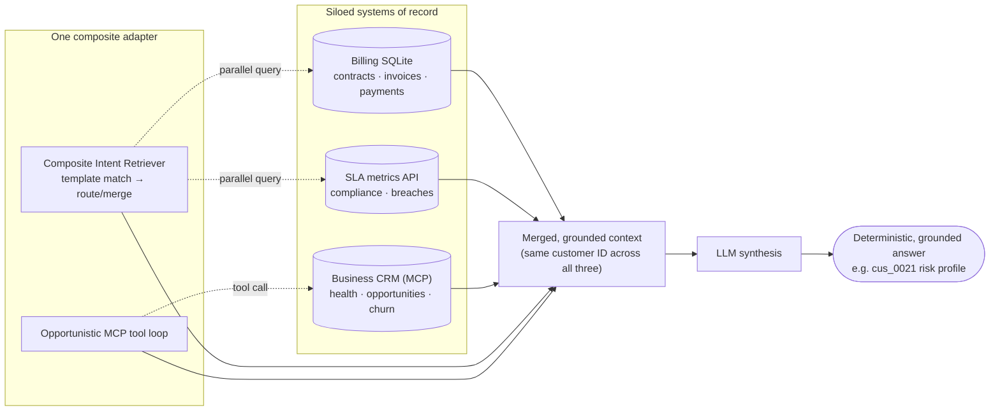

# Example 13: Customer 360 — Cross-Adapter Composition

**Level 5 · Advanced / production**

[Multi-Source Composite](multi-source-composite.md) showed the Composite Intent Retriever routing a query to whichever *one* child adapter best matches it. That's smart routing across unrelated topics (HR vs. EV data vs. movies) — each query still gets answered by a single source.

This example goes a level deeper: **cross-adapter templates**, where one query fans out to *multiple* child adapters in parallel and merges their results — because the adapters hold genuinely related data that lives in different systems. That's the scenario cross-adapter templates exist for, and it's easiest to see with data that actually joins.



Three systems that were never designed to talk to each other — a relational database, a REST API, and an MCP tool server — get queried in parallel behind one adapter and one API key. Because every source is keyed by the same customer ID, the merged context is grounded (it's real retrieved/tool data, not a guess) and deterministic (the same question routes the same way every time), while still reading as one coherent answer instead of three disconnected dumps.

## The setup: one customer, two systems

Two intent adapters share the same customer ID space (`cus_0001`…`cus_0036`):

| Adapter | Domain | Datasource |
|---|---|---|
| `intent-sql-sqlite-billing` | Contracts, invoices, payments | SQLite |
| `intent-http-sla-metrics` | Support SLA compliance metrics | HTTP (local mock API) |

Both are configured in `config/adapters/billing-sla.yaml`. The shared IDs come from a third system — the sample MCP business server in `examples/mcp-server/`, which models customers, opportunities, and support tickets. That server is **not** part of the composition (see [why](#why-the-mcp-server-isnt-a-child-adapter) below) — it's the common ancestor the other two data sets are keyed against.

Full source and setup steps: [`examples/customer-360-composite/README.md`](../../examples/customer-360-composite/README.md). A ready-to-use persona/prompt and a suggested-questions intro are included too: [`customer-360-prompt.md`](../../examples/customer-360-composite/customer-360-prompt.md) and [`customer-360-intro.md`](../../examples/customer-360-composite/customer-360-intro.md).

## Why the MCP server isn't a child adapter

The Composite Intent Retriever only routes across `type: retriever, adapter: intent` adapters — plain SQL/HTTP intent adapters with a template store it can search. MCP tool-calling adapters ([Opportunistic MCP Tool Calling](mcp-tool-calling.md)) work differently: the model discovers and calls tools live, with no template-matching layer to plug into composite routing. There's currently no way to list an MCP adapter in `child_adapters` or as a cross-adapter `target_adapters` entry.

So the MCP server stays a separate, standalone skill on the same customer domain. The billing and SLA adapters are the two that demonstrate real cross-system composition.

## Cross-adapter templates: routing to *multiple* sources at once

A cross-adapter template is owned by the composite retriever, not by any child adapter. It competes in the same similarity-scoring pool as regular templates — but when it wins, the composite retriever queries **every** listed target adapter in parallel and merges the results, instead of picking just one.

`examples/intent-templates/cross-adapter-template/billing_sla_cross_adapter_templates.yaml`:

```yaml
templates:
  - id: customer_360_billing_and_sla
    description: Combine billing/contract data with support SLA metrics for a customer
    cross_adapter: true
    target_adapters:
      - adapter: "intent-sql-sqlite-billing"
        label: "Billing"
      - adapter: "intent-http-sla-metrics"
        label: "Support SLA"
    merge_strategy: side_by_side
    partial_results: true
    nl_examples:
      - "show me billing and support SLA status for customer cus_0007"
      - "customer 360 view for cus_0012 including invoices and SLA"
```

Wired into the composite adapter in `config/adapters/composite.yaml`:

```yaml
- name: "composite-customer-360"
  enabled: true
  type: "retriever"
  adapter: "composite"
  implementation: "retrievers.implementations.composite.CompositeIntentRetriever"
  config:
    child_adapters:
      - "intent-sql-sqlite-billing"
      - "intent-http-sla-metrics"
    cross_adapter_templates:
      enabled: true
      template_library_path:
        - "examples/intent-templates/cross-adapter-template/billing_sla_cross_adapter_templates.yaml"
      template_collection_name: "composite_customer360_cross_adapter_templates"
    cross_adapter_execution:
      timeout_per_adapter: 10.0
      partial_results: true
      default_merge_strategy: "side_by_side"
```

## Setup

```bash
# 1. Start the SLA metrics mock API
cd examples/mcp-server
npm install
npm run sla                               # http://localhost:9998

# 2. Generate the billing database (separate terminal)
cd examples/intent-templates/sql-intent-template/sqlite/billing
python3 generate_billing_data.py --force  # creates billing.db

# 3. Restart ORBIT so the new adapters load
python3 server/main.py
```

### Create a persona and API key

Open `http://localhost:3000/admin` → **Prompts / Personas** → **+ Create**, and paste in
[`examples/customer-360-composite/customer-360-prompt.md`](../../examples/customer-360-composite/customer-360-prompt.md)
as the system prompt. It tells the model about both data sources, how to format
currency/tables, and how to synthesize across a merged (cross-adapter) response.

Then **API Keys** → **+ Create**:

1. Choose `composite-customer-360` as the adapter.
2. Name the key `Customer 360`.
3. Select the persona you just created.
4. Save the key and copy the `orbit_…` value shown once.

### Try it with `curl`

```bash
curl -X POST http://localhost:3000/v1/chat \
  -H "Content-Type: application/json" \
  -H "X-API-Key: orbit_YOUR_KEY" \
  -d '{"messages": [{"role": "user", "content": "Show me billing and support SLA status for customer cus_0021"}]}'
```

### Try it with OrbitChat

Add the `composite-customer-360` adapter to your OrbitChat config — it's already
present in [`clients/orbitchat/orbitchat-local.yaml`](../../clients/orbitchat/orbitchat-local.yaml)
under the id `composite-customer-360` (display name "Customer 360"). Then run
OrbitChat with the key you just created, mapped to that same adapter id:

```bash
ORBIT_ADAPTER_KEYS='{"composite-customer-360":"orbit_YOUR_KEY"}' orbitchat --open
```

Pick **Customer 360** from the adapter picker and try the prompts from
[`examples/customer-360-composite/customer-360-intro.md`](../../examples/customer-360-composite/customer-360-intro.md), for example:

> "Show me billing and support SLA status for customer cus_0021."

## Bonus: opportunistic MCP tool calling on top

`composite-customer-360` also has `mcp_tools: true` / `mcp_servers: ["business-sample"]` in its capabilities — the same opportunistic MCP pattern from [Example 10](mcp-tool-calling.md), layered on top of composite retrieval rather than a plain passthrough adapter. This lets the model call the `business-sample` MCP server's live CRM tools (customer health, opportunities, support tickets) on the same turn as the billing/SLA retrieval, without a `skill` field or adapter swap.

Start the MCP server too (separate from the SLA mock API):

```bash
cd examples/mcp-server
MCP_TOKEN=test-secret npm start   # http://127.0.0.1:8080/mcp
```

Then ask something that needs both billing/SLA data *and* live CRM context, e.g.:

> "Show me cus_0021's billing and SLA status, and check if they have any open opportunities."

Both retrieval (composite billing+SLA) and MCP tool calls can happen on the same turn — retrieval always runs first via `retrieval_behavior: "always"`, and the tool-calling loop runs afterward with that context already in the prompt. Note this means every turn now pays both costs (composite retrieval + tool schemas sent to the model), even for questions that don't need CRM data — a deliberate tradeoff for this bonus section, not the default for the base example above.

### High-value questions: three systems, one answer

This is where the composition earns its keep — a single question that needs billing data, SLA data, *and* live CRM signals (health score, opportunities, churn modeling), none of which alone can answer it:

| Question | What it pulls together |
|---|---|
| "Give me a full risk profile for cus_0021: contract status, SLA compliance, and current churn probability." | Billing (contract/invoice status) + SLA (compliance rate) + MCP `simulate_churn_risk_scenario` |
| "Which Enterprise customers have overdue invoices *and* SLA breaches — and how healthy are they in the CRM?" | Cross-adapter billing+SLA query, then MCP `get_customer_health` per customer returned |
| "Find the customer with the most SLA breaches, then check their health score and simulate their churn risk if we lose them." | SLA (`list_sla_breaches`) → MCP `get_customer_health` → MCP `simulate_churn_risk_scenario` — a 3-step chain |
| "Which sales rep is managing the most at-risk accounts — overdue invoices, SLA breaches, and low seat utilization?" | Billing (overdue invoices) + SLA (breaches) + MCP `get_product_telemetry` + MCP `get_sales_rep_performance` |
| "Build a renewal-save account plan for cus_0034 using their contract terms, SLA history, and open support tickets." | Billing (contract) + SLA (compliance) + MCP `list_support_tickets` + MCP `build_account_plan` |

Walking through the first one end to end: "Give me a full risk profile for cus_0021: contract status, SLA compliance, and current churn probability."

1. The composite retriever matches `customer_360_billing_and_sla` (cross-adapter) and queries `intent-sql-sqlite-billing` + `intent-http-sla-metrics` in parallel — contract/invoice status and SLA compliance land in the prompt as retrieved context.
2. The model still needs churn probability, which neither adapter has — it calls the `business-sample` MCP tool `simulate_churn_risk_scenario` with `customerId: "cus_0021"`.
3. The final answer synthesizes all three: contract/billing health, SLA compliance rate, and the modeled churn probability with ARR at risk — one coherent risk profile, not three separate answers.

Confirm this by checking the response's `sources`: a `composite_routing.cross_adapter: true` block for the retrieval half, plus an `mcp_tool_call` entry (`business-sample__simulate_churn_risk_scenario`) for the CRM half. See [`docs/adapters/playbook-mcp-tool-loop.md`](../adapters/playbook-mcp-tool-loop.md) for more multi-step MCP tool-chaining scenarios (built against `simple-chat`, but the same tool-calling mechanics apply here).

## See routing in action

| Query | What happens |
|---|---|
| "What invoices are overdue for customer cus_0007?" | Single-adapter match → routes only to `intent-sql-sqlite-billing` |
| "What's the SLA compliance rate for cus_0012?" | Single-adapter match → routes only to `intent-http-sla-metrics` |
| "Show me billing and support SLA status for customer cus_0021" | **Cross-adapter match** → both adapters queried in parallel, merged `side_by_side` |
| "Which customers have both overdue invoices and SLA breaches?" | **Cross-adapter match** → aggregate results from both sources for the model to correlate |

<!-- MEDIA: screenshot | customer-360-cross-adapter/cross-adapter-response | API response JSON showing a cross_adapter routing block with both Billing and Support SLA sources merged side_by_side -->
> 🖼️ **Screenshot placeholder:** a cross-adapter response merging Billing and Support SLA results.
> _(To be added — see [`_media-todo.md`](_media-todo.md))_

A cross-adapter response's metadata looks like:

```json
{
  "composite_routing": {
    "cross_adapter": true,
    "template_id": "customer_360_billing_and_sla",
    "merge_strategy": "side_by_side",
    "target_adapters": ["intent-sql-sqlite-billing", "intent-http-sla-metrics"],
    "successful_adapters": ["intent-sql-sqlite-billing", "intent-http-sla-metrics"],
    "failed_adapters": []
  }
}
```

Compare that `cross_adapter: true` block to the single-adapter `composite_routing` shape from [Multi-Source Composite](multi-source-composite.md) — same adapter, two different routing paths depending on what the query actually needs.

See [Composite Intent Retriever](../adapters/composite-intent-retriever.md) for the full cross-adapter template reference, merge strategies, and partial-failure handling.

---

[Tutorial home](../tutorial.md) | [Previous: Example 12: Message Queue (Async) Requests](message-queue-async.md) | [Next: Example 14: Intent Adapter Observability](intent-observability.md)

---
