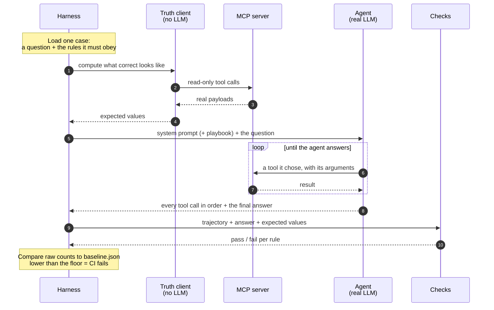

# How the MCP agent evaluation harness works

`README.md` covers *why* this exists and how to run it. This document covers
*how it is built* — the moving parts, why they are separated the way they are,
and what happens during a single case.

## The one-sentence version

Drive a real LLM agent against the live MCP server, record which tools it
called and what it said, then score that behaviour against expectations
computed from the *same server* by a second, LLM-free client — and ratchet the
resulting counts so a regression fails a test.

## The central design constraint: two independent channels

Everything else follows from one decision. The harness talks to the MCP server
over **two separate paths that share no code**:

| | Agent channel | Ground-truth channel |
|---|---|---|
| Module | `mcpeval/agent.py` | `mcpeval/protocol.py` |
| Client | `langchain-mcp-adapters` → `langchain.agents.create_agent` | `RawMcpClient`, plain httpx JSON-RPC |
| Involves an LLM | yes | **never** |
| Purpose | produce the behaviour under test | compute what correct looks like |
| May call mutating tools | yes (that is often the test) | `call_readonly()` rejects `MUTATING_TOOLS` |

If both channels shared a client, a bug in `langchain-mcp-adapters` could
corrupt the observation *and* the expectation in the same direction, and the
suite would pass while the agent misbehaved. Keeping them independent is what
makes a passing score mean something.

The second channel is also what makes ground truth cheap: `protocol.py` is a
plain JSON-RPC POST with no session handshake, because the sample server builds
a fresh `McpServer` per request and carries no session id.

## Why no expected value is ever hardcoded

The sample data is only *partly* deterministic. Under `faker.seed(4242)` the
ids, names, ARR, health scores, seats and stages are stable — but
`renewalDate`, `closeDate`, `lastExecutiveMeeting` and ticket `createdAt` come
from `faker.date.soon()` / `faker.date.recent()`, so they move **every day**.
Ticket state drifts further as the CRUD cases run.

So a case never states an expected value. It states a *program for computing
one*:

```yaml
ground_truth:
  - as: top
    tool: list_customers
    args: {region: EMEA, segment: Enterprise, limit: 3}
checks:
  - type: answer_contains
    values: ["${top.customers[0].name}"]
```

`mcpeval/ground_truth.py` runs that program against the live server just before
the agent runs, binds each result to a name, and `${...}` references resolve
against those bindings (`mcpeval/schema.py`). Reseed the server and the
expectations follow by themselves.

Where an expectation is an ordering or a filter the server does not perform —
"rank reps by `attainmentPct`, not raw closed amount" — a named function in
`DERIVERS` computes it from an earlier binding, rather than the answer being
frozen into YAML.

## What a single case does



Both channels reach the same server, and neither knows about the other. The
expectations are computed *before* the agent runs and from a client that has no
model in it, so the agent cannot influence what it is about to be judged
against.

## The modules

| Module | Responsibility |
|---|---|
| `config.py` | Repo paths, `.env` loading (local then repo root, never overriding the real environment), `Settings`, and the `MUTATING_TOOLS` set |
| `models.py` | `ModelSpec` per provider — key, env var(s), availability, model family, lazy chat-model construction |
| `protocol.py` | `RawMcpClient`: JSON-RPC over HTTP, plus `call_readonly()` which refuses mutating tools |
| `agent.py` | MCP tool discovery, the agent (`langchain.agents.create_agent`), and `extract_trajectory()` — **the only module touching LangChain message internals** |
| `schema.py` | Case/Suite dataclasses, YAML loading, `${binding}` resolution |
| `ground_truth.py` | Runs a case's ground-truth program; `DERIVERS` for computed expectations |
| `evaluators.py` | The 15 check types in the `CHECKS` registry, each returning a `CheckOutcome` |
| `judge.py` | The single LLM-as-judge check, `groundedness` |
| `sandbox.py` | Snapshot/restore around mutating CRUD cases |
| `runner.py` | Orchestration: suite × model × variant → `EvalResult` |
| `report.py` | `EvalResult` → JSON record + markdown scoreboard |
| `langsmith_sync.py` | Optional tracing, dataset push, and `evaluate()` reusing the same check functions |

`agent.py` is deliberately the single chokepoint for LangChain internals — the
part most likely to churn across library versions — the 0.x→1.x move that
retired `langgraph.prebuilt.create_react_agent` touched exactly one line here.
A library upgrade has one place to break.

## The two axes

Every run is a matrix over **model** × **prompt variant**:

- `base` — the server's `business-mcp-prompt.md` alone.
- `playbook` — that prompt *plus* the body of the suite's `config/skills/`
  playbook.

A suite with no playbook of its own (`general`, `deep_workflow`) has nothing to
inject, so it always runs as `base` — otherwise the gate's playbook-only default
would skip it entirely and silently lose its coverage.

Running both answers a question the repo could not previously answer: **do the
playbooks actually change model behaviour?** The report prints the delta
directly, and the recorded baseline shows it is real — without its playbook,
`gpt-5.4-mini` called the destructive `delete_support_ticket` on a request that
never asked for a deletion; with it, it does not.

## Checks: programmatic first, LLM last

Fourteen of the fifteen check types are deterministic code over the trajectory —
`required_tools`, `forbidden_tools`, `tool_order`, `tool_sequence`,
`arg_matches`, `arg_bound`, `tool_choice`, `answer_contains`,
`answer_not_contains`, `answer_ordering`, `no_tool_calls`,
`tool_error_handled`, `recovers_after_error`, `no_id_enumeration`,
`max_tool_calls`. Each traces to a specific playbook rule; the table in
`README.md` maps them.

Three of them exist specifically for multi-step work, where the shallow checks
either miss a failure or invent one:

- **`tool_sequence`** states a whole ordered workflow in one check, as a
  subsequence over the full trajectory. `tool_order` relates a single pair by
  *first* occurrence, so a repeated early call makes it report failures that did
  not happen — `b, a, b, c` contains a valid `a → b → c`, but first-occurrence
  indexing says otherwise. That false-alarm rate grows with workflow length.
- **`arg_matches` with `which: all`** closes the repeated-call blind spot. The
  default `any` passes as soon as one call carried the right argument, so an
  agent that drifts onto a different customer halfway through a seven-step
  workflow still scores green.
- **`recovers_after_error`** asserts the agent hit a failing tool, *kept going*
  and finished. `tool_error_handled` only covers the terminal case — reporting
  the failure honestly — so without this a run that gave up at step two and a
  run that recovered and completed score identically.

Checks are `hard` by default; a `soft` check is recorded and reported but does
not fail its case. A case passes when every *hard* check passes.

Exactly one check is an LLM: `groundedness`, which asks whether the prose
invents figures the tool output never contained — the failure no regex can
catch, such as building an owner-level breakdown out of an aggregate that
carries no owner data. Two guardrails apply:

1. **The judge prefers a different provider than the model under test.** Self
   grading is a known bias; when only one key is present the run is still
   judged but flagged as self-judged.
2. **The judge score is reported, never ratcheted.** An LLM grading prose is
   the noisiest signal here, and gating on it would produce flaky failures that
   teach people to ignore the gate.

## Mutating cases and the sandbox

`create/update/delete_support_ticket` mutate a module-level array inside the
server process, so changes persist across requests and would leak between
cases. Three layers of containment:

1. **Ordering** — `runner.run_eval()` sorts read-only cases ahead of mutating
   ones, so a mutation can never perturb an expectation computed earlier.
2. **Disposable targets** — a mutating case's `setup` asks the sandbox to
   create a ticket it is allowed to modify or destroy, so the agent's
   destructive action lands on something the harness owns rather than on seeded
   data.
3. **Snapshot and restore** — `TicketSandbox.capture()` records every ticket
   before the run and `restore()` afterwards deletes what was created,
   recreates what was deleted, and reverts what was changed. `drifted()` then
   asserts nothing is left over.

The honest fallback, stated in the README: if a run aborts mid-case, restart
the Node server to restore the seed.

## The gate

`tests/test_regression.py` is the ratchet, marked `integration` + `slow` so it
is never part of a casual run — it makes real, billable API calls. It asserts,
per `suite::model::variant` key:

- corpus size is unchanged (a changed case count means re-baseline, not pass),
- `checks_passed` has not fallen below the floor,
- `cases_passed` has not fallen below the floor,
- `agent_errors` has not risen above it.

**Baselines store raw counts, not rates** — the same convention as
`server/tests/intent_eval`, for the same reason: storing a rounded rate and
comparing it against a freshly computed float manufactures 1-ULP "regressions"
that are not real.

Every missing prerequisite **skips with an explanation** rather than failing: a
stopped server, an absent API key, or a key with no baseline entry. A missing
key must never masquerade as a behavioural regression.

Tool-calling is not deterministic even at `temperature=0`, which is precisely
why the gate is a ratchet on counts rather than an exact-match assertion. The
regeneration command lives at the bottom of `tests/test_regression.py`.

## Supporting tests

Three tiers, each cheaper than the last to run:

| File | Needs | Purpose |
|---|---|---|
| `tests/test_evaluators.py`, `test_models.py`, `test_langsmith_sync.py` | nothing | Check functions, the provider registry and the LangSmith dataset/target agreement — no server, no keys, no network (`-m unit`) |
| `tests/test_judge.py` | server + a key | Judge discrimination: a faithful answer must score clearly above a fabricated one |
| `tests/test_protocol.py`, `test_tools_direct.py`, `test_sandbox.py` | the server | Pin the invariants the ground truth relies on: 36 customers, 72 opportunities, default limit 10, max 25, sort orders, error shape |
| `tests/test_regression.py` | server + API keys | The behavioural gate |

`test_tools_direct.py` matters more than it looks: it stops the ground-truth
channel from silently redefining what correct means. If the server's sorting or
clamping changes, that file fails loudly instead of the expectations quietly
sliding along with it.

## Related

- [`README.md`](README.md) — why this exists, quick start, adding a case
- [`agentic-test-harness.svg`](agentic-test-harness.svg) — the one-slide version of this document
- [`examples/mcp-server`](../mcp-server) — the server under test
- [`config/skills/`](../../config/skills) — the playbooks these cases encode
- [`server/tests/intent_eval`](../../server/tests/intent_eval) — the harness this one mirrors
