# Migration Guide: Making RAG Framework Domain-Agnostic

This guide explains how to migrate your existing PostgreSQL RAG system to use the new domain-agnostic architecture.

## New Architecture Overview

The enhanced system introduces a completely domain-agnostic design:

```mermaid
flowchart TD
    %% User Input
    U[👤 User Query]

    %% Core System
    subgraph CORE [🧠 Core Processing]
        QP[🔄 Query Processor]
        TE[📋 Template Engine]
        PE[🔍 Param Extractor]
        RG[💬 Response Generator]
        VC[🗄️ ChromaDB]
    end

    %% Domain Config
    subgraph CFG [⚙️ Domain Config]
        DC[🏢 Domain Config]
        TL[📚 Template Library]
        DY[📄 domain.yaml]
        TY[📄 templates.yaml]
    end

    %% Plugins
    subgraph PLUGINS [🔌 Plugin System]
        PM[🧩 Plugin Manager]
        DP[🏢 Domain Plugin]
        AP[📊 Analytics Plugin]
        SP[🛡️ Security Plugin]
        CP[🔧 Custom Plugins]
    end

    %% Data
    subgraph DATA [📂 Data Sources]
        DB[🗃️ PostgreSQL]
        OL[🧠 Ollama]
    end

    %% SDK Tools
    subgraph SDK [🏗️ Template SDK]
        TGen[⚙️ Generator]
        TBuild[🏗️ Builder]
        TVal[✅ Validator]
    end

    %% Main Flow
    U --> QP --> TE --> VC --> PE --> DB --> RG --> U

    %% Config Links
    DC --> PE
    DC --> RG
    DC --> DP
    TL --> VC
    TL --> TE

    DY -.-> DC
    TY -.-> TL

    %% Plugins
    PM --> QP
    PM --> PE
    PM --> RG
    DP --> PM
    AP --> PM
    SP --> PM
    CP --> PM

    %% SDK flow
    DC --> TGen --> TBuild --> TVal --> TL

    %% Ollama external
    OL --> PE
    OL --> RG
    OL --> VC

    %% Styles
    classDef box fill:#ffffff,stroke:#444,stroke-width:2px
    class U,QP,TE,PE,RG,VC,DC,TL,DY,TY,PM,DP,AP,SP,CP,DB,OL,TGen,TBuild,TVal box
```



## Key Architecture Components

### 1. **Domain Configuration Layer**
- **DomainConfiguration**: Central configuration defining business domain
- **Domain YAML**: Declarative domain definition (entities, fields, relationships)
- **Template Library**: SDK-managed collection of query templates
- **Template YAML**: Generated or manually defined query templates

### 2. **Core RAG Engine**
- **EnhancedRAGSystem**: Main orchestrator using domain configuration
- **Domain-Aware Parameter Extractor**: Builds extraction patterns from domain config
- **Domain-Aware Response Generator**: Formats responses using domain field definitions
- **Template Engine**: Semantic template matching with ChromaDB

### 3. **Plugin Architecture**
- **Plugin Manager**: Orchestrates plugin execution across system phases
- **Domain Plugin**: Handles domain-specific business logic
- **Analytics Plugin**: Provides data enrichment and insights
- **Security Plugin**: Validates queries and enforces access control
- **Custom Plugins**: Extensible for domain-specific requirements

### 4. **Template SDK**
- **Template Builder**: Fluent API for programmatic template creation
- **Template Generator**: Auto-generates standard templates from domain config
- **Template Validator**: Ensures template consistency and correctness

## Enhanced System Changes

The enhanced system introduces:
1. **DomainConfiguration** - Defines entities, fields, relationships, and vocabulary
2. **TemplateLibrary** - SDK for building and managing query templates
3. **EnhancedRAGSystem** - Domain-aware RAG system that uses configuration
4. **DomainPlugin** - Handles domain-specific logic via plugin architecture

## Migration Steps

### Step 1: Define Your Domain Configuration

Instead of hardcoding customer/order logic, create a domain configuration:

```python
from domain_configuration import DomainConfiguration, DomainEntity, DomainField, EntityType, DataType

# Create domain
domain = DomainConfiguration(
    domain_name="E-Commerce",
    description="E-commerce domain with customers and orders"
)

# Add entities
customer = DomainEntity(
    name="customer",
    entity_type=EntityType.PRIMARY,
    table_name="customers",
    description="Customer information",
    primary_key="id",
    display_name_field="name",
    searchable_fields=["name", "email"],
    common_filters=["city", "country"]
)
domain.add_entity(customer)

# Add fields
domain.add_field("customer", DomainField(
    name="id",
    data_type=DataType.INTEGER,
    db_column="id",
    description="Customer ID",
    required=True,
    searchable=True
))

# Save configuration
domain.to_yaml("ecommerce_domain.yaml")
```

### Step 2: Convert Templates to Use Template Library

Replace your YAML templates with programmatic template generation:

```python
from template_library import TemplateLibrary, QueryTemplateBuilder, TemplateType

library = TemplateLibrary(domain)

# Create template using SDK
template = (QueryTemplateBuilder("find_customer_by_id", domain)
    .with_description("Find customer by ID")
    .of_type(TemplateType.SEARCH_FIND)
    .with_examples(
        "Show me customer 123",
        "Get customer #456"
    )
    .with_parameter(
        name="customer_id",
        param_type=ParameterType.INTEGER,
        description="Customer ID",
        required=True
    )
    .with_semantic_tags(
        action="search_find",
        primary_entity="customer"
    )
    .with_sql("""
        SELECT * FROM customers
        WHERE id = %(customer_id)s
    """)
    .with_tags("customer", "find", "id")
    .approve()
    .build()
)

library.add_template(template)
library.export_to_yaml("templates.yaml")
```

### Step 3: Update Your RAG System

Replace `SemanticRAGSystem` with `EnhancedRAGSystem`:

```python
from enhanced_base_rag_system import EnhancedRAGSystem
from domain_plugin import DomainSpecificPlugin

# Load domain configuration
domain = DomainConfiguration("E-Commerce", "E-commerce system")
domain.from_yaml("ecommerce_domain.yaml")

# Load templates
library = TemplateLibrary(domain)
library.import_from_yaml("templates.yaml")

# Initialize enhanced system
rag_system = EnhancedRAGSystem(
    domain=domain,
    template_library=library,
    embedding_client=OllamaEmbeddingClient(),
    inference_client=OllamaInferenceClient(),
    db_client=PostgreSQLDatabaseClient()
)

# Register domain plugin
domain_plugin = DomainSpecificPlugin(domain)
rag_system.register_plugin(domain_plugin)

# Populate ChromaDB from library
rag_system.populate_chromadb_from_library(clear_first=True)
```

### Step 4: Update Parameter Extraction

The new `DomainAwareParameterExtractor` automatically handles parameter extraction based on domain configuration:

```python
# Old way (hardcoded patterns)
if param_name == 'customer_id':
    match = re.search(r'customer\s*(?:id\s*)?(?:#|number|id)?\s*(\d+)', query)
    
# New way (domain-aware)
# Automatically handled by DomainAwareParameterExtractor
# It builds patterns from domain configuration
```

### Step 5: Migrate Custom Logic to Plugins

Move domain-specific logic from core system to plugins:

```python
class ECommercePlugin(BaseRAGPlugin):
    def __init__(self, domain: DomainConfiguration):
        super().__init__(
            name="ECommercePlugin",
            version="1.0.0",
            priority=PluginPriority.HIGH
        )
        self.domain = domain
    
    def post_process_results(self, results: List[Dict], context: PluginContext) -> List[Dict]:
        # Add e-commerce specific processing
        for result in results:
            if 'total' in result:
                result['total_formatted'] = f"${result['total']:,.2f}"
        return results
```

## Integration Options

### Option 1: Full Migration (Recommended)

Replace entire system with enhanced version:

```python
# customer_order_rag.py
from enhanced_base_rag_system import EnhancedRAGSystem

class SemanticRAGSystem(EnhancedRAGSystem):
    """Backward compatible wrapper"""
    
    def __init__(self, **kwargs):
        # Load domain configuration
        domain = self._load_customer_order_domain()
        
        # Initialize enhanced system
        super().__init__(
            domain=domain,
            **kwargs
        )
        
        # Register existing plugins
        self._register_default_plugins()
```

### Option 2: Gradual Migration

Keep existing system but use domain configuration for new features:

```python
# Add to existing SemanticRAGSystem
def load_domain_configuration(self, domain_config_path: str):
    """Load domain configuration for enhanced features"""
    self.domain = DomainConfiguration("temp", "temp")
    self.domain.from_yaml(domain_config_path)
    
    # Update parameter extractor
    self.parameter_extractor = DomainAwareParameterExtractor(
        self.inference_client, 
        self.domain
    )
```

### Option 3: Parallel Systems

Run both systems side by side:

```python
# Keep existing system
existing_rag = SemanticRAGSystem()

# Add new domain-agnostic system
healthcare_domain = create_healthcare_domain()
healthcare_rag = EnhancedRAGSystem(
    domain=healthcare_domain,
    embedding_client=embedding_client,
    inference_client=inference_client,
    db_client=db_client
)
```

## Benefits After Migration

1. **Domain Independence**: Same codebase works for any business domain
2. **Configuration-Driven**: Define domains in YAML without code changes
3. **Template SDK**: Programmatically generate templates with validation
4. **Plugin Architecture**: Extend functionality without modifying core
5. **Better Maintainability**: Clear separation of concerns

## Example: Adding a New Domain

After migration, adding a new domain is simple:

```python
# 1. Define domain
domain = create_healthcare_domain()  # or load from YAML

# 2. Generate templates
generator = DomainTemplateGenerator(domain)
library = generator.generate_standard_templates()

# 3. Create RAG system
rag_system = EnhancedRAGSystem(
    domain=domain,
    template_library=library,
    embedding_client=embedding_client,
    inference_client=inference_client,
    db_client=db_client
)

# 4. Register domain plugins
rag_system.register_plugin(DomainSpecificPlugin(domain))
rag_system.register_plugin(DomainAnalyticsPlugin(domain))

# Done! System ready for new domain
```

## Testing Migration

```python
# Test queries work the same
test_queries = [
    "Show me customer 123",
    "Find orders over $500",
    "List recent customers"
]

for query in test_queries:
    old_result = old_system.process_query(query)
    new_result = new_system.process_query(query)
    
    assert old_result['success'] == new_result['success']
    assert old_result['template_id'] == new_result['template_id']
```

## Troubleshooting

### Issue: Templates not matching
- Check domain vocabulary includes all synonyms
- Verify semantic tags are properly set
- Ensure embedding text includes all relevant terms

### Issue: Parameters not extracting
- Verify field aliases in domain configuration
- Check parameter names match field names
- Enable debug logging for parameter extraction

### Issue: Plugin not working
- Ensure plugin is registered and enabled
- Check plugin priority for execution order
- Verify plugin implements required methods

## Next Steps

1. Export your existing domain structure to YAML
2. Convert templates using the Template SDK
3. Test with parallel systems before full migration
4. Gradually move custom logic to plugins
5. Document domain-specific configurations

For support, refer to the example implementations:
- `example_healthcare_domain.py` - Complete domain example
- `template_generator.py` - Automated template generation
- `domain_plugin.py` - Plugin examples