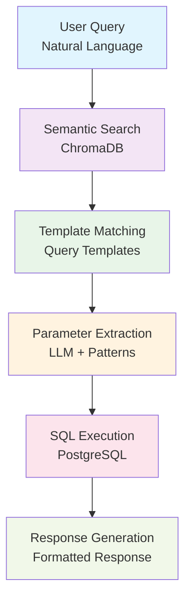

# PostgreSQL Adapter Test Suite

This directory contains comprehensive test scripts for the PostgreSQL adapter, designed to work with the **adapter granularity strategy** implemented in ORBIT.

## 🎯 Overview

The PostgreSQL adapter demonstrates a **multi-table** adapter pattern that follows our adapter granularity strategy:

- **Complexity**: `MULTI_TABLE` (controlled JOIN with customer filtering)
- **Risk Level**: `LOW` (customer-specific queries prevent full table scans)
- **Governance**: Requires `approved_by_admin: true` for production use
- **Performance**: 15-second timeout with query monitoring enabled

## 📁 Files

| File | Purpose |
|------|---------|
| `customer-order.sql` | Database schema with optimized indexes |
| `customer-order.py` | Test data generator and query testing |
| `test_connection.py` | Simple database connection test |
| `diagnose_connection.py` | Advanced connection troubleshooting |
| `test_adapter_integration.py` | Comprehensive adapter validation suite |
| `semantic_rag_system.py` | Enhanced RAG system with ChromaDB and Ollama |
| `interactive_demo.py` | Command-line interactive demo |
| `streamlit_app.py` | Web-based Streamlit UI for the RAG system |
| `query_templates.yaml` | Query templates for semantic matching |
| `env_utils.py` | Environment variable utilities |
| `requirements.txt` | Python dependencies |
| `requirements_streamlit.txt` | Streamlit-specific dependencies |

## 🚀 Quick Start

### 1. Install Dependencies
```bash
pip install -r requirements.txt
```

### 2. Set Environment Variables

Create a `.env` file in this directory with your database and Ollama configuration:

```bash
# Copy the example file
cp env.example .env

# Edit the .env file with your actual database and Ollama settings

# PostgreSQL Database Configuration
DATASOURCE_POSTGRES_USERNAME=postgres
DATASOURCE_POSTGRES_PASSWORD=your_password
DATASOURCE_POSTGRES_HOST=localhost
DATASOURCE_POSTGRES_PORT=5432
DATASOURCE_POSTGRES_DATABASE=test_db
DATASOURCE_POSTGRES_SSL_MODE=prefer

# Ollama Configuration
OLLAMA_BASE_URL=http://localhost:11434
OLLAMA_EMBEDDING_MODEL=bge-m3
OLLAMA_INFERENCE_MODEL=gemma3:1b

```

Alternatively, you can set environment variables directly:
```bash
export DATASOURCE_POSTGRES_USERNAME=postgres
export DATASOURCE_POSTGRES_PASSWORD=your_password
export DATASOURCE_POSTGRES_HOST=localhost
export DATASOURCE_POSTGRES_PORT=5432
export DATASOURCE_POSTGRES_DATABASE=test_db
```

### 3. Create Database and Schema
```bash
# Create database
createdb retrieval

# Run schema setup
psql -d retrieval -f customer-order.sql
```

### 4. Test Database Connection
```bash
python test_connection.py
```

### 5. Generate Test Data
```bash
python customer-order.py --action insert --customers 100 --orders 500
```

### 6. Test the Adapter
```bash
python test_adapter_integration.py
```

### 7. Try the Interactive Demos

#### Command-Line Demo
```bash
python interactive_demo.py
```

#### Web-Based Streamlit UI
```bash
# Install Streamlit dependencies
pip install -r requirements_streamlit.txt

# Launch the Streamlit app
python -m streamlit run streamlit_app.py
```

## 🤖 Semantic RAG System

This directory includes an enhanced **Semantic RAG (Retrieval-Augmented Generation)** system that combines:

- **ChromaDB**: Vector database for semantic template matching
- **Ollama**: Local LLM for embeddings and inference
- **PostgreSQL**: Structured data storage
- **Natural Language Processing**: Advanced parameter extraction

### Key Features

- **Semantic Template Matching**: Uses embeddings to find the best query template for natural language queries
- **Intelligent Parameter Extraction**: Extracts parameters from natural language using pattern matching and LLM assistance
- **Conversation Context**: Maintains conversation history for better understanding
- **Multiple Interfaces**: Both command-line and web-based Streamlit UI
- **Configurable Models**: Environment-based configuration for Ollama models and endpoints

### Architecture



## 🔧 Database Schema

### Tables

**customers** table:
- `id` (SERIAL PRIMARY KEY)
- `name`, `email`, `phone`, `address`, `city`, `country`
- `created_at`, `updated_at` (with triggers)

**orders** table:
- `id` (SERIAL PRIMARY KEY)
- `customer_id` (FK to customers.id)
- `order_date`, `total`, `status`
- `shipping_address`, `payment_method`
- `created_at`, `updated_at` (with triggers)

### Indexes
- `idx_orders_customer_id` - Essential for JOIN performance
- `idx_orders_created_at` - Optimizes date range queries
- `idx_orders_order_date` - Supports date-based filtering

## 🎯 Adapter Configuration

The adapter is configured in `config.yaml` as:

```yaml
- name: "recent-customer-activity"
  type: "retriever"
  datasource: "postgres"
  adapter: "sql"
  implementation: "retrievers.implementations.relational.PostgreSQLRetriever"
  config:
    query_template: |
      SELECT c.name, o.order_date, o.total
      FROM customers c
      INNER JOIN orders o ON c.id = o.customer_id
      WHERE o.created_at >= NOW() - INTERVAL '7 days'
      AND c.id = {customer_id}
      ORDER BY o.created_at DESC
      LIMIT 20
    max_results: 20
    query_timeout: 15000
    required_parameters: ["customer_id"]
    approved_by_admin: true
    enable_query_monitoring: true
```

## 🔍 Query Pattern Analysis

### What Makes This a Good Multi-Table Adapter:

1. **Customer-Specific Filtering**: `c.id = {customer_id}` prevents full table scans
2. **Date Range Limiting**: `o.created_at >= NOW() - INTERVAL '7 days'` bounds result set
3. **Result Limiting**: `LIMIT 20` prevents excessive memory usage
4. **Optimized JOIN**: Uses primary key to foreign key relationship
5. **Required Parameters**: `customer_id` parameter prevents unfiltered queries

### Performance Safeguards:

- **Query Timeout**: 15 seconds maximum execution time
- **Result Limits**: Maximum 20 results per query
- **Index Support**: Strategic indexes on JOIN and filter columns
- **Parameter Validation**: Required `customer_id` parameter

## 🛠️ Usage Examples

### Test Database Connection
```bash
# Test connection using .env file
python test_connection.py
```

### Generate Test Data
```bash
# Insert 50 customers and 200 orders (uses .env file or environment variables)
python customer-order.py --action insert --customers 50 --orders 200

# Insert with custom database settings (overrides .env values)
python customer-order.py --action insert --customers 10 --orders 20 \
  --host localhost --port 5432 --database retrieval --user postgres
```

### Query Recent Activity
```bash
# Query specific customer's recent activity
python customer-order.py --action query --customer-id 1

# Query top customers by spending
python customer-order.py --action query
```

### Clean Up Test Data
```bash
# Delete all test data (requires confirmation)
python customer-order.py --action delete --confirm
```

### Interactive RAG System

#### Command-Line Interface
```bash
# Start the interactive demo
python interactive_demo.py

# Example queries you can try:
# - "Show me orders from customer 1"
# - "Find orders over $500"
# - "What did Maria Smith buy?"
# - "Show me pending orders"
```

#### Web Interface (Streamlit)
```bash
# Launch the web UI
streamlit run streamlit_app.py

# Features:
# - Natural language query input
# - Example queries for quick testing
# - Real-time results with formatting
# - Query history tracking
# - Configuration display
# - Parameter visualization
```

### Example Queries for the RAG System

The semantic RAG system supports various natural language queries:

**Customer Queries:**
- "Show me orders from customer 1"
- "What did Maria Smith buy?"
- "Find customer with email john@example.com"

**Amount Queries:**
- "Show me orders over $500"
- "Find orders between $100 and $500"
- "What are the smallest orders?"

**Status Queries:**
- "Show me all pending orders"
- "Which orders need attention?"

**Location Queries:**
- "Show orders from New York customers"
- "Orders from customers in France"

**Time-based Queries:**
- "What were yesterday's sales?"
- "Show me today's revenue"
- "Orders from last week"

**Analytics Queries:**
- "Who are our top 10 customers?"
- "How are sales trending?"
- "Show me new customers from this week"

## 🧪 Testing Suite

The `test_adapter_integration.py` script provides comprehensive testing:

### Test 1: Adapter Validation
- Validates adapter configuration against granularity strategy
- Checks complexity classification (MULTI_TABLE)
- Verifies risk level assessment (LOW)
- Reports warnings and recommendations

### Test 2: Database Connectivity
- Tests PostgreSQL connection with environment variables
- Verifies database and table existence
- Validates table schema matches adapter expectations

### Test 3: Query Execution
- Tests the actual adapter query with real data
- Verifies parameter binding and result formatting
- Checks query returns expected data structure

### Test 4: Performance Monitoring
- Measures query execution time
- Validates performance within adapter limits
- Tests query plan generation for optimization

## 📊 Validation Results

When run, the adapter validation shows:

```
✅ Validation Result: VALID
✅ Complexity: MULTI_TABLE
✅ Risk Level: LOW

⚠️  Warnings:
  - Query contains 1 JOIN operations
  - Consider adding security_filter or allowed_columns for better access control

💡 Recommendations:
  - Consider splitting into multiple single-table adapters
  - Implement comprehensive monitoring for query performance
  - Add query execution plan analysis
  - Consider creating a materialized view for this query pattern
```

## 🚨 Best Practices

### Security
- Always use parameterized queries (`%s`, not string formatting)
- Implement customer-specific filtering to prevent data leakage
- Consider adding `security_filter` for additional access control

### Performance
- Monitor query execution times regularly
- Use `EXPLAIN ANALYZE` to optimize query plans
- Consider materialized views for frequently accessed data
- Implement proper indexing strategy

### Monitoring
- Enable `enable_query_monitoring: true` in production
- Set appropriate `query_timeout` values
- Monitor `max_results` to prevent memory issues
- Track adapter usage patterns

## 🔄 Migration from Single Tables

If you want to migrate to single-table adapters (recommended pattern):

### Customer Profile Adapter
```yaml
- name: "customer-profiles"
  type: "retriever"
  datasource: "postgres"
  adapter: "sql"
  config:
    table: "customers"
    max_results: 100
    query_timeout: 3000
    allowed_columns: ["id", "name", "email", "city"]
    security_filter: "active = true"
```

### Customer Orders Adapter
```yaml
- name: "customer-orders"
  type: "retriever"
  datasource: "postgres"
  adapter: "sql"
  config:
    table: "orders"
    max_results: 50
    query_timeout: 2000
    security_filter: "customer_id = {user.customer_id}"
```

## 🐛 Troubleshooting

### Common Issues

**Ollama Connection Issues**
```bash
# Check if Ollama is running
curl http://localhost:11434/api/tags

# Start Ollama if not running
ollama serve

# Pull required models
ollama pull bge-m3
ollama pull gemma3:1b

# Test embedding generation
python -c "
import requests
response = requests.post('http://localhost:11434/api/embeddings', 
                        json={'model': 'bge-m3', 'prompt': 'test'})
print(f'Embedding dimensions: {len(response.json()[\"embedding\"])}')
"
```

**ChromaDB Issues**
```bash
# Clear ChromaDB if you get dimension mismatch errors
rm -rf ./chroma_db

# Or use the built-in clearing function
python -c "
from semantic_rag_system import SemanticRAGSystem
rag = SemanticRAGSystem()
rag.clear_chromadb()
rag.populate_chromadb('query_templates.yaml', clear_first=False)
"
```

**Cloud Database Connection Issues (Supabase, AWS RDS, etc.)**
```bash
# Run the diagnostic tool for comprehensive troubleshooting
python diagnose_connection.py

# For Supabase and other cloud databases:
# 1. Set individual environment variables in your .env file:
#    DATASOURCE_POSTGRES_USERNAME=postgres
#    DATASOURCE_POSTGRES_PASSWORD=your_password
#    DATASOURCE_POSTGRES_HOST=db.lkyihqptgeqeaoyoantn.supabase.co
#    DATASOURCE_POSTGRES_PORT=5432
#    DATASOURCE_POSTGRES_DATABASE=postgres
# 2. Ensure SSL is enabled (usually required)
# 3. Verify IP whitelist if applicable

# Test with SSL enabled
DATASOURCE_POSTGRES_SSL_MODE=require python test_connection.py

# Common SSL modes:
# - require: Always use SSL (recommended for cloud)
# - verify-ca: Verify server certificate
# - verify-full: Verify server certificate and hostname
# - prefer: Use SSL if available
# - allow: Allow SSL but don't require it
# - disable: No SSL
```

**Database Connection Failed**
```bash
# Check PostgreSQL is running
pg_isready

# Check database exists
psql -l | grep retrieval

# Create database if missing
createdb retrieval
```

**Tables Not Found**
```bash
# Run schema setup
psql -d retrieval -f customer-order.sql

# Verify tables exist
psql -d retrieval -c "\dt"
```

**No Test Data**
```bash
# Generate test data
python customer-order.py --action insert --customers 10 --orders 20
```

**Permission Errors**
```bash
# Check database permissions
psql -d retrieval -c "SELECT current_user, current_database();"
```

## 📈 Performance Tuning

### Index Optimization
```sql
-- Monitor index usage
SELECT schemaname, tablename, indexname, idx_scan, idx_tup_read 
FROM pg_stat_user_indexes 
WHERE schemaname = 'public';

-- Create additional indexes if needed
CREATE INDEX idx_orders_customer_date ON orders(customer_id, created_at);
```

### Query Optimization
```sql
-- Analyze query performance
EXPLAIN ANALYZE SELECT c.name, o.order_date, o.total
FROM customers c
INNER JOIN orders o ON c.id = o.customer_id
WHERE o.created_at >= NOW() - INTERVAL '7 days'
AND c.id = 1;
```